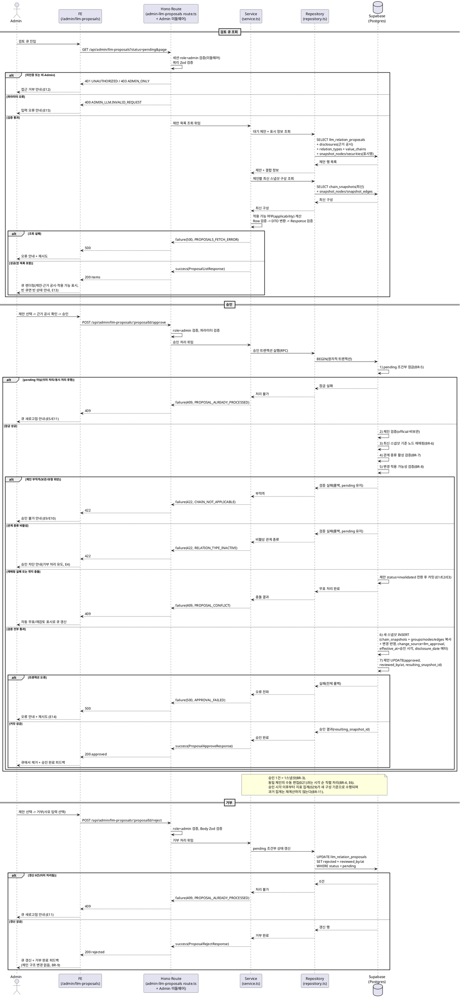

# Usecase 022: LLM 관계 변경안 검토 (승인/거부)

> 근거: `docs/userflow.md` 022, `docs/prd.md` 3장(어드민 페이지)·6장(LLM 보조 업데이트·시계열·이력), `docs/database.md` §1.3·§3.3·§3.8·§5·§7-4, `docs/techstack.md` §4(Hono route → service → repository → Supabase).
> **외부 서비스 직접 연동 없음**: LLM 호출은 배치 030(워커의 LLM 어댑터) 전용이다. 본 유스케이스는 배치가 사전 적재한 자체 DB의 제안 큐(`llm_relation_proposals`)만 조회·처리한다(PRD 8장).

---

## 1. Primary Actor

- **Admin** (`role=admin`, 서버 측 role 검증) — 어드민 페이지의 LLM 관계 변경안 검토 큐에서 제안을 승인/거부한다.
- 간접 연계 액터: **System** — 배치 030이 검토 큐(pending 제안)를 적재하는 선행 공급자다(별도 유스케이스).

## 2. Precondition (사용자 관점)

- Admin 계정으로 로그인 상태다.
- 어드민 페이지(`/admin/llm-proposals`)에 접근 가능하다.
- (처리할 제안이 있으려면) LLM 공시 분석 배치(030)가 대기(pending) 상태의 제안을 큐에 적재해 둔 상태다.

## 3. Trigger

- Admin이 어드민 메뉴에서 "LLM 관계 변경안 검토 큐"에 진입한다.
- 개별 제안을 선택해 근거 공시와 함께 검토한 뒤 **승인** 또는 **거부** 상호작용을 실행한다.

## 4. Main Scenario

### 4-A. 검토 큐 조회

1. Admin이 검토 큐 페이지(`/admin/llm-proposals`)에 진입한다.
2. FE가 제안 목록 API(`GET /api/admin/llm-proposals?status=pending`)를 호출한다.
3. Hono 미들웨어(withAppContext)가 세션과 `role=admin`을 서버 측에서 검증하고, route가 쿼리 파라미터를 Zod로 검증한다.
4. Service가 Repository를 통해 대기 제안을 조회한다 — 제안 본문(`llm_relation_proposals`)에 근거 공시(`disclosures`: 제목/공시일/원문 링크), 관계 종류(`relation_types`: 이름/활성 여부), 대상 체인(`value_chains`)·노드 표시 정보(`snapshot_nodes` + `securities`)를 결합한다.
5. Service가 각 제안을 **대상 체인의 현재(최신) 스냅샷 구성과 대조**해 적용 가능 여부(`applicability` — 참조 노드 재매핑 가능, 대상 엣지 존재/중복 여부, 관계 종류 활성 여부)를 계산해 함께 반환한다(조회 시점 표시용, 쓰기 없음).
6. FE가 제안 목록을 렌더링한다: 제안 유형(추가/변경/삭제), 대상 노드 쌍, 관계 종류 라벨, 근거 공시(제목·일자·원문 링크), LLM 근거 설명(rationale), 적용 가능/재검토 필요 표시.

### 4-B. 승인

7. Admin이 제안 1건을 선택해 근거 공시를 확인하고 승인을 실행한다.
8. FE가 승인 API(`POST /api/admin/llm-proposals/:proposalId/approve`)를 호출한다.
9. Service가 Repository를 통해 **하나의 원자적 트랜잭션**(Postgres 함수/RPC로 캡슐화, techstack §7)으로 처리한다:
   1. 제안 처리 잠금 — `status=pending`인 경우에만 처리 가능(조건부 갱신, 이중 처리 방지).
   2. 대상 체인 검증 — `chain_type=official`이며 보관(`is_archived`) 상태가 아님.
   3. 현재 최신 스냅샷 조회 후 **노드 재매핑** — 제안이 참조하는 `based_on_snapshot` 노드를 최신 스냅샷의 동일 노드로 매핑(상장기업=`security_id` 매칭, 자유 주체=노드 정체성 매칭).
   4. 관계 종류 활성(`is_active=true`) 재검증(relation_add/update).
   5. 변경 적용 가능성 검증 — add: 동일 노드 쌍·동일 관계 종류 엣지 미존재 및 자기 참조 아님, update/delete: 대상 엣지가 최신 구성에 존재.
   6. **새 스냅샷 생성(승인 1건 = 1스냅샷)** — 최신 스냅샷의 그룹/노드/엣지를 복사하고 제안 변경을 반영해 `chain_snapshots`(+`snapshot_groups`/`snapshot_nodes`/`snapshot_edges`)에 INSERT. `change_source=llm_approval`, `effective_at=승인 시각`, 근거 공시일은 `disclosure_date` 메타데이터로 보관, `created_by=승인 Admin`.
   7. 제안 갱신 — `status=approved`, `reviewed_by`/`reviewed_at` 기록, `resulting_snapshot_id`로 새 스냅샷 연결.
10. FE가 성공 응답을 받아 큐에서 해당 제안을 제거(상태 갱신)하고 승인 완료 피드백을 표시한다.
11. (사이드이펙트) 승인 시각 이후부터 일별 지표 집계 배치(029)가 새 구성 기준으로 집계한다 — 과거 집계는 재계산하지 않는다. 타임라인(012)에 새 스냅샷 마커가 추가된다.

### 4-C. 거부

12. Admin이 제안을 선택해 거부를 실행한다(사유 입력 선택).
13. FE가 거부 API(`POST /api/admin/llm-proposals/:proposalId/reject`)를 호출한다.
14. Service가 `status=pending` 조건부 갱신으로 `status=rejected`, `reviewed_by`/`reviewed_at`을 기록한다. **체인 구조에는 아무 반영이 없다**(스냅샷 미생성).
15. FE가 큐를 갱신하고 거부 완료 피드백을 표시한다.

## 5. Edge Cases

| # | 상황 | 처리 |
|---|---|---|
| E1 | 제안이 참조하는 노드가 최신 구성에서 삭제됨(재매핑 실패) | 승인 시도 시 제안을 자동 `invalidated`로 전환 + `409 PROPOSAL_CONFLICT` 반환. 목록에서는 재검토(적용 불가) 표시 |
| E2 | update/delete 대상 엣지가 최신 구성에 없음(그새 수동 편집으로 변경/삭제) | E1과 동일 — 자동 무효(`invalidated`) 처리 |
| E3 | relation_add인데 동일 노드 쌍·동일 관계 종류 엣지가 이미 존재(수동 편집으로 선반영 등) | 충돌 처리 — 자동 `invalidated`(중복 반영 방지, 스냅샷 엣지 유니크 제약과 이중 방어) |
| E4 | 비활성(`is_active=false`) 관계 종류를 참조하는 제안 승인 시도 | `422 RELATION_TYPE_INACTIVE`로 승인 차단, 제안은 `pending` 유지(Admin이 거부 처리 가능). 기존 엣지·과거 스냅샷은 영향 없음 |
| E5 | 동시 다중 Admin이 동일 제안 처리 | 처리 잠금 — `pending` 조건부 갱신으로 선착 1건만 성공, 후행 요청은 `409 PROPOSAL_ALREADY_PROCESSED` → FE 큐 새로고침 |
| E6 | 동일 체인에 수동 편집(021)과 승인이 동시 발생 | 스냅샷 생성을 승인/편집 시각 순으로 직렬 처리 — 승인 트랜잭션은 그 시점의 최신 스냅샷을 기준으로 원자적으로 수행해 이벤트 정합성 유지 |
| E7 | 중복 제안(동일 변경 다건) | 적재 시(030) DB 부분 유니크(`pending` 한정)로 동일 (체인·노드쌍·관계종류·유형) 1건만 존재. 승인 완료 후 유사 제안이 남아 있으면 승인 시도 시 E3로 무효 처리 |
| E8 | 신규 노드가 필요한 제안(범위 밖) | 배치 030에서 필터되어 큐에 유입되지 않음. 방어적으로 승인 시 재매핑 실패(E1)로 무효 처리 |
| E9 | 대상이 사용자 체인인 제안 | 배치 030에서 배제(공식 체인 전용). 방어적으로 승인 시 `chain_type=official` 재검증, 위반 시 `422 CHAIN_NOT_APPLICABLE` 차단 |
| E10 | 대상 공식 체인이 보관(archived, 021의 보관 전환)됨 | 승인 차단(`422 CHAIN_NOT_APPLICABLE`), 제안은 `pending` 유지(체인 복원 가능성 대비 — 일괄 무효 전환 여부는 Open Question) |
| E11 | 이미 처리된(approved/rejected/invalidated) 제안에 승인/거부 재시도 | `409 PROPOSAL_ALREADY_PROCESSED` — 멱등 거부, 상태 변경 없음 |
| E12 | 비-Admin(비로그인 포함) 접근 | 서버 측 미들웨어에서 `401 UNAUTHORIZED` / `403 ADMIN_ONLY` 거부(클라이언트 우회 방지) |
| E13 | 대기 제안 0건 | 200 + 빈 목록 → FE 빈 상태 안내 |
| E14 | 승인 트랜잭션 중 DB 오류(스냅샷 복사 실패 등) | 전체 롤백(부분 반영 없음 — 제안 상태·스냅샷 모두 원복), `500 APPROVAL_FAILED` + FE 재시도 유도 |
| E15 | 잘못된 파라미터(존재하지 않는 proposalId, status 값 오류 등) | `404 PROPOSAL_NOT_FOUND` / `400 INVALID_REQUEST` |

## 6. Business Rules

### 6.1 규칙

- **BR-1 (공식 체인 전용)**: LLM 보조 업데이트 대상은 공식 밸류체인뿐이다. 사용자 체인 대상 제안은 생성 단계(030)에서 배제되며, 승인 시 서버가 `chain_type=official`을 재검증한다.
- **BR-2 (기존 노드 간 관계 한정)**: 제안 범위는 기존 노드 간 관계 추가/변경/삭제(`relation_add`/`relation_update`/`relation_delete`)로 한정된다. 신규 노드 제안은 MVP 범위 밖이다(030 필터).
- **BR-3 (승인 1건 = 1스냅샷)**: 승인은 구조 변경 이벤트다. 최신 구성을 복사해 변경을 반영한 불변 스냅샷 1건을 생성한다. `change_source=llm_approval`, 유효 시점(`effective_at`)=승인 시각, 근거 공시일은 `disclosure_date` 메타데이터로 보관한다.
- **BR-4 (직렬 처리)**: 동일 체인의 스냅샷 생성(수동 편집 021 포함)은 승인/편집 시각 순으로 직렬 처리한다. 승인 반영은 원자적 트랜잭션으로 수행하며, 트랜잭션 시점의 최신 스냅샷을 기준으로 한다.
- **BR-5 (처리 잠금·멱등)**: 제안은 `pending` 상태에서만 승인/거부할 수 있다. `pending` 조건부 갱신으로 이중 처리를 방지하고, 이미 처리된 제안에 대한 재요청은 상태 변경 없이 409로 거부한다.
- **BR-6 (노드 재매핑)**: 제안은 생성 기준 스냅샷(`based_on_snapshot_id`)의 노드를 참조한다. 승인 시 최신 스냅샷의 동일 노드로 재매핑한다(상장기업 노드=`security_id` 매칭, 자유 주체 노드=정체성 매칭). 재매핑 실패 시 제안을 `invalidated`로 전환한다.
- **BR-7 (관계 종류 제약)**: 비활성 관계 종류는 신규 반영에 사용할 수 없다(024 정책과 일관 — 신규 선택만 차단, 기존 엣지·과거 스냅샷 유지). 승인 시점에 `is_active`를 재검증한다.
- **BR-8 (구조 무결성)**: 승인 반영 시 자기 참조 엣지 금지, 동일 노드 쌍·동일 관계 종류 중복 금지(서로 다른 관계 종류 병존은 허용). 스냅샷 테이블의 CHECK/유니크/복합 FK 제약이 DB 레벨에서 이중 방어한다.
- **BR-9 (거부)**: 거부는 체인에 아무 변경을 가하지 않는다. `status=rejected`와 검토자/검토 시각만 기록한다.
- **BR-10 (권한)**: 모든 API는 Hono 미들웨어에서 서버 측 `role=admin` 검증을 통과해야 한다(RLS 비활성 정책 — 인가는 전적으로 서버 미들웨어/Service 책임).
- **BR-11 (집계 연계)**: 승인으로 생성된 새 구성은 유효 시점 이후의 일별 지표 집계(029)에만 반영된다. 과거 집계는 재계산하지 않는다.
- **BR-12 (중복 대기 방지)**: 동일 (체인, source, target, 관계 종류, 제안 유형)의 `pending` 제안은 DB 부분 유니크(NULLS NOT DISTINCT)로 1건만 존재한다.

### 6.2 API Specification

공통: 응답은 `success()/failure()` 공통 래퍼(`{ ok: true, data }` / `{ ok: false, error: { code, message } }`). 소속 모듈: `features/admin-llm-proposals/backend/{schema,route,service,repository,error}.ts`. 전 엔드포인트에 Admin 인증 공통 에러 적용 — `401 UNAUTHORIZED`(미인증), `403 ADMIN_ONLY`(role≠admin).

#### (1) 검토 큐 목록 조회 — `GET /api/admin/llm-proposals`

- Query Parameters (`ProposalListQuerySchema`):

  ```typescript
  {
    status?: 'pending' | 'approved' | 'rejected' | 'invalidated',  // 기본 pending
    page?: number      // ≥1, 기본 1. 페이지당 건수는 상수(기본 20)
  }
  ```

- Response `200` (`ProposalListResponseSchema`):

  ```typescript
  {
    items: Array<{
      proposalId: string,
      chain: { chainId: string, name: string },
      proposalType: 'relation_add' | 'relation_update' | 'relation_delete',
      sourceNode: {
        nodeId: string,                          // based_on_snapshot 기준 노드 ID
        displayName: string,                     // 상장기업=종목명, 자유주체=subject_name
        nodeKind: 'listed_company' | 'free_subject',
        ticker: string | null
      },
      targetNode: { /* sourceNode와 동일 구조 */ },
      relationType: {
        relationTypeId: string, name: string, isActive: boolean
      } | null,                                  // relation_delete는 null 가능
      disclosure: {                              // 근거 공시
        disclosureId: string, title: string,
        disclosureDate: string,                  // YYYY-MM-DD
        url: string, source: 'dart' | 'sec'
      },
      rationale: string,                         // LLM 근거 설명
      status: 'pending' | 'approved' | 'rejected' | 'invalidated',
      basedOnSnapshotId: string,
      applicability: {                           // 최신 구성 대조 결과(조회 시점 표시용, 쓰기 없음)
        isApplicable: boolean,
        reason: 'NODE_NOT_FOUND' | 'EDGE_NOT_FOUND' | 'EDGE_ALREADY_EXISTS'
              | 'RELATION_TYPE_INACTIVE' | 'CHAIN_NOT_APPLICABLE' | null
      },
      createdAt: string,
      reviewedBy: string | null, reviewedAt: string | null,
      resultingSnapshotId: string | null         // 승인 시 생성된 스냅샷
    }>,
    page: number, pageSize: number, hasMore: boolean
  }
  ```

- Error Codes:

  | HTTP | code | 조건 |
  |---|---|---|
  | 400 | `ADMIN_LLM.INVALID_REQUEST` | status/page 형식 오류 |
  | 401 / 403 | `UNAUTHORIZED` / `ADMIN_ONLY` | 미인증 / 비-Admin |
  | 500 | `ADMIN_LLM.PROPOSALS_FETCH_ERROR` | DB 조회·스키마 검증 실패 |

#### (2) 제안 승인 — `POST /api/admin/llm-proposals/:proposalId/approve`

- Request Body: 없음(빈 객체).
- Response `200` (`ProposalApproveResponseSchema`):

  ```typescript
  {
    proposalId: string,
    status: 'approved',
    resultingSnapshotId: string,   // 승인으로 생성된 새 스냅샷
    effectiveAt: string            // 승인 시각(ISO 8601) = 구조 변경 유효 시점
  }
  ```

- Error Codes:

  | HTTP | code | 조건 | 제안 상태 변화 |
  |---|---|---|---|
  | 404 | `ADMIN_LLM.PROPOSAL_NOT_FOUND` | 제안 미존재 | — |
  | 409 | `ADMIN_LLM.PROPOSAL_ALREADY_PROCESSED` | pending 아님(동시 처리 포함) | 없음(멱등) |
  | 409 | `ADMIN_LLM.PROPOSAL_CONFLICT` | 참조 노드 재매핑 실패 / 대상 엣지 부재 / add 대상 엣지 기존재 | `invalidated`로 자동 전환 |
  | 422 | `ADMIN_LLM.RELATION_TYPE_INACTIVE` | 제안 관계 종류가 비활성 | `pending` 유지 |
  | 422 | `ADMIN_LLM.CHAIN_NOT_APPLICABLE` | 대상 체인이 official 아님 또는 보관(archived) | `pending` 유지 |
  | 500 | `ADMIN_LLM.APPROVAL_FAILED` | 트랜잭션 실패(전체 롤백) | 없음(원복) |

#### (3) 제안 거부 — `POST /api/admin/llm-proposals/:proposalId/reject`

- Request Body (`ProposalRejectRequestSchema`):

  ```typescript
  {
    reason?: string    // 거부 사유(선택) — 영속화 방식은 Open Question
  }
  ```

- Response `200` (`ProposalRejectResponseSchema`):

  ```typescript
  { proposalId: string, status: 'rejected', reviewedAt: string }
  ```

- Error Codes:

  | HTTP | code | 조건 |
  |---|---|---|
  | 404 | `ADMIN_LLM.PROPOSAL_NOT_FOUND` | 제안 미존재 |
  | 409 | `ADMIN_LLM.PROPOSAL_ALREADY_PROCESSED` | pending 아님 |
  | 500 | `ADMIN_LLM.REJECTION_FAILED` | 갱신 실패 |

### 6.3 Database Operations

| 시점 | 테이블 | 연산 | 내용 |
|---|---|---|---|
| 큐 조회 | `llm_relation_proposals` | SELECT | 상태 필터(`idx(status, created_at)`), 페이지네이션 |
| 큐 조회 | `disclosures` | SELECT | 근거 공시(제목/공시일/원문 링크/출처) 조인 |
| 큐 조회 | `relation_types` | SELECT | 관계 종류 이름(최신 라벨)·`is_active` |
| 큐 조회 | `value_chains` | SELECT | 대상 체인 이름·`chain_type`·`is_archived` |
| 큐 조회 | `chain_snapshots` / `snapshot_nodes` / `snapshot_edges` | SELECT | 노드 표시 정보(`based_on_snapshot` 기준) + 최신 스냅샷(`idx(chain_id, effective_at DESC)`) 대조로 적용 가능 여부 계산 |
| 큐 조회 | `securities` | SELECT | 상장기업 노드 표시명(종목명/티커) 조인 |
| 승인(트랜잭션) | `llm_relation_proposals` | UPDATE | `status=pending` 조건부 잠금 → `approved` + `reviewed_by`/`reviewed_at`/`resulting_snapshot_id` |
| 승인(트랜잭션) | `value_chains` | SELECT | `chain_type=official`·비보관 검증 |
| 승인(트랜잭션) | `chain_snapshots` | SELECT / INSERT | 최신 스냅샷 식별 → 새 스냅샷 1건 생성(`change_source=llm_approval`, `effective_at`, `disclosure_date`, `created_by`) |
| 승인(트랜잭션) | `snapshot_groups` / `snapshot_nodes` / `snapshot_edges` | SELECT / INSERT | 최신 구성 복사 + 제안 변경 반영(add=엣지 추가, update=대상 엣지 관계 종류 변경, delete=대상 엣지 제외). 복합 FK·유니크·CHECK 제약으로 정합 강제 |
| 승인 충돌 시 | `llm_relation_proposals` | UPDATE | `status=invalidated`(참조 유실/충돌) + `reviewed_by`/`reviewed_at` |
| 거부 | `llm_relation_proposals` | UPDATE | `status=pending` 조건부 → `rejected` + `reviewed_by`/`reviewed_at` |

- 승인 반영(잠금→검증→스냅샷 복사→제안 갱신)은 복잡 트랜잭션이므로 Postgres 함수로 정의해 `client.rpc()`로 호출한다(techstack §7). 마이그레이션 SQL이 SOT.
- DELETE는 없다 — 처리된 제안은 상태 전환으로만 관리(이력 보존), 스냅샷은 불변이다.

### 6.4 External Service Integration

- **없음.** 본 유스케이스의 요청 경로에서 외부 API(LLM/OpenDART/SEC/토스증권) 호출은 발생하지 않는다.
- 간접 의존(별도 유스케이스): 공시 수집 배치(027)가 `disclosures`를 적재하고, LLM 공시 분석 배치(030)가 워커의 LLM 어댑터(공급자 미정, 어댑터로 추상화)를 통해 `llm_relation_proposals`(pending)를 적재한다. 본 기능은 그 결과물인 자체 DB 큐만 소비한다.
- LLM 배치 장애로 큐 적재가 지연되어도 본 기능은 가용한 큐 범위 내에서 정상 동작한다(빈 큐 = 빈 상태 안내).

## 7. Sequence Diagram


