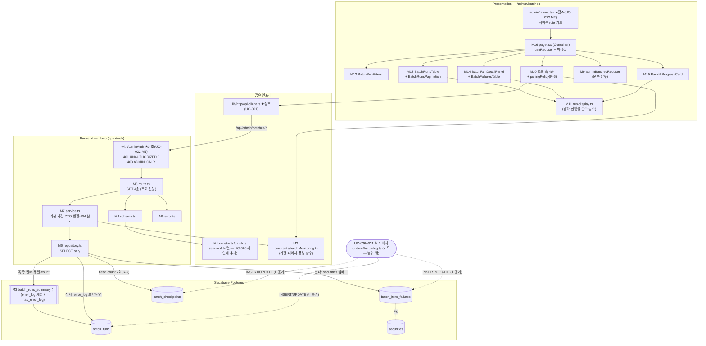

# Plan: UC-023 배치 작업 모니터링 조회

> 근거: `docs/usecases/023/spec.md`, `docs/usecases/000_decisions.md`(H-8, C-3 파생 계약), `docs/techstack.md` §4(모노레포 Codebase Structure)·§7(마이그레이션 SOT·복잡 조회는 뷰/RPC)·§8(배치 모니터링 정책), `docs/database.md` §3(batch 3테이블)·§5(enum)·§7-4(표준 조회 쿼리), `supabase/migrations/0012_batch_runs.sql`(기존 스키마 — 변경 없음), `docs/usecases/022/plan.md`(공통 Admin 인증 가드 M1/M2의 SOT), `docs/usecases/026/plan.md`(워커 측 기록 계약·`packages/domain/constants/batch.ts`의 SOT), `.claude/skills/spec_to_plan/references/hono-backend-guide.md`(Hono 백엔드 컨벤션).
>
> - **범위**: ① 어드민 배치 조회 API 4종(`features/admin-batches/backend/*` — 전부 GET, 조회 전용), ② 목록 요약용 DB 뷰 마이그레이션 1건(BR-6 — `error_log` 본문 비전송), ③ `/admin/batches` 페이지 FE(폴링 포함).
> - **범위 밖**: `batch_runs`/`batch_item_failures`/`batch_checkpoints` **기록**(UC-026~031 워커 `runtime/batch-log.ts` 소관 — BR-5 디커플), 수동 재실행 액션·엔드포인트(E7 — 2단계, 본 plan은 어떤 쓰기 모듈도 정의하지 않음), 어드민 인증 미들웨어·레이아웃(UC-022 M1/M2 참조만).
> - **외부 서비스 연동 없음**(spec §6.4) — 자체 DB 3테이블만 SELECT 한다. OpenDART/SEC/토스 클라이언트 모듈은 배치 잡 plan(026~031) 소관이므로 본 plan에 외부 클라이언트 설계 대상이 없다.
> - `docs/pages/`에 admin-batches 페이지의 state_management.md는 **존재하지 않으므로**, FE 상태는 spec_to_plan 컨벤션(Container + `useReducer`, 서버 상태는 TanStack Query)으로 본 plan이 최소 설계한다(R-8).
> - DB 스키마는 `0012_batch_runs.sql`로 이미 존재한다. **테이블·컬럼·인덱스 변경 없음** — 신규 마이그레이션은 읽기 전용 뷰 1건뿐이다(R-2).

---

## 사전 정합화 결정 (spec 모호점·타 plan 충돌 해소 — 구현 시 이 표를 따름)

| # | 사안 | 결정 | 근거 |
|---|---|---|---|
| R-1 | 401/403 에러 코드 — spec은 `ADMIN_FORBIDDEN`, 공통 미들웨어(UC-022 M1)는 `ADMIN_ONLY` export | **공통 미들웨어 코드를 따른다**: 401 `UNAUTHORIZED`, 403 `ADMIN_ONLY`. UC-022 plan이 "UC-021/023/024가 동일 상수 재사용"을 계약으로 선점했고, 미들웨어는 라우트 그룹 공용이라 기능별 코드 분기가 불가능하다. spec의 `ADMIN_FORBIDDEN` 표기는 이 코드로 대체(FE는 HTTP status 401/403으로 분기하므로 동작 차이 없음) | UC-022 plan M1(공유 SOT), DRY |
| R-2 | 목록에서 `error_log` 본문 제외(BR-6·E3)의 구현 방식 | 읽기 전용 뷰 **`batch_runs_summary`**(`error_log IS NOT NULL AS has_error_log` 계산 컬럼, 본문 컬럼 미포함)를 마이그레이션으로 추가하고 목록 조회는 이 뷰만 사용한다. PostgREST가 뷰를 테이블처럼 노출하므로 필터·정렬·count는 supabase-js 표준 기능으로 처리(RPC 불필요 — SQL 로직 최소화). 단순 뷰라 플래너가 인라인해 `idx_batch_runs_job_started`를 그대로 탄다 | BR-6, E3, techstack §7(오버엔지니어링 금지) |
| R-3 | `pagination.totalCount` 산출 | 목록·실패 조회 모두 `select(..., { count: 'exact' })` + `range()` 병행 1회 호출. UC-022의 `pageSize+1`/hasMore 방식과 다르지만 **spec 응답 계약이 totalCount를 명시**하므로 spec을 따른다 | spec API-1/API-3 응답 계약 |
| R-4 | 기본 조회 기간(상수)의 적용 규칙 | `from` 미지정 시에만 `now − BATCH_RUNS_DEFAULT_LOOKBACK_DAYS`를 하한으로 적용, `to` 미지정 시 상한 없음. `from`·`to` 모두 지정되면 그대로 사용하되 `from > to`는 스키마 refine으로 400 `VALIDATION_ERROR`(E9). 기본 기간 적용은 Service 책임(Route는 파싱만) | spec API-1·BR-7·E9 |
| R-5 | 백필 진행률(API-4) 산출 방식 | RPC 없이 supabase-js **head count 2회**(전체: `job_type='backfill_all'`, 완료: `+ is_completed=true`) + `batch_runs` 최신 1건 조회. 키 수천 규모라 exact count로 충분(부분 인덱스 `idx_batch_checkpoints_incomplete` 존재). `isCompleted = total > 0 AND completed = total`, 체크포인트 0건이면 `0/0` + `isCompleted=false`(E11) | BR-9, E11, techstack 원칙 4 |
| R-6 | running 폴링(E2·Main 7)의 구현 위치 | TanStack Query **`refetchInterval` 파생 함수**로만 구현: 최신 응답에 `status='running'` 행이 있으면 `BATCH_RUNS_POLL_INTERVAL_MS`, 없으면 `false`. 별도 타이머/전역 상태 없음. 화면 이탈 = 컴포넌트 unmount로 자동 중단, 탭 비활성 시 기본값(`refetchIntervalInBackground:false`)으로 중단. 폴링 중 일시 오류는 이전 데이터 유지(placeholderData) + 다음 주기 자동 재조회(E12) | spec Main 7·E2·E12, 최소 구현 |
| R-7 | 마이그레이션 파일 번호 | 다른 plan들(UC-007/008/010/012/015/022/026)이 `0013` 이후 번호를 경합 선점 중 — 본 plan은 `NNNN_admin_batch_runs_summary_view.sql`의 **NNNN을 구현 시점의 다음 빈 번호로 부여**한다(내용만 고정, 뷰라 순서 무관 적용 가능 — 0012 이후이기만 하면 됨) | techstack §7, plan 간 충돌 방지 |
| R-8 | 페이지 상태 설계(state_management.md 부재) | Container(`page.tsx`) + `useReducer` 최소 설계를 본 plan이 정의: `{ jobType, status, from, to, page, selectedRunId, failuresPage }` 7필드. 서버 데이터·폴링·로딩은 전부 TanStack Query 소관(리듀서에 서버 상태 미보관). 상세 패널 열림 여부는 `selectedRunId !== null` 파생 | spec_to_plan 컨벤션, UC-022 M11 패턴과 일관 |
| R-9 | 실패 목록(API-3) 정렬 | `updated_at DESC, id DESC`(tie-break 결정성). `docs/database.md` §7-4 표준 쿼리와 일치 | database.md §7-4 |
| R-10 | 존재하지 않는 runId의 실패 목록 조회(API-3 404) | 실패 0건과 미존재 run을 구분하기 위해 Service가 **run 존재 확인을 선행**(단건 조회) 후 실패 목록을 조회한다. 미존재 → 404 `RUN_NOT_FOUND`(E8) | spec API-3 에러 계약 |
| R-11 | E10(장시간 running) 표시 | running 행에 `now − startedAt` 경과 시간을 파생 표기(FE 순수 함수, 폴링 리렌더로 갱신)만 수행. 상태 보정·타임아웃 처리·경고 배지는 추가하지 않는다(조회 전용 소관 외 — spec E10 명시) | spec E10, BR-1 |

---

## 개요

| # | 모듈 | 위치 | 설명 |
| --- | --- | --- | --- |
| **공통(shared) — 도메인 상수** | | | |
| M1 | 배치 enum 리터럴 상수(추가) | `packages/domain/constants/batch.ts` (UC-026 plan 정의 파일에 **심볼 추가**) | `BATCH_JOB_TYPES`(6종)·`BATCH_RUN_STATUSES`(4종) `as const` 배열 + `BatchJobType`/`BatchRunStatus` 타입 — DB enum 리터럴과 1:1(BR-3·BR-4). 워커(잡 기록)와 웹(필터 검증·배지)이 공용하는 SOT |
| M2 | 모니터링 조회 상수 | `packages/domain/constants/batchMonitoring.ts` (신규) | `ADMIN_BATCH_RUNS_PAGE_SIZE_DEFAULT=20`·`_MAX=100`, `ADMIN_BATCH_FAILURES_PAGE_SIZE_DEFAULT=20`·`_MAX=100`, `BATCH_RUNS_DEFAULT_LOOKBACK_DAYS=14`, `BATCH_RUNS_POLL_INTERVAL_MS=10_000` — BR-7(하드코딩 금지). FE/BE 공용 |
| **DB — Persistence (마이그레이션 SOT)** | | | |
| M3 | 목록 요약 뷰 마이그레이션 | `supabase/migrations/NNNN_admin_batch_runs_summary_view.sql` (R-7) | `batch_runs_summary` 뷰 — `error_log` 본문 제외 + `has_error_log` 계산 컬럼(R-2). 테이블 변경 없음 |
| **백엔드 — `features/admin-batches/backend` (본 UC 소유)** | | | |
| M4 | Zod 스키마 | `apps/web/src/features/admin-batches/backend/schema.ts` | Query/Param/Row/Response 스키마 분리 정의(E9 검증 포함) |
| M5 | 에러 코드 | `apps/web/src/features/admin-batches/backend/error.ts` | `VALIDATION_ERROR`/`RUN_NOT_FOUND`/`INTERNAL_ERROR`(spec §6.2). 401/403은 공통 미들웨어 코드(R-1) |
| M6 | 리포지토리 | `apps/web/src/features/admin-batches/backend/repository.ts` | 뷰·3테이블 SELECT 캡슐화(Persistence) — 전부 읽기, 쓰기 함수 없음(BR-1) |
| M7 | 서비스 | `apps/web/src/features/admin-batches/backend/service.ts` | 기본 기간·페이지 상수 적용, Row→DTO 변환, 404 분기, 백필 진행률 산출 |
| M8 | 라우트 + 등록 | `apps/web/src/features/admin-batches/backend/route.ts`, `apps/web/src/backend/hono/app.ts`(수정) | `GET /admin/batches/runs`, `GET /admin/batches/runs/:runId`, `GET /admin/batches/runs/:runId/failures`, `GET /admin/batches/backfill/progress` — HTTP 파싱/검증만. `withAdminAuth()` 그룹 선적용 |
| **프론트엔드 — `/admin/batches` (R-8 설계 준수)** | | | |
| M9 | 페이지 리듀서 | `apps/web/src/features/admin-batches/hooks/adminBatchesReducer.ts` | 필터/페이지/선택 상태 순수 리듀서(R-8) |
| M10 | 조회 훅 4종 + 폴링 정책 | `apps/web/src/features/admin-batches/hooks/useBatchRunsQuery.ts`, `useBatchRunDetailQuery.ts`, `useBatchRunFailuresQuery.ts`, `useBackfillProgressQuery.ts`, `pollingPolicy.ts` | TanStack Query 훅 + `resolveRunsRefetchInterval()` 순수 함수(R-6) |
| M11 | 표시 파생 유틸 | `apps/web/src/features/admin-batches/lib/run-display.ts` | 경과 시간/소요 시간 포맷, running 존재 판정, 백필 진행률(%) 계산 — 순수 함수(E10·BR-9 표시) |
| M12 | 필터 바 | `apps/web/src/features/admin-batches/components/BatchRunFilters.tsx` | 작업 종류/상태/기간 필터 Presenter |
| M13 | 실행 목록 테이블 + 페이지네이션 | `apps/web/src/features/admin-batches/components/BatchRunsTable.tsx`, `BatchRunsPagination.tsx` | 상태·이월 배지·경과 시간·행 선택 Presenter / totalCount 기반 페이지 이동 Presenter |
| M14 | 실행 상세 패널 | `apps/web/src/features/admin-batches/components/BatchRunDetailPanel.tsx`, `BatchFailuresTable.tsx` | 실행 요약 + `errorLog` 본문 + 종목 단위 실패 목록(자체 페이지네이션) Presenter |
| M15 | 백필 진행 카드 | `apps/web/src/features/admin-batches/components/BackfillProgressCard.tsx` | 완료/전체 키 수·진행률·최신 실행 상태 Presenter(0/0 미실행 표기 — E11) |
| M16 | 페이지 컨테이너 | `apps/web/src/app/admin/batches/page.tsx` | `'use client'` Container — `useReducer` + 쿼리 훅 소유, 파생값 계산, Presenter 배선 |
| M17 | UI 문구 상수 | `apps/web/src/features/admin-batches/constants.ts` | 작업 종류/상태 한글 라벨 맵, 빈 상태·오류·이월 배지 문구(하드코딩 금지) |
| **공통 인프라 — 위치만 참조(선행 plan 정의, 본 UC 신규 정의 없음)** | | | |
| — | Admin 인증 미들웨어 | `apps/web/src/backend/middleware/admin.ts` | `withAdminAuth()` 401/403 — **UC-022 plan M1 정의** (BR-2의 서버 측 관문) |
| — | 어드민 레이아웃 가드 + 셸 | `apps/web/src/app/admin/layout.tsx` | 서버측 role 확인·어드민 내비(배치 모니터링 링크 포함) — **UC-022 plan M2 정의** |
| — | Hono 골격·미들웨어 체인·응답 헬퍼 | `apps/web/src/backend/{hono,http,middleware}/*` | UC-001 plan 정의 |
| — | FE API 클라이언트 | `apps/web/src/lib/http/api-client.ts` | `HandlerResult` 언랩·`ApiError` — UC-001 plan 정의 |
| — | DB 생성 타입 | `packages/domain/types/database.ts` | M3 적용 후 `generate_typescript_types` 재생성(techstack §7 — 뷰 타입 포함) |

- **워커(`apps/worker`) 변경 없음** — 데이터 생산(`batch_runs`/`batch_item_failures`/`batch_checkpoints` 쓰기)은 UC-026~031 소관(BR-5). 이력 0건이어도 본 기능은 빈 상태로 정상 동작(E1).
- **INSERT/UPDATE/DELETE 모듈 없음** — 조회 전용(BR-1). 재실행 버튼·엔드포인트 미구현(E7).

## Diagram

데이터 흐름: Presenter(M12~M15) → Container(M16) dispatch/쿼리 → api-client → `withAdminAuth` → Route(M8) → Service(M7) → Repository(M6) → 뷰/테이블. 전 구간 읽기 전용이며, 워커 기록과는 DB로만 접한다(BR-5).

---

## Implementation Plan

### M1. 배치 enum 리터럴 상수 — `packages/domain/constants/batch.ts` (공유, 심볼 추가)

- 구현 내용:
  1. UC-026 plan이 정의한 파일에 다음 심볼을 **추가**한다(기존 상수 변경 없음 — UC-001 plan의 "공용 파일에 심볼 추가" 방식과 동일):
     `BATCH_JOB_TYPES = ['collect_quotes','collect_financials','collect_fx_market_hours','aggregate_daily_metrics','analyze_disclosures','backfill_all'] as const`,
     `BATCH_RUN_STATUSES = ['running','success','partial_success','failed'] as const`, `BatchJobType`/`BatchRunStatus` 타입 export.
  2. DB enum(`0012` — `batch_job_type`/`batch_run_status`)과 리터럴·순서 일치(BR-3·BR-4). 프레임워크 의존 없음(techstack §4 domain 원칙).
  3. 워커 잡(026~031)의 `jobType` 인자·웹 필터 검증·FE 라벨 키가 전부 이 상수를 참조(DRY — 문자열 중복 정의 금지).
- 의존성: 없음(최우선 구현). UC-026 plan과 파일 공유하나 심볼 충돌 없음(교차 확인 완료 — UC-026은 cron/청크/재시도 상수만 정의).
- **Unit Tests**:
  - [ ] `BATCH_JOB_TYPES`가 `docs/database.md` §5 enum 6종과 정확히 일치한다(스냅샷 비교)
  - [ ] `BATCH_RUN_STATUSES`가 4종(running/success/partial_success/failed)과 정확히 일치한다

### M2. 모니터링 조회 상수 — `packages/domain/constants/batchMonitoring.ts` (공유, 신규)

- 구현 내용: BR-7(기본 조회 기간·페이지 크기·폴링 주기 상수 관리) 이행 —
  `ADMIN_BATCH_RUNS_PAGE_SIZE_DEFAULT = 20`, `ADMIN_BATCH_RUNS_PAGE_SIZE_MAX = 100`,
  `ADMIN_BATCH_FAILURES_PAGE_SIZE_DEFAULT = 20`, `ADMIN_BATCH_FAILURES_PAGE_SIZE_MAX = 100`,
  `BATCH_RUNS_DEFAULT_LOOKBACK_DAYS = 14`(R-4), `BATCH_RUNS_POLL_INTERVAL_MS = 10_000`(R-6).
  FE 훅과 BE 스키마/서비스가 동일 상수를 import(DRY).
- 의존성: 없음.
- **Unit Tests**:
  - [ ] 페이지 기본값이 최대값 이하이고 전부 1 이상 정수다(가드 테스트)
  - [ ] `BATCH_RUNS_POLL_INTERVAL_MS`가 1,000ms 이상이다(과도 폴링 방지 가드)

### M3. 목록 요약 뷰 마이그레이션 — `supabase/migrations/NNNN_admin_batch_runs_summary_view.sql` (Persistence, R-2·R-7)

- 구현 내용 (적용은 `mcp__supabase__apply_migration`, 로컬 Supabase 금지 — 저장소 SQL 가이드라인 준수):
  1. `CREATE OR REPLACE VIEW batch_runs_summary AS SELECT id, job_type, status, started_at, finished_at, processed_count, failed_count, is_carried_over, target_market, (error_log IS NOT NULL) AS has_error_log, created_at FROM batch_runs;` — **`error_log` 본문 컬럼 미포함**(BR-6·E3의 구조적 보장: 목록 경로로는 본문이 DB 밖으로 나갈 수 없다).
  2. `COMMENT ON VIEW` — 용도(어드민 배치 모니터링 목록 전용, 023) 명기. 테이블/인덱스/enum 변경 없음(0012가 이미 최종 — `idx_batch_runs_job_started`가 목록 정렬을 커버).
  3. 멱등(`CREATE OR REPLACE`). 번호는 구현 시점 다음 빈 번호(R-7).
  4. 적용 후 `mcp__supabase__generate_typescript_types`로 `packages/domain/types/database.ts` 재생성(뷰 Row 타입 포함 — techstack §7).
- 의존성: 기존 0012(테이블)·0003(securities). 신규 테이블·컬럼 없음.
- **검증 시나리오 (마이그레이션 QA — SQL 레벨, 시드 데이터로 실행)**:
  - [ ] `error_log`가 NULL인 행 → `has_error_log=false`, 본문 있는 행 → `true`
  - [ ] 뷰에 `error_log` 컬럼이 존재하지 않는다(`SELECT error_log FROM batch_runs_summary` 오류)
  - [ ] `EXPLAIN`으로 `job_type` 필터 + `started_at DESC` 정렬 시 `idx_batch_runs_job_started` 사용 확인
  - [ ] `target_market` NULL 행(시장 무관 잡)이 정상 노출된다

### M4. Zod 스키마 — `features/admin-batches/backend/schema.ts`

- 구현 내용:
  1. `BatchRunsListQuerySchema`: `{ jobType: z.enum(BATCH_JOB_TYPES).optional(), status: z.enum(BATCH_RUN_STATUSES).optional(), from: z.iso.datetime({ offset: true }).optional(), to: z.iso.datetime({ offset: true }).optional(), page: z.coerce.number().int().min(1).default(1), pageSize: z.coerce.number().int().min(1).max(ADMIN_BATCH_RUNS_PAGE_SIZE_MAX).default(ADMIN_BATCH_RUNS_PAGE_SIZE_DEFAULT) }` + `.refine(from/to 모두 존재 시 from <= to)`(E9) — 위반 시 400 `VALIDATION_ERROR`.
  2. `RunIdParamSchema`: `z.string().uuid()` — uuid 형식이 아니면 400(존재 여부 판정 이전의 형식 검증).
  3. `BatchFailuresQuerySchema`: `page`/`pageSize`(failures 상수 기본·최대).
  4. Row 스키마(snake_case — DB와 1:1): `BatchRunSummaryRowSchema`(M3 뷰: `has_error_log` boolean 포함, `finished_at`/`target_market` nullable), `BatchRunDetailRowSchema`(`batch_runs` 원본: `error_log` nullable 포함), `BatchItemFailureRowSchema`(`id, attempt_count, last_error(nullable), is_resolved, updated_at, securities: { id, ticker, name, market } | null` — 임베드 결과), `BackfillLatestRunRowSchema`.
  5. Response 스키마(camelCase — spec §6.2 계약 그대로): `BatchRunsListResponseSchema`(`runs[]` + `pagination{page,pageSize,totalCount}`), `BatchRunDetailResponseSchema`(`run{...errorLog}`), `BatchRunFailuresResponseSchema`(`failures[]`(security nullable) + `pagination`), `BackfillProgressResponseSchema`(`totalCheckpoints, completedCheckpoints, isCompleted, latestRun(nullable)`). 각 `z.infer` export(FE 훅이 타입 재사용).
- 의존성: M1, M2.
- **Unit Tests**:
  - [ ] 파라미터 전부 미지정 → `page=1`, `pageSize=20` 기본값 적용, 필터 undefined
  - [ ] `jobType=unknown_job` / `status=paused` → 파싱 실패(E9 — BR-3·BR-4 밖 값)
  - [ ] `from=2026-07-05T00:00:00+09:00, to=2026-07-01T00:00:00+09:00`(from>to) → refine 실패(E9)
  - [ ] `page=0` / `pageSize=101` / `pageSize=abc` → 실패(E9 페이지 범위 오류)
  - [ ] `RunIdParamSchema`: uuid 아닌 문자열 실패
  - [ ] `BatchItemFailureRowSchema`: `securities: null` 행(비종목 실패) 통과(BR-8)
  - [ ] `BatchRunSummaryRowSchema`: `finished_at: null`(running) 행 통과(E2)

### M5. 에러 코드 — `features/admin-batches/backend/error.ts`

- 구현 내용: spec §6.2 그대로(`as const`) —
  `validationError: 'VALIDATION_ERROR'`(400, E9), `runNotFound: 'RUN_NOT_FOUND'`(404, E8), `internalError: 'INTERNAL_ERROR'`(500, E12).
  `AdminBatchesServiceError` 타입 export. 401 `UNAUTHORIZED`/403 `ADMIN_ONLY`는 공통 미들웨어 소관(R-1 — 본 파일에 재정의하지 않음).
- 의존성: 없음. Unit Tests: N/A(상수 정의).

### M6. 리포지토리 — `features/admin-batches/backend/repository.ts`

- 구현 내용 (Supabase 문법은 이 파일에만 존재, 예외 대신 결과 객체 반환, **전 함수 SELECT 전용** — BR-1의 계층 보장):
  1. `listRunSummaries(client, { jobType?, status?, fromIso?, toIso?, limit, offset })` →
     `from('batch_runs_summary').select('*', { count: 'exact' })`에 조건부 `.eq('job_type', jobType)`/`.eq('status', status)`/`.gte('started_at', fromIso)`/`.lte('started_at', toIso)` 체인,
     `.order('started_at', { ascending: false }).order('id', { ascending: false })`(tie-break 결정성) + `.range(offset, offset+limit-1)` → `{ rows, totalCount }`(R-3). 0건이어도 정상 결과(E1).
  2. `findRunById(client, runId)` → `from('batch_runs').select('id, job_type, status, started_at, finished_at, processed_count, failed_count, is_carried_over, target_market, error_log').eq('id', runId).maybeSingle()` → `row | null`(API-2 — 본문은 여기서만, BR-6).
  3. `listFailuresByRun(client, runId, { limit, offset })` →
     `from('batch_item_failures').select('id, attempt_count, last_error, is_resolved, updated_at, securities(id, ticker, name, market)', { count: 'exact' }).eq('batch_run_id', runId).order('updated_at', { ascending: false }).order('id', { ascending: false }).range(...)` → `{ rows, totalCount }`(R-9 — `idx_batch_item_failures_run` 활용, `security_id` NULL 행은 임베드가 null).
  4. `countBackfillCheckpoints(client)` → head count 2회(R-5): `from('batch_checkpoints').select('*', { count: 'exact', head: true }).eq('job_type','backfill_all')` / 동일 + `.eq('is_completed', true)` → `{ total, completed }`.
  5. `findLatestBackfillRun(client)` → `from('batch_runs').select('id, status, started_at, finished_at').eq('job_type','backfill_all').order('started_at', { ascending: false }).limit(1).maybeSingle()` → `row | null`.
- 의존성: M3(뷰 존재), M4(Row 타입), 공통 Supabase 컨텍스트(UC-001 plan).
- **Unit Tests** (Supabase client mock — 쿼리 빌더 호출 스냅샷):
  - [ ] `listRunSummaries`가 필터 미지정 시 `eq`를 걸지 않고, 지정 시에만 해당 조건을 추가한다
  - [ ] `listRunSummaries`가 `batch_runs_summary`(테이블 아님)를 대상으로 `count:'exact'`·`started_at DESC` 정렬·range를 사용한다(R-2·R-3)
  - [ ] `findRunById`가 `error_log`를 포함해 조회하고, 0행이면 throw 없이 `null` 반환(E8 입력)
  - [ ] `listFailuresByRun`이 `batch_run_id` eq + `updated_at DESC` 정렬 + securities 임베드를 사용한다(R-9)
  - [ ] `countBackfillCheckpoints`가 `head:true` count 쿼리 2회로 total/completed를 반환한다(R-5)
  - [ ] DB 오류 응답 시 `{ ok:false, message }` 결과 반환(throw 없음 — 500 매핑 입력)

### M7. 서비스 — `features/admin-batches/backend/service.ts`

- 구현 내용 (repository 인터페이스에만 의존 — deps 주입으로 테스트 가능, `now` 주입형):
  1. **`listBatchRuns(deps, query, now): HandlerResult<BatchRunsListResponse>`** —
     `from` 미지정 시 `fromIso = now − BATCH_RUNS_DEFAULT_LOOKBACK_DAYS`(R-4), `offset = (page−1) × pageSize`;
     repository 호출 → 오류 시 `failure(500, INTERNAL_ERROR)`(E12) → Row 배열 Zod 검증(위반 → 동일 500) →
     snake_case→camelCase DTO 변환(`has_error_log`→`hasErrorLog`, `finished_at:null` 그대로 — E2) →
     `success({ runs, pagination: { page, pageSize, totalCount } })`. 0건도 200 + 빈 배열(E1).
  2. **`getBatchRunDetail(deps, runId): HandlerResult<BatchRunDetailResponse>`** —
     `findRunById` → `null` → `failure(404, RUN_NOT_FOUND)`(E8); 행 존재 → DTO 변환(`errorLog` nullable 포함) → `success({ run })`.
  3. **`listBatchRunFailures(deps, runId, query): HandlerResult<BatchRunFailuresResponseSchema>`** —
     **run 존재 확인 선행**(R-10): `findRunById` null → 404; 존재 시 `listFailuresByRun` →
     DTO 변환: 임베드 securities → `security { id, ticker, name, market }`, NULL이면 `security: null`(BR-8 비종목 실패) → `success({ failures, pagination })`.
  4. **`getBackfillProgress(deps): HandlerResult<BackfillProgressResponse>`** —
     `countBackfillCheckpoints` + `findLatestBackfillRun` 병렬 조회 →
     `isCompleted = total > 0 && completed === total`(R-5), 체크포인트 0건 → `{ totalCheckpoints: 0, completedCheckpoints: 0, isCompleted: false }`(E11), 백필 실행 이력 없음 → `latestRun: null` → `success(...)`. 조회 오류 → `failure(500, INTERNAL_ERROR)`.
  5. 전 함수 응답을 Response 스키마로 최종 검증 후 반환(계약 드리프트 차단). 쓰기 경로 없음(BR-1).
- 의존성: M2, M4, M5, M6, 공통 `response.ts`.
- **Unit Tests** (repository mock 주입, `now` 고정):
  - [ ] `from`/`to` 미지정 → repository에 `fromIso = now−14일`, `toIso = undefined`가 전달된다(R-4)
  - [ ] `from` 명시 → 기본 기간을 덮어쓰지 않고 명시값 그대로 전달된다
  - [ ] `page=3, pageSize=20` → `offset=40` 계산
  - [ ] 목록 0건 → `success({ runs: [], pagination.totalCount: 0 })`(E1)
  - [ ] running 행(`finished_at:null`) → DTO `finishedAt: null` 그대로 통과(E2 — 상태 보정 없음)
  - [ ] `has_error_log` → `hasErrorLog` 매핑, 목록 DTO에 `errorLog` 필드가 존재하지 않는다(BR-6)
  - [ ] `getBatchRunDetail`: 미존재 runId → 404 `RUN_NOT_FOUND`(E8) / 존재 → `errorLog` 본문 포함 200
  - [ ] `listBatchRunFailures`: 미존재 runId → 404(실패 목록 조회 미수행 — R-10) / 실패 0건인 실존 run → 200 + 빈 배열
  - [ ] 실패 행의 securities NULL → `security: null`, 존재 → 4필드 매핑(BR-8)
  - [ ] 백필: total=3200·completed=2710 → `isCompleted:false` / total=completed=3200 → `true` / total=0 → `0/0`·`false`(E11)
  - [ ] 백필 실행 이력 없음 → `latestRun: null`
  - [ ] repository `{ok:false}` → `failure(500, INTERNAL_ERROR)`(E12)

### M8. 라우트 — `features/admin-batches/backend/route.ts` + 등록 (`backend/hono/app.ts` 수정)

- 구현 내용:
  1. `registerAdminBatchRoutes(app)` — 라우트 그룹에 `withAdminAuth()`(UC-022 M1) 선적용(BR-2 — 401 `UNAUTHORIZED`/403 `ADMIN_ONLY`는 미들웨어가 처리, E5·E6):
     - `GET /admin/batches/runs`: 쿼리 `BatchRunsListQuerySchema.safeParse` 실패 → 400 `VALIDATION_ERROR`(E9) → `listBatchRuns` → `respond()`
     - `GET /admin/batches/runs/:runId`: param uuid 검증(실패 → 400) → `getBatchRunDetail` → `respond()`
     - `GET /admin/batches/runs/:runId/failures`: param + `BatchFailuresQuerySchema` 검증 → `listBatchRunFailures` → `respond()`
     - `GET /admin/batches/backfill/progress`: 파라미터 없음 → `getBackfillProgress` → `respond()`
  2. **GET 외 메서드 미등록**(E7·BR-1 — 재실행 등 쓰기 엔드포인트 자체가 존재하지 않음).
  3. 실패 로깅: 500은 error 레벨(DB 원문 오류는 로그 전용 — 응답 비노출), 404/400은 info. 폴링 트래픽을 고려해 성공 요청은 debug 레벨.
  4. `backend/hono/app.ts`에 `registerAdminBatchRoutes(app)` 1줄 추가(UC-022의 `/admin/llm-proposals`와 경로 충돌 없음 — `/admin/batches` 네임스페이스 최초 사용).
- 의존성: UC-022 M1(미들웨어), M4, M5, M7, 공통 미들웨어 체인(UC-001).
- **QA Sheet**:

| # | 시나리오 | 기대 결과 |
| --- | --- | --- |
| 1 | 비로그인 `GET /api/admin/batches/runs` | 401 `UNAUTHORIZED`(E6) |
| 2 | 일반 사용자(role=user) 호출 | 403 `ADMIN_ONLY`(E5 — R-1 코드) |
| 3 | Admin, 파라미터 없이 목록 호출 | 200 — 최근 14일(상수)·`started_at DESC`·20건, `pagination.totalCount` 포함 |
| 4 | `?jobType=collect_financials&status=partial_success` | 해당 조합만 반환, 각 행에 `isCarriedOver`·`hasErrorLog` 플래그 |
| 5 | `?jobType=banana` / `?from>to` / `?page=0` | 400 `VALIDATION_ERROR`(E9) |
| 6 | 이력 0건 상태(배치 미가동)에서 목록 호출 | 200 + `runs: []`(E1) |
| 7 | running 실행 존재 시 목록 | 해당 행 `status='running'`, `finishedAt: null`(E2) |
| 8 | 목록 응답 body 검사 | `errorLog` 본문 필드 부재, `hasErrorLog`만 존재(BR-6) |
| 9 | 실존 runId 상세 조회 | 200 — `errorLog` 본문 포함(partial_success 이월 사례: E4 요약 문구) |
| 10 | 미존재 uuid 상세/실패 조회 | 404 `RUN_NOT_FOUND`(E8) / uuid 형식 오류 → 400 |
| 11 | 실패 목록 조회(종목 실패 + 비종목 실패 혼재 run) | 200 — 종목 행은 `security{ticker,name,market}`, 비종목 행은 `security:null`(BR-8) |
| 12 | 백필 미실행 상태에서 progress 호출 | 200 `{ totalCheckpoints:0, completedCheckpoints:0, isCompleted:false, latestRun:null }`(E11) |
| 13 | 백필 진행 중 progress 호출 | 200 — 완료/전체 키 수·최신 실행 상태 일치(BR-9) |
| 14 | `POST /api/admin/batches/runs/{id}/rerun` 등 임의 쓰기 호출 | 404(라우트 미존재 — E7 확인) |

### M9. 페이지 리듀서 — `features/admin-batches/hooks/adminBatchesReducer.ts`

- 구현 내용 (R-8 설계 — 순수 함수, I/O·서버 상태 없음):
  1. `AdminBatchesState = { jobType: BatchJobType | null, status: BatchRunStatus | null, from: string | null, to: string | null, page: number, selectedRunId: string | null, failuresPage: number }`, `initialAdminBatchesState`(전부 null·page 1).
  2. Action 5종: `FILTER_CHANGED{ jobType?, status?, from?, to? }`(부분 갱신 + **page 1 리셋 + 상세 닫힘**), `PAGE_CHANGED{ page }`(1 미만 무시, 상세 닫힘), `RUN_SELECTED{ runId }`(선택 + `failuresPage` 1 리셋; 동일 ID 재선택은 동일 참조 반환), `DETAIL_CLOSED`, `FAILURES_PAGE_CHANGED{ page }`(상세 열림 중에만 유효 — `selectedRunId===null`이면 무시).
  3. 변화 없으면 기존 state 참조 반환(리렌더 최소화). 폴링·로딩·데이터는 TanStack Query 소관(리듀서 미보관 — R-6).
- 의존성: M1(리터럴 타입).
- **Unit Tests**:
  - [ ] 초기 상태: 필터 null·page 1·선택 null
  - [ ] `FILTER_CHANGED(status:'failed')` → status만 교체 + page 1 리셋 + `selectedRunId` 해제
  - [ ] `PAGE_CHANGED(0)` → 무시(동일 참조) / `PAGE_CHANGED(2)` → page 2 + 상세 닫힘
  - [ ] `RUN_SELECTED(a)` 후 `RUN_SELECTED(a)` → 동일 참조 / `RUN_SELECTED(b)` → 교체 + failuresPage 1
  - [ ] `FAILURES_PAGE_CHANGED` — 상세 미열림 상태에서 무시(지연 이벤트 방어)
  - [ ] 전 Action에서 입력 state 비변이(mutate 없음)

### M10. 조회 훅 4종 + 폴링 정책 — `hooks/useBatchRunsQuery.ts` 외 3종, `hooks/pollingPolicy.ts`

- 구현 내용:
  1. **`pollingPolicy.ts`**(순수 함수 — 테스트 대상 핵심): `hasRunningRun(runs): boolean`, `resolveRunsRefetchInterval(data: BatchRunsListResponse | undefined): number | false` — running 행 존재 시 `BATCH_RUNS_POLL_INTERVAL_MS`, 아니면 `false`(R-6). `resolveBackfillRefetchInterval(data)` — `latestRun?.status==='running'`일 때만 동일 주기.
  2. `useBatchRunsQuery(filters, page)`: 쿼리 키 `['admin','batches','runs',{ jobType, status, from, to, page }]`, `apiFetch('/admin/batches/runs?...')`(null 필터는 쿼리스트링 생략), `placeholderData: keepPreviousData`(페이지/폴링 전환 깜빡임 방지·E12 이전 데이터 유지), `refetchInterval: q => resolveRunsRefetchInterval(q.state.data)`(`refetchIntervalInBackground` 기본 false — 탭 이탈 시 중단).
  3. `useBatchRunDetailQuery(runId)`: 키 `['admin','batches','run', runId]`, `enabled: runId !== null`.
  4. `useBatchRunFailuresQuery(runId, page)`: 키 `['admin','batches','run', runId, 'failures', page]`, `enabled: runId !== null`, `keepPreviousData`.
  5. `useBackfillProgressQuery()`: 키 `['admin','batches','backfill-progress']`, `refetchInterval: q => resolveBackfillRefetchInterval(q.state.data)`.
  6. 조회 전용이므로 뮤테이션 훅 없음(BR-1). 401/403 `ApiError`는 오류 화면에서 재로그인 유도(레이아웃 가드가 통상 선차단 — 세션 만료 잔여 케이스).
- 의존성: M2, M4(타입), M8(API), 공유 api-client(UC-001).
- **Unit Tests** (`pollingPolicy` 순수 함수):
  - [ ] runs에 `running` 1건 포함 → `BATCH_RUNS_POLL_INTERVAL_MS` 반환(E2)
  - [ ] 전부 종료 상태 → `false`(폴링 중단 — Main 7)
  - [ ] `data: undefined`(로딩/오류) → `false`(오류 루프 방지 — 다음 성공 조회는 수동/포커스 재검증으로 수렴, E12)
  - [ ] 빈 목록 → `false`(E1)
  - [ ] 백필: `latestRun:null` → `false` / `latestRun.status='running'` → 주기 반환

### M11. 표시 파생 유틸 — `features/admin-batches/lib/run-display.ts`

- 구현 내용 (전부 순수 함수, date-fns만 사용 — Presenter가 로직을 갖지 않도록 분리):
  1. `formatElapsed(startedAtIso, now): string` — running 행의 경과 시간(예: `"1시간 23분 경과"`, E10·R-11).
  2. `formatRunDuration(startedAtIso, finishedAtIso): string` — 종료 실행의 소요 시간(예: `"41분 12초"`).
  3. `formatBackfillProgress(completed, total): { percent: number, label: string }` — `total=0`이면 `percent 0`·미실행 라벨(E11), 그 외 반올림 %·`"2,710 / 3,200"` 라벨(BR-9).
  4. 시각 표기는 `Asia/Seoul` 고정 포맷 헬퍼 `formatKstDateTime(iso)`(어드민 운영 화면 — 결정 C-6의 표시 시간대와 일관).
- 의존성: 없음.
- **Unit Tests**:
  - [ ] `formatElapsed`: 83분 경과 → `"1시간 23분"` 포함 문자열 / 30초 경과 → 분 미만 표기
  - [ ] `formatRunDuration`: 2026-07-05T02:00 → 02:41:12 → `"41분 12초"`
  - [ ] `formatBackfillProgress(2710, 3200)` → `percent 85`·라벨 `"2,710 / 3,200"` / `(0,0)` → `percent 0`·미실행 라벨(E11) / `(3200,3200)` → `percent 100`
  - [ ] `formatKstDateTime`이 UTC 입력을 KST 표기로 변환한다

### M12. 필터 바 — `components/BatchRunFilters.tsx`

- 구현 내용: 순수 Presenter(shadcn-ui Select/DatePicker) — props `{ jobType, status, from, to, onChange }`. 작업 종류(전체 + 6종 — M17 라벨), 상태(전체 + 4종), 기간(from/to 날짜 선택, 기본값 비움 = 서버 기본 기간 안내 문구 표시), 필터 초기화 버튼. `from > to` 선택은 입력 단계에서 차단(서버 400의 사전 방지 — E9). 로직 없음(onChange 위임).
- 의존성: M1, M17.
- **QA Sheet**:

| # | 시나리오 | 기대 결과 |
| --- | --- | --- |
| 1 | 작업 종류 `collect_financials` 선택 | `onChange({jobType})` 1회 → 목록 재조회 + 페이지 1 복귀(Container 배선) |
| 2 | 상태 `failed` + 종류 동시 적용 | AND 조건 목록 갱신(Main 5) |
| 3 | 기간 미지정 상태 | "최근 14일" 기본 기간 안내 문구 표시(BR-7 상수 노출) |
| 4 | from을 to보다 뒤 날짜로 선택 시도 | 선택 차단 또는 즉시 경고 — 400 요청 미발생(E9) |
| 5 | 필터 초기화 | 전 필터 해제 + 기본 목록 복귀 |

### M13. 실행 목록 테이블 + 페이지네이션 — `components/BatchRunsTable.tsx`, `BatchRunsPagination.tsx`

- 구현 내용:
  1. `BatchRunsTable` 순수 Presenter — props `{ runs, isLoading, isError, onRetry, selectedRunId, onSelect, now }`. 행 구성(Main 3~4): 작업 종류 라벨, 상태 배지(성공/실패/부분성공/진행 중 — 색상 구분), 시작·종료 시각(KST — M11), **running 행은 종료 시각 대신 경과 시간**(E10·R-11), 처리/실패 건수, **이월 배지**(`isCarriedOver=true` — E4, "다음 실행에서 잔여분 처리" 툴팁), `targetMarket` 표기(있을 때), `hasErrorLog` 행에 로그 아이콘. 행 클릭 → `onSelect(runId)`(실패/부분 성공 외 행도 상세 열람 가능 — 요약 확인용). 로딩 스켈레톤/오류(재시도 버튼)/빈 상태(E1 안내) 분기. **재실행 버튼 미노출**(E7).
  2. `BatchRunsPagination` 순수 Presenter — props `{ page, pageSize, totalCount, onPageChange }`. totalCount 기반 총 페이지 계산·이전/다음/현재 표시(R-3).
- 의존성: M4(타입), M11, M17.
- **QA Sheet**:

| # | 시나리오 | 기대 결과 |
| --- | --- | --- |
| 1 | 목록 로드 | 시작 시각 내림차순, 행마다 종류·상태 배지·시각·건수 표시(Main 4) |
| 2 | `partial_success + isCarriedOver` 행 | 부분성공 배지 + 이월 배지 동시 표시(E4) |
| 3 | running 행 | "진행 중" 배지 + 경과 시간 표기, 종료 시각 없음(E2·E10) |
| 4 | 폴링 갱신으로 running → success 전환 | 배지·종료 시각 자동 갱신, 스크롤/선택 유지 |
| 5 | 이력 0건 | "실행 이력이 없습니다" 빈 상태 안내(E1) |
| 6 | 조회 오류 | 오류 안내 + 재시도 버튼(`onRetry`)(E12) |
| 7 | 행 클릭 | `onSelect` 호출 → 상세 패널 열림, 선택 행 하이라이트 |
| 8 | 어떤 행에도 재실행 버튼 없음 | 확인(E7 — MVP 조회 전용) |
| 9 | totalCount 132·pageSize 20 | 총 7페이지, 마지막 페이지에서 다음 비활성 |

### M14. 실행 상세 패널 — `components/BatchRunDetailPanel.tsx`, `BatchFailuresTable.tsx`

- 구현 내용:
  1. `BatchRunDetailPanel` 순수 Presenter(shadcn-ui Sheet) — props `{ run, isLoading, isError, onRetry, onClose, failuresSlot }`. 내용(Main 6): 실행 요약(종류/상태/시작·종료/소요 시간(M11)/처리·실패 건수/이월/대상 시장) + **`errorLog` 본문**(monospace, 세로 스크롤 컨테이너 — 대량 로그 대응, 없으면 "요약 로그 없음"). 하단에 `failuresSlot`(실패 테이블) 렌더. 404 수신 시 안내 후 닫기 유도(E8 — "목록으로 복귀").
  2. `BatchFailuresTable` 순수 Presenter — props `{ failures, totalCount, page, pageSize, isLoading, onPageChange }`. 행: 종목 정보(`ticker · name · market`, 비종목 실패는 "—" + 오류 메시지만 — BR-8), 시도 횟수, 최종 오류(`lastError`), **해소 여부 배지**(`isResolved` — 해소됨/미해소), `updatedAt`. 자체 페이지네이션(failures 상수).
- 의존성: M4(타입), M11, M17.
- **QA Sheet**:

| # | 시나리오 | 기대 결과 |
| --- | --- | --- |
| 1 | partial_success 행 선택 | 패널 열림 — 요약 + `errorLog` 본문(이월 사유 등) + 실패 목록 동시 로드(Main 6) |
| 2 | 실패 12건 run | 실패 테이블에 티커/종목명/시장·시도 횟수·최종 오류·해소 배지 표시(BR-8) |
| 3 | 비종목 실패 행(예: 환율) | 종목 칸 "—", 오류 메시지만 표시(BR-8) |
| 4 | `isResolved=true` 행 | "해소됨" 배지(이후 주기 재포함 성공 구분) |
| 5 | 실패 0건 성공 run 선택 | 요약만 표시 + "실패 항목 없음" 안내 |
| 6 | 대량 `errorLog` | 패널 내부 스크롤로 열람, 페이지 레이아웃 붕괴 없음(E3) |
| 7 | 열람 중 해당 run이 목록에서 사라진 기간 필터 적용 | 패널 닫힘(FILTER_CHANGED — M9 전이) |
| 8 | 미존재 runId 상세(폴링 사이 삭제 등 방어) | 404 안내 + 닫기 → 목록 복귀(E8) |
| 9 | 닫기/ESC | `onClose` → 패널 닫힘, 목록·필터 상태 유지 |

### M15. 백필 진행 카드 — `components/BackfillProgressCard.tsx`

- 구현 내용: 순수 Presenter(shadcn-ui Card/Progress) — props `{ progress, isLoading, isError }`. 내용(Main 8·BR-9): 진행률 바(`formatBackfillProgress` — M11), 완료/전체 키 수 라벨, `isCompleted` 완료 배지, `latestRun` 상태 배지·시작/종료 시각(없으면 "실행 이력 없음"). `totalCheckpoints=0`이면 "미실행(0/0)" 표기(E11). 조회 오류 시 카드 내 소형 오류 표시(목록과 독립 실패 — 페이지 전체를 막지 않음).
- 의존성: M4(타입), M11, M17.
- **QA Sheet**:

| # | 시나리오 | 기대 결과 |
| --- | --- | --- |
| 1 | 백필 미실행 | "미실행" + 0/0 표기, 진행률 0%(E11) |
| 2 | 진행 중(2,710/3,200) | 85% 바 + `2,710 / 3,200` + 최신 실행 running 배지 |
| 3 | 완료(총=완료) | 100% + 완료 배지 |
| 4 | progress API 오류 | 카드 내 오류 표시, 실행 목록은 정상 동작(독립성) |
| 5 | 백필 running 중 | 카드도 폴링 주기로 자동 갱신(M10 정책) |

### M16. 페이지 컨테이너 — `apps/web/src/app/admin/batches/page.tsx`

- 구현 내용: `'use client'` Container(R-8) — UC-022 M2 어드민 레이아웃(`admin/layout.tsx`) 하위에 렌더(서버측 가드 통과 후 진입 — Precondition):
  1. `useReducer(adminBatchesReducer, initialAdminBatchesState)` + `useBatchRunsQuery(state 필터, state.page)` + `useBackfillProgressQuery()` + (선택 시) `useBatchRunDetailQuery`/`useBatchRunFailuresQuery` 소유.
  2. 파생값(렌더 중 식 — 상태 금지): 상세 패널 열림 = `state.selectedRunId !== null`, running 존재 여부·경과 시간은 M10/M11 순수 함수.
  3. Presenter 배선: 필터 → `FILTER_CHANGED`, 페이지 → `PAGE_CHANGED`, 행 선택 → `RUN_SELECTED`, 패널 닫기 → `DETAIL_CLOSED`, 실패 페이지 → `FAILURES_PAGE_CHANGED`. 목록 오류 재시도 = `refetch()` 호출.
  4. 폴링은 훅 옵션에 내장(R-6) — Container에 타이머 코드 없음. 언마운트로 자동 중단(Main 7 "화면 이탈 시 중단").
  5. 레이아웃: 상단 BackfillProgressCard → 필터 바 → 실행 목록 테이블 + 페이지네이션 → (선택 시) 상세 패널.
- 의존성: M9~M15, M17, UC-022 M2(레이아웃 — 참조).
- **QA Sheet**:

| # | 시나리오 | 기대 결과 |
| --- | --- | --- |
| 1 | Admin이 `/admin/batches` 진입 | 목록·백필 카드 자동 조회·렌더(Main 1~4) |
| 2 | 비-Admin/비로그인 진입 | 레이아웃 가드 리다이렉트 + API 401/403 이중 방어(E5·E6) |
| 3 | 필터 변경 반복 | 쿼리 키 분리로 캐시 정합, `keepPreviousData`로 깜빡임 없음(Main 5) |
| 4 | running 실행 존재 | 폴링 주기(상수)마다 목록 자동 재조회, running 소멸 시 폴링 중단(E2·Main 7) |
| 5 | 폴링 중 일시 네트워크 오류 | 이전 데이터 유지 + 다음 주기 자동 재시도, 상단 비침투적 오류 표시(E12) |
| 6 | 다른 페이지로 이동 | 폴링 즉시 중단(unmount — Main 7) |
| 7 | 실패 행 선택 → 상세 → 필터 변경 | 패널 자동 닫힘 + 목록 갱신(M9 전이 규칙) |
| 8 | 새로고침(F5) 후 | 초기 필터로 복원(필터는 URL 미동기화 — MVP 로컬 상태, 상세 닫힘) |

### M17. UI 문구 상수 — `features/admin-batches/constants.ts`

- 구현 내용: `BATCH_JOB_TYPE_LABELS: Record<BatchJobType, string>`(시세 수집/재무·공시 수집/환율·장운영 수집/일별 지표 집계/공시 LLM 분석/전 종목 백필), `BATCH_RUN_STATUS_LABELS: Record<BatchRunStatus, string>`(+배지 variant 맵), 이월 배지·툴팁 문구(E4 "다음 실행에서 잔여분 처리"), 빈 상태(E1)/오류·재시도(E12)/404 복귀(E8)/백필 미실행(E11)/기본 기간 안내(BR-7) 문구. 컴포넌트 하드코딩 금지 규칙 이행.
- 의존성: M1.
- **Unit Tests**:
  - [ ] 라벨 맵 키가 `BATCH_JOB_TYPES`/`BATCH_RUN_STATUSES` 전체를 빠짐없이 커버한다(누락 시 컴파일/테스트 실패)

---

## 구현 순서 및 검증 게이트

1. **도메인·DB**: M1 → M2 → M3(마이그레이션 적용 + SQL 검증 시나리오 + `generate_typescript_types` 재생성)
2. **백엔드**: M4·M5 → M6 → M7 → M8 (service 단위 테스트 필수 — TDD Red→Green, 라우트 QA Sheet 수행. UC-022 M1 미들웨어가 미구현이면 해당 모듈 선행 구현)
3. **프론트엔드**: M17 → M9(+테스트) → M11(+테스트) → M10(+폴링 정책 테스트) → M12~M15 → M16(QA Sheet 수행)
4. 전체 게이트: `npm run typecheck` / `npm run lint` / `npm run test` 무오류(CLAUDE.md Must) + M8/M16 QA 수동 확인
   (시드: `batch_runs` 4상태 각 1건 이상 + 이월 행 + running 행 + `batch_item_failures` 종목/비종목 혼재 + `batch_checkpoints` 부분 완료 — 워커 미가동 환경에서는 SQL 시드로 구성)

## 타 유스케이스 plan과의 경계 (충돌 방지 계약)

| 공유 지점 | 본 plan의 역할 | 타 plan의 역할 |
|---|---|---|
| `backend/middleware/admin.ts`·`app/admin/layout.tsx` | **참조만**(재정의 금지). 403 코드는 `ADMIN_ONLY`로 통일(R-1) | UC-022가 최초 정의(코드·시그니처 SOT). UC-021/024도 동일 참조 |
| `batch_runs`/`batch_item_failures`/`batch_checkpoints` | **SELECT만**(BR-1·BR-5). 쓰기 함수 자체를 정의하지 않음 | 기록(INSERT/UPDATE)은 UC-026~031 워커 `runtime/batch-log.ts`·`repositories/batch.repository.ts` 전담. 성공/부분 성공 시 `finished_at` 기록은 UC-026 plan 모듈 7의 책임(본 기능 표시 계약의 전제) |
| `packages/domain/constants/batch.ts` | enum 리터럴(`BATCH_JOB_TYPES`/`BATCH_RUN_STATUSES`) **심볼 추가**(M1) | UC-026이 파일 최초 정의(cron/청크/재시도 상수). 워커 잡들이 M1 리터럴을 jobType 인자로 재사용 권장(문자열 중복 제거) |
| `batch_runs_summary` 뷰(M3) | 최초 정의·유일 소비자 | 타 plan 사용 없음. `batch_runs` 테이블 스키마 변경 시(추후) 뷰 동기 수정은 변경 plan 책임 |
| `batch_runs`의 최근 성공 `finished_at` | 본 plan 미관여 | UC-009(C-3 "최종 수집 시각" 파생)가 자체 repository로 별도 조회 — 본 plan의 뷰·API와 독립(충돌 없음) |
| 마이그레이션 번호(R-7) | `NNNN_admin_batch_runs_summary_view.sql` — 구현 시점 다음 빈 번호 | UC-007/008/010/012/015/022/026 plan의 후보 번호들과 순서 조정(내용 독립 — 적용 순서 무관) |
| `packages/domain/types/database.ts` | M3 적용 후 재생성 1회 | 모든 plan 공통 규칙(techstack §7) |
| 수동 재실행 API/버튼 | 미구현(E7 — 엔드포인트·버튼 부재가 계약) | 2단계 범위. 추가 시 본 feature(`admin-batches`)에 POST 라우트를 확장하는 형태로 설계 예정 |
