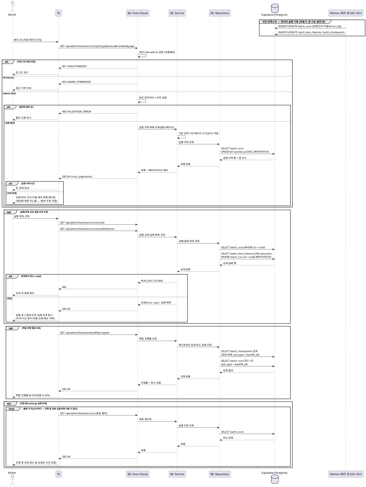

# UC-023: 배치 작업 모니터링 조회

> `docs/userflow.md` 023번 기능의 상세 유스케이스. Admin이 수집/집계 배치(026~031)의 최근 실행 상태와 실패 로그를 조회한다. **MVP는 조회 전용**이며 수동 재실행은 2단계 범위로 제외한다(액션 미노출). 워커와 웹은 `batch_runs` 계열 테이블로 완전히 디커플되어 있어, 본 기능은 자체 DB 조회만 수행한다.

---

## 1. Primary Actor

- **Admin** (role=admin, 서버 측 role 검증)

> 조회 대상 데이터의 생산자는 System(배치 워커, UC-026~031)이지만, 본 기능의 주 액터는 모니터링 화면을 조회하는 Admin이다.

## 2. Precondition (사용자 관점)

- Admin 계정으로 로그인 상태이다.
- 어드민 페이지(`/admin/batches`)에 접근했다.

> 실행 이력 데이터의 존재는 전제 조건이 아니다(이력 0건이어도 빈 상태로 정상 동작 — E1).

## 3. Trigger

- Admin이 어드민 배치 모니터링 화면에 진입한다.
- (부가) 작업 종류/상태/기간 필터를 변경하거나, 실패한 실행 항목을 선택해 로그 상세를 연다.

## 4. Main Scenario

1. Admin이 배치 모니터링 화면에 진입한다.
2. 시스템은 서버 측에서 세션과 role=admin을 검증한다.
3. 시스템은 배치 작업별 최근 실행 이력 목록을 로드한다.
   - 항목: 작업 종류(6종), 상태(성공/실패/부분성공/진행 중), 시작·종료 시각, 처리 건수, 실패 건수, 한도 이월 여부, 대상 시장(해당 시).
   - 정렬: 시작 시각 내림차순. 기본 조회 기간(상수)과 페이지네이션을 적용한다.
4. 화면은 작업별 상태 목록을 렌더링한다. 부분 성공 항목은 이월 여부 배지를 함께 표시한다.
5. Admin이 작업 종류/상태/기간 필터를 조정하면, 시스템은 필터를 적용해 목록을 재조회한다.
6. Admin이 실패 또는 부분 성공 실행 항목을 선택하면, 시스템은 해당 실행의 상세를 로드한다.
   - 실행 요약 로그(`error_log`)와 종목 단위 실패 목록(종목 식별 정보, 시도 횟수, 최종 오류, 해소 여부)을 표시한다.
7. 목록에 진행 중(running) 실행이 있으면, 화면은 폴링 주기(상수)마다 목록을 재조회해 상태를 갱신한다. 진행 중 실행이 사라지거나 화면을 이탈하면 폴링을 중단한다.
8. (부가) 백필 작업(UC-031)에 대해서는 체크포인트 기반 진행 현황(완료 키 수/전체 키 수)을 함께 표시한다.

## 5. Edge Cases

| # | 상황 | 처리 |
|---|------|------|
| E1 | 실행 이력 없음(배치 미가동/초기 상태) | `200` + 빈 목록 → FE는 빈 상태 안내 표시 |
| E2 | 진행 중(running) 작업 존재 | `finished_at` NULL 상태로 표시, 폴링 주기(상수)로 목록 재조회해 갱신. 조회 전용이므로 화면에서 상태를 보정하지 않음 |
| E3 | 로그 대량(장기 운영 누적) | 시작 시각 내림차순 + 페이지네이션 + 기본 조회 기간(상수) 제한. `error_log` 본문은 목록에서 제외하고 상세 조회에서만 로드 |
| E4 | 부분 성공(API 일일 한도 초과 이월) | `status=partial_success` + `is_carried_over=true` → 이월 배지로 명시(다음 실행에서 잔여분 처리됨을 안내) |
| E5 | 비-Admin(일반 User) 접근 | 서버 측 role 검증으로 `403` 거부(클라이언트 우회 방지) |
| E6 | 미로그인/세션 만료 | `401` → 로그인 유도 |
| E7 | 수동 재실행 시도 | MVP 범위 밖 — 재실행 액션 버튼·엔드포인트 자체를 제공하지 않음(2단계) |
| E8 | 존재하지 않는 실행 ID로 상세 조회 | `404 RUN_NOT_FOUND` → 안내 후 목록 복귀 |
| E9 | 잘못된 필터 값(미정의 jobType/status, from>to, 페이지 범위 오류) | 요청 스키마 검증 실패 `400 VALIDATION_ERROR` |
| E10 | 장시간 running으로 방치된 실행(워커 비정상 종료 추정) | 시작 후 경과 시간을 함께 표시해 Admin이 이상 실행을 인지할 수 있게 함. 상태 보정(타임아웃 처리)은 조회 화면 소관이 아님 |
| E11 | 백필 미실행/체크포인트 없음 | 진행 현황을 미실행 상태(0/0)로 표시 |
| E12 | 조회 중 네트워크/서버 오류 | 오류 안내 + 재시도 유도(폴링 중 일시 오류는 다음 주기에 자동 재시도) |

## 6. Business Rules

### 6.1 조회 규칙

- **BR-1 (조회 전용)**: 본 기능은 읽기 전용이다. 재실행/수정/삭제 등 어떤 쓰기 액션도 제공하지 않는다(수동 재실행은 2단계). 사이드이펙트 없음.
- **BR-2 (서버 측 권한 검증)**: 모든 어드민 배치 API는 Hono 미들웨어에서 세션·role=admin을 검증한다. 클라이언트 라우트 가드는 보조 수단일 뿐이다.
- **BR-3 (상태 모델)**: 실행 상태는 `running`/`success`/`partial_success`/`failed` 4종(enum `batch_run_status`)이며, 한도 초과 이월 여부는 `is_carried_over`로 별도 표기한다.
- **BR-4 (작업 종류)**: 작업 종류는 enum `batch_job_type` 6종으로 고정되며 userflow 배치 기능과 1:1 대응한다 — `collect_quotes`(026), `collect_financials`(027), `collect_fx_market_hours`(028), `aggregate_daily_metrics`(029), `analyze_disclosures`(030), `backfill_all`(031).
- **BR-5 (워커-웹 디커플)**: 데이터 소스는 워커가 기록한 `batch_runs`/`batch_item_failures`/`batch_checkpoints` 테이블뿐이다. 웹에서 워커로의 RPC/직접 호출은 없다.
- **BR-6 (목록·상세 분리)**: 목록 응답은 요약 필드만 반환하고(`error_log` 본문 제외, 존재 여부 플래그만), 실패 로그 본문과 종목 단위 실패 상세는 상세 API에서만 반환한다(E3 대량 로그 대응).
- **BR-7 (상수 관리)**: 기본 조회 기간, 페이지 크기, 진행 중 상태 폴링 주기는 하드코딩하지 않고 상수로 관리한다.
- **BR-8 (실패 항목 표시)**: 종목 단위 실패는 종목 식별 정보(티커/종목명/시장)와 함께 표시하고, `is_resolved`로 이후 주기 재포함 성공(해소) 여부를 구분한다. 비종목 항목 실패는 종목 정보 없이 오류 메시지만 표시한다.
- **BR-9 (백필 진행률)**: 백필(031) 진행 현황은 `batch_checkpoints`의 완료 키 수/전체 키 수로 산출한다.

### 6.2 API Specification

> 계층: Hono Route(`route.ts`, HTTP 파싱/검증) → Service(`service.ts`, 비즈니스 규칙) → Repository(`repository.ts`, Supabase 접근). 모든 엔드포인트는 어드민 미들웨어(세션 + role=admin 검증)를 통과해야 한다. 조회 전용이므로 GET만 제공한다.

#### API-1. 배치 실행 이력 목록 조회

| 항목 | 내용 |
|---|---|
| 엔드포인트 | `GET /api/admin/batches/runs` |
| 권한 | Admin (서버 측 role 검증) |

Query Parameters:

| 파라미터 | 타입 | 필수 | 설명 |
|---|---|---|---|
| `jobType` | enum(`batch_job_type` 6종) | 선택 | 작업 종류 필터. 미지정 시 전체 |
| `status` | enum(`running`/`success`/`partial_success`/`failed`) | 선택 | 상태 필터 |
| `from`, `to` | ISO 8601 datetime | 선택 | `started_at` 기준 기간 필터. 미지정 시 기본 조회 기간(상수) 적용 |
| `page`, `pageSize` | integer | 선택 | 페이지네이션. 기본값·최대값은 상수 |

Response `200 OK`:

```json
{
  "runs": [
    {
      "id": "uuid",
      "jobType": "collect_financials",
      "status": "partial_success",
      "startedAt": "2026-07-05T02:00:00+09:00",
      "finishedAt": "2026-07-05T02:41:12+09:00",
      "processedCount": 2480,
      "failedCount": 12,
      "isCarriedOver": true,
      "targetMarket": "KRX",
      "hasErrorLog": true
    }
  ],
  "pagination": { "page": 1, "pageSize": 20, "totalCount": 132 }
}
```

- `finishedAt`은 진행 중(running) 실행에서 `null`이다(E2).
- `hasErrorLog`는 `error_log` 존재 여부 플래그다. 본문은 API-2에서만 반환한다(BR-6).

에러:

| HTTP | code | 설명 |
|---|---|---|
| 400 | `VALIDATION_ERROR` | 잘못된 필터/페이지 파라미터(E9) |
| 401 | `UNAUTHORIZED` | 미로그인/세션 만료(E6) |
| 403 | `ADMIN_FORBIDDEN` | 비-Admin 접근(E5) |
| 500 | `INTERNAL_ERROR` | 조회 실패(E12) |

#### API-2. 배치 실행 상세 조회 (실패 로그 포함)

| 항목 | 내용 |
|---|---|
| 엔드포인트 | `GET /api/admin/batches/runs/{runId}` |
| 권한 | Admin |

Response `200 OK`:

```json
{
  "run": {
    "id": "uuid",
    "jobType": "collect_financials",
    "status": "partial_success",
    "startedAt": "2026-07-05T02:00:00+09:00",
    "finishedAt": "2026-07-05T02:41:12+09:00",
    "processedCount": 2480,
    "failedCount": 12,
    "isCarriedOver": true,
    "targetMarket": "KRX",
    "errorLog": "OpenDART 일일 한도 도달로 214건 이월..."
  }
}
```

에러:

| HTTP | code | 설명 |
|---|---|---|
| 401 | `UNAUTHORIZED` | 미로그인/세션 만료 |
| 403 | `ADMIN_FORBIDDEN` | 비-Admin 접근 |
| 404 | `RUN_NOT_FOUND` | 존재하지 않는 실행 ID(E8) |
| 500 | `INTERNAL_ERROR` | 조회 실패 |

#### API-3. 실행별 종목 단위 실패 목록 조회

| 항목 | 내용 |
|---|---|
| 엔드포인트 | `GET /api/admin/batches/runs/{runId}/failures` |
| 권한 | Admin |

Query Parameters: `page`, `pageSize`(선택, 기본값·최대값 상수).

Response `200 OK`:

```json
{
  "failures": [
    {
      "id": "uuid",
      "security": { "id": "uuid", "ticker": "005930", "name": "삼성전자", "market": "KRX" },
      "attemptCount": 3,
      "lastError": "HTTP 429 rate limited",
      "isResolved": false,
      "updatedAt": "2026-07-05T02:40:58+09:00"
    },
    {
      "id": "uuid",
      "security": null,
      "attemptCount": 1,
      "lastError": "환율 응답 스키마 불일치",
      "isResolved": true,
      "updatedAt": "2026-07-05T02:40:58+09:00"
    }
  ],
  "pagination": { "page": 1, "pageSize": 20, "totalCount": 12 }
}
```

- `security`는 비종목 항목 실패면 `null`이다(BR-8).

에러: API-2와 동일(`404 RUN_NOT_FOUND` 포함).

#### API-4. 백필 진행 현황 조회

| 항목 | 내용 |
|---|---|
| 엔드포인트 | `GET /api/admin/batches/backfill/progress` |
| 권한 | Admin |

Response `200 OK`:

```json
{
  "totalCheckpoints": 3200,
  "completedCheckpoints": 2710,
  "isCompleted": false,
  "latestRun": {
    "id": "uuid",
    "status": "partial_success",
    "startedAt": "2026-07-04T09:00:00+09:00",
    "finishedAt": "2026-07-04T18:20:00+09:00"
  }
}
```

- 체크포인트가 0건이면 `totalCheckpoints=0`으로 미실행 상태를 표현한다(E11). `latestRun`은 백필 실행 이력이 없으면 `null`.

에러: API-1과 동일(400 제외).

### 6.3 Database Operations

| 테이블 | 작업 | 목적 |
|---|---|---|
| `batch_runs` | SELECT | 실행 이력 목록(필터·`started_at DESC` 정렬·페이지네이션 — `idx_batch_runs_job_started` 활용), 실행 상세(`error_log` 포함), 백필 최신 실행 조회 — API-1/2/4 |
| `batch_item_failures` | SELECT | 특정 실행(`batch_run_id`)의 종목 단위 실패 목록(`idx_batch_item_failures_run` 활용) — API-3 |
| `securities` | SELECT | 실패 항목의 종목 표시 정보(티커/종목명/시장) 조인 — API-3 |
| `batch_checkpoints` | SELECT | 백필 진행률(완료/전체 키 수 집계, `job_type='backfill_all'`) — API-4 |

- **INSERT/UPDATE/DELETE 없음**: 본 기능은 조회 전용이다(BR-1). 위 테이블에 대한 쓰기는 전부 배치 워커(`runtime/batch-log.ts`, UC-026~031) 소관이며 본 유스케이스 범위 밖이다.

### 6.4 External Service Integration

- **없음.** 본 기능은 자체 DB(`batch_runs`/`batch_item_failures`/`batch_checkpoints`)만 조회한다. OpenDART·SEC EDGAR·토스증권 등 외부 API 호출은 배치 잡(UC-026~031) 소관이며, 그 결과 상태가 위 테이블에 기록된 것을 읽기만 한다(PRD 전역 정책: 외부 API는 배치 적재 전용, 클라이언트 화면은 자체 DB만 조회).

## 7. Sequence Diagram



## 8. 관련 유스케이스

- **UC-026 시세 수집 배치 ~ UC-031 최초 백필 배치**: 본 기능이 조회하는 실행 이력·실패·체크포인트 데이터의 생산자(워커 `runtime/batch-log.ts` 경유 기록).
- **UC-027 재무/공시/기업정보 수집 배치**: 일일 한도 초과 이월(`is_carried_over`) 표시의 대표 사례(E4).
- **UC-031 최초 전 종목 과거 데이터 백필 배치**: 진행률·완료 상태(`batch_checkpoints`) 표시의 소스(BR-9).
- **(2단계) 배치 수동 재실행**: PRD Non-Goals — 본 유스케이스에서 액션을 제공하지 않는 근거(E7).
