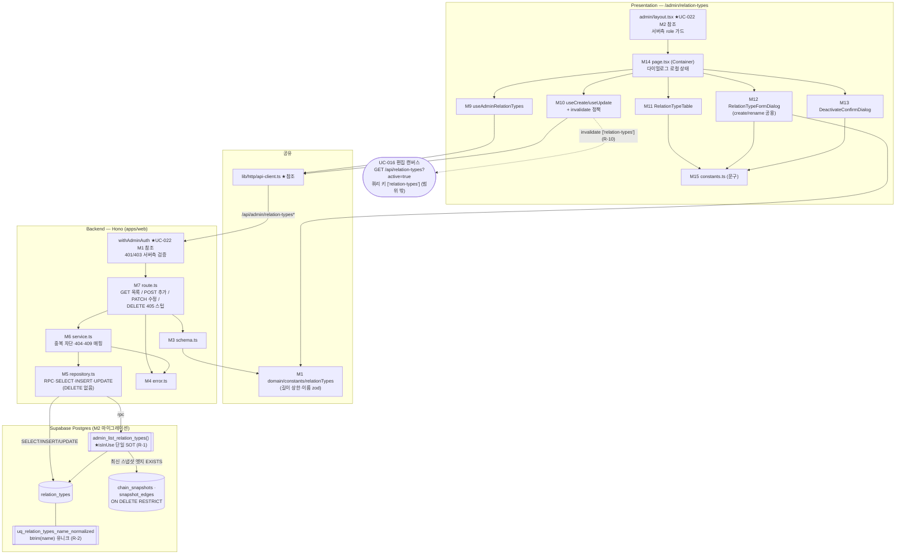

# Plan: UC-024 관계 종류 마스터 관리

> 근거: `docs/usecases/024/spec.md`, `docs/usecases/000_decisions.md`(E~F 섹션 — 본 UC 직접 관련 확정 없음, 기본 정책은 spec BR 채택), `docs/techstack.md` §4(모노레포 Codebase Structure)·§7(복잡 조인은 Postgres 함수/RPC), `docs/database.md` §3(relation_types·chain_snapshots·snapshot_edges)·§7, `supabase/migrations/0004_relation_types.sql`·`0006_chain_snapshots.sql`(기존 스키마), `docs/usecases/022/plan.md`(공통 Admin 인증 가드 M1/M2 — 본 plan은 재정의 없이 참조), `docs/usecases/016/plan.md`(`features/relation-types` 조회 feature 소유 경계·쿼리 키 계약), `.claude/skills/spec_to_plan/references/hono-backend-guide.md`(Hono 백엔드 컨벤션).
>
> **범위**: ① 어드민 관계 종류 마스터 CRUD API(`features/admin-relation-types/backend/*` — 목록/추가/수정, 물리 삭제 미제공), ② `isInUse` 판정 SQL 함수 + 중복 이름 유니크 인덱스 마이그레이션, ③ `/admin/relation-types` 페이지 FE.
> **범위 밖**: 편집 캔버스의 활성 종류 소비(`GET /api/relation-types?active=true` — UC-016 소유), 비활성 종류 신규 엣지 저장 차단(UC-016 R-1 / UC-018·021 저장 service), LLM 제안의 비활성 종류 승인 차단(UC-022), 관계 종류 초기 시드 적재(환경 구성 단계 — spec §9).
> **외부 서비스 연동 없음**(spec §6.4) — 자체 DB(`relation_types` 마스터)만 사용하므로 외부 클라이언트 모듈·재시도/타임아웃 설계 대상이 없다.
>
> `/admin/relation-types` 페이지에 대한 `docs/pages/*/state_management.md` 문서는 존재하지 않는다. 단순 마스터 관리 화면(목록 + 다이얼로그 3종)이므로 서버 상태는 TanStack Query, 다이얼로그/폼 로컬 상태는 `useState` + react-hook-form으로 설계한다(별도 Context+`useReducer` 불요 — UC-001 plan과 동일 판단).

---

## 사전 정합화 결정 (spec Open Question·모호점 해소 — 구현 시 이 표를 따름)

| # | 사안 | 결정 | 근거 |
|---|---|---|---|
| R-1 | `isInUse` 판정 범위("각 체인의 최신 스냅샷") | **모든 체인(공식+사용자, 보관 포함)** 을 대상으로, 체인별 최신 스냅샷(`effective_at DESC, created_at DESC LIMIT 1` — UC-022 plan과 동일 tie-break)의 엣지가 해당 종류를 참조하면 `true`. 판정 로직은 SQL 함수 1개(`admin_list_relation_types`)로만 구현(TS 재구현 금지) | spec API-1 각주, database.md §4(최신 스냅샷=현재 구성). 보관 체인은 복원 가능하므로 현행 구성으로 취급(보수적 영향 안내) |
| R-2 | 중복 이름 정책(spec E2/BR-5 Open Question — 000_decisions 미확정) | **spec BR-5 기본 정책 채택**: 앞뒤 공백 제거(trim) 정규화 후 활성·비활성 전체 대상 **정확 일치** 중복 차단(409). 대소문자는 구분 유지(spec이 trim만 명시). 서비스 사전 검사(친절한 409) + **DB `btrim(name)` 유니크 인덱스**(동시 생성 레이스 최종 방어 — 물리 삭제 금지 특성상 중복이 유입되면 영구 제거 불가이므로 DB 레벨 방어 필수) | spec BR-1·BR-5, E10(다중 어드민 동시 수정) |
| R-3 | `DELETE /api/admin/relation-types/{id}` 응답(spec은 "405 또는 404" 허용) | **명시적 405 스텁 라우트 등록** — `METHOD_NOT_ALLOWED` 코드 + "비활성화를 사용하세요" 안내 메시지 반환. 삭제 로직·Repository DELETE 함수는 일절 구현하지 않는다(BR-1) | spec E1 주 문안이 405 + 비활성화 유도. 미등록 시 Hono 기본 404라 안내 불가 → 스텁이 결정적 |
| R-4 | 응답 래퍼: spec 예시는 `{ "relationTypes": [...] }` 최상위 | 공통 래퍼 적용: `{ "ok": true, "data": { ... } }` — 필드 구성은 spec 그대로 | UC-016 plan R-5·hono-backend-guide `respond()` 패턴과 통일 |
| R-5 | 목록 정렬(spec 미명시) | `created_at ASC, id ASC` — UC-016 관계 종류 픽커와 동일 기준(순서 안정성, 목록 갱신 시 행 위치 고정) | UC-016 plan M6 |
| R-6 | `isDirected` 수정 차단(BR-4) 구현 방식 | PATCH 요청 스키마를 `.strict()`로 정의 — `isDirected` 포함 미지 키 유입 시 스키마 단계에서 400 `VALIDATION_ERROR`(spec 에러 표의 "`isDirected` 수정 시도" 케이스) | spec API-3, zod strict 객체 |
| R-7 | 이름 정규화 시점 | 요청 스키마의 `z.string().trim()` 변환으로 스키마 단계에서 정규화 → 서비스·Repository는 항상 정규화된 값만 다룬다. **저장되는 name은 항상 정규화 값**이라는 불변식이 성립하므로 중복 검사는 `.eq('name', normalized)` 동등 비교로 충분(btrim 유니크 인덱스가 최종 방어) | spec BR-5, DRY(정규화 로직 단일 지점) |
| R-8 | 이름 길이 상한 값(spec "상수 관리"만 명시) | `RELATION_TYPE_NAME_MAX_LENGTH = 50` — `packages/domain/constants`에 단일 정의, FE 폼/BE 스키마 공용. 값 변경은 이 상수에서만 | spec BR-5, techstack §4(domain 상수) |
| R-9 | 마이그레이션 파일 번호 | 다른 plan들이 `0013_*` 이후 번호를 경합 선점 중 — 파일명 `NNNN_relation_types_admin.sql`의 **NNNN은 구현 시점의 다음 빈 번호로 부여**(내용만 고정) | UC-022 plan R-7과 동일 규칙 |
| R-10 | 편집 캔버스 반영(BR-8·Main-7) | 본 UC의 뮤테이션 성공 시 `['admin','relation-types']`와 함께 UC-016 쿼리 키 `['relation-types']`도 invalidate(동일 세션 즉시 반영). 타 세션은 목록 재조회 시점 반영(spec §9 — 별도 캐시 무효화 인프라 없음) | UC-016 plan M15 쿼리 키 계약 |

---

## 개요

| # | 모듈 | 위치 | 설명 |
| --- | --- | --- | --- |
| **공유 — packages/domain (순수 상수/스키마, FE/BE 공용)** | | | |
| M1 | 도메인 상수 | `packages/domain/constants/relationTypes.ts` | `RELATION_TYPE_NAME_MAX_LENGTH=50`(R-8), `relationTypeNameSchema`(zod: trim→min(1)→max) — FE 폼과 BE 요청 스키마가 동일 스키마 import(DRY) |
| **DB — Persistence (마이그레이션 SOT)** | | | |
| M2 | 마스터 관리 마이그레이션 | `supabase/migrations/NNNN_relation_types_admin.sql` (R-9) | ① `uq_relation_types_name_normalized` — `btrim(name)` 유니크 인덱스(R-2), ② `admin_list_relation_types()` — 전체 목록 + `is_in_use` 판정 SQL 함수(R-1 단일 SOT) |
| **백엔드 — `features/admin-relation-types/backend` (본 UC 소유)** | | | |
| M3 | Zod 스키마 | `apps/web/src/features/admin-relation-types/backend/schema.ts` | Request/RPC Row/Response 스키마 분리 정의 |
| M4 | 에러 코드 | `apps/web/src/features/admin-relation-types/backend/error.ts` | spec §6.2 코드 그대로(`VALIDATION_ERROR`/`RELATION_TYPE_NAME_DUPLICATE`/`RELATION_TYPE_NOT_FOUND`/`METHOD_NOT_ALLOWED`/`INTERNAL_ERROR`) |
| M5 | 리포지토리 | `apps/web/src/features/admin-relation-types/backend/repository.ts` | 목록 RPC 호출·중복 조회·INSERT/UPDATE 캡슐화. **DELETE 함수 없음**(BR-1) |
| M6 | 서비스 | `apps/web/src/features/admin-relation-types/backend/service.ts` | 목록 DTO 변환, 추가/수정 비즈니스 규칙(중복 차단·404 분기·유니크 위반→409 매핑) |
| M7 | 라우트 | `apps/web/src/features/admin-relation-types/backend/route.ts` | `GET/POST /admin/relation-types`, `PATCH /admin/relation-types/:id`, `DELETE` 405 스텁(R-3) — HTTP 파싱/검증만 |
| M8 | Hono 앱 등록 | `apps/web/src/backend/hono/app.ts` (수정) | `registerAdminRelationTypeRoutes(app)` 1줄 추가(`withAdminAuth` 그룹 적용) |
| **프론트엔드 — `/admin/relation-types`** | | | |
| M9 | 목록 쿼리 훅 | `apps/web/src/features/admin-relation-types/hooks/useAdminRelationTypes.ts` | 쿼리 키 `['admin','relation-types']` — TanStack Query |
| M10 | 뮤테이션 훅 | `apps/web/src/features/admin-relation-types/hooks/useCreateRelationType.ts`, `useUpdateRelationType.ts` | 추가/수정(이름·활성 전환) mutation + invalidate 정책(R-10) + 오류 코드→문구 매핑 순수 함수 |
| M11 | 마스터 목록 테이블 | `apps/web/src/features/admin-relation-types/components/RelationTypeTable.tsx` | 이름·방향성·활성 상태·사용 여부 배지 + 행별 액션(이름 변경/비활성화/재활성화) Presenter. 삭제 액션 미노출(E1) |
| M12 | 추가/이름 변경 다이얼로그 | `apps/web/src/features/admin-relation-types/components/RelationTypeFormDialog.tsx` | 생성(`create`: 이름+방향성)·이름 변경(`rename`: 이름만) 공용 폼 다이얼로그 — react-hook-form + zod Presenter |
| M13 | 비활성화 확인 다이얼로그 | `apps/web/src/features/admin-relation-types/components/DeactivateConfirmDialog.tsx` | 비활성화 영향 안내(사용 중이면 강조 안내 — E3) + 확정/취소 Presenter |
| M14 | 페이지 컨테이너 | `apps/web/src/app/admin/relation-types/page.tsx` | `'use client'` Container — 쿼리/뮤테이션/다이얼로그 로컬 상태 소유, Presenter 배선 |
| M15 | UI 문구 상수 | `apps/web/src/features/admin-relation-types/constants.ts` | 배지 라벨·영향 안내·토스트·필드 오류 문구 상수(하드코딩 금지) |
| **공통 인프라 — 위치만 참조(선행 plan 정의, 본 UC 신규 정의 없음)** | | | |
| — | Admin 인증 미들웨어 | `apps/web/src/backend/middleware/admin.ts` | `withAdminAuth()` + `UNAUTHORIZED`/`ADMIN_ONLY` 코드 — **UC-022 plan M1 정의, 재사용**(E5·BR-6) |
| — | 어드민 레이아웃 가드 | `apps/web/src/app/admin/layout.tsx` | 서버측 role 가드 + 어드민 셸(관계 종류 관리 내비 링크 포함) — UC-022 plan M2 정의 |
| — | Hono 골격·응답 헬퍼·미들웨어 체인 | `apps/web/src/backend/{hono,http,middleware}/*` | UC-001 plan 정의 |
| — | FE API 클라이언트 | `apps/web/src/lib/http/api-client.ts` | `HandlerResult` 언랩·`ApiError` — UC-001 plan 정의 |
| — | DB 생성 타입 | `packages/domain/types/database.ts` | M2 적용 후 `generate_typescript_types` 재생성(techstack §7) |

- **기존 테이블 스키마 변경 없음** — `relation_types`(0004)의 컬럼·트리거는 그대로 사용한다. M2는 인덱스·함수만 추가한다. `snapshot_edges.relation_type_id`·`llm_relation_proposals.relation_type_id`의 `ON DELETE RESTRICT`(0006·0011 기존)가 물리 삭제의 DB 최종 방어선(BR-1)이다.
- **워커(apps/worker) 변경 없음**, **외부 연동 없음**.
- **스냅샷 미생성**(BR-7): 마스터 변경은 체인 구조 변경 이벤트가 아니므로 본 plan의 어떤 경로도 `chain_snapshots`에 쓰지 않는다.

## Diagram



데이터 흐름: Presenter(M11~M13) → Container(M14)의 mutation → API 클라이언트 → Admin 미들웨어 → Route(M7) → Service(M6) → Repository(M5) → 테이블/SQL 함수(M2). `isInUse` 판정은 `admin_list_relation_types()` 하나로 수렴하고(R-1), 중복 차단은 서비스 사전 검사 + DB 유니크 인덱스의 이중 방어다(R-2).

---

## Implementation Plan

### M1. 도메인 상수 — `packages/domain/constants/relationTypes.ts` (공유)

- 구현 내용:
  1. `RELATION_TYPE_NAME_MAX_LENGTH = 50`(R-8) — spec BR-5의 "길이 상한 상수" 단일 정의.
  2. `relationTypeNameSchema`(zod): `z.string().trim().min(1).max(RELATION_TYPE_NAME_MAX_LENGTH)` — trim 변환을 스키마에 내장(R-7). FE 폼(M12)과 BE 요청 스키마(M3)가 동일 스키마를 import(DRY — 검증 규칙 드리프트 차단).
  3. 프레임워크 의존 없는 순수 상수/zod만(techstack §4 `packages/domain` 원칙). UC-016 M1의 `RelationType` 타입(`types/chainEditor.ts`)과 중복 정의하지 않는다 — 본 파일은 검증 상수 전용.
- 의존성: 없음(최우선 구현).
- **Unit Tests**:
  - [ ] `'공급'` 통과, 결과값이 trim된 원본과 동일
  - [ ] `'  공급  '` → `'공급'`으로 변환되어 통과(R-7 정규화)
  - [ ] `''`·`'   '`(공백만) → 실패(E7)
  - [ ] 51자 이름 → 실패 / 정확히 50자 → 통과(경계값)

### M2. 마스터 관리 마이그레이션 — `supabase/migrations/NNNN_relation_types_admin.sql` (Persistence, R-9)

- 구현 내용 (멱등성·`CREATE OR REPLACE FUNCTION`·`SECURITY INVOKER`·`SET search_path = ''` — 저장소 SQL 가이드라인 준수. 적용은 `mcp__supabase__apply_migration`, 로컬 Supabase 금지):
  1. **`uq_relation_types_name_normalized`** — `CREATE UNIQUE INDEX IF NOT EXISTS ... ON relation_types (btrim(name))`(R-2). 동시 생성/변경 레이스에서 중복 이름 유입을 DB 레벨에서 차단(위반 시 23505 → 서비스가 409 매핑). 적용 전 기존 데이터의 trim 중복 여부를 점검하는 주석 가이드 포함(시드 이전 적용이 원칙이라 실충돌 없음 예상).
  2. **`admin_list_relation_types()`** — 전체 목록 + 사용 여부 판정 함수(R-1 단일 SOT, techstack §7: 복잡 조인은 RPC화). 반환 TABLE: `(id uuid, name text, is_directed boolean, is_active boolean, is_in_use boolean, created_at timestamptz, updated_at timestamptz)`.
     - CTE `latest_snapshots`: `SELECT DISTINCT ON (chain_id) id FROM chain_snapshots ORDER BY chain_id, effective_at DESC, created_at DESC` — 체인별 최신 스냅샷 1건(R-1 tie-break, `idx(chain_id, effective_at DESC)` 활용).
     - `is_in_use = EXISTS (SELECT 1 FROM snapshot_edges e JOIN latest_snapshots ls ON e.snapshot_id = ls.id WHERE e.relation_type_id = rt.id)` — `idx_snapshot_edges_relation_type` 활용.
     - 정렬 `created_at ASC, id ASC`(R-5).
  3. DELETE 관련 정의 없음 — 물리 삭제 차단은 기존 0006·0011의 `ON DELETE RESTRICT`가 담당(BR-1, 본 마이그레이션은 관여하지 않음).
  4. 적용 후 `mcp__supabase__generate_typescript_types`로 `packages/domain/types/database.ts` 재생성(techstack §7).
- 의존성: 마이그레이션 0004·0006(기존 적용분). 신규 테이블/컬럼 없음.
- **검증 시나리오 (마이그레이션 QA — SQL 레벨, 시드 데이터로 실행)**:
  - [ ] 어느 체인의 최신 스냅샷 엣지가 참조하는 종류 → `is_in_use=true`
  - [ ] **과거 스냅샷에서만** 참조되고 최신 스냅샷에는 없는 종류 → `is_in_use=false`(최신 기준 판정 — spec API-1 각주)
  - [ ] 어떤 엣지도 참조하지 않는 종류 → `is_in_use=false`
  - [ ] 체인 2개 중 1개의 최신 스냅샷만 참조 → `is_in_use=true`(전 체인 OR)
  - [ ] 보관(archived) 체인의 최신 스냅샷 참조 → `is_in_use=true`(R-1)
  - [ ] 활성/비활성 종류 모두 반환되고 `created_at ASC` 정렬이다(R-5)
  - [ ] `'공급'` 존재 상태에서 `' 공급 '` INSERT → 유니크 위반 23505(R-2)
  - [ ] 최신 스냅샷 엣지가 참조 중인 종류 `DELETE` 시도 → FK RESTRICT 오류(E1 DB 최종 방어 확인)

### M3. Zod 스키마 — `features/admin-relation-types/backend/schema.ts`

- 구현 내용:
  1. `RelationTypeCreateRequestSchema`: `{ name: relationTypeNameSchema, isDirected: z.boolean().optional().default(true) }`(spec API-2, BR-4 기본 유향). `.strict()` — 미지 키 400.
  2. `RelationTypeUpdateRequestSchema`: `z.object({ name: relationTypeNameSchema.optional(), isActive: z.boolean().optional() }).strict()`(R-6 — `isDirected` 등 미지 키 유입 시 파싱 실패) + `.refine(최소 1개 필드 존재)`(spec API-3 "수정 필드 0개" → 400).
  3. `RelationTypeIdParamSchema`: `z.string().uuid()`.
  4. `AdminRelationTypeRpcRowSchema`(snake_case — M2 ② 반환 행과 1:1): `id`, `name`, `is_directed`, `is_active`, `is_in_use`, `created_at`, `updated_at`. `RelationTypeRowSchema`(INSERT/UPDATE 반환 행): `id`, `name`, `is_directed`, `is_active`, `created_at`, `updated_at`.
  5. Response 스키마(camelCase — spec 계약 그대로, R-4 래퍼는 `respond()` 소관): `AdminRelationTypeListResponseSchema` = `{ relationTypes: Array<{ id, name, isDirected, isActive, isInUse, createdAt, updatedAt }> }`, `RelationTypeMutationResponseSchema` = `{ id, name, isDirected, isActive }`(API-2·API-3 공용). 각 `z.infer` export(FE 훅이 타입 재사용).
- 의존성: M1.
- **Unit Tests**:
  - [ ] 생성: `isDirected` 미지정 → `true` 기본값(BR-4) / `name: '  라이선스 '` → trim되어 통과
  - [ ] 생성: `name` 누락·공백만·51자 → 실패(E7) / `isDirected: 'yes'`(타입 오류) → 실패
  - [ ] 수정: `{}`(필드 0개) → 실패 / `{ isActive: false }`만 → 통과 / `{ name, isActive }` 동시 → 통과
  - [ ] 수정: `{ isDirected: false }` 포함 → strict 위반으로 실패(R-6·BR-4)
  - [ ] `RelationTypeIdParamSchema`: uuid 아닌 문자열 → 실패

### M4. 에러 코드 — `features/admin-relation-types/backend/error.ts`

- 구현 내용: spec §6.2 Error Codes 그대로(`as const`):
  ```
  validationError:   'VALIDATION_ERROR'                 // 400 (E7, 필드 0개, isDirected 수정 시도)
  notFound:          'RELATION_TYPE_NOT_FOUND'          // 404 (E6)
  nameDuplicate:     'RELATION_TYPE_NAME_DUPLICATE'     // 409 (E2)
  methodNotAllowed:  'METHOD_NOT_ALLOWED'               // 405 (E1, R-3)
  internalError:     'INTERNAL_ERROR'                   // 500 (E11)
  ```
  `AdminRelationTypeServiceError` 타입 export. 401 `UNAUTHORIZED`/403 `ADMIN_ONLY`는 공통 미들웨어(UC-022 M1) 소관 — 본 파일에 재정의하지 않는다.
- 의존성: 없음. Unit Tests: N/A(상수 정의).

### M5. 리포지토리 — `features/admin-relation-types/backend/repository.ts`

- 구현 내용 (Supabase 문법은 이 파일에만 존재, 예외 대신 결과 객체 반환 — techstack §4. **DELETE 함수를 구현하지 않는다** — BR-1의 코드 레벨 이행):
  1. `listRelationTypesWithUsage(client)` → `client.rpc('admin_list_relation_types')`. `{ rows } | { error }` 반환.
  2. `findRelationTypeById(client, id)` → `relation_types` 단건 SELECT(`maybeSingle`). `{ row: Row | null } | { error }`.
  3. `findRelationTypeByName(client, normalizedName, excludeId?)` → `.select('id').eq('name', normalizedName)` + `excludeId` 존재 시 `.neq('id', excludeId)`(자기 자신 제외 — spec 시퀀스). R-7 불변식(저장 name은 항상 정규화 값) 전제의 동등 비교. `{ duplicated: boolean } | { error }`.
  4. `insertRelationType(client, { name, isDirected })` → INSERT(`is_active`는 컬럼 default true — spec Main-3-2) 후 `.select().single()`. 오류 매핑: Postgres `23505`(유니크 위반) → `{ kind: 'duplicate' }`(R-2 레이스 방어), 그 외 → `{ kind: 'error' }`. 성공 → `{ kind: 'created', row }`.
  5. `updateRelationType(client, id, patch: { name?, is_active? })` → `.update(patch).eq('id', id).select().maybeSingle()`. `updated_at`은 DB 트리거 자동 갱신(0004 — 앱에서 설정하지 않음). 매핑: 갱신 행 null → `{ kind: 'not_found' }`, `23505` → `{ kind: 'duplicate' }`, 성공 → `{ kind: 'updated', row }`.
- 의존성: M2(함수·인덱스 존재), M3(Row 타입).
- **Unit Tests** (Supabase client mock):
  - [ ] `listRelationTypesWithUsage`가 `admin_list_relation_types`를 파라미터 없이 rpc 호출한다
  - [ ] `findRelationTypeByName`: `excludeId` 지정 시 `.neq('id', excludeId)` 조건이 포함된다(자기 이름 재저장 허용의 핵심)
  - [ ] `insertRelationType`: 23505 오류 → `{ kind: 'duplicate' }`(throw 없음) / 기타 오류 → `{ kind: 'error' }`
  - [ ] `updateRelationType`: 갱신 대상 0행 → `{ kind: 'not_found' }` / patch에 전달한 키만 UPDATE에 포함된다(부분 수정)
  - [ ] 모듈이 delete 관련 export를 갖지 않는다(정적 검사 — BR-1)

### M6. 서비스 — `features/admin-relation-types/backend/service.ts`

- 구현 내용 (repository 인터페이스에만 의존 — deps 주입으로 테스트 가능):
  1. **`listRelationTypes(deps): HandlerResult<AdminRelationTypeListResponse>`** — RPC 호출 → 오류 시 `failure(500, INTERNAL_ERROR)` → 행 배열 Zod 검증(위반 → 동일 500) → snake→camel DTO 변환 → 응답 스키마 검증 후 `success`. 빈 목록도 200(시드 이전 상태 허용).
  2. **`createRelationType(deps, input): HandlerResult<RelationTypeMutationResponse>`** — (스키마 단계에서 이미 정규화된) `input.name`으로:
     - `findRelationTypeByName(name)` — 중복 → `failure(409, RELATION_TYPE_NAME_DUPLICATE)`(E2, 활성·비활성 전체 대상 — 조회에 `is_active` 필터 없음), 조회 오류 → `failure(500, INTERNAL_ERROR)`.
     - `insertRelationType` — `duplicate`(레이스) → 409 동일 매핑, `error` → 500, `created` → `success(DTO, 201)`(spec API-2 `201 Created`).
  3. **`updateRelationType(deps, id, patch): HandlerResult<RelationTypeMutationResponse>`**:
     - `findRelationTypeById(id)` — null → `failure(404, RELATION_TYPE_NOT_FOUND)`(E6), 오류 → 500.
     - `patch.name` 존재 && 기존 이름과 다름 → `findRelationTypeByName(name, excludeId=id)` 중복 검사 → 중복 시 409. **기존 이름과 동일한 재저장은 중복 검사 생략**(no-op rename 허용). `patch.isActive`만 있는 경우 이름 검사 자체를 수행하지 않는다.
     - `updateRelationType(id, { name?, is_active? })` — `not_found`(경합 방어) → 404, `duplicate` → 409, `updated` → `success(DTO, 200)`.
     - 비활성화/재활성화는 상태 전환만 수행한다 — 사용 중 여부와 무관하게 허용(E3·E4·E8), 기존 엣지·스냅샷에 어떤 쓰기도 하지 않는다(BR-2·BR-7). 영향 안내는 FE(M13) 표시 책임.
  4. E10(다중 어드민 동시 수정): 별도 낙관적 잠금 없음 — 마지막 쓰기 우선. FE가 처리 후 목록을 재조회해 동기화한다.
- 의존성: M1, M3, M4, M5, 공통 `response.ts`.
- **Unit Tests** (repository mock 주입):
  - [ ] 목록: RPC 행 → camelCase DTO 매핑 정확(`is_in_use`→`isInUse` 등) / 빈 배열 → `success({ relationTypes: [] })` / RPC 오류·행 스키마 위반 → 500
  - [ ] 생성 정상: 중복 검사 → insert 순서로 호출되고 201 + `{ id, name, isDirected, isActive: true }` 반환
  - [ ] 생성: 사전 검사 중복 → 409, insert 미호출 / insert 23505(레이스) → 409(E2·E10)
  - [ ] 생성: 비활성 종류와 동일 이름 → 409(활성·비활성 전체 대상 — BR-5)
  - [ ] 수정: 미존재 ID → 404, update 미호출(E6)
  - [ ] 이름 변경: 타 행과 중복 → 409 / 자기 자신과 동일 이름 → 중복 검사 생략하고 성공
  - [ ] `{ isActive: false }`만 전달 → 이름 중복 검사 미호출, update patch에 `is_active`만 포함(비활성화 — E3)
  - [ ] `{ isActive: true }` → 재활성화 성공(E4)
  - [ ] update `not_found` 반환(경합) → 404 / `duplicate` → 409 / repo 오류 → 500
  - [ ] 어떤 경로도 스냅샷/엣지 repository 함수를 호출하지 않는다(BR-7 — mock 호출 검증)

### M7. 라우트 — `features/admin-relation-types/backend/route.ts` + M8 등록

- 구현 내용:
  1. `registerAdminRelationTypeRoutes(app)` — 그룹 전체에 `withAdminAuth()`(UC-022 M1) 선적용(BR-6 — 401/403은 미들웨어가 응답, E5):
     - `GET /admin/relation-types`: 쿼리 없음(spec API-1) → `listRelationTypes` → `respond()`.
     - `POST /admin/relation-types`: body `RelationTypeCreateRequestSchema.safeParse` 실패 → 400 `VALIDATION_ERROR`(필드 단위 details 포함 — E7 FE 표기용) → `createRelationType` → `respond()`(201).
     - `PATCH /admin/relation-types/:id`: param uuid 검증(실패 → 400) + body `RelationTypeUpdateRequestSchema`(실패 → 400 — 필드 0개·strict 위반 포함) → `updateRelationType` → `respond()`.
     - `DELETE /admin/relation-types/:id`: **405 스텁**(R-3) — `respond(failure(405, METHOD_NOT_ALLOWED, '관계 종류는 삭제할 수 없습니다. 비활성화를 사용하세요.'))`. 서비스/리포지토리 호출 없음.
  2. 실패 로깅: 500은 error 레벨(DB 원문 오류는 로그 전용 — 응답 비노출), 404/409는 info, 405는 warn(비정상 호출 시도 추적 — E1).
  3. M8: `backend/hono/app.ts`에 `registerAdminRelationTypeRoutes(app)` 1줄 추가 — `/admin/llm-proposals`(UC-022) 등 기존 어드민 라우트와 경로 충돌 없음.
- 의존성: M3, M4, M6, 공통 미들웨어(UC-022 M1)·응답 헬퍼.
- **QA Sheet**:

| # | 시나리오 | 기대 결과 |
| --- | --- | --- |
| 1 | 비로그인 `GET /api/admin/relation-types` | 401 `UNAUTHORIZED`(E5) |
| 2 | 일반 사용자(role=user) 호출 | 403 `ADMIN_ONLY`(E5) — 모든 메서드 동일 |
| 3 | Admin `GET` | 200 — 활성/비활성 전체 + `isDirected`/`isActive`/`isInUse`/`createdAt`/`updatedAt`, `created_at ASC` 순 |
| 4 | `POST {name:'라이선스'}` | 201 `{ id, name:'라이선스', isDirected:true, isActive:true }`(기본 유향 — BR-4) |
| 5 | `POST {name:'  공급  '}`(기존 '공급' 존재) | 409 `RELATION_TYPE_NAME_DUPLICATE`(trim 정규화 후 대조 — E2) |
| 6 | `POST {name:''}` / 공백만 / 51자 | 400 `VALIDATION_ERROR` + 필드 details(E7) |
| 7 | `PATCH {name:'공급(부품)'}` 유효 ID | 200 — DB `name` 갱신, `updated_at` 트리거 갱신 확인 |
| 8 | `PATCH {isActive:false}` → 이후 `GET /api/relation-types?active=true`(UC-016) | 200 후 활성 목록에서 제외(BR-8 소비 지점 확인) — 기존 엣지·스냅샷 행 무변화 |
| 9 | `PATCH {isActive:true}` 비활성 종류 | 200 — 재활성화(E4) |
| 10 | `PATCH {}` (필드 0개) | 400 `VALIDATION_ERROR` |
| 11 | `PATCH {isDirected:false}` | 400 `VALIDATION_ERROR`(strict — BR-4·R-6) |
| 12 | `PATCH` 존재하지 않는 uuid | 404 `RELATION_TYPE_NOT_FOUND`(E6) / uuid 형식 오류 → 400 |
| 13 | `DELETE /api/admin/relation-types/{id}` (curl 직접 호출) | 405 `METHOD_NOT_ALLOWED` + 비활성화 유도 메시지, DB 무변화(E1) |
| 14 | 두 어드민이 같은 이름으로 동시 `POST`(레이스 모의) | 1건만 생성, 후행 409(유니크 인덱스 — R-2) |

### M9. 목록 쿼리 훅 — `hooks/useAdminRelationTypes.ts`

- 구현 내용: `useAdminRelationTypes(): UseQueryResult<AdminRelationTypeListResponse>` — 쿼리 키 `['admin','relation-types']`, `apiFetch('/admin/relation-types')`. 마스터 소규모 목록이라 페이지네이션 없음. 401/403 `ApiError`는 전파(레이아웃 가드가 선차단하므로 세션 만료 케이스 — 오류 화면에서 재로그인 유도).
- 의존성: M3(타입), M7(API), 공유 api-client.
- Unit Tests: 얇은 래퍼 — 생략(M14 통합 QA로 커버).

### M10. 뮤테이션 훅 — `hooks/useCreateRelationType.ts`, `useUpdateRelationType.ts`

- 구현 내용:
  1. `useCreateRelationType()` — `POST /admin/relation-types`, `retry: 0`(E11은 사용자 수동 재시도). `useUpdateRelationType()` — `PATCH /admin/relation-types/:id`(body: `{ name? , isActive? }`), `retry: 0`.
  2. 성공 시 공통 `onSuccess`: `invalidateQueries({ queryKey: ['admin','relation-types'] })` **및** `invalidateQueries({ queryKey: ['relation-types'] })`(R-10 — UC-016 편집 캔버스 선택 목록 즉시 반영, Main-7·BR-8).
  3. `relationTypeErrorMessage(error: ApiError): string` 순수 매핑 함수(테스트 대상): `RELATION_TYPE_NAME_DUPLICATE` → 중복 안내, `RELATION_TYPE_NOT_FOUND` → "목록을 새로고침해 주세요"(E6 — 호출측이 목록 invalidate 병행), `VALIDATION_ERROR` → 필드 오류 위임 문구, 그 외/네트워크 → 재시도 유도(E11). 문구는 M15 상수 참조.
- 의존성: M3, M4(코드 상수), M15, 공유 api-client.
- **Unit Tests** (`relationTypeErrorMessage` 순수 함수):
  - [ ] 409 → 중복 안내 문구 / 404 → 목록 새로고침 유도 문구 / 500·네트워크 오류 → 재시도 문구 / 미지 코드 → 기본 문구
- **QA (훅 통합 — M14에서 확인)**: 뮤테이션 성공 후 `['admin','relation-types']`·`['relation-types']` 두 키가 모두 무효화된다

### M11. 마스터 목록 테이블 — `components/RelationTypeTable.tsx`

- 구현 내용: 순수 Presenter(shadcn-ui Table/Badge) — props `{ items, isLoading, isError, onRetry, mutatingId, onRenameClick, onDeactivateClick, onReactivate }`. 행 구성(spec Main-2): 이름, 방향성 배지(유향/무향 — 생성 후 변경 불가이므로 표시 전용), 활성 상태 배지(활성/비활성), **사용 여부 배지**(`isInUse` — "사용 중" 표시, 비활성화 영향 판단 보조), 생성/수정일, 행 액션: 이름 변경 버튼, 활성 행은 "비활성화"(→ `onDeactivateClick(item)`), 비활성 행은 "재활성화"(→ `onReactivate(item)` 즉시 실행 — 파괴적 변경이 아니므로 확인 다이얼로그 없음, E4). **삭제 버튼은 존재하지 않는다**(E1·Main-8). `mutatingId` 행은 액션 비활성+스피너. 로딩 스켈레톤/오류(재시도)/빈 상태(시드 이전) 분기.
- 의존성: M3(타입), M15.
- **QA Sheet**:

| # | 시나리오 | 기대 결과 |
| --- | --- | --- |
| 1 | 목록 로드 | 행마다 이름·방향성·활성·사용 여부 배지·수정일 표시, 활성/비활성 모두 노출 |
| 2 | 사용 중(`isInUse=true`) 행 | "사용 중" 배지 표시(비활성화 영향 사전 인지 — Main-2) |
| 3 | 활성 행 | "이름 변경"·"비활성화" 액션 노출, "재활성화" 미노출 |
| 4 | 비활성 행 | "재활성화" 노출 + 비활성 배지(회색 등 시각 구분) |
| 5 | 어떤 행에도 삭제 버튼 없음 | UI 전수 확인(E1) |
| 6 | 처리 중 행(`mutatingId`) | 해당 행 액션 비활성+스피너, 다른 행은 활성 유지 |
| 7 | 목록 오류 | 오류 안내 + 재시도 버튼(`onRetry`)(E11) |
| 8 | 빈 목록 | "등록된 관계 종류가 없습니다" 안내(시드 이전 상태) |

### M12. 추가/이름 변경 다이얼로그 — `components/RelationTypeFormDialog.tsx`

- 구현 내용: 순수 Presenter(shadcn-ui Dialog + react-hook-form) — props `{ mode: 'create' | 'rename', target?: { id, name }, isSubmitting, onSubmit, onCancel }`. 폼 스키마: `z.object({ name: relationTypeNameSchema, isDirected: z.boolean() })`(M1 재사용 — 서버와 동일 규칙, E7 클라이언트 선검증).
  - `create` 모드: 이름 입력 + 방향성 선택(라디오: 유향/무향, 기본 유향 — BR-4) + "방향성은 생성 후 변경할 수 없습니다" 보조 문구.
  - `rename` 모드: 이름 입력만(초깃값 `target.name`), 방향성 필드 미노출(BR-4 — 수정 불가).
  - 이름 필드: 글자 수 카운터(`RELATION_TYPE_NAME_MAX_LENGTH`), 필드 단위 오류 표시(필수/길이 — E7). 서버 409 수신 시 이름 필드에 중복 오류 표시(Container가 오류 주입 — 다이얼로그 유지로 정정 가능).
- 의존성: M1, M15.
- **QA Sheet**:

| # | 시나리오 | 기대 결과 |
| --- | --- | --- |
| 1 | "관계 종류 추가" 클릭 | create 다이얼로그 — 이름 빈 값, 방향성 기본 "유향" 선택 |
| 2 | 이름 미입력/공백만 제출 | 필드 오류 표시, 요청 미발생(E7) |
| 3 | 50자 초과 입력 | 카운터 경고/입력 차단, 제출 차단 |
| 4 | 무향 선택 후 추가 | `{ name, isDirected: false }`로 `onSubmit` 호출 |
| 5 | 중복 이름 제출(서버 409) | 다이얼로그 유지 + 이름 필드에 중복 오류 문구 → 정정 후 재제출 가능(E2) |
| 6 | rename 모드 진입 | 현재 이름 초깃값, 방향성 필드 없음(BR-4) |
| 7 | 제출 중 | 확정 버튼 비활성 — 중복 요청 없음 |
| 8 | 취소/ESC | 요청 없이 닫힘, 목록 무변경 |

### M13. 비활성화 확인 다이얼로그 — `components/DeactivateConfirmDialog.tsx`

- 구현 내용: 순수 Presenter(shadcn-ui AlertDialog) — props `{ target: { id, name, isInUse } | null, isSubmitting, onConfirm, onCancel }`(`target=null` 미렌더). 내용: 공통 영향 안내 "비활성화하면 편집 화면의 신규 선택 목록에서 제외됩니다. 언제든 재활성화할 수 있습니다." + `isInUse=true`면 강조 안내 "이 종류를 사용하는 기존 관계와 과거 스냅샷은 그대로 유지·표시되며, 신규 선택만 차단됩니다."(spec Main-5-1·E3·BR-2). 확정/취소 버튼(`isSubmitting` 비활성).
- 의존성: M15.
- **QA Sheet**:

| # | 시나리오 | 기대 결과 |
| --- | --- | --- |
| 1 | 미사용 종류 비활성화 클릭 | 공통 영향 안내만 표시 |
| 2 | 사용 중 종류 비활성화 클릭 | 공통 안내 + "기존 엣지·과거 스냅샷 유지, 신규 선택만 차단" 강조 안내(E3) |
| 3 | 확정 | `onConfirm(id)` 1회 호출, 처리 중 버튼 비활성 |
| 4 | 취소 | 요청 없이 닫힘, 상태 무변경 |

### M14. 페이지 컨테이너 — `apps/web/src/app/admin/relation-types/page.tsx`

- 구현 내용: `'use client'` Container — `/admin/relation-types`(어드민 레이아웃 가드는 UC-022 M2가 담당, 본 페이지는 재검증하지 않음 — API 미들웨어가 인가의 진실):
  1. `useAdminRelationTypes()` + 생성/수정 뮤테이션(M10) 소유.
  2. 다이얼로그 로컬 상태 1개: `dialog: { kind: 'create' } | { kind: 'rename', target } | { kind: 'deactivate', target } | null`(`useState` — 동시에 1개만 열림). 파생값: `mutatingId = update.isPending ? update.variables.id : null`.
  3. Presenter 배선: 상단 "관계 종류 추가" 버튼 → create 다이얼로그; 테이블 행 액션 → rename/deactivate 다이얼로그·재활성화 즉시 mutation(`{ isActive: true }`).
  4. 뮤테이션 결과 처리: 성공 → 다이얼로그 닫기 + 성공 토스트 + invalidate(M10 — 목록 갱신으로 최신 상태 동기화, E10); 409 → (create/rename) 다이얼로그 유지 + 필드 오류 주입(M12 QA-5); 404 → 토스트 "이미 변경된 항목" + invalidate(목록 재조회 유도 — E6); 500/네트워크 → 오류 토스트 + 상태 유지(재시도 가능 — E11). 낙관적 갱신 없음(확정 후 재조회만).
  5. 모든 종류가 비활성이 되어도 관리 화면은 정상 동작(E8 — 편집 캔버스 안내는 UC-016 소관).
- 의존성: M9~M13, M15.
- **QA Sheet**:

| # | 시나리오 | 기대 결과 |
| --- | --- | --- |
| 1 | 페이지 진입 | 목록 자동 조회·렌더(활성/비활성/사용 여부 포함 — Main-1·2) |
| 2 | 추가 성공 | 다이얼로그 닫힘 + 토스트 + 목록에 신규 행(활성) 등장(Main-3) |
| 3 | 이름 변경 성공 | 목록 라벨 즉시 갱신(Main-4) — 기존 엣지 데이터 무변화(DB 확인) |
| 4 | 사용 중 종류 비활성화 | 영향 안내 다이얼로그 → 확정 → 비활성 배지 전환(Main-5), 이후 편집 캔버스 신규 선택 목록에서 제외(UC-016 연계 확인) |
| 5 | 재활성화 | 즉시 실행 → 활성 배지 복원(Main-6·E4) |
| 6 | 다른 어드민이 먼저 수정한 항목 이름 변경(E10) | 마지막 쓰기 우선으로 반영, 처리 후 목록 재조회로 최신 상태 표시 |
| 7 | 서버 오류(모의) | 오류 토스트 + 입력/다이얼로그 유지 → 재시도 가능(E11) |
| 8 | 모든 종류 비활성화 | 관리 화면 정상 동작(E8), 차단 없음 |
| 9 | 뷰 페이지(UC-009)에서 비활성 종류 기존 엣지 | 최신 이름 라벨로 정상 표시(BR-2·BR-3 — 회귀 확인) |

### M15. UI 문구 상수 — `features/admin-relation-types/constants.ts`

- 구현 내용: 배지 라벨(유향/무향/활성/비활성/사용 중), 다이얼로그 제목·영향 안내 문구(공통/사용 중 강조), 필드 오류 문구(필수/길이/중복), 토스트 문구(추가·변경·비활성화·재활성화 성공/404 재조회 유도/오류 재시도), 빈 상태 문구. 컴포넌트 하드코딩 금지 규칙 이행.
- 의존성: M1(길이 상수 참조 문구). Unit Tests: N/A(상수 정의).

---

## 구현 순서 및 검증 게이트

1. **도메인·DB**: M1 → M2(마이그레이션 적용 + SQL 검증 시나리오 + `generate_typescript_types` 재생성)
2. **백엔드**: M3·M4 → M5 → M6 → M7·M8 (service 단위 테스트 필수, 라우트 QA Sheet 수행 — `withAdminAuth`가 미구현이면 UC-022 M1을 선행 구현)
3. **프론트엔드**: M15 → M9·M10(+오류 매핑 테스트) → M11~M13 → M14(QA Sheet 수행)
4. 전체 게이트: `npm run typecheck` / `npm run lint` / `npm run test` 무오류(CLAUDE.md Must) + M7/M14 QA 수동 확인(시드: 활성/비활성/사용 중/미사용 종류 + 최신·과거 스냅샷 참조 케이스 데이터 구성)

## 타 유스케이스 plan과의 경계 (충돌 방지 계약)

| 공유 지점 | 본 plan의 역할 | 타 plan의 역할 |
|---|---|---|
| `backend/middleware/admin.ts`(`withAdminAuth`)·`app/admin/layout.tsx` | 재정의 없이 참조(그룹 적용·내비 링크 소비) | **UC-022 plan M1/M2가 최초 정의**(코드·시그니처 SOT) |
| `features/relation-types`(조회 feature)·`GET /api/relation-types` | 관여하지 않음 — 본 UC의 활성 전환이 이 API의 결과를 바꾸는 소비 관계만 존재(BR-8) | **UC-016 plan 소유**(M4~M8). 쿼리 키 `['relation-types']`는 본 plan M10이 invalidate만 수행(R-10) |
| `features/admin-relation-types`(어드민 CRUD feature) | **본 plan 소유**(UC-016 plan M4-5에 명시된 경계) | 타 plan은 접근하지 않음 |
| `relation_types` 테이블 쓰기(INSERT/UPDATE) | **본 plan이 유일한 쓰기 경로**(시드 제외). DELETE는 어디에도 없음(BR-1) | UC-009/012/016/018/021/022는 SELECT(라벨·활성 검증)만 |
| `uq_relation_types_name_normalized` 인덱스(M2) | 최초 정의 — 이후 시드 적재는 `ON CONFLICT DO NOTHING`으로 멱등 처리 가능 | 관계 종류 초기 시드(공급/고객/경쟁/협력/지분투자/규제)는 환경 구성 단계 소관(spec §9) |
| `admin_list_relation_types()` 함수 | 최초 정의·유일 소비(API-1) | 타 plan 소비 없음 |
| 비활성 종류의 신규 엣지 저장 차단(E9·spec BR 연계) | 관여하지 않음 — 마스터 상태 전환만 제공 | UC-016 R-1 / UC-018·021 저장 service / UC-022 승인 RPC가 각자 저장·승인 시점에 판정 |
| 마이그레이션 번호(R-9) | `NNNN_relation_types_admin.sql` — 구현 시점 다음 빈 번호 | UC-008/012/014/015/022 plan의 후보 번호와 순서 조정(내용 독립 — 순서 무관 적용 가능) |
| `packages/domain/types/database.ts` | M2 적용 후 재생성 1회 | 모든 plan 공통 규칙(techstack §7) |
