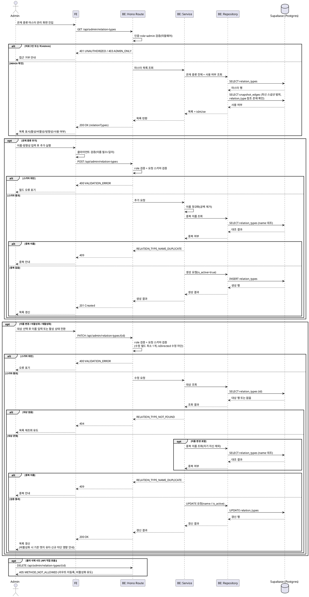

# UC-024: 관계 종류 마스터 관리

> `docs/userflow.md` 024번 기능의 상세 유스케이스. Admin이 관계 종류 마스터(공급/고객/경쟁/협력/지분투자/규제 등)를 추가·이름 변경·비활성화·재활성화한다. **물리 삭제는 금지**하며, 비활성화는 신규 선택만 차단하고 기존 엣지·과거 스냅샷은 그대로 유지·표시된다. 마스터의 활성 상태는 편집 캔버스(UC-016)의 관계 종류 선택 가능 목록을 결정한다.

---

## 1. Primary Actor

- **Admin** (role=admin, 서버 측 role 검증 필수 — 클라이언트 우회 방지)

## 2. Precondition (사용자 관점)

- Admin 계정으로 로그인 상태이다.
- 어드민 페이지의 관계 종류 마스터 관리 화면(`/admin/relation-types`)에 진입할 수 있다.

## 3. Trigger

- Admin이 관계 종류 마스터 관리 화면에 진입한다(목록 조회).
- Admin이 다음 상호작용 중 하나를 실행한다.
  - (추가) 신규 관계 종류 추가.
  - (이름 변경) 기존 관계 종류의 이름 변경.
  - (비활성화) 활성 관계 종류의 비활성화.
  - (재활성화) 비활성 관계 종류의 재활성화.

## 4. Main Scenario

1. Admin이 관계 종류 마스터 관리 화면에 진입한다.
2. 시스템은 서버 측에서 role=admin을 검증한 뒤, 관계 종류 전체 목록(활성/비활성 포함)을 로드한다.
   - 각 항목에 이름, 방향성(유향/무향), 활성 상태, **사용 여부**(현행 스냅샷 엣지에서 참조 중인지)를 함께 표시해 비활성화 영향 판단을 돕는다.
3. **(추가)** Admin이 이름과 방향성(유향/무향, 기본 유향)을 입력해 추가를 실행한다.
   1. 시스템은 이름 필수·길이 상한(상수 관리)·중복 여부를 검증한다.
   2. 검증 통과 시 `is_active=true`로 신규 관계 종류를 생성하고 목록을 갱신한다.
4. **(이름 변경)** Admin이 대상 관계 종류를 선택해 새 이름을 입력한다.
   1. 시스템은 추가와 동일한 이름 검증을 수행한 뒤 이름을 갱신한다.
   2. 기존 엣지·과거 스냅샷은 관계 종류 **ID 참조를 유지**하므로 데이터 변경 없이 표시 라벨만 즉시 최신 이름을 따른다(라벨 이력 미보존 — 과거 스냅샷도 최신 이름으로 표시).
5. **(비활성화)** Admin이 대상 관계 종류를 비활성화한다.
   1. 시스템은 `is_active=false`로 전환한다. 사용 중인 종류라면 "기존 엣지·과거 스냅샷은 유지되고 신규 선택만 차단된다"는 영향 안내를 표시한다.
   2. 이후 편집 캔버스(UC-016)의 신규 선택 목록에서 제외된다. 기존 엣지·과거 스냅샷은 유지·표시된다.
6. **(재활성화)** Admin이 비활성 관계 종류를 재활성화하면 `is_active=true`로 복원되어 다시 신규 선택이 가능해진다.
7. 각 변경 후 시스템은 마스터 목록을 갱신하고, 편집 화면의 선택 가능 목록(활성만)에 반영한다.
8. 물리 삭제 액션은 UI에 노출하지 않으며, API 직접 호출로 삭제를 시도해도 차단된다(비활성화 유도).

## 5. Edge Cases

| # | 상황 | 처리 |
|---|------|------|
| E1 | 물리 삭제 시도(API 직접 호출 포함) | 삭제 엔드포인트 미제공 → 405 응답, 비활성화 유도. DB 레벨에서도 `snapshot_edges.relation_type_id ON DELETE RESTRICT`로 최종 방어 |
| E2 | 중복 이름 추가/변경 | 이름 정규화(앞뒤 공백 제거) 후 활성·비활성 전체 대상 중복 차단(409). *허용 여부는 미확정 정책 — Open Question* |
| E3 | 사용 중(엣지가 참조 중) 관계 종류 비활성화 | 허용. 기존 엣지·과거 스냅샷 유지·표시, 신규 선택만 차단. 화면에 영향 안내 표시 |
| E4 | 비활성 종류 재활성화 | 정상 복원(`is_active=true`), 신규 선택 재허용 |
| E5 | 비-Admin(User/Guest) 접근·요청 | 서버 측 role 검증으로 거부(401/403), 클라이언트 우회 방지 |
| E6 | 존재하지 않는 관계 종류 ID로 변경/비활성화 요청 | 404 응답, 목록 재조회 유도 |
| E7 | 이름 미입력/공백만 입력/길이 상한 초과 | 400 검증 실패, 필드 단위 오류 표기 |
| E8 | 모든 관계 종류가 비활성 상태가 됨 | 마스터 관리 자체는 허용. 편집 캔버스에서는 관계 설정 불가 안내(UC-016 E6 연계) |
| E9 | 비활성화와 사용자의 체인 저장이 동시에 발생 | 저장 시점의 마스터 상태 기준으로 서버가 판정(UC-016 E11/BR-4 — 비활성 종류의 신규 엣지만 거부, 기존 엣지 유지) |
| E10 | 다중 어드민 동시 수정(같은 항목 이름 변경 등) | 단순 마스터 특성상 마지막 쓰기 우선. 처리 후 목록 재조회로 최신 상태 동기화 |
| E11 | 네트워크/서버 오류 | 오류 안내 + 재시도 유도. 변경 요청은 단건 UPDATE/INSERT라 부분 실패 없음 |

## 6. Business Rules

### 6.1 마스터 관리 규칙

- **BR-1 (물리 삭제 금지)**: 관계 종류는 어떤 경로로도 물리 삭제하지 않는다. API에 삭제 엔드포인트를 제공하지 않고, DB는 `snapshot_edges`·`llm_relation_proposals`의 `relation_type_id ON DELETE RESTRICT`로 이중 방어한다.
- **BR-2 (비활성화 의미)**: `is_active=false`는 **신규 선택 차단만** 의미한다. 기존 엣지·과거 스냅샷은 유지·표시되며, 재활성화로 언제든 복원할 수 있다.
- **BR-3 (이름 변경 의미)**: 엣지·스냅샷은 관계 종류 ID를 참조하므로 이름 변경은 참조 데이터에 영향이 없다. 표시 라벨은 항상 마스터의 **최신 이름**을 따르며, 라벨 이력은 보존하지 않는다(과거 스냅샷도 최신 이름으로 표시).
- **BR-4 (추가 기본값)**: 신규 관계 종류는 `is_active=true`로 생성한다. 방향성(`is_directed`)은 생성 시 지정하며(기본 유향), **생성 후에는 변경 불가**로 한다 — 방향성 변경은 기존 엣지의 의미(무향 쌍 정규화·중복 판정, UC-016 BR-2/BR-5)를 소급 변경하기 때문이다.
- **BR-5 (이름 검증)**: 이름은 필수이며 앞뒤 공백 제거 후 빈 문자열 불가, 길이 상한은 상수로 관리한다. 중복 이름은 활성·비활성 전체를 대상으로 차단한다(기본 정책 제안 — Open Question).
- **BR-6 (권한)**: 모든 관리 API는 서버 측(Hono 미들웨어)에서 role=admin을 검증한다. 클라이언트 측 화면 제어는 보조 수단일 뿐이다.
- **BR-7 (스냅샷 무관)**: 마스터 변경(추가/이름 변경/활성 상태 전환)은 밸류체인 구조 변경 이벤트가 아니므로 **스냅샷을 생성하지 않는다**(스냅샷은 체인 구성 변경 시에만 — UC-018/021/022).
- **BR-8 (편집 화면 반영)**: 편집 캔버스의 신규 선택 목록(UC-016 API-1 `GET /api/relation-types?active=true`)에는 활성 종류만 노출한다. 비활성 종류는 기존 엣지 라벨 렌더링을 위해 전체 조회에는 포함된다.

### 6.2 API Specification

> 계층: Hono Route(`route.ts`, HTTP 파싱/검증 + admin role 미들웨어) → Service(`service.ts`, 비즈니스 규칙) → Repository(`repository.ts`, Supabase 접근). 요청/응답 DTO는 Zod 스키마로 분리 정의한다. 어드민 전용 API는 `/api/admin/*` 네임스페이스를 사용한다.

#### API-1. 관계 종류 마스터 목록 조회 (어드민)

| 항목 | 내용 |
|---|---|
| 엔드포인트 | `GET /api/admin/relation-types` |
| 권한 | Admin (서버 측 role 검증) |
| Query | 없음 (활성/비활성 전체 반환) |

Response `200 OK`:

```json
{
  "relationTypes": [
    {
      "id": "uuid",
      "name": "공급",
      "isDirected": true,
      "isActive": true,
      "isInUse": true,
      "createdAt": "2026-07-01T09:00:00+09:00",
      "updatedAt": "2026-07-05T09:00:00+09:00"
    }
  ]
}
```

- `isInUse`: 각 체인의 최신 스냅샷 엣지에서 해당 종류를 참조 중인지 여부(비활성화 영향 안내용 표시 정보).

에러:

| HTTP | code | 설명 |
|---|---|---|
| 401 | `UNAUTHORIZED` | 미로그인/세션 만료 |
| 403 | `ADMIN_ONLY` | 비-Admin 접근(E5) |
| 500 | `INTERNAL_ERROR` | 조회 실패(E11) |

#### API-2. 관계 종류 추가

| 항목 | 내용 |
|---|---|
| 엔드포인트 | `POST /api/admin/relation-types` |
| 권한 | Admin |

Request Body:

```json
{
  "name": "라이선스",
  "isDirected": true
}
```

- `name`: 필수. 공백 정규화 후 비어있지 않아야 하며 길이 상한(상수) 이내.
- `isDirected`: 선택(기본 `true`). 생성 후 변경 불가(BR-4).

Response `201 Created`:

```json
{
  "id": "uuid",
  "name": "라이선스",
  "isDirected": true,
  "isActive": true
}
```

에러:

| HTTP | code | 설명 |
|---|---|---|
| 400 | `VALIDATION_ERROR` | 이름 누락/공백/길이 초과(E7), 타입 오류 |
| 401 | `UNAUTHORIZED` | 미로그인 |
| 403 | `ADMIN_ONLY` | 비-Admin(E5) |
| 409 | `RELATION_TYPE_NAME_DUPLICATE` | 중복 이름(E2, 기본 정책 기준) |

#### API-3. 관계 종류 수정 (이름 변경 / 비활성화 / 재활성화)

| 항목 | 내용 |
|---|---|
| 엔드포인트 | `PATCH /api/admin/relation-types/{id}` |
| 권한 | Admin |

Request Body (필드 중 최소 1개 필수, `isDirected`는 수정 불가):

```json
{
  "name": "공급(부품)",
  "isActive": false
}
```

- `name`: 선택. 지정 시 API-2와 동일한 이름 검증.
- `isActive`: 선택. `false`=비활성화, `true`=재활성화.

Response `200 OK`:

```json
{
  "id": "uuid",
  "name": "공급(부품)",
  "isDirected": true,
  "isActive": false
}
```

에러:

| HTTP | code | 설명 |
|---|---|---|
| 400 | `VALIDATION_ERROR` | 수정 필드 0개, 이름 검증 실패(E7), `isDirected` 수정 시도 |
| 401 | `UNAUTHORIZED` | 미로그인 |
| 403 | `ADMIN_ONLY` | 비-Admin(E5) |
| 404 | `RELATION_TYPE_NOT_FOUND` | 존재하지 않는 ID(E6) |
| 409 | `RELATION_TYPE_NAME_DUPLICATE` | 중복 이름(E2) |

#### API-4. 물리 삭제 — 미제공

| 항목 | 내용 |
|---|---|
| 엔드포인트 | `DELETE /api/admin/relation-types/{id}` — **정의하지 않음** |
| 동작 | 라우트 미등록으로 호출 시 `405 METHOD_NOT_ALLOWED`(또는 404) 응답. UI에도 삭제 액션 미노출(E1) |

#### (참고) 편집 화면 소비 API

- `GET /api/relation-types?active=true` (UC-016 API-1 소관): 편집 캔버스의 신규 선택 목록. 본 기능의 활성 상태 변경이 즉시 반영되는 소비 지점이다.

### 6.3 Database Operations

| 테이블 | 작업 | 목적 |
|---|---|---|
| `relation_types` | SELECT | 전체 목록 조회(API-1), 추가/이름 변경 시 중복 이름 검사(BR-5), 수정 대상 존재 확인(API-3) |
| `relation_types` | INSERT | 신규 관계 종류 생성 — `name`, `is_directed`, `is_active=true`(API-2) |
| `relation_types` | UPDATE | `name` 변경, `is_active` 전환(API-3). `updated_at`은 트리거로 자동 갱신 |
| `snapshot_edges` | SELECT | 관계 종류별 사용 여부(`isInUse`) 판별 — 각 체인 최신 스냅샷의 엣지가 참조하는 `relation_type_id` 존재 확인(API-1) |

- **DELETE 없음**: `relation_types`에 대한 DELETE는 Repository에 구현하지 않는다(BR-1). DB 레벨에서도 `snapshot_edges.relation_type_id`·`llm_relation_proposals.relation_type_id`의 `ON DELETE RESTRICT`가 물리 삭제를 차단한다.
- 인덱스 활용: `idx_relation_types_active`(활성 필터), `snapshot_edges`의 relation_type 참조 확인은 최신 스냅샷 범위로 한정해 조회한다.

### 6.4 External Service Integration

- **없음.** 본 기능은 자체 DB(`relation_types` 마스터)만 사용하며 외부 API 호출이 발생하지 않는다(PRD 전역 정책: 외부 API는 배치 적재 전용).

## 7. Sequence Diagram



## 8. 관련 유스케이스

- **UC-016 관계(엣지) 설정/편집/삭제**: 활성 관계 종류만 신규 선택 가능(BR-8). 비활성 종류의 기존 엣지 유지·라벨 최신 이름 표시 규칙의 소비 지점.
- **UC-021 공식 밸류체인 관리**: 공식 체인 편집에서도 동일한 활성 관계 종류 목록을 사용.
- **UC-022 LLM 관계 변경안 검토**: 비활성 관계 종류를 참조하는 제안은 적용 차단(UC-022 엣지케이스).
- **UC-009 밸류체인 뷰 조회**: 비활성 종류를 참조하는 기존 엣지·과거 스냅샷도 정상 표시(최신 이름 라벨).

## 9. 비고

- 관계 종류 초기 시드(공급/고객/경쟁/협력/지분투자/규제 등)는 환경 구성 단계의 시드 데이터로 적재한다(PRD 6장 "사전 정의 마스터").
- 마스터 변경은 즉시 반영되며 별도 배포/캐시 무효화 절차를 요구하지 않는다. 편집 화면은 목록 재조회(서버 상태 캐시 무효화) 시점에 최신 상태를 반영한다.
