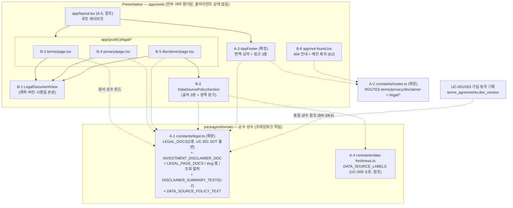

# Plan: UC-025 약관/정책 조회 및 푸터 면책 노출

> 근거: `docs/usecases/025/spec.md`, `docs/usecases/000_decisions.md`(G-1·G-2, A-4), `docs/techstack.md` §4(`app/(public)/legal/*`, `packages/domain/constants`),
> `docs/database.md` §3.1(`terms_agreements`·`terms_doc_type` — 본 기능은 **참조만**, DB 접근 없음),
> `docs/usecases/001/plan.md`(모듈 4 — `packages/domain/constants/legal.ts` `LEGAL_DOCS` SOT 최초 정의),
> `docs/usecases/007/plan.md`(A-2 `DISCLAIMER_SUMMARY_TEXT`, A-6 `constants/routes.ts`, A-7 `AppFooter`),
> `docs/usecases/009/plan.md`(A7 — `packages/domain/constants/data-freshness.ts`의 `DATA_SOURCE_LABELS`).
>
> **범위 경계**
> - 본 plan은 정책 페이지 3종(`/legal/terms`·`/legal/privacy`·`/legal/disclaimer`)의 정적 렌더링과,
>   전역 푸터의 **면책 요약 + 정책 링크 3종 완성**(disclaimer 링크 추가), 그리고 미정의 경로 404 안내(E2)를 다룬다.
> - **신규 Hono API·repository/service·DB 마이그레이션·외부 서비스 연동이 전부 없다**(spec §6.2~6.4, BR-1).
>   따라서 backend 수직 슬라이스(`features/legal/backend/*`)는 만들지 않는다 — 페이지(RSC)가 도메인 상수를 직접 렌더링한다.
> - 약관 **동의 수집·기록**은 UC-001/003 소관(BR-1). 화면별 "최종 수집 시각" 표기는 UC-009/020 소관(BR-7).
>   개정 이력·재동의 플로우는 2단계(BR-8)로 본 plan 범위 밖이다.
> - 접근 제어 없음 — 전 라우트 공개(BR-10). `(public)` 라우트 그룹에 배치한다.

---

## 사전 정합화 결정 (기존 plan 간 충돌 해소 — 구현 시 이 표를 따름)

| # | 충돌 | 결정 | 근거 |
|---|---|---|---|
| R-1 | 정책 페이지 경로: UC-003 plan(§ google-login-button)·UC-007 plan(A-7 QA)은 `/terms`·`/privacy`로 기술, UC-001 plan·spec은 `/legal/terms`·`/legal/privacy` | **`/legal/terms`·`/legal/privacy`·`/legal/disclaimer`로 확정.** 모든 링크는 `ROUTES` 상수를 경유하므로 `routes.ts`의 값만 본 결정대로 정의하면 타 plan 모듈 수정 없이 정합된다 | spec §6.2 페이지 계약 + techstack §4(`app/(public)/legal/*`)가 경로의 SOT. 경로를 소유하는 UC는 025 |
| R-2 | 도메인 상수 경로: UC-007 plan은 `packages/domain/src/constants/legal.ts`, UC-001 plan·다수 plan은 `packages/domain/constants/legal.ts` | **`packages/domain/constants/legal.ts`로 통일**(스캐폴드가 `src/` 레이아웃을 쓰면 동일 모듈의 물리 경로만 달라질 뿐, 파일은 하나다 — 중복 생성 금지) | techstack §4 Codebase Structure가 SOT |
| R-3 | 면책 문서의 docType 취급: DB enum `terms_doc_type`은 2종(terms_of_service·privacy_policy)뿐 | 페이지 표기용 타입 `LegalPageDocType = TermsDocType \| 'investment_disclaimer'`를 **DB enum과 분리 정의**. `LEGAL_DOCS`(2종)·`REQUIRED_TERMS_DOC_TYPES`는 **변경 금지**(UC-001 계약 유지 — disclaimer가 동의 대상에 편입되는 회귀 방지) | spec BR-4(면책 문서는 동의 대상 아님), database.md §237(`terms_doc_type` 2종) |

---

## 개요

### A. 공통 모듈 — 기존 plan 소유 파일의 **확장/참조** (재정의 금지)

| # | 모듈 | 위치 | 소유 plan | 본 plan의 기여/사용 |
| --- | --- | --- | --- | --- |
| A-1 | 정책 문서 상수(SOT) — **확장** | `packages/domain/constants/legal.ts` | UC-001(모듈 4)·UC-007(A-2) | 기존 `LEGAL_DOCS`(약관 2종)·`DISCLAIMER_SUMMARY_TEXT`(G-2)에 **면책 문서·slug 맵·조회 헬퍼·출처 표기 정책 문구 추가** |
| A-2 | 라우트 경로 상수 — **확장** | `apps/web/src/constants/routes.ts` | UC-007(A-6) | `ROUTES.terms='/legal/terms'`, `ROUTES.privacy='/legal/privacy'` 값 확정(R-1) + `ROUTES.disclaimer='/legal/disclaimer'` 추가 |
| A-3 | 전역 푸터 — **확장** | `apps/web/src/components/common/AppFooter.tsx` | UC-007(A-7) | 링크 2종 → **3종 완성**(투자 면책 추가), 링크 목록을 상수 기반 매핑으로 전환(BR-5/E5) |
| A-4 | 데이터 출처 라벨 — **참조만** | `packages/domain/constants/data-freshness.ts` | UC-009(A7) | `DATA_SOURCE_LABELS`(금융감독원 DART·SEC EDGAR·토스증권)를 면책 페이지 출처 표기에 재사용(DRY — BR-7) |
| A-5 | 루트 레이아웃 — **참조만** | `apps/web/src/app/layout.tsx` | UC-005(모듈 14)·UC-007(A-7) | `AppFooter` 장착 지점. 전 라우트 그룹((public)/(protected)/admin/auth)이 루트 레이아웃 하위이므로 푸터 누락이 구조적으로 불가(E5) — 본 plan은 QA로 검증만 |

### B. 본 plan 소유 모듈

| # | 모듈 | 위치 | 설명 |
| --- | --- | --- | --- |
| B-1 | 정책 문서 뷰(Presenter) | `apps/web/src/features/legal/components/LegalDocumentView.tsx` | 제목·버전·시행일·본문 렌더링. 로직 없는 순수 Presenter — 3개 페이지 공용(DRY) |
| B-2 | 출처 표기 정책 섹션(Presenter) | `apps/web/src/features/legal/components/DataSourcePolicySection.tsx` | 면책 페이지 전용 — 출처 3종 + 정책 문구 표기(BR-7) |
| B-3 | 이용약관 페이지 | `apps/web/src/app/(public)/legal/terms/page.tsx` | RSC — `terms_of_service` 문서 상수 렌더링 + `metadata` |
| B-4 | 개인정보처리방침 페이지 | `apps/web/src/app/(public)/legal/privacy/page.tsx` | RSC — `privacy_policy` 문서 상수 렌더링 + `metadata` |
| B-5 | 투자 면책 페이지 | `apps/web/src/app/(public)/legal/disclaimer/page.tsx` | RSC — `investment_disclaimer` 문서 + 출처 표기 정책 섹션 + `metadata` |
| B-6 | 전역 404 안내 페이지 — **공통(최초 정의)** | `apps/web/src/app/not-found.tsx` | E2: 미정의 경로 404 안내 + 메인 복귀 링크. `/legal/*` 미정의 경로 포함 **앱 전역** 404의 단일 처리 지점(타 plan 미정의 — 본 plan이 선점) |

- **DB 마이그레이션 신규 없음, `features/legal/backend/* 없음`, `apps/worker` 변경 없음, 외부 서비스 연동 없음**(spec §6.3~6.4).
- 정책 페이지는 동적 세그먼트(`[slug]`) 대신 **정적 세그먼트 3개**로 구현한다 — 미정의 `/legal/*` 경로가 Next.js 기본 매칭 실패로
  자동으로 B-6(404)에 수렴하므로 별도 `notFound()` 분기 코드가 필요 없다(E2, 오류 여지 최소화).

---

## Diagram

데이터 흐름: 페이지(RSC) → 도메인 상수 직독 → HTML. Hono·Supabase·외부 서비스 노드가 존재하지 않는다(spec §7).

---

## Implementation Plan

### A-1. 정책 문서 상수 확장 (`packages/domain/constants/legal.ts`) — 공통 SOT

- 구현 내용 (기존 심볼은 **시그니처 불변** — UC-001 모듈 4·UC-007 A-2가 정의한 것 위에 추가만 한다):
  1. 기존 유지: `TermsDocType`(= DB enum 2종), `LEGAL_DOCS: Record<TermsDocType, LegalDocContent>`,
     `REQUIRED_TERMS_DOC_TYPES`, `DISCLAIMER_SUMMARY_TEXT`(G-2 문구 그대로).
     `LegalDocContent = { docType, title, body, version, effectiveDate }` 타입이 아직 명명 export가 아니면 이번에 export한다
     (spec §6.2 데이터 계약: `effectiveDate`는 `YYYY-MM-DD` 문자열, `body`는 빈 줄(`\n\n`) 구분 문단 плain text — G-1 플레이스홀더).
  2. `LegalPageDocType = TermsDocType | 'investment_disclaimer'` 추가(R-3). DB enum에는 **넣지 않는다**(BR-4).
  3. `INVESTMENT_DISCLAIMER_DOC: LegalDocContent` 추가 — 면책 전문 플레이스홀더 본문(G-1) + 버전·시행일.
  4. `LEGAL_PAGE_DOCS: Record<LegalPageDocType, LegalDocContent>` 추가 —
     `terms_of_service`/`privacy_policy` 항목은 **`LEGAL_DOCS`의 동일 객체를 참조**(복사 금지 — BR-3/E4:
     UC-001이 기록하는 `doc_version`과 페이지 표기가 항상 같은 값이 되는 구조적 보장).
  5. `LEGAL_PAGE_SLUGS = { terms: 'terms_of_service', privacy: 'privacy_policy', disclaimer: 'investment_disclaimer' } as const`
     추가 — URL 마지막 세그먼트(slug) → docType 맵. 경로 접두어(`/legal`)는 웹 계층 `routes.ts` 소관(도메인 패키지에 URL 전체를 넣지 않는다).
  6. `getLegalPageDoc(docType: LegalPageDocType): LegalDocContent` 순수 조회 헬퍼 추가(페이지 3종이 사용).
  7. `DATA_SOURCE_POLICY_TEXT: string` 추가 — BR-7 데이터 출처 표기 **정책 문구**(정보 제공 목적·출처 명시 원칙, G-1 플레이스홀더).
     출처 **명칭 목록**은 여기 중복 정의하지 않고 `data-freshness.ts`의 `DATA_SOURCE_LABELS`를 쓴다(A-4, DRY).
  8. `FOOTER_LEGAL_LINK_LABELS: Record<LegalPageDocType, string>` 추가 — 푸터 링크 라벨
     ("이용약관"/"개인정보처리방침"/"투자 면책 문구"). spec §6.2 "푸터 데이터 계약(라벨)"의 상수화(하드코딩 금지).
  9. `packages/domain/constants/index.ts` 배럴 재수출 갱신(UC-008/013 컨벤션과 동일).
- 의존성: 없음(zod·프레임워크 비의존 순수 상수 — techstack §4 domain 원칙).

**Unit Tests** (vitest — `packages/domain`):

- [ ] `LEGAL_PAGE_DOCS.terms_of_service === LEGAL_DOCS.terms_of_service` (객체 동일 참조 — 버전 SOT 공유, BR-3/E4)
- [ ] `LEGAL_PAGE_DOCS.privacy_policy === LEGAL_DOCS.privacy_policy` (동일)
- [ ] `LEGAL_PAGE_DOCS`의 키가 정확히 3종(`terms_of_service`, `privacy_policy`, `investment_disclaimer`)이다
- [ ] `REQUIRED_TERMS_DOC_TYPES`에 `investment_disclaimer`가 **포함되지 않는다**(BR-4 — 동의 대상 회귀 방지)
- [ ] `LEGAL_PAGE_SLUGS`의 값 집합이 `LEGAL_PAGE_DOCS`의 키 집합과 일치한다(slug 맵 누락/오타 방지)
- [ ] 모든 문서의 `effectiveDate`가 `YYYY-MM-DD` 형식이고 `version`·`title`·`body`가 비어 있지 않다(spec 데이터 계약)
- [ ] `getLegalPageDoc('investment_disclaimer')`가 `INVESTMENT_DISCLAIMER_DOC`를 반환한다
- [ ] 각 문서의 `docType` 필드가 자신의 `LEGAL_PAGE_DOCS` 키와 일치한다(내부 정합)

### A-2. 라우트 경로 상수 확장 (`apps/web/src/constants/routes.ts`) — 공통

- 구현 내용:
  1. `ROUTES.terms = '/legal/terms'`, `ROUTES.privacy = '/legal/privacy'` 값을 R-1 결정대로 확정하고
     `ROUTES.disclaimer = '/legal/disclaimer'`를 추가한다. (UC-007 A-6가 이미 구현돼 있으면 값 수정+1키 추가만.)
  2. `LEGAL_ROUTES: Record<LegalPageDocType, string>` 파생 맵 추가 — `LEGAL_PAGE_SLUGS`를 순회해
     `/legal/${slug}`를 조립(경로 문자열 중복 기입 금지). `ROUTES.terms` 등은 이 맵을 참조하도록 정리해도 된다(단일 SOT).
- 의존성: A-1(`LEGAL_PAGE_SLUGS`, `LegalPageDocType`).

**Unit Tests**:

- [ ] `LEGAL_ROUTES`가 3개 키 전부에 대해 `/legal/{slug}` 형태를 반환한다
- [ ] `ROUTES.terms === '/legal/terms'`, `ROUTES.privacy === '/legal/privacy'`, `ROUTES.disclaimer === '/legal/disclaimer'` (R-1 고정 계약 — UC-001 폼 링크·UC-003 고지 문구 링크가 이 값에 의존)

### B-1. 정책 문서 뷰 (`features/legal/components/LegalDocumentView.tsx`) — Presenter

- 구현 내용:
  1. Server Component 호환 순수 Presenter(`'use client'` 불필요 — 상태·이벤트 없음). props: `{ doc: LegalDocContent, children?: ReactNode }`.
  2. 렌더링: `<h1>{title}</h1>` + 버전·시행일 표기 행("버전 {version} · 시행일 {effectiveDate}" — MVP 표기 의무, spec Main 5) +
     본문(`body`를 빈 줄 기준 문단 분리해 `
` 목록으로 렌더 — 순수 표시 변환이므로 컴포넌트 내 인라인 허용) +
     `children` 슬롯(면책 페이지의 출처 섹션 장착 지점 — B-2를 disclaimer 페이지에서만 주입).
  3. 시맨틱 마크업(`<article>`/`<section>`) + Tailwind 타이포그래피로 가독성 확보. 문서 텍스트 하드코딩 없음(전부 props).
- 의존성: A-1(타입만).

**QA Sheet**:

| # | 시나리오 | 기대 결과 |
| --- | --- | --- |
| 1 | 임의 문서 렌더 | 제목 → 버전·시행일 → 본문 순서로 표시, 버전·시행일이 상수 값 그대로 |
| 2 | 여러 문단(`\n\n`) 포함 본문 | 문단별 `
` 분리 렌더(뭉개짐 없음) |
| 3 | `children` 미전달(약관/방침) | 본문 아래 추가 섹션 없음 |
| 4 | `children` 전달(면책) | 본문 아래 출처 섹션 표시 |
| 5 | 모바일 폭(375px) | 줄바꿈 정상, 가로 스크롤 없음(반응형 — techstack 결정 5) |

### B-2. 출처 표기 정책 섹션 (`features/legal/components/DataSourcePolicySection.tsx`) — Presenter

- 구현 내용:
  1. Server Component 호환 순수 Presenter(props 없음 — 상수 직독 표시 전용).
  2. `DATA_SOURCE_POLICY_TEXT`(A-1) + `DATA_SOURCE_LABELS`(A-4, UC-009 소유 상수 재사용) 목록 렌더 —
     "금융감독원 DART · SEC EDGAR · 토스증권" 3종(BR-7).
  3. "화면별 최종 수집 시각" 관련 표기는 넣지 않는다(UC-009/020 소관 — BR-7 경계).
- 의존성: A-1, A-4.

**QA Sheet**:

| # | 시나리오 | 기대 결과 |
| --- | --- | --- |
| 1 | 면책 페이지 렌더 | 출처 3종(DART/SEC EDGAR/토스증권)이 전부 표시 |
| 2 | 정책 문구 | `DATA_SOURCE_POLICY_TEXT` 상수 문구 그대로(컴포넌트 내 하드코딩 없음) |

### B-3~B-5. 정책 페이지 3종 (`app/(public)/legal/{terms,privacy,disclaimer}/page.tsx`)

- 구현 내용 (3파일 공통 패턴 — 각 파일 10줄 내외, 로직 없음):
  1. Server Component. `getLegalPageDoc('terms_of_service' | 'privacy_policy' | 'investment_disclaimer')`로 문서 상수를 로드해
     `<LegalDocumentView doc={doc} />` 렌더. **fetch·쿼리·동적 API 미사용 → Next.js가 빌드 타임 정적 렌더링**(spec §6.2 "서버 렌더링(정적)", E6: JS 비활성/검색엔진도 HTML만으로 열람 가능).
  2. B-5(disclaimer)만 `<LegalDocumentView doc={...}><DataSourcePolicySection /></LegalDocumentView>`로 출처 섹션 주입(BR-7).
  3. 각 파일에서 `export const metadata: Metadata = { title: doc.title }` 상당의 정적 메타데이터 지정(문서 제목 = 탭 타이틀).
  4. 인증·role 검사 코드 없음(BR-10). `(public)` 그룹 배치로 충분 — (public) 레이아웃에 로그인 가드가 없음을 전제(techstack §4).
  5. 언어 전환 UI 없음 — 한국어 단일(E3/BR-9).
- 의존성: A-1, B-1, B-2(disclaimer만).

**QA Sheet**:

| # | 시나리오 | 기대 결과 |
| --- | --- | --- |
| 1 | 비로그인으로 `/legal/terms` 직접 진입 | 200 — 이용약관 본문 + 버전·시행일 표기 |
| 2 | 비로그인으로 `/legal/privacy` 직접 진입 | 200 — 개인정보처리방침 본문 + 버전·시행일 표기 |
| 3 | 비로그인으로 `/legal/disclaimer` 직접 진입 | 200 — 면책 전문 + 버전·시행일 + 출처 3종 표기(BR-7) |
| 4 | 로그인/Admin 상태로 진입 | 동일 렌더(권한 분기 없음 — BR-10) |
| 5 | 브라우저 JS 비활성 후 접근 | 전체 콘텐츠 HTML만으로 열람 가능(E6 — RSC 정적 렌더) |
| 6 | 페이지 하단 | 공통 푸터 상시 노출(루트 레이아웃 — spec Main 6) |
| 7 | 표기 버전 vs `LEGAL_DOCS` 상수 | 값 동일(단일 상수 참조 — E4). 상수 개정 시 페이지 표기 자동 반영(E1) |
| 8 | 브라우저 탭 타이틀 | 문서 제목 반영(metadata) |

### B-6. 전역 404 안내 페이지 (`app/not-found.tsx`) — 공통(최초 정의)

- 구현 내용:
  1. Next.js App Router 규약 파일 `not-found.tsx` — 미매칭 경로 전역 폴백. 정적 세그먼트 구조(B-3~B-5) 덕분에
     `/legal/foo` 같은 미정의 경로는 자동으로 이 페이지에 수렴한다(E2 — 라우팅 분기 코드 불필요).
  2. 내용: 404 안내 문구 + 메인 복귀 링크(`ROUTES.home`). 순수 Presenter, 상태 없음.
  3. 앱 전역 공통 자산이므로 이후 다른 UC(잘못된 체인/기업 경로 등 페이지 레벨 `notFound()` 호출)도 이 파일을 재사용한다 — 재정의 금지.
- 의존성: A-2(`ROUTES.home`).

**QA Sheet**:

| # | 시나리오 | 기대 결과 |
| --- | --- | --- |
| 1 | `/legal/refund` 등 미정의 `/legal/*` 진입 | 404 안내 페이지(HTTP 404) + 메인 복귀 링크(E2) |
| 2 | 메인 복귀 링크 클릭 | `/` 이동 |
| 3 | `/legal`(하위 세그먼트 없음) 진입 | 404 안내(인덱스 페이지 미정의 — spec 페이지 계약에 없음) |
| 4 | 404 페이지에도 푸터 노출 | 루트 레이아웃 공통이므로 면책 요약·링크 표시(E5) |

### A-3. 전역 푸터 확장 (`components/common/AppFooter.tsx`) — 공통(UC-007 A-7 파일 수정)

- 구현 내용:
  1. 기존(UC-007 A-7): `DISCLAIMER_SUMMARY_TEXT` + 약관/개인정보 링크 2종. 본 plan에서 **투자 면책 링크를 추가해 3종 완성**(spec Main 2).
  2. 링크를 개별 하드코딩하지 않고 `LEGAL_PAGE_DOCS`의 키 순회 × `FOOTER_LEGAL_LINK_LABELS`(라벨) × `LEGAL_ROUTES`(경로) 매핑으로
     렌더 — 문서 종류가 늘어도 푸터 수정이 불필요한 구조(BR-2 "동일 상수 모듈 제공" 이행).
  3. 순수 Presenter 유지(상태·로직 없음, Server Component 호환). 루트 레이아웃 장착은 기존 그대로(A-5 참조) —
     **페이지별 푸터 개별 구현 금지**(E5/BR-5). 정책 페이지들도 별도 푸터 코드를 갖지 않는다.
- 의존성: A-1, A-2.

**QA Sheet**:

| # | 시나리오 | 기대 결과 |
| --- | --- | --- |
| 1 | 메인/체인 뷰/기업 상세/auth/admin 등 임의 페이지 진입 | 푸터에 면책 요약(G-2 문구 그대로) + 링크 3종(이용약관·개인정보처리방침·투자 면책 문구) 상시 노출(BR-5) |
| 2 | 각 링크 클릭 | 각각 `/legal/terms`·`/legal/privacy`·`/legal/disclaimer` 이동(R-1) |
| 3 | 정책 페이지 자체 하단 | 동일 푸터 노출(전역 레이아웃 — spec Main 6) |
| 4 | 모바일 폭 | 요약 문구 줄바꿈 정상, 링크 터치 타깃 확보, 가로 스크롤 없음 |

---

## 구현 순서 및 검증

1. **A-1** 도메인 상수 확장(+단위 테스트 선작성, TDD Red→Green) → **A-2** 라우트 상수(+테스트)
2. **B-1 → B-2** Presenter → **B-3~B-5** 페이지 3종 → **B-6** 404 페이지
3. **A-3** 푸터 확장(링크 3종 매핑 전환)
4. 통합 검증: `npm run typecheck && npm run lint && npm run test` 무오류 + 각 QA Sheet 수동 확인
   - 특히 E6(JS 비활성 열람), E2(404), E5(전 라우트 그룹 푸터 노출), 버전 표기 = 상수 값 일치(E4)를 확인
   - (선택) Playwright e2e: 푸터 링크 3종 내비게이션 + `/legal/*` 3종 200 + 미정의 경로 404 스모크

## 다른 유스케이스와의 접점 (충돌 방지 메모)

- `packages/domain/constants/legal.ts`는 UC-001(가입 동의 `doc_version` 기록)·UC-003(소셜 가입 동의)·UC-007(푸터 요약 문구)과 공유하는 SOT다.
  본 plan은 **기존 심볼을 추가만 하고 변경하지 않는다**(R-3). 문서 개정 시 이 파일의 버전·시행일·본문만 갱신하면
  페이지 표기(025)와 동의 기록 버전(001/003)이 동시 반영된다(BR-3/E1/E4). UC-003 plan의 `TERMS_DOC_VERSIONS`(auth.ts)가
  구현 시점에 존재한다면 별도 상수를 두지 말고 `LEGAL_DOCS`의 `version`을 재수출하는 형태로 정리한다(버전 SOT 이원화 금지).
- `apps/web/src/constants/routes.ts`의 `ROUTES.terms/privacy/disclaimer` 값은 본 plan이 확정한다(R-1).
  UC-001 가입 폼의 약관 링크, UC-003 Google 버튼 고지 문구 링크, UC-007 푸터가 모두 이 상수를 참조하므로 문자열 직접 기입 금지.
- `app/not-found.tsx`(B-6)는 본 plan이 최초 정의하는 앱 전역 공통 파일 — 이후 plan은 재정의하지 말고 `notFound()` 호출로 재사용한다.
- 면책 페이지의 출처 명칭은 UC-009 소유 `DATA_SOURCE_LABELS`를 재사용한다. 출처 목록 변경은 `data-freshness.ts` 한 곳에서만 한다.
- 본 기능은 읽기 전용(BR-1)이므로 Hono 라우터/미들웨어/Supabase 클라이언트 등 공통 백엔드 골격(UC-001/007 정의)에 아무 변경이 없다.
