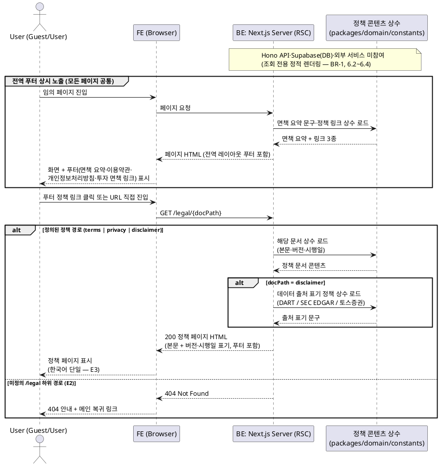

# UC-025: 약관/정책 조회 및 푸터 면책 노출

> `docs/userflow.md` 025번 기능의 상세 유스케이스. 이용약관·개인정보처리방침·투자 면책 문구 페이지를 제공하고, 전 페이지 공통 푸터에 면책 요약과 각 정책 링크를 상시 노출한다. **MVP는 정적 페이지 형태**(PRD §2 Internal, §3-7)이며, 각 문서에 버전·시행일을 표기한다. 조회 전용 기능으로 DB·외부 서비스 접근이 없다.

---

## 1. Primary Actor

- **Guest / User** (전역 — 로그인 여부 무관, Admin 포함 모든 방문자)

## 2. Precondition (사용자 관점)

- 없음. 서비스의 아무 페이지에나 접근할 수 있으면 된다(로그인 불필요, 권한 제약 없음).

## 3. Trigger

- 사용자가 서비스의 임의 페이지에 진입한다(푸터 면책 요약·정책 링크 상시 노출).
- 사용자가 푸터의 정책 링크를 클릭하거나 정책 페이지 URL(`/legal/terms`, `/legal/privacy`, `/legal/disclaimer`)로 직접 진입한다.

## 4. Main Scenario

1. 사용자가 서비스의 임의 페이지에 진입한다.
2. 시스템은 전역 레이아웃의 공통 푸터에 다음을 렌더링한다.
   - 투자 면책 요약 문구(모든 데이터는 정보 제공 목적이며 투자 권유가 아님).
   - 정책 페이지 링크 3종: 이용약관 / 개인정보처리방침 / 투자 면책 문구.
3. 사용자가 푸터의 정책 링크를 클릭한다(또는 URL 직접 진입).
4. 시스템(Next.js 서버 렌더링)은 요청 경로에 매핑된 정책 문서의 정적 콘텐츠(본문·버전·시행일)를 콘텐츠 상수에서 로드한다.
5. 정책 페이지가 렌더링된다.
   - 공통: 문서 본문 + **버전·시행일 표기**(MVP).
   - 투자 면책 페이지: 면책 전문과 함께 **데이터 출처 표기 정책**(금융감독원 DART, SEC EDGAR, 토스증권)을 노출한다.
6. 정책 페이지 하단에도 동일한 공통 푸터가 상시 노출된다(전역 레이아웃 공통).

## 5. Edge Cases

| # | 상황 | 처리 |
|---|------|------|
| E1 | 정책 문서 개정 | 콘텐츠 상수의 본문·버전·시행일 갱신만 반영(MVP). 기존 동의 사용자에 대한 재동의 요구는 2단계 범위로 제외 |
| E2 | 잘못된 정책 경로(`/legal` 하위 미정의 경로) 진입 | `404 Not Found` 안내 페이지 표시 |
| E3 | 다국어 요청 | 한국어 단일 제공(사양, PRD Non-Goals) — 언어 전환 UI 미제공 |
| E4 | 회원가입(UC-001) 동의 기록과 표기 버전 불일치 위험 | 정책 문서 버전은 단일 콘텐츠 상수를 SOT로 공유 — UC-001의 `doc_version` 기록과 본 페이지 표기가 같은 상수를 참조하므로 불일치가 구조적으로 발생하지 않음 |
| E5 | 일부 레이아웃에서 푸터 누락 위험 | 푸터는 전역 공통 레이아웃 컴포넌트로 렌더링(public/protected/admin/auth 전 라우트 그룹 포함) — 페이지별 개별 구현 금지 |
| E6 | 검색엔진/JS 비활성 환경 접근 | 서버 렌더링 정적 페이지이므로 HTML만으로 전체 콘텐츠 열람 가능(별도 처리 불필요) |

## 6. Business Rules

### 6.1 정책·노출 규칙

- **BR-1 (조회 전용)**: 본 기능은 읽기 전용 정적 콘텐츠 제공이다. 어떤 쓰기 액션·사이드이펙트도 없다. 약관 **동의 수집·기록은 UC-001(회원가입) 소관**이며 본 기능 범위가 아니다.
- **BR-2 (정적 콘텐츠 + 상수 관리)**: MVP에서 정책 문서 본문·버전·시행일은 DB가 아닌 **정적 콘텐츠 상수**(`packages/domain/constants`)로 관리한다(하드코딩 금지 규칙에 따라 컴포넌트 내 직접 기입 금지). 문서별 관리 항목: 문서 종류 식별자, 제목, 본문, 버전, 시행일.
- **BR-3 (버전 SOT 공유)**: 이용약관(`terms_of_service`)·개인정보처리방침(`privacy_policy`)의 버전 상수는 UC-001이 `terms_agreements.doc_version`에 기록하는 값의 SOT다. 개정 시 상수 갱신만으로 페이지 표기와 동의 기록 버전이 함께 반영된다(E1/E4).
- **BR-4 (면책 문서는 동의 대상 아님)**: 투자 면책 문구는 열람 전용이며 동의 수집 대상이 아니다. 따라서 DB enum `terms_doc_type`(terms_of_service, privacy_policy)에 포함되지 않고, 라우트 식별자로만 존재한다.
- **BR-5 (푸터 상시 노출)**: 면책 요약 + 정책 링크 3종은 **전 페이지** 공통 푸터에 상시 노출한다. 전역 레이아웃 1곳에서 렌더링해 페이지 누락을 방지한다(E5).
- **BR-6 (면책 문구 원칙)**: 모든 데이터는 정보 제공 목적이며 투자 권유가 아님을 명시한다(PRD 전역 정책).
- **BR-7 (데이터 출처 표기 정책)**: 투자 면책 페이지에 데이터 출처(금융감독원 DART, SEC EDGAR, 토스증권) 표기 정책을 정적 문구로 노출한다. 화면별 "최종 수집 시각" 표기는 각 데이터 화면(UC-009/UC-020) 소관이며 본 기능 범위가 아니다.
- **BR-8 (개정 정책)**: 문서 개정 시 버전·시행일 표기만 갱신한다(MVP). 개정 이력 목록 제공·기존 사용자 재동의 요구는 2단계 범위(E1).
- **BR-9 (언어)**: 한국어 단일 제공(PRD Non-Goals — 다국어 제외).
- **BR-10 (접근 권한)**: 비로그인 포함 전체 공개. 인증·role 검증이 없다.

### 6.2 API Specification

> **신규 REST API 없음.** MVP에서 정책 문서는 정적 콘텐츠 상수를 Next.js 서버 컴포넌트(RSC)가 직접 렌더링하므로 Hono API·DB 조회가 발생하지 않는다(techstack §4 — `app/(public)/legal/*`). 아래는 API에 준하는 **페이지 계약**이다.

#### 페이지 계약 (Next.js 라우트)

| 경로 | 메서드 | 접근 권한 | 렌더링 | 응답 |
|---|---|---|---|---|
| `/legal/terms` | GET (페이지 요청) | 전체 공개 | 서버 렌더링(정적) | `200` HTML — 이용약관 본문 + 버전·시행일 |
| `/legal/privacy` | GET (페이지 요청) | 전체 공개 | 서버 렌더링(정적) | `200` HTML — 개인정보처리방침 본문 + 버전·시행일 |
| `/legal/disclaimer` | GET (페이지 요청) | 전체 공개 | 서버 렌더링(정적) | `200` HTML — 투자 면책 전문 + 버전·시행일 + 데이터 출처 표기 정책 |
| `/legal/{미정의 경로}` | GET | 전체 공개 | - | `404 Not Found` 안내 페이지(E2) |

각 페이지가 콘텐츠 상수에서 로드하는 데이터 계약:

```json
{
  "docType": "terms_of_service | privacy_policy | investment_disclaimer",
  "title": "string",
  "body": "string (문서 본문)",
  "version": "string (예: 1.0)",
  "effectiveDate": "YYYY-MM-DD"
}
```

- 전역 푸터가 로드하는 데이터 계약: 면책 요약 문구(string) + 정책 링크 3종(라벨·경로). 동일 상수 모듈에서 제공한다(BR-2).

에러:

| HTTP | 상황 | 처리 |
|---|---|---|
| 404 | `/legal` 하위 미정의 경로(E2) | 404 안내 페이지 → 메인 복귀 링크 제공 |

> `400`/`401`/`403`/`500` 계열 에러 없음 — 요청 파라미터·인증·DB 조회가 존재하지 않는 정적 렌더링이다.

### 6.3 Database Operations

| 테이블 | 작업 | 목적 |
|---|---|---|
| (없음) | - | 본 기능은 DB에 접근하지 않는다. 정책 본문·버전·시행일은 정적 콘텐츠 상수로 관리한다(BR-2) |

- **`terms_agreements` (참고, 본 기능 범위 밖)**: 약관 동의 이력 INSERT는 UC-001(회원가입) 소관이다. 본 기능의 버전 상수가 그 `doc_version` 값의 SOT라는 관계만 존재한다(BR-3).
- 정책 문서 본문 저장 테이블은 스키마에 없다(database.md — MVP 정적 페이지 결정). 문서 개정 이력의 DB 관리·재동의 플로우는 2단계에서 재검토한다.

### 6.4 External Service Integration

- **없음.** OpenDART·SEC EDGAR·토스증권 등 외부 API 호출이 없다. 투자 면책 페이지의 데이터 출처 표기(DART/SEC/토스증권)는 정적 문구이며, 외부 서비스명 나열일 뿐 연동이 아니다(PRD 전역 정책: 외부 API는 배치 적재 전용).

## 7. Sequence Diagram

> 본 기능은 Hono Route → Service → Repository → Supabase 경로를 타지 않는다(신규 API 없음, BR-1/6.2). BE는 Next.js 서버 렌더링(RSC)이 담당하고 데이터 소스는 정책 콘텐츠 상수 모듈이다. Supabase·외부 서비스는 참여하지 않는다.



## 8. 관련 유스케이스

- **UC-001 이메일 회원가입**: 가입 시 이용약관·개인정보처리방침 2종 필수 동의를 수집하고 `terms_agreements`에 `doc_version`을 기록한다. 그 버전 값의 SOT가 본 기능의 정책 콘텐츠 상수다(BR-3, E4).
- **UC-003 Google 소셜 로그인**: 신규 가입 경로에서의 약관 동의 처리 — 동일 버전 상수를 참조한다.
- **UC-007 메인/탐색 페이지 조회**: 푸터 면책·정책 링크 노출의 대표 연계 지점(userflow 007 처리 5). 실제로는 전 페이지 공통이다(BR-5).
- **UC-009 밸류체인 뷰 / UC-020 기업 상세**: 화면별 데이터 출처·최종 수집 시각 표기는 해당 유스케이스 소관이며, 본 기능은 출처 표기 **정책 문구**만 면책 페이지에 노출한다(BR-7).
- **(2단계) 정책 개정 재동의 플로우**: 문서 개정 시 기존 동의 사용자 재동의 요구는 MVP 범위 밖(E1, BR-8).
