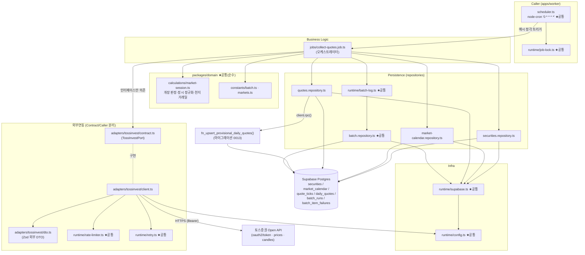

# Plan: UC-026 시세 수집 배치 (collect-quotes)

> 근거: `docs/usecases/026/spec.md`, `docs/usecases/000_decisions.md`(H-5·H-7·C-3), `docs/techstack.md` §4·§6·§8·§9,
> `docs/database.md` §3.4·§3.6·§3.9·§5, `supabase/migrations/0007_price_timeseries.sql`·`0009_fx_and_market_calendar.sql`·`0012_batch_runs.sql`,
> `docs/external/tossinvest-openapi.md`(§4 Rate Limits, §5 에러 코드, §8 보강 조사).
>
> - 본 plan은 **워커(`apps/worker`) 측 첫 구현 계획**이다. UC-001~016 plan은 전부 웹(`apps/web`)·`packages/domain` 소관이라
>   워커 공통 골격(스케줄러/런타임/리포지토리 베이스/어댑터)이 아직 어느 plan에도 정의되어 있지 않다.
>   따라서 본 plan이 워커 공통(shared) 모듈을 최초 정의하고, UC-027~031 plan은 위치만 참조한다(UC-001 plan이 웹 공통을 정의한 방식과 동일).
> - 사용자향 HTTP API·화면이 없는 **System 배치**다. Presentation 모듈은 없으며, 실행 결과 조회는 UC-023(웹) 소관이다.
> - DB 스키마(`quote_ticks`/`daily_quotes`/`market_calendar`/`batch_runs`/`batch_item_failures`)는 0007·0009·0012 마이그레이션으로 이미 존재한다.
>   신규 마이그레이션은 **일별 잠정 집계 UPSERT RPC 함수 1건**뿐이다(테이블 변경 없음). 함수 번호는 `0013`을 기본으로 하되,
>   타 유스케이스 plan(007/008/010/012/015)이 먼저 `0013`을 점유하면 다음 빈 번호로 밀어 적용한다(모두 멱등 `CREATE OR REPLACE` — 기존 컨벤션 준수).
> - 외부 연동은 **토스증권 Open API** 1건이다(`docs/external/tossinvest-openapi.md`). techstack §8에 따라
>   `adapters/tossinvest/contract.ts`(계약) ↔ `client.ts`(구현)로 격리하고, 잡은 contract에만 의존한다.
> - 결정 H-5에 따라 미국 종목 마스터는 SEC 전체를 유지하되 **시세 수집 대상은 `toss_symbol IS NOT NULL`인 종목으로 한정**한다.
> - 결정 C-3에 따라 "최종 수집 시각"은 별도 기록 없이 `batch_runs`의 성공 실행 `finished_at`에서 파생된다(UC-009 plan이 이미 조회 측 구현).

---

## 개요

### 공통(shared) 모듈 — 워커 골격, 본 plan에서 최초 정의 (UC-027~031 재사용)

| 모듈 | 위치 | 설명 |
| --- | --- | --- |
| 워커 패키지 골격 | `apps/worker/package.json`, `apps/worker/tsconfig.json`, `apps/worker/vitest.config.ts` | npm workspace 멤버. scripts: `dev`(tsx watch), `build`(tsc), `start`, `lint`, `typecheck`, `test`(vitest) — techstack §6 그대로 |
| 워커 환경설정 | `apps/worker/src/runtime/config.ts` | `process.loadEnvFile()`(Node 24 내장) + zod 검증: Supabase URL/서비스 롤 키, `TOSSINVEST_CLIENT_ID`/`TOSSINVEST_CLIENT_SECRET`. 하드코딩 금지의 단일 진입점 |
| Supabase 클라이언트 팩토리 | `apps/worker/src/runtime/supabase.ts` | service-role 클라이언트 생성(`persistSession:false`), 타임아웃 fetch 래퍼 주입. 워커 전용(웹의 `lib/supabase/*`와 별개 — 프로세스가 다름) |
| 토큰버킷 레이트리미터 | `apps/worker/src/runtime/rate-limiter.ts` | API 그룹별 토큰버킷(자체 구현, techstack §2·§8). `X-RateLimit-Remaining/Reset` 헤더 피드백으로 동적 감속 |
| 재시도 유틸 | `apps/worker/src/runtime/retry.ts` | `withRetry(fn, opts)` — 지수 백오프(기본 3회) + jitter + `Retry-After` 존중 + `shouldRetry` 판정 주입 |
| 잡 중복 기동 방지 | `apps/worker/src/runtime/job-lock.ts` | 프로세스 내 인메모리 락(잡 유형별). 실행 중이면 스킵(spec 6.2(1) 동시성 정책의 1차 방어) |
| 배치 실행 기록기 | `apps/worker/src/runtime/batch-log.ts` | `startRun()`/`finishRun()`/`recordItemFailures()`/`resolveFailures()` — 모든 잡 공용 파사드. 실제 쿼리는 batch 리포지토리에 위임 |
| 배치 리포지토리 | `apps/worker/src/repositories/batch.repository.ts` | `batch_runs` INSERT/UPDATE, `batch_item_failures` SELECT/INSERT/UPDATE 캡슐화 |
| 스케줄러 진입점 | `apps/worker/src/scheduler.ts` | node-cron 등록(Caller). 본 plan에서는 `collect-quotes`만 등록, 이후 잡은 후속 plan이 행 추가 |

### 공통(shared) 모듈 — 도메인 (packages/domain, web·worker 공유 가능 순수 로직)

| 모듈 | 위치 | 설명 |
| --- | --- | --- |
| 배치 상수 | `packages/domain/constants/batch.ts` | `COLLECT_QUOTES_CRON='0 * * * *'`, `QUOTE_TICKS_RETENTION_DAYS=30`, `BATCH_MAX_RETRY=3`, `BATCH_RETRY_BASE_DELAY_MS`, `TOSS_SYMBOLS_CHUNK_SIZE=200`, `DB_UPSERT_CHUNK_SIZE=1000`, `WORKER_HTTP_TIMEOUT_MS` |
| 시장 상수 | `packages/domain/constants/markets.ts` | `MARKET_TIMEZONES = { KRX:'Asia/Seoul', US:'America/New_York' }`, `MARKETS=['KRX','US']` — DB enum `market_code` 리터럴과 일치 |
| 시장 세션 계산 | `packages/domain/calculations/market-session.ts` | 순수 함수: `resolveLocalDate(market, at)`, `resolveMarketPhase(calendarRow, now)`(open/before_open/after_close/holiday/unknown), `normalizeToHourUtc(now)`, `localDayUtcRange(market, localDate)` — UC-028(캘린더 적재 검증)·UC-029(집계 기준일)와 공유 |

### 기능(collect-quotes) 모듈

| 모듈 | 위치 | 설명 |
| --- | --- | --- |
| 토스 어댑터 계약 | `apps/worker/src/adapters/tossinvest/contract.ts` | `TossInvestPort` 인터페이스 + 내부 정규화 모델(`NormalizedQuote`, `NormalizedDailyCandle`, `SymbolFailure`) + 어댑터 오류 타입. 잡이 의존하는 유일한 어댑터 표면 |
| 토스 외부 DTO 스키마 | `apps/worker/src/adapters/tossinvest/dto.ts` | 외부 응답 Zod 스키마(`TokenResponse`, `PricesResponse`, `CandlePageResponse`, 오류 envelope) — 외부 계약과 내부 모델 분리 |
| 토스 어댑터 구현 | `apps/worker/src/adapters/tossinvest/client.ts` | Client Credentials 토큰 발급·캐시, 200개 청크 분할 `GET /api/v1/prices`, 종목별 `GET /api/v1/candles?interval=1d`, 레이트리밋·재시도·오류 코드 매핑·Zod 검증 |
| 종목 리포지토리 | `apps/worker/src/repositories/securities.repository.ts` | 수집 대상 종목 SELECT(`listing_status='listed'` + 개장 시장 + `toss_symbol IS NOT NULL`) |
| 캘린더 리포지토리 | `apps/worker/src/repositories/market-calendar.repository.ts` | 시장·현지일자별 `market_calendar` 1행 SELECT |
| 시세 리포지토리 | `apps/worker/src/repositories/quotes.repository.ts` | `quote_ticks` 멱등 UPSERT·30일 초과 DELETE, `daily_quotes` 확정 UPSERT·미확정 행 조회, 잠정 집계 RPC 호출 |
| 잠정 일별 집계 RPC | `supabase/migrations/0013_fn_upsert_provisional_daily_quotes.sql` | `fn_upsert_provisional_daily_quotes(p_market, p_trade_date, p_from, p_to)` — 당일 틱 → OHLCV 잠정값 단일 문 UPSERT(확정 행 보호). techstack §7(복잡 집계는 Postgres 함수) 준수 |
| 시세 수집 잡 | `apps/worker/src/jobs/collect-quotes.job.ts` | 오케스트레이터: 개장/확정 판정 → 수집 → 멱등 적재 → 잠정 집계 → 종가 확정 → 정리 → 기록. 모든 의존성(포트·리포지토리·clock) 주입형 |

### 범위 밖 (다른 plan 소관)

- `market_calendar`·`fx_rates` **적재**: UC-028(본 잡은 읽기만, 당일 데이터 없으면 E9 보수적 스킵).
- 시가총액 계산·carry-forward 집계: UC-029(`aggregate-daily-metrics`). 본 잡은 `daily_quotes`까지만 책임.
- 과거 일봉 백필·종목 마스터 시드: UC-031(H-5). 본 잡은 백필 완료 후 증분만 담당.
- 배치 실행 이력 조회 화면/API: UC-023(웹). 본 잡은 `batch_runs`/`batch_item_failures` 기록까지만.
- 수동 재실행 트리거(HTTP/UI): MVP 제외(spec 3장 — 2단계).
- LLM·OpenDART·SEC 어댑터: UC-027/030 plan에서 동일 패턴으로 추가.

---

## Diagram

데이터 흐름: Scheduler → Job(비즈니스 로직) → Adapter(외부)·Repository(퍼시스턴스) → Supabase. 잡은 `contract.ts`와 리포지토리 함수 시그니처에만 의존하고 HTTP·SQL 문법을 알지 못한다(techstack §4 계층 분리 매핑).

---

## Implementation Plan

### 1. 공통 — 워커 패키지 골격 (`apps/worker/package.json`, `tsconfig.json`, `vitest.config.ts`)

- 구현 내용:
  1. `package.json`: name `@iib/worker`, `"@iib/domain": "*"` 워크스페이스 참조, deps `@supabase/supabase-js`·`node-cron`·`date-fns`·`date-fns-tz`·`zod`, devDeps `tsx`·`vitest`·`typescript`·`eslint`. scripts는 techstack §6 그대로(`dev`=`tsx watch src/scheduler.ts`, `build`=`tsc -p tsconfig.json`, `start`=`node dist/scheduler.js`, `lint`/`typecheck`/`test`). `yauzl`·LLM SDK는 본 plan 범위 아님(UC-027/030에서 추가).
  2. `tsconfig.json`: 루트 `tsconfig.base.json` 상속, `outDir=dist`, NodeNext 모듈 해석.
  3. `vitest.config.ts`: node 환경, `src/**/*.test.ts`.
  4. 루트 `package.json` workspaces(`apps/*`)에 이미 매칭되므로 루트 수정 없음(UC-001 plan의 골격 정의와 충돌 없음 — 워크스페이스 글롭 공유).
- 의존성: 없음(최초 골격).
- Unit Tests: N/A(설정 파일). `npm run typecheck -w apps/worker` 통과로 검증.

### 2. 공통 — 워커 환경설정 (`runtime/config.ts`)

- 구현 내용:
  1. 모듈 로드 시 `process.loadEnvFile()`을 try/catch로 호출(루트 `.env` — 파일 없으면 무시, 배포 환경은 주입 env 사용. dotenv 의존성 불필요, Node 24 내장).
  2. zod 스키마로 검증·파싱: `NEXT_PUBLIC_SUPABASE_URL`(url), `SUPABASE_SERVICE_ROLE_KEY`(min 1), `TOSSINVEST_CLIENT_ID`(min 1), `TOSSINVEST_CLIENT_SECRET`(min 1) — techstack §9의 키 이름 그대로. lazy 싱글턴 `getWorkerConfig()`.
  3. 실패 시 누락 키 이름을 포함한 명확한 오류로 프로세스 기동 중단(잡 도중이 아닌 기동 시점 조기 실패).
- 의존성: 없음.
- **Unit Tests**:
  - [ ] 필수 키 4종이 모두 있으면 파싱 성공, 타입 안전 객체 반환
  - [ ] `TOSSINVEST_CLIENT_SECRET` 누락 시 해당 키 이름이 포함된 오류 발생
  - [ ] `NEXT_PUBLIC_SUPABASE_URL`이 URL 형식이 아니면 실패
  - [ ] `.env` 파일 부재 시에도 예외 없이 process.env 값으로 동작

### 3. 공통 — Supabase 클라이언트 팩토리 (`runtime/supabase.ts`) 【외부 서비스 연동 모듈 — Supabase】

- 구현 내용: `createWorkerSupabase(config)` — `createClient(url, serviceRoleKey, { auth: { persistSession:false, autoRefreshToken:false }, global: { fetch: timeoutFetch } })`.
  `timeoutFetch`는 `AbortSignal.timeout(WORKER_HTTP_TIMEOUT_MS)` 주입 래퍼(대량 UPSERT를 고려해 웹 상수보다 여유 있게, `constants/batch.ts` 상수).
  프로세스 수명 동안 싱글턴 재사용(잡마다 재생성 금지).
- 외부 연동 필수 항목:
  - 에러 처리: 팩토리는 생성만. 쿼리 오류 분류는 각 리포지토리 책임(오류를 결과 객체로 반환).
  - 재시도: DB 쓰기는 어댑터 재시도와 분리 — UPSERT는 멱등이므로 청크 단위 1회 재시도만 허용(모듈 5 `withRetry` 재사용, `BATCH_MAX_RETRY` 미적용의 예외는 두지 않고 동일 상수 사용).
  - 타임아웃: 위 fetch 래퍼 일괄 적용.
  - 환경변수: 모듈 2 경유만. 서비스 롤 키 하드코딩·로그 출력 금지.
- 의존성: 모듈 2, `constants/batch.ts`.
- **Unit Tests**:
  - [ ] `persistSession:false`·`autoRefreshToken:false` 옵션으로 생성된다(옵션 스냅샷)
  - [ ] 주입된 fetch가 타임아웃 초과 시 abort 한다(fake timer)

### 4. 공통 — 토큰버킷 레이트리미터 (`runtime/rate-limiter.ts`)

- 구현 내용:
  1. `createRateLimiter({ groups: Record<string, { tps: number }> , clock? })` → `limiter.acquire(group): Promise<void>`.
     그룹별 독립 버킷: 용량=tps, 초당 tps개 재충전. 토큰 없으면 다음 충전 시각까지 대기(sleep) 후 획득.
  2. `limiter.feedback(group, { limit?, remaining?, reset? })`: 응답 헤더(`X-RateLimit-*`) 반영 — `remaining`이 임계(예: 2) 이하로 내려가면 `reset`초 동안 선제 감속, `limit`이 설정 tps와 다르면 버킷 용량을 헤더 값으로 갱신(BR-8: 하드코딩이 아닌 동적 조절).
  3. `clock`(now/sleep) 주입으로 fake timer 테스트 가능. 외부 라이브러리 미사용(techstack §2 — bottleneck 기각).
- 의존성: 없음.
- **Unit Tests**:
  - [ ] tps=2 설정 시 1초 내 3번째 `acquire`가 다음 충전까지 대기한다(fake timer)
  - [ ] 그룹이 다르면 버킷이 독립적으로 소모된다
  - [ ] `feedback(remaining:0, reset:3)` 후 3초 동안 `acquire`가 대기한다
  - [ ] `feedback(limit:5)`가 이후 버킷 용량을 5로 갱신한다
  - [ ] 미정의 그룹 `acquire`는 즉시 통과(안전 기본값)

### 5. 공통 — 재시도 유틸 (`runtime/retry.ts`)

- 구현 내용: `withRetry<T>(fn, { retries=BATCH_MAX_RETRY, baseDelayMs=BATCH_RETRY_BASE_DELAY_MS, shouldRetry, onRetry?, clock? })`.
  지수 백오프(base×2^n) + full jitter. `shouldRetry(error)`가 false면 즉시 중단(예: `stock-not-found`는 재시도 무의미 — spec 6.4).
  오류 객체가 `retryAfterMs`를 노출하면 백오프 대신 그 값만큼 대기(429 `Retry-After` 존중 — E3).
- 의존성: `constants/batch.ts`.
- **Unit Tests**:
  - [ ] 2회 실패 후 3회째 성공 시 결과를 반환하고 총 3회 호출된다
  - [ ] `retries` 소진 시 마지막 오류를 그대로 던진다
  - [ ] `shouldRetry`가 false를 반환하면 1회 호출 후 즉시 던진다
  - [ ] `retryAfterMs=5000` 오류 시 지수 백오프가 아닌 5초 대기 후 재시도한다(fake timer)
  - [ ] 대기 시간이 시도마다 증가한다(지수 백오프, jitter 범위 내)

### 6. 공통 — 잡 중복 기동 방지 (`runtime/job-lock.ts`)

- 구현 내용: `createJobLock()` → `tryAcquire(jobType): boolean` / `release(jobType)`. 인메모리 `Set<string>`.
  워커는 단일 프로세스(techstack §8)이므로 프로세스 내 락으로 충분하고, 프로세스 재기동·크래시 케이스는 멱등 적재가 2차 방어(spec 6.2(1)·E8·E12).
  `release`는 finally에서 보장 호출.
- 의존성: 없음.
- **Unit Tests**:
  - [ ] 첫 `tryAcquire`는 true, 해제 전 재획득은 false
  - [ ] `release` 후 재획득 가능
  - [ ] 잡 유형이 다르면 서로 간섭하지 않는다

### 7. 공통 — 배치 리포지토리 + 실행 기록기 (`repositories/batch.repository.ts`, `runtime/batch-log.ts`)

- 구현 내용:
  1. `batch.repository.ts`(모든 함수는 `SupabaseClient` 인자, discriminated union 결과 반환 — 웹 리포지토리 컨벤션과 동일):
     - `insertRun(client, { jobType })` → `batch_runs` INSERT(`status:'running'`, `started_at:now()` 기본값) → `runId`.
     - `finishRun(client, runId, { status, processedCount, failedCount, isCarriedOver, errorLog })` → UPDATE(`finished_at=now()`).
     - `insertItemFailures(client, runId, failures: Array<{securityId, attemptCount, lastError}>)` → 배열 INSERT.
     - `findUnresolvedFailures(client, jobType)` → `batch_item_failures` + `batch_runs!inner(job_type)` 조인, `is_resolved=false` 행의 `{id, securityId}` 목록(미해소 실패 우선 확인 — spec 입력 계약).
     - `resolveFailures(client, failureIds: string[])` → `is_resolved=true` UPDATE(id IN, 소규모라 청크 불필요).
  2. `batch-log.ts`: 위를 감싼 잡 공용 파사드 `createBatchLogger(client)` — `start(jobType)`, `finish(runId, summary)`, `itemFailures(...)`, `resolve(...)`.
     `finish`의 `errorLog`는 요약 문자열(종목 단위 상세는 `batch_item_failures` 참조 — spec 출력 계약)로 길이 상한(상수)을 두어 저장.
     기록 실패 자체는 잡을 실패시키지 않고 console.error로만 남긴다(모니터링 기록이 본 작업을 차단하지 않음).
- 의존성: 모듈 3.
- **Unit Tests** (supabase 클라이언트 mock):
  - [ ] `insertRun`이 `job_type='collect_quotes'`, `status='running'`으로 INSERT하고 id를 반환한다
  - [ ] `finishRun`이 status/카운트/이월/오류 로그와 `finished_at`을 UPDATE 한다
  - [ ] `findUnresolvedFailures`가 `job_type` 조인 + `is_resolved=false` 필터를 적용한다
  - [ ] `insertItemFailures`가 camelCase 입력을 snake_case 행으로 변환한다
  - [ ] DB 오류 시 throw 없이 `{ok:false}`를 반환하고, batch-log 파사드는 이를 삼키고 경고만 남긴다

### 8. 공통 — 스케줄러 진입점 (`scheduler.ts`)

- 구현 내용:
  1. 기동 시 `getWorkerConfig()`(조기 실패) → `createWorkerSupabase()` → 잡 의존성 조립(어댑터·리포지토리·batch-log 주입).
  2. `cron.schedule(COLLECT_QUOTES_CRON, handler)` 등록. handler: `jobLock.tryAcquire('collect_quotes')` 실패 시 경고 로그 후 스킵(장시간 확정 스텝으로 다음 정각과 겹치는 경우 — `batch_runs`에는 기록하지 않음, 다음 주기 자연 수행), 성공 시 잡 실행 후 finally에서 release.
  3. handler는 잡의 어떤 예외도 프로세스로 전파하지 않는다(잡 내부에서 `failed` 기록 — 모듈 15, 최후 방어로 try/catch + console.error).
  4. 이후 유스케이스(027~030)는 이 파일에 `cron.schedule` 행만 추가한다(1 잡 = 1 파일 원칙 유지).
- 의존성: 모듈 1, 2, 3, 6, 15, `constants/batch.ts`.
- **Unit Tests** (cron 등록 함수를 분리한 `registerSchedules(deps)`로 테스트):
  - [ ] `COLLECT_QUOTES_CRON` 표현식으로 collect-quotes 핸들러가 등록된다
  - [ ] 락 획득 실패 시 잡이 호출되지 않는다
  - [ ] 잡이 예외를 던져도 핸들러가 정상 종료하고 락이 해제된다

### 9. 공통 — 도메인 상수 (`packages/domain/constants/batch.ts`, `markets.ts`)

- 구현 내용:
  1. `batch.ts`: `COLLECT_QUOTES_CRON = '0 * * * *'`, `QUOTE_TICKS_RETENTION_DAYS = 30`(BR-4), `BATCH_MAX_RETRY = 3`(BR-7),
     `BATCH_RETRY_BASE_DELAY_MS = 1_000`, `TOSS_SYMBOLS_CHUNK_SIZE = 200`(prices/stocks 공통 상한 — 토스 문서 §8.2),
     `DB_UPSERT_CHUNK_SIZE = 1_000`(techstack §7), `WORKER_HTTP_TIMEOUT_MS`, `BATCH_ERROR_LOG_MAX_LENGTH`.
  2. `markets.ts`: `MARKETS = ['KRX','US'] as const`(DB enum `market_code` 리터럴 일치), `MARKET_TIMEZONES: Record<MarketCode, string>`
     (`KRX:'Asia/Seoul'`, `US:'America/New_York'`), `MarketCode` 타입 export.
  3. 프레임워크·DB 의존성 없음(techstack §4 domain 원칙). UC-027~031·UC-029 집계가 동일 상수를 참조(DRY).
- 의존성: 없음.
- **Unit Tests**:
  - [ ] `MARKET_TIMEZONES`의 키가 `MARKETS`와 정확히 일치한다
  - [ ] `TOSS_SYMBOLS_CHUNK_SIZE`가 1~200 범위다(외부 계약 상한 위반 방지 가드 테스트)

### 10. 공통 — 시장 세션 계산 (`packages/domain/calculations/market-session.ts`)

- 구현 내용(전부 순수 함수, date-fns/date-fns-tz만 사용):
  1. `resolveLocalDate(market, at: Date): string` — `MARKET_TIMEZONES[market]` 기준 `yyyy-MM-dd`(캘린더 조회·`trade_date` 산출의 단일 SOT).
  2. `resolveMarketPhase(calendar: { isTradingDay, openAt, closeAt } | null, now: Date)` →
     `'unknown'`(행 없음 — E9) | `'holiday'`(`isTradingDay=false` 또는 `openAt`/`closeAt` null) | `'before_open'`(`now < openAt`) |
     `'open'`(`openAt <= now < closeAt`) | `'after_close'`(`now >= closeAt`). 절대 시각 비교라 조기 마감·DST 자동 반영(E2, BR-2).
  3. `normalizeToHourUtc(now: Date): Date` — 분/초/밀리초 절삭(`observed_at` 정시 정규화 — BR-6·E8).
  4. `localDayUtcRange(market, localDate: string): { fromUtc: Date, toUtc: Date }` — 현지 일자의 [00:00, 익일 00:00) UTC 절대 구간
     (잠정 집계 RPC의 틱 범위 파라미터. tz 계산을 SQL이 아닌 검증된 순수 함수에 둔다).
- 의존성: 모듈 9.
- **Unit Tests**:
  - [ ] `resolveLocalDate('US', 2026-07-06T03:00Z)` = `'2026-07-05'`(뉴욕 전일 — KST 새벽 미국 장 케이스)
  - [ ] `resolveMarketPhase`: 개장 전/개장 정각/장중/마감 정각/마감 후/휴장일/행 없음 → 각각 기대 phase
  - [ ] 조기 마감일(`closeAt` 13:00 현지) 14시 실행 → `'after_close'`(E2)
  - [ ] DST 전환 주간의 US `openAt`(절대 시각) 기준으로도 판정이 어긋나지 않는다
  - [ ] `normalizeToHourUtc(10:07:33.2Z)` = `10:00:00.0Z`, 정시 입력은 불변(멱등)
  - [ ] `localDayUtcRange('KRX','2026-07-06')` = `2026-07-05T15:00Z ~ 2026-07-06T15:00Z`

### 11. 어댑터 계약 (`adapters/tossinvest/contract.ts`)

- 구현 내용:
  1. 내부 정규화 모델: `NormalizedQuote { symbol, price, volume: number|null, currency }`,
     `NormalizedDailyCandle { symbol, date, open, high, low, close, volume }`,
     `SymbolFailure { symbol, reason: 'not_found'|'validation_failed'|'request_failed', message }`.
  2. `TossInvestPort` 인터페이스:
     - `getPrices(symbols: string[]): Promise<{ quotes: NormalizedQuote[]; failures: SymbolFailure[]; carriedOverSymbols: string[] }>`
       — 청크 분할·부분 실패 분리는 구현 책임. `carriedOverSymbols`는 지속 429 등으로 포기·이월된 심볼(E3).
     - `getConfirmedDailyCandle(symbol: string, localDate: string): Promise<NormalizedDailyCandle | null>`
       — 해당 일자의 확정 일봉. **없거나 아직 미발행이면 null**(오류 아님 — E10 재시도 대상 유지).
  3. 어댑터 오류 타입: `TossAuthError`(토큰 발급/재발급 최종 실패 — 잡 전체 `failed` 신호, E5), `TossRequestError { code, status, retryAfterMs? }`.
  4. UC-028(`exchange-rate`/`market-calendar`)·UC-031(`stocks`/candles 페이지네이션) 메서드는 후속 plan이 이 인터페이스에 추가한다(계약 파일 공유, 심볼 충돌 없음).
- 의존성: 없음(타입 전용).
- Unit Tests: N/A(인터페이스·타입 정의). 구현 검증은 모듈 13.

### 12. 어댑터 외부 DTO 스키마 (`adapters/tossinvest/dto.ts`)

- 구현 내용:
  1. Zod 스키마: `oauthTokenResponseSchema { access_token, expires_in, token_type }`,
     `priceItemSchema`(symbol·lastPrice 필수, volume·currency 선택 — 실 응답 필드는 openapi.json 확인 후 확정하되 **필수 최소 필드만 엄격 검증**하고 미지 필드는 passthrough),
     `pricesResponseSchema`, `candleSchema { timestamp, openPrice, highPrice, lowPrice, closePrice, volume }`, `candlePageResponseSchema { candles, nextBefore }`,
     `tossErrorEnvelopeSchema { error: { requestId, code, message } }`(§5 오류 envelope).
  2. DTO → 내부 모델 변환 순수 함수: `toNormalizedQuote(dto)`, `toNormalizedDailyCandle(symbol, dto, market tz 기준 일자 문자열)`.
     숫자 필드는 문자열/숫자 양쪽 수용(`z.coerce.number()` — sharesOutstanding 사례처럼 대형 수가 문자열로 오는 API 특성 방어).
- 의존성: 모듈 11(모델 타입).
- **Unit Tests**:
  - [ ] 정상 prices 응답 파싱 → `NormalizedQuote` 변환(문자열 숫자 `"71500"`도 number로 강제)
  - [ ] `lastPrice` 결측 항목은 검증 실패로 분류된다(E4/E11 입력)
  - [ ] candle DTO의 `timestamp`가 내부 모델에서 시장 현지 일자 문자열로 변환된다
  - [ ] 오류 envelope 파싱: `code`/`message` 추출, 스키마 밖 필드 존재해도 통과
  - [ ] 스키마 자체가 깨진 JSON(형식 불명) → 파싱 실패를 오류가 아닌 판별 가능한 결과로 반환

### 13. 어댑터 구현 (`adapters/tossinvest/client.ts`) 【외부 서비스 연동 모듈 — 토스증권 Open API】

- 구현 내용: `createTossInvestClient({ config, rateLimiter, fetchImpl?, clock? }): TossInvestPort`
  1. **토큰 관리**: 인메모리 캐시 `{ accessToken, expiresAt }`. 만료 60초 전(상수)부터 재발급.
     `POST /oauth2/token`(form-urlencoded, Client Credentials — `AUTH` 그룹 `acquire` 후 호출).
     401 `invalid-token`/`expired-token` 수신 시 캐시 무효화 → 1회 재발급 → 원 요청 재시도, 재발급도 실패하면 `TossAuthError`(E5).
     동시 재발급 방지(진행 중 Promise 공유).
  2. **`getPrices(symbols)`**: `TOSS_SYMBOLS_CHUNK_SIZE`(200)로 청크 분할 → 청크마다
     `rateLimiter.acquire('MARKET_DATA')` → `GET /api/v1/prices?symbols=...` → 응답 헤더 `X-RateLimit-*`를 `feedback()`으로 반영 →
     `withRetry`(재시도 대상: 429·5xx·네트워크/타임아웃, 429는 `Retry-After`→`retryAfterMs`) →
     항목별 Zod 검증: 성공 → `quotes`, 검증 실패 → `failures(validation_failed)`, 요청 심볼 중 응답 누락 → `failures(not_found)`.
     청크가 재시도 소진 후에도 실패하면 해당 청크 심볼을 `carriedOverSymbols`에 적재하고 **다음 청크는 계속 진행**(전량 중단 금지 — E3 이월).
  3. **`getConfirmedDailyCandle(symbol, localDate)`**: `rateLimiter.acquire('MARKET_DATA_CHART')` →
     `GET /api/v1/candles?symbol=&interval=1d&count=1&adjusted=true` → 최신 일봉 1건의 현지 일자가 `localDate`와 일치하면 반환,
     불일치(아직 당일 봉 미발행)·빈 배열이면 `null`(E10 — 호출 성공이지만 확정 불가). `stock-not-found`(404)는 `TossRequestError` throw(재시도 없음 — 잡이 종목 실패로 기록).
  4. **오류 코드 매핑**(spec 6.4): 401 → 토큰 재발급 경로, 404 `stock-not-found` → 비재시도 오류, 429 → `retryAfterMs` 포함 재시도 오류,
     500 `internal-error`/`maintenance` → 재시도 오류. 원문 `requestId`를 오류 메시지에 포함(CS 추적 — 토스 문서 §5).
  5. **TPS 기본값**: `AUTH:5, MARKET_DATA:10, MARKET_DATA_CHART:5`를 어댑터 내부 상수로 두고 rateLimiter 생성 시 주입(그룹명·수치는 외부 계약 종속이므로 domain이 아닌 어댑터에 위치).
- 외부 연동 필수 항목:
  - 에러 처리 및 재시도: 위 3~4항. 재시도는 모듈 5 `withRetry`(3회 지수 백오프+jitter, `Retry-After` 존중)로 통일.
  - 타임아웃: `fetchImpl`에 `AbortSignal.timeout(WORKER_HTTP_TIMEOUT_MS)` 적용(요청 단위).
  - API 키/인증 정보: `TOSSINVEST_CLIENT_ID`/`TOSSINVEST_CLIENT_SECRET`는 모듈 2 config 경유만. 로그에 토큰·시크릿 출력 금지.
  - 단위 테스트 시나리오: 아래 참조(fetch mock + fake timer).
- 의존성: 모듈 2, 4, 5, 9, 11, 12.
- **Unit Tests** (fetch mock):
  - [ ] 최초 호출 시 토큰을 발급받고, 유효 기간 내 재호출은 토큰 요청을 반복하지 않는다(캐시)
  - [ ] 만료 임박 시각에는 선제 재발급한다(fake timer)
  - [ ] prices 호출 중 401 `expired-token` → 재발급 후 동일 청크 1회 재시도, 성공 결과 반환
  - [ ] 토큰 재발급까지 실패 → `TossAuthError` throw(E5)
  - [ ] 450개 심볼 → 200/200/50 3청크로 분할 호출된다
  - [ ] 각 청크 호출 전 `acquire('MARKET_DATA')`가 호출되고, 응답 헤더가 `feedback`으로 전달된다
  - [ ] 429 + `Retry-After: 2` → 2초 대기 후 재시도, 재시도 소진 시 청크 심볼이 `carriedOverSymbols`로 반환되고 다음 청크는 계속 진행된다(E3)
  - [ ] 응답에 없는 요청 심볼 → `failures(not_found)`, 필드 결측 항목 → `failures(validation_failed)` (E4/E11)
  - [ ] `getConfirmedDailyCandle`: 당일 봉 일치 → 정규화 반환 / 최신 봉이 전일자 → `null`(E10) / 404 → `TossRequestError`
  - [ ] 5xx → 백오프 재시도 후 성공하면 정상 반환(E13)

### 14. 시세·종목·캘린더 리포지토리 (`repositories/securities.repository.ts`, `market-calendar.repository.ts`, `quotes.repository.ts`)

- 구현 내용(모두 `SupabaseClient` 인자 + 결과 객체 반환, throw 금지):
  1. `securities.repository.ts` — `findCollectTargets(client, markets: MarketCode[])`:
     `from('securities').select('id, toss_symbol, market, currency').in('market', markets).eq('listing_status','listed').not('toss_symbol','is',null)`
     (BR-3 + 결정 H-5 + E7 — suspended/delisted 제외).
  2. `market-calendar.repository.ts` — `findByMarketDate(client, market, localDate)`:
     `uq(market, calendar_date)` 단건 `maybeSingle()`. 없으면 `null`(E9 판정 입력).
  3. `quotes.repository.ts`:
     - `upsertTicks(client, rows)`: `DB_UPSERT_CHUNK_SIZE` 청크 반복 `upsert(rows, { onConflict: 'security_id,observed_at', ignoreDuplicates: true })`
       — 동일 정시 재실행 시 기존 행 유지(DO NOTHING, BR-6·E8). 행: `{security_id, observed_at(정시 ISO), price, volume, source:'toss'}`.
     - `upsertProvisionalDaily(client, market, tradeDate, fromUtc, toUtc)`: `client.rpc('fn_upsert_provisional_daily_quotes', {...})` 호출(모듈 16), 갱신 건수 반환.
     - `findUnconfirmedDaily(client, market, tradeDate)`: `from('daily_quotes').select('security_id, securities!inner(toss_symbol, market)')
       .eq('trade_date', tradeDate).eq('is_closing_confirmed', false).eq('securities.market', market).not('securities.toss_symbol','is',null)`
       → 확정 대상 목록(spec 입력 계약 3).
     - `upsertConfirmedDaily(client, rows)`: 확정 OHLCV + `is_closing_confirmed:true`를 `onConflict:'security_id,trade_date'`로 UPSERT(덮어쓰기 — BR-5).
     - `deleteExpiredTicks(client, cutoffUtc)`: `delete().lt('observed_at', cutoffUtc)` → 삭제 건수(BR-4 정리 스텝).
- 의존성: 모듈 3, 9.
- **Unit Tests** (supabase 클라이언트 mock — 쿼리 빌더 호출 스냅샷):
  - [ ] `findCollectTargets`가 market IN·`listing_status='listed'`·`toss_symbol NOT NULL` 3필터를 모두 적용한다
  - [ ] `upsertTicks`가 2,500행을 1,000/1,000/500 3청크로 나눠 호출하고 `ignoreDuplicates:true`를 사용한다
  - [ ] `upsertTicks` 청크 중 1개 실패 시 실패 청크 정보를 담아 `{ok:false, ...}` 반환(부분 성공 집계 입력)
  - [ ] `findUnconfirmedDaily`가 시장·일자·미확정 필터를 적용하고 심볼을 반환한다
  - [ ] `upsertConfirmedDaily`가 `is_closing_confirmed:true`와 onConflict 키를 사용한다
  - [ ] `deleteExpiredTicks`가 cutoff 미만 조건으로 삭제한다

### 15. 시세 수집 잡 (`jobs/collect-quotes.job.ts`)

- 구현 내용: `createCollectQuotesJob(deps)` → `run(now?: Date)`. `deps = { toss: TossInvestPort, repos, batchLog, clock }` 전부 주입(테스트 mock).
  Main Scenario 1~14를 다음 스텝 함수로 분해(파일 내 private 함수, 1 파일 = 1 책임 유지):
  1. **시작 기록**: `batchLog.start('collect_quotes')` → runId. `baseHour = normalizeToHourUtc(now)`.
  2. **판정**: 시장별(`MARKETS`) `resolveLocalDate` → 캘린더 조회 → `resolveMarketPhase`.
     - `open` → 수집 대상 시장. `after_close` → `findUnconfirmedDaily`가 비어있지 않으면 확정 대상 시장(spec 3단계).
     - `unknown`(캘린더 없음, E9) → 해당 시장 스킵 + 스킵 사유를 오류 요약에 누적(최종 status `partial_success` 처리).
  3. **조기 종료**(E1): 수집·확정 대상 모두 없고 E9 스킵도 없으면 `finish(success, processed 0)` 후 종료.
  4. **미해소 실패 확인**: `findUnresolvedFailures('collect_quotes')` — 이번 대상에 자연 포함되는지 대조용 목록 확보(BR-7).
  5. **수집 스텝**(개장 시장 존재 시): `findCollectTargets` → 심볼→security 매핑 → `toss.getPrices(symbols)` →
     성공 시세를 틱 행으로 변환(`observed_at = baseHour`) → `upsertTicks` →
     시장별 `upsertProvisionalDaily(market, localDate, localDayUtcRange(...))`(BR-5 잠정값).
     어댑터 `failures`는 종목 단위 실패 누적, `carriedOverSymbols` 존재 시 `isCarriedOver=true`.
  6. **종가 확정 스텝**(확정 대상 시장): 대상 종목별 `withRetry(() => toss.getConfirmedDailyCandle(symbol, localDate))`
     (재시도 대상 판정은 어댑터 오류 분류 재사용) —
     결과 candle → 확정 행 버퍼에 적재, `null` → 스킵(미확정 유지, 실패 기록 없음 — E10), 최종 오류 → 종목 단위 실패 누적(E4).
     버퍼를 `upsertConfirmedDaily`로 일괄 UPSERT.
  7. **정리 스텝**: `deleteExpiredTicks(baseHour - QUOTE_TICKS_RETENTION_DAYS일)`(BR-4). 실패해도 잡 status에는 경고 로그만(다음 주기 재시도로 수렴).
  8. **실패 기록·해소**: 종목 단위 최종 실패 → `batchLog.itemFailures(runId, ...)`(attempt_count=BATCH_MAX_RETRY).
     4단계 미해소 목록 중 이번에 성공한 종목 → `batchLog.resolve(ids)`.
  9. **종료 기록**(spec 6.2(4) 오류 결과 계약):
     - `processedCount` = 틱 적재 성공 종목 수 + 종가 확정 성공 건수, `failedCount` = 종목 단위 최종 실패 수.
     - 전량 성공(실패 0, E9 스킵 없음) → `success`; 일부 실패 또는 E9 시장 스킵 → `partial_success` + `errorLog` 요약;
       `TossAuthError` 또는 수집·확정 전량 실패 → `failed` + `errorLog`(E5·E11 전량 케이스);
       이월 발생 시 `isCarriedOver=true` 병기.
  10. **최상위 방어**: run 전체를 try/catch — 예상 밖 예외는 `finish(failed, errorLog)` 시도 후 종료(기록 실패 시 console.error만 — E12는 `running` 고아로 남아 UC-023에서 식별).
- 의존성: 모듈 5, 7, 9, 10, 11, 14.
- **Unit Tests** (전 의존성 mock, `now` 고정 주입):
  - [ ] 휴장일(양 시장 holiday) → 외부 호출 없이 `success`/processed 0으로 종료(E1)
  - [ ] KRX open·US before_open → KRX 종목만 조회·수집하고 US는 관여하지 않는다(BR-2)
  - [ ] 캘린더 행 없음(KRX unknown)·US open → US는 정상 수집, 최종 status `partial_success` + errorLog에 KRX 스킵 사유(E9)
  - [ ] 정상 수집: `upsertTicks` 행의 `observed_at`이 전부 정시(baseHour)로 정규화된다(BR-6)
  - [ ] 정상 수집 후 개장 시장마다 `upsertProvisionalDaily`가 현지 거래일·UTC 구간으로 호출된다(BR-5)
  - [ ] 어댑터 `failures` 2건 → `itemFailures` 기록 + `partial_success` + failedCount=2(E4)
  - [ ] `carriedOverSymbols` 존재 → `isCarriedOver=true`로 종료 기록(E3)
  - [ ] KRX after_close + 미확정 2종목 → candle 성공 1·null 1 → 확정 UPSERT 1건, null 종목은 실패 기록 없이 미확정 유지(E10)
  - [ ] `after_close`지만 미확정 행 0건 → 확정 스텝 미수행(이미 확정 완료 케이스)
  - [ ] `TossAuthError` → 즉시 `failed` 기록, 이후 스텝 미수행(E5)
  - [ ] 미해소 실패 종목이 이번 수집에 성공 → `resolve` 호출(BR-7)
  - [ ] 정리 스텝이 `baseHour - 30일` cutoff로 호출된다(BR-4)
  - [ ] 리포지토리가 `{ok:false}` 반환(틱 적재 전량 실패) → `failed` + errorLog
  - [ ] 예상 밖 예외 발생 → `finish(failed)`가 호출되고 예외가 밖으로 전파되지 않는다

### 16. 잠정 일별 집계 RPC (`supabase/migrations/0013_fn_upsert_provisional_daily_quotes.sql`)

- 구현 내용:
  1. `CREATE OR REPLACE FUNCTION fn_upsert_provisional_daily_quotes(p_market market_code, p_trade_date date, p_from timestamptz, p_to timestamptz) RETURNS integer`.
  2. 본문(단일 INSERT … SELECT):
     `quote_ticks t JOIN securities s ON s.id=t.security_id AND s.market=p_market`, `t.observed_at >= p_from AND t.observed_at < p_to`를
     `GROUP BY t.security_id`로 집계 —
     `open=(array_agg(price ORDER BY observed_at))[1]`, `high=max(price)`, `low=min(price)`,
     `close=(array_agg(price ORDER BY observed_at DESC))[1]`, `volume=(array_agg(volume ORDER BY observed_at DESC))[1]`
     (**volume은 누적 거래량이므로 합계가 아닌 최종 관측값** — 0007 컬럼 주석 준수).
  3. `ON CONFLICT (security_id, trade_date) DO UPDATE SET open/high/low/close/volume, is_closing_confirmed=false 유지 안 함 — 대신
     UPDATE에 `WHERE daily_quotes.is_closing_confirmed = false` 가드`: **확정된 행은 잠정값으로 절대 되돌리지 않는다**(지연 실행 보호, BR-5·E8).
  4. 반환값 = 영향 행 수. `SECURITY INVOKER`(service-role 호출 전용), `SET search_path = public, pg_temp`(기존 마이그레이션 컨벤션).
     시각 경계(p_from/p_to)는 SQL이 아닌 domain `localDayUtcRange`가 계산해 전달(tz 로직 단일화).
  5. 적용은 `mcp__supabase__apply_migration`, 적용 후 `generate_typescript_types`로 `packages/domain/types/database.ts` 재생성(techstack §7).
- 의존성: 기존 0003(securities)·0007(quote_ticks/daily_quotes). 신규 테이블·컬럼 없음.
- **검증 시나리오** (SQL 통합 테스트 — 구현 시 Supabase 브랜치/시드 데이터로 실행):
  - [ ] 틱 3건(10시 100원/11시 120원/12시 90원) → open=100, high=120, low=90, close=90, 잠정 행 생성(`is_closing_confirmed=false`)
  - [ ] 같은 파라미터 재호출 → 행 수 불변, 값 동일(멱등)
  - [ ] 새 틱 1건 추가 후 재호출 → close·극값만 갱신
  - [ ] 대상 행이 이미 `is_closing_confirmed=true` → 값이 변경되지 않는다(확정 보호)
  - [ ] p_market 밖 종목·구간 밖 틱은 집계에서 제외된다

---

## 구현 순서 및 검증

1. **도메인**: 모듈 9 → 10 (순수 함수, Vitest 선작성 — TDD Red→Green)
2. **워커 골격**: 모듈 1 → 2 → 3 → 4 → 5 → 6
3. **DB**: 모듈 16 마이그레이션 작성 → `mcp__supabase__apply_migration` 적용(선점 번호 확인 후 넘버링) → 타입 재생성
4. **퍼시스턴스·기록**: 모듈 7 → 14
5. **외부 어댑터**: 모듈 11 → 12 → 13 (fetch mock 단위 테스트 필수 — 실 API 키 발급 전에도 전체 검증 가능)
6. **잡·스케줄러**: 모듈 15 → 8
7. 통합 검증: `npm run typecheck && npm run lint && npm run test` 무오류 + 아래 통합 QA 시트 확인

**통합 QA 시트** (로컬 `npm run dev:worker` + 실 키/모의 서버, UC-023 화면 또는 SQL로 확인):

| # | 시나리오 | 기대 결과 |
| --- | --- | --- |
| 1 | KRX 개장 시간대(평일 10:00 KST) 정각 실행 | `quote_ticks`에 KRX listed·toss_symbol 보유 전 종목 정시 행 적재, `daily_quotes` 잠정 UPSERT, `batch_runs` success |
| 2 | 동일 시각 잡을 즉시 2회 실행(수동 kick) | 2회차는 job-lock 스킵 또는 `ignoreDuplicates`로 틱 행 수 불변(E8) |
| 3 | 휴장일(일요일) 실행 | 외부 호출 0회, `batch_runs` success/processed 0(E1) |
| 4 | KRX 마감 후(16:00 KST) 실행 | 당일 미확정 종목에 candles 호출, `daily_quotes.is_closing_confirmed=true` + 확정 OHLCV로 대체(BR-5) |
| 5 | `market_calendar` 당일 행 삭제 후 실행 | 해당 시장 스킵, `batch_runs` partial_success + error_log에 사유(E9) |
| 6 | 잘못된 `TOSSINVEST_CLIENT_SECRET`로 실행 | `batch_runs` failed + error_log(토큰 발급 실패), 프로세스는 계속 생존(E5) |
| 7 | `toss_symbol`이 실재하지 않는 종목 1건 주입 | 그 종목만 `batch_item_failures` 기록, 잡은 partial_success(E4). 다음 실행에서 재포함 확인 |
| 8 | 31일 전 `observed_at` 틱 시드 후 실행 | 정리 스텝이 해당 행 삭제(BR-4) |
| 9 | 실행 완료 후 UC-009 화면(구현 시) | "최종 수집 시각"이 이번 실행 `finished_at`으로 파생 표기(C-3/BR-10) |

## 다른 유스케이스와의 접점 (충돌 방지 메모)

- **워커 공통 골격**(모듈 1~8)과 `adapters/tossinvest/*`는 UC-027~031 plan이 **재정의 없이 참조·확장**하는 기준이다.
  `scheduler.ts`는 후속 잡의 `cron.schedule` 행 추가, `contract.ts`는 UC-028(환율·캘린더)·UC-031(stocks·candles 페이지네이션) 메서드 추가 지점.
- `packages/domain/constants/batch.ts`·`markets.ts`·`calculations/market-session.ts`는 UC-028/029/031과 공유하는 SOT —
  기존 plan의 domain 모듈(`metrics-range.ts`(010), `timeline-date.ts`(012), `auth.ts`/`legal.ts`(001))과 파일·심볼 충돌 없음(교차 확인 완료).
- 마이그레이션 번호 `0013`은 UC-007/008/010/012/015 plan도 각자 후보로 선언한 상태 — **구현 순서대로 빈 번호를 점유**하고
  본 함수 파일명은 번호만 조정한다(함수명 `fn_upsert_provisional_daily_quotes`는 유일, 내용 충돌 없음).
- `batch_runs` 기록 형태(status·finished_at)는 UC-009(C-3 최종 수집 시각)·UC-023(모니터링)이 조회 계약으로 소비한다 —
  성공/부분 성공 시 `finished_at`을 반드시 기록하는 것이 본 plan의 책임(모듈 7).
- 본 잡이 적재하는 `daily_quotes`(확정 종가)는 UC-029 집계의 입력이며, 결측 일자 carry-forward·시총 환산은 UC-029 소관(본 잡은 행을 만들지 않는 결측을 그대로 둔다).
- 백필(UC-031)과의 동시 실행 충돌은 결정 H-7(정기 잡 우선, 백필이 정기 시간대 일시 정지) — 본 잡에는 방어 로직을 추가하지 않는다.
