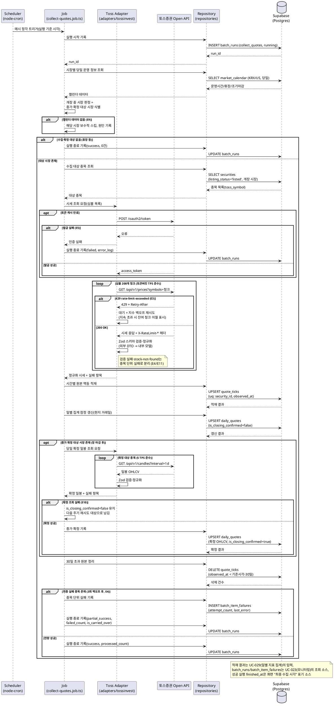

# UC-026: 시세 수집 배치

> 근거: `docs/userflow.md` 026, `docs/prd.md` 6장(수집 범위·주기, 기준 정책), `docs/database.md` §3.4·§3.9·§5, `docs/techstack.md` §4·§8(워커 아키텍처: Scheduler → Job → Adapter/Repository → Supabase), `docs/external/tossinvest-openapi.md`.
> 종목 마스터 전 종목의 시세를 **1시간 1회(시장별 개장 중에만)** 토스증권 Open API에서 수집해 시간별 원본(30일 보존)으로 저장하고, 일별 집계를 갱신하며, 장 마감 후 종가를 확정 기록하는 System 배치다. 사용자 직접 상호작용은 없으며, 실행 결과는 어드민 배치 모니터링(UC-023)에서 조회된다.

---

## 1. Primary Actor

- **System** — 배치 워커(`apps/worker`)의 스케줄러(node-cron)가 매시 정각에 기동하는 `collect-quotes` 잡.
- (간접 이해관계자) **Admin**: 실행 상태·실패 로그를 UC-023에서 조회. **Guest/User**: 적재 결과를 대시보드(UC-010)·기업 상세(UC-020)에서 간접 소비.

## 2. Precondition

> 배치 기능이므로 사용자 조작 전제는 없다. 잡이 의미 있게 동작하기 위한 운영 전제만 기술한다.

- 종목 마스터(`securities`)에 수집 대상 종목이 적재되어 있고, 각 종목에 토스 심볼(`toss_symbol`)이 매핑되어 있다(최초 적재는 UC-031 백필).
- 장 운영시간·휴장일 데이터(`market_calendar`)가 환율·장 운영시간 수집 배치(UC-028)로 당일(각 시장 현지 기준)까지 적재되어 있다.
- 토스증권 Open API 자격 증명(`TOSSINVEST_CLIENT_ID`/`TOSSINVEST_CLIENT_SECRET`)이 워커 환경변수에 설정되어 있다.
- 배치 워커 프로세스가 실행 중이다(MVP는 로컬 `npm run dev:worker`).

## 3. Trigger

- **시간별 스케줄 트리거**: `apps/worker/src/scheduler.ts`의 node-cron이 **매시 정각**(cron `0 * * * *`, 상수 관리)에 `collect-quotes` 잡을 기동한다.
- 수동 재실행 트리거(HTTP/UI)는 MVP 범위 밖이다(UC-023은 조회 전용, 재실행은 2단계).

## 4. Main Scenario

1. 스케줄러가 매시 정각에 `collect-quotes` 잡을 기동하고, 잡은 `batch_runs`에 실행 레코드(`job_type=collect_quotes`, `status=running`, `started_at`)를 기록한다.
2. 잡이 Repository를 통해 `market_calendar`에서 각 시장(KRX/US)의 당일(현지 거래일 기준) 운영 정보를 조회하고, 실행 시각을 `open_at`~`close_at`(절대 시각, 조기 마감·서머타임 반영)과 대조해 **개장 중 시장**을 판정한다.
3. 같은 판정에서 **종가 확정 대상 시장**(당일 장이 이미 마감되었고 `daily_quotes`에 미확정 종가가 남아 있는 시장)도 함께 식별한다.
4. 개장 중 시장도, 확정 대상 시장도 없으면 잡은 수집을 생략하고 `batch_runs`를 `success`(처리 0건)로 종료한다.
5. (수집 스텝) 잡이 Repository로 개장 중 시장 소속의 수집 대상 종목(`securities.listing_status='listed'` 전 종목, 체인 편입 여부 무관)을 조회한다.
6. 토스 어댑터가 액세스 토큰을 확보한다 — 캐시된 토큰이 유효하면 재사용, 만료 시 `POST /oauth2/token`(Client Credentials)으로 재발급.
7. 어댑터가 종목 심볼을 **200개 청크**로 분할해 `GET /api/v1/prices`를 호출한다. 호출은 토큰버킷 레이트리미터가 API 그룹별 TPS와 응답 헤더(`X-RateLimit-Remaining`/`X-RateLimit-Reset`)를 반영해 속도를 동적 조절한다.
8. 어댑터가 각 응답을 Zod 스키마로 검증·정규화(외부 DTO → 내부 시세 모델)한 뒤 잡에 반환한다. 검증 실패·종목 단위 오류는 실패 항목으로 분리한다.
9. 잡이 Repository를 통해 시간별 원본을 `quote_ticks`에 **멱등 적재**한다 — `observed_at`은 실행 기준 시각(정시)으로 정규화하고, `uq(security_id, observed_at)` 제약으로 중복 실행·지연 실행 시에도 이중 적재를 방지한다.
10. 잡이 당일(현지 거래일)의 `daily_quotes`를 **잠정값으로 UPSERT**한다 — 당일 관측 틱 기반 근사(시가=최초 관측, 고가/저가=관측 극값, 종가=최종 관측), `is_closing_confirmed=false`.
11. (종가 확정 스텝) 3단계에서 식별된 확정 대상 시장의 종목에 대해 어댑터가 `GET /api/v1/candles`(`interval=1d`)로 당일 확정 일봉(OHLCV)을 조회하고, 잡이 `daily_quotes`를 확정값으로 UPSERT하며 `is_closing_confirmed=true`로 기록한다.
12. (정리 스텝) 잡이 보존 기간(30일, 상수)을 초과한 `quote_ticks`를 삭제한다.
13. 종목 단위 실패는 **3회 지수 백오프 재시도** 후에도 실패하면 `batch_item_failures`에 기록하고, 다음 정기 주기에 자동 재포함한다(대상 재산정으로 자연 포함 + 미해소 실패 우선 확인).
14. 잡이 `batch_runs`를 종료 기록한다 — 전량 성공 시 `success`, 일부 실패 시 `partial_success`(+`failed_count`), 한도 초과로 잔여 청크를 이월했으면 `is_carried_over=true`. 화면의 "최종 수집 시각"은 성공 실행의 `finished_at`에서 파생 표기한다(UC-009/020).

## 5. Edge Cases

| # | 상황 | 처리 |
|---|---|---|
| E1 | 휴장일/전 시장 폐장(개장 중 시장 0, 확정 대상 0) | `market_calendar.is_trading_day`·운영시간 기준 수집 생략, `success`(0건)로 정상 종료 기록 |
| E2 | 조기 마감(`is_early_close`)/서머타임(미국 DST) | `market_calendar`의 절대 시각(`open_at`/`close_at`, timestamptz)이 이미 반영 → 개장 판정이 자동 조정됨 |
| E3 | API 레이트 리밋 초과(429 `rate-limit-exceeded`) | `Retry-After` 헤더만큼 대기 + 지수 백오프·jitter 재시도. 지속 초과 시 잔여 청크를 다음 실행으로 이월(`is_carried_over=true` 기록) |
| E4 | 종목 단위 실패(`stock-not-found`, 응답 필드 결측, 검증 실패 등) | 종목 단위 3회 지수 백오프 재시도 → 최종 실패는 `batch_item_failures` 기록, 잡은 `partial_success`. 다음 주기 자동 재포함. 결측 일자의 일별 집계는 직전 관측값 이월(carry-forward, UC-029), 화면 폴백은 UC-010/020 소관 |
| E5 | 토큰 발급 실패/만료(`invalid-token`/`expired-token`) | 토큰 1회 재발급 후 재시도. 재발급도 실패하면 잡을 `failed`로 기록하고 오류 로그 저장(다음 정기 주기 재시도) |
| E6 | 신규 상장 종목 | 종목 마스터 등재 시점 이후 주기부터 자동 포함(과거분은 UC-031 백필 소관) |
| E7 | 거래정지(`suspended`)/상장폐지(`delisted`) 종목 | 마스터 상태 기준 수집 대상에서 제외. 기존 시계열은 보존(종목 물리 삭제 금지), 결측 구간은 carry-forward로 집계 |
| E8 | 중복 실행/지연 실행(스케줄 겹침, 워커 재기동 직후) | `observed_at` 정시 정규화 + `uq(security_id, observed_at)`·`uq(security_id, trade_date)` 유니크 제약으로 멱등 적재(동일 시각 중복 방지) |
| E9 | `market_calendar`에 당일 데이터 없음(UC-028 미실행/지연) | 개장 판정 불가 → 해당 시장은 **보수적으로 스킵**하고 원인을 `batch_runs.error_log`에 기록(`partial_success`) |
| E10 | 종가 확정용 일봉 조회 실패(candles 장애) | `is_closing_confirmed=false` 유지 → 화면은 미확정 표기(UC-010/020). 다음 주기의 확정 스텝에서 재시도(확정 대상 판정에 계속 포함) |
| E11 | 외부 응답 스키마 변경/파싱 불가(Zod 검증 실패) | 해당 청크·종목을 실패 처리하고 원문 요약을 실패 로그에 기록. 전량 실패 시 `failed` |
| E12 | 잡 실행 도중 워커 중단(크래시) | `batch_runs`에 `running` 고아 레코드 잔존 → 모니터링(UC-023)에서 식별. 다음 정기 실행은 독립 수행되며 멱등 적재로 중복 없음 |
| E13 | 토스 서버 장애(`internal-error`/`maintenance`) | 지수 백오프 재시도 후 실패분 이월. 서비스 화면은 기존 적재분으로 폴백 동작(구조·재무만으로 동작, PRD 8장) |
| E14 | 시세 재배포 약관 리스크 | 약관 준수 범위 내 저장·노출(출처 "토스증권" 표기). 약관 원문 확인은 키 발급 시 수동 검토(techstack §10 확정 프로세스) |

## 6. Business Rules

### 6.1 수집·적재 규칙

- **BR-1 (배치 전용 연동)**: 토스증권 Open API는 본 배치의 DB 적재 용도로만 호출한다. 클라이언트 화면은 자체 DB(`quote_ticks`/`daily_quotes`)만 읽는다(PRD 전역 정책).
- **BR-2 (개장 중 수집)**: 시세 수집은 시장별 개장 중에만, 1시간 1회 수행한다. 개장 판정은 `market_calendar`(UC-028 적재)의 절대 시각 기준이며 조기 마감·서머타임을 자동 반영한다.
- **BR-3 (전 종목 대상)**: 수집 대상은 종목 마스터 전 종목(체인 편입 여부 무관)이되, `listing_status='listed'`만 포함한다. 거래정지·상장폐지 종목은 제외하고 결측은 carry-forward로 처리한다.
- **BR-4 (원본 30일 보존)**: 시간별 원본(`quote_ticks`)은 30일(상수)만 보존하며, 잡의 정리 스텝이 초과분을 삭제한다. 일별 집계(`daily_quotes`)는 영구 보존한다.
- **BR-5 (일별 집계·종가 확정)**: 일별 집계는 각 시장 **현지 거래일** 기준으로 갱신한다. 장중에는 틱 기반 잠정값(`is_closing_confirmed=false`), 장 마감 후 확정 스텝에서 확정 일봉(OHLCV)으로 대체하고 `is_closing_confirmed=true`를 기록한다. 확정 전 값은 화면에서 "미확정"으로 표기된다(UC-010/020).
- **BR-6 (멱등성)**: 모든 적재는 멱등이다 — `observed_at` 정시 정규화 + `uq(security_id, observed_at)`(틱), `uq(security_id, trade_date)` UPSERT(일별). 중복·지연 실행이 데이터를 오염시키지 않는다.
- **BR-7 (재시도·이월)**: 종목 단위 실패는 3회 지수 백오프(상수) 재시도, 최종 실패는 `batch_item_failures`에 기록 후 다음 정기 주기에 자동 재포함한다. API 일일/초당 한도 초과분은 분할·다음 실행 이월(`is_carried_over`)한다.
- **BR-8 (한도 준수)**: API 그룹별 TPS(prices=MARKET_DATA 10 TPS, candles=MARKET_DATA_CHART 5 TPS, 토큰=AUTH 5 TPS)를 토큰버킷으로 준수하되, 하드코딩이 아닌 응답 헤더(`X-RateLimit-*`) 기반으로 동적 조절한다.
- **BR-9 (모니터링 기록)**: 모든 실행은 시작/종료/상태/처리·실패 건수/이월 여부/오류 로그를 `batch_runs`에 기록한다(UC-023 조회 전용 소스). 워커와 웹은 DB로만 결합한다.
- **BR-10 (최종 수집 시각)**: 화면의 "최종 수집 시각"은 별도 컬럼 없이 성공 실행 `batch_runs.finished_at`에서 파생한다.
- **BR-11 (약관 준수)**: 시세의 저장·노출은 토스증권 이용약관 준수 범위 내로 한정하고, 화면에 출처를 표기한다.

### 6.2 API Specification (잡 트리거·입출력 계약)

> 본 기능은 사용자향 HTTP API가 없는 워커 잡이다. 계약은 **잡 트리거 계약 + 입력 계약(소스) + 출력 계약(적재·기록)**으로 정의한다. 실행 이력 조회 HTTP API(`GET /api/admin/batches`)는 UC-023 소관이다.

#### (1) 잡 트리거 계약

| 항목 | 내용 |
|---|---|
| 잡 식별자 | `batch_job_type = 'collect_quotes'` |
| 실행 주체 | `apps/worker` — `scheduler.ts`(node-cron) → `jobs/collect-quotes.job.ts` |
| 스케줄 | 매시 정각 `0 * * * *` (상수 관리, 조정 가능) |
| 입력 파라미터 | 실행 기준 시각(now) 1개 — 잡 내부에서 정시로 정규화해 `observed_at`으로 사용 |
| HTTP 엔드포인트 | 없음(수동 재실행 API/UI는 MVP 제외 — 2단계) |
| 동시성 | 동일 잡 유형 중복 기동 방지(실행 중 체크 정책) + 멱등 적재로 이중 방어 |

#### (2) 입력 계약 (읽기 소스)

| 소스 | 내용 |
|---|---|
| `securities` | 수집 대상: `listing_status='listed'` 전 종목의 `id`, `toss_symbol`, `market`, `currency` |
| `market_calendar` | 시장별 당일 `is_trading_day`, `open_at`, `close_at`, `is_early_close` → 개장/확정 대상 판정 |
| `daily_quotes` | 확정 대상 판정: 당일 행의 `is_closing_confirmed=false` 여부 |
| `batch_item_failures` | 직전 실행 미해소 실패 종목(재포함 확인용) |
| 토스증권 Open API | `POST /oauth2/token`, `GET /api/v1/prices`, `GET /api/v1/candles` — §6.4 |

#### (3) 출력 계약 (적재·기록)

- **`quote_ticks`** (시간별 원본, 멱등): `security_id`, `observed_at`(정시 정규화), `price`, `volume`, `source='toss'`.
- **`daily_quotes`** (일별 집계, UPSERT): `security_id`, `trade_date`(현지 거래일), `open/high/low/close_price`, `volume`, `is_closing_confirmed`.
- **`batch_runs`** (실행 이력) — 종료 시 레코드 형태:

```json
{
  "job_type": "collect_quotes",
  "status": "success | partial_success | failed",
  "started_at": "2026-07-05T10:00:00+09:00",
  "finished_at": "2026-07-05T10:03:42+09:00",
  "processed_count": 4980,
  "failed_count": 20,
  "is_carried_over": false,
  "error_log": "실패 요약(종목 단위 상세는 batch_item_failures 참조)"
}
```

- **`batch_item_failures`** (종목 단위 실패): `batch_run_id`, `security_id`, `attempt_count`, `last_error`, `is_resolved`.

#### (4) 오류 결과 계약

| 상황 | `batch_runs.status` | 부가 기록 |
|---|---|---|
| 전량 성공(수집 대상 없음 포함) | `success` | 처리 건수(대상 없으면 0) |
| 일부 종목 실패 / 시장 스킵(E9) | `partial_success` | `failed_count`, `batch_item_failures`, `error_log` |
| 한도 초과 이월 발생 | `success`/`partial_success` + `is_carried_over=true` | 이월 사유 로그 |
| 토큰 발급 불가·전량 실패 | `failed` | `error_log`(원인) |

### 6.3 Database Operations

| 테이블 | 작업 | 목적 |
|---|---|---|
| `securities` | SELECT | 수집 대상 종목 조회(`listing_status='listed'`, 개장 중 시장 소속, `toss_symbol` 매핑) |
| `market_calendar` | SELECT | 시장별 당일 개장 여부·운영시간 판정(조기 마감·DST 반영) |
| `quote_ticks` | INSERT (UPSERT) | 시간별 시세 원본 멱등 적재 — `uq(security_id, observed_at)` 충돌 시 중복 방지 |
| `quote_ticks` | DELETE | 보존 기간(30일, 상수) 초과분 정리 스텝 |
| `daily_quotes` | SELECT | 종가 확정 대상 판정(당일 `is_closing_confirmed=false` 행) |
| `daily_quotes` | INSERT/UPDATE (UPSERT) | 일별 집계 잠정 갱신(장중) 및 확정 기록(`is_closing_confirmed=true`, 확정 OHLCV) — `uq(security_id, trade_date)` |
| `batch_runs` | INSERT | 실행 시작 기록(`running`) |
| `batch_runs` | UPDATE | 실행 종료 기록(상태/건수/이월/오류 로그) |
| `batch_item_failures` | SELECT | 미해소 실패 종목 확인(다음 주기 재포함) |
| `batch_item_failures` | INSERT/UPDATE | 종목 단위 최종 실패 기록, 성공 시 `is_resolved` 갱신 |

- 대량 적재는 배열 UPSERT를 청크(1,000~5,000행) 단위로 반복한다(techstack §7). 데이터 접근은 워커 `repositories/`가 캡슐화하며, 잡 로직은 Repository 인터페이스에만 의존한다.

### 6.4 External Service Integration

- **대상**: 토스증권 Open API (`https://openapi.tossinvest.com`) — `docs/external/tossinvest-openapi.md` 참조. 국내(KRX)+미국(US) 시세를 단일 소스로 수집한다.
- **연동 격리**: `adapters/tossinvest/contract.ts`(인터페이스) ↔ `client.ts`(구현)로 분리. 잡은 contract에만 의존해 소스 교체(약관 이슈 등) 시 잡 로직 무변경(techstack §8).

| 용도 | 엔드포인트 | 제약 |
|---|---|---|
| 인증 | `POST /oauth2/token` (Client Credentials) | `AUTH` 그룹 5 TPS. 토큰 캐시 후 만료 시에만 재발급 |
| 시간별 시세 | `GET /api/v1/prices?symbols=...` | `symbols` 콤마 구분 **최대 200개**, `MARKET_DATA` 그룹 10 TPS |
| 확정 일봉(종가 확정) | `GET /api/v1/candles?symbol=&interval=1d` | 종목당 개별 호출, `count` 최대 200, `MARKET_DATA_CHART` 그룹 5 TPS |

- **공통 헤더**: `Authorization: Bearer {access_token}`. 계좌 헤더(`X-Tossinvest-Account`)는 시세 카테고리에 불필요.
- **레이트 리밋 대응**: 응답 헤더 `X-RateLimit-Limit/Remaining/Reset`을 읽어 토큰버킷을 동적 조절, 429 수신 시 `Retry-After`만큼 대기 후 지수 백오프+jitter 재시도.
- **오류 코드 매핑**: `invalid-token`/`expired-token`(401)→토큰 재발급 후 재시도, `stock-not-found`(404)→종목 단위 실패 기록(재시도 무의미), `rate-limit-exceeded`(429)→대기·이월, `internal-error`/`maintenance`(500)→백오프 재시도 후 이월.
- **응답 검증**: 외부 응답은 어댑터에서 Zod 스키마로 런타임 검증 후 내부 모델로 변환한다(외부 계약과 내부 로직 분리).
- **제약 사항**: 전체 종목 덤프 API가 없어 심볼 목록은 자체 종목 마스터(`securities`)가 기준이다. 시가총액 필드는 미제공이므로 시총 계산(종가×상장주식수)은 집계 배치(UC-029) 소관이다.
- **약관 유의**: 시세 재배포·상업적 활용 제한 조항 존재 — 저장·노출은 약관 준수 범위 내로 한정하고 키 발급 시 원문을 수동 확인한다(techstack §10 확정 프로세스).

## 7. Sequence Diagram

> 워커 계층은 techstack §4의 배치 아키텍처(Scheduler → Job → Adapter/Repository → Supabase)를 따른다(웹의 Hono route → service → repository에 대응하는 워커 측 계층). 외부 서비스(토스증권 Open API)는 별도 participant로 표기한다.



## 8. 관련 유스케이스

- **UC-028 환율·장 운영시간 수집 배치**: 개장 판정 입력(`market_calendar`)의 공급자. 당일 데이터 미존재 시 본 배치는 보수적 스킵(E9).
- **UC-029 일별 체인 지표 사전 집계 배치**: 본 배치가 적재한 `daily_quotes`(확정 종가)를 시가총액 계산 입력으로 소비. 결측 일자 carry-forward 집계도 UC-029 규칙.
- **UC-031 최초 전 종목 과거 데이터 백필 배치**: 과거 일봉의 최초 공급. 본 배치는 백필 완료 이후의 증분 수집을 담당(동시 실행 충돌 방지는 UC-031 정책).
- **UC-023 배치 작업 모니터링 조회**: `batch_runs`/`batch_item_failures` 기록의 조회 화면(조회 전용).
- **UC-010 대시보드 / UC-020 기업 상세**: 적재 데이터의 최종 소비처. 시세 미수집·미확정 시 폴백·미확정 표기는 해당 유스케이스 소관.
