# Plan: UC-027 재무/공시/기업정보 수집 배치 (collect-financials)

> 근거: `docs/usecases/027/spec.md`, `docs/usecases/000_decisions.md`(H-5·H-7·H-10·C-3), `docs/techstack.md` §2·§4·§6·§7·§8·§9,
> `docs/database.md` §3.2·§3.5·§3.8·§3.9·§5, `supabase/migrations/0003_securities_master.sql`·`0008_fundamentals.sql`·`0011_disclosures_llm.sql`·`0012_batch_runs.sql`,
> `docs/external/opendart.md`(§3~§9)·`docs/external/sec-edgar-api.md`(§3~§10)·`docs/external/tossinvest-openapi.md`(§4·§6·§8),
> `docs/usecases/026/plan.md`(워커 공통 골격 — 본 plan은 이를 **재정의 없이 참조·확장**한다).
>
> - 사용자향 HTTP API·화면이 없는 **System 배치**다. Presentation 모듈은 없으며, 실행 결과 조회는 UC-023(웹) 소관이다.
> - 워커 공통 골격(패키지 골격·config·supabase 팩토리·rate-limiter·retry·job-lock·batch-log·batch.repository·scheduler)은
>   **UC-026 plan 모듈 1~8이 SOT**다. 본 plan은 그 확장 지점(설정 키 추가, 리포지토리 메서드 추가, cron 행 추가)만 정의한다.
> - DB 스키마(`securities`/`company_profiles`/`quarterly_financials`/`shares_outstanding`/`disclosures`/`batch_runs`/`batch_item_failures`/`batch_checkpoints`)는
>   0003·0008·0011·0012 마이그레이션으로 이미 존재한다. 신규 마이그레이션은 **재무 UPSERT RPC 함수 1건**뿐이다(테이블 변경 없음).
>   `quarterly_financials`의 유니크 키가 **부분 유니크 인덱스**(`WHERE period_type='quarter'`/`'annual'`)라서 PostgREST(`supabase-js upsert onConflict`)로는
>   충돌 대상을 지정할 수 없으므로 RPC가 필수다. 파일 번호는 `0014`를 기본으로 하되 선점 시 다음 빈 번호로 민다(026 plan과 동일 규칙).
> - 외부 연동은 **OpenDART / SEC EDGAR / 토스증권 Open API** 3건이다. techstack §8에 따라 각각
>   `adapters/<provider>/contract.ts`(계약)+`dto.ts`(외부 Zod 스키마)+`client.ts`(구현)로 격리하고, 잡은 contract에만 의존한다.
>   토스 어댑터는 026이 만든 파일에 `getStockInfos` 메서드만 추가한다(026 plan 모듈 11이 예고한 확장 지점).
>
> ### spec Open Questions에 대한 본 plan의 결정 (000_decisions.md 미기재분 — 구현 차단 해소용)
>
> | # | 사안 | 결정 | 근거 |
> |---|---|---|---|
> | OQ-1 | 기업개황(company.json) 갱신 전략 | **증분 갱신**: `company_profiles` 행이 없는 종목 + `corpCode.xml`의 `modify_date`가 `last_collected_at` 일자 이후인 종목만 호출 | BR-4 호출 최소화. 매일 전량(약 2,600콜)은 일일 한도 낭비. 스키마 변경 없이 판정 가능 |
> | OQ-2 | 공시 저장 범위 | KRX: `pblntf_ty` 생략(전체 유형) + `stock_code` 보유 상장 법인만 저장. US: form 화이트리스트 상수(`10-K`,`10-Q`,`8-K`,`20-F`,`40-F`,`6-K` + `/A` 정정 변형) | 국내는 사후 필터가 호출 절약에 유리(opendart.md §3.1). 미국은 전체 form 저장 시 노이즈 과다 — 상수로 관리해 정책 변경 여지 유지(BR-12와 동일 원칙) |
> | OQ-3 | 국내 2Q 매출 산출 | **차감 규칙 유지**(2Q=반기 누적−1Q, `derived_from_cumulative`) — spec BR-10·DB 코멘트 그대로. 단 1Q 값 결측으로 차감 불가 시 반기보고서 원천 3개월치(`thstrm_amount`)를 폴백으로 채택(`three_month` 기록) | spec 본문 우선. `amount_basis`가 행 단위로 산출 방식을 보존하므로 폴백 혼용에도 정합 |
> | OQ-4 | 토스 상장주식수 소속 배치 | **027 유지** (spec·database.md §5 기재대로) | 026은 시세 전용(quote_ticks/daily_quotes까지). `shares_outstanding` 적재 주체를 027 하나로 단일화 |
> | OQ-5 | 재무 정정 → 029 전달 방식 | RPC(`fn_upsert_quarterly_financials`)가 **값이 실제로 변한 행만 UPDATE**(`IS DISTINCT FROM` 가드) → `updated_at`이 "실제 정정 시각"이 됨. 029는 자신의 직전 성공 실행 이후 `updated_at`이 갱신된 행의 `(security_id, calendar_year, calendar_quarter)`를 영향 기간으로 재계산 | 별도 이벤트 테이블 없이 기존 `updated_at` 트리거로 완결(최소 인프라). 029 plan이 조회 측 계약을 소비 |
>
> ### 그 외 plan 수준 설계 결정
>
> - **실행 시각**: `COLLECT_FINANCIALS_CRON = '0 19 * * *'`, 타임존 `Asia/Seoul`(상수). 근거: KRX 당일 공시 접수 마감(18시) 이후 + SEC 벌크 재생성(~03:00 ET ≈ 16~17시 KST) 이후 + US 장 마감과 무관(벌크는 전 영업일분).
> - **공시 조회 윈도우**: `bgn_de = 당일−1, end_de = 당일`(KST, `DISCLOSURE_LOOKBACK_DAYS=1` 상수). 전일 19시 이후 접수분 누락 방지 — 멱등 UPSERT라 중복 무해.
> - **잡 중복 실행 방지**: 026의 인메모리 job-lock(1차) + spec Main 1의 **DB `batch_runs.status=running` 검사(2차)**를 병용. 크래시 고아 행으로 영구 스킵되지 않도록 `started_at`이 `BATCH_STALE_RUNNING_HOURS(=24h)` 초과한 running 행은 무시(경고 로그).
> - **SEC 상장주식수 폴백 체인의 1차 소스는 companyfacts 벌크**: `dei`/`us-gaap` facts는 companyfacts에 그대로 들어있어(sec-edgar-api.md §4.3·§5.3) 종목당 최대 4회의 `companyconcept` 개별 호출 없이 동일 판정이 가능하다(BR-4 "벌크 우선"). `companyconcept`(404=폴백 신호, E11)는 어댑터에 구현하되 **벌크에 엔트리가 없는 CIK의 보완 경로**로만 사용한다.
> - **토스 상장주식수 적재 규칙**: 토스 응답에는 기준일이 없으므로 `as_of_date=실행일(KST)`. 종목별 최신 toss 행과 값이 같으면 스킵(변경 시에만 새 행) — `shares_outstanding`을 "변경 이력"으로 유지해 일일 중복 행 팽창 방지(C-4의 min~max 표기와 정합).
> - **corpCode.xml XML 파싱**: 워커에 `fast-xml-parser`를 추가한다(zero-dep·고채택·활발 유지보수 — techstack 설계 원칙 1·2로 유추, techstack §1 표에 없는 신규 의존성이므로 구현 시 techstack.md에 행 추가). ZIP 해제는 기존 `yauzl` 재사용.
> - **KRX 회계 기간 산출**: `(bsns_year, reprt_code)` → 기간 시작·종료일은 12월 결산 가정 순수 함수로 산출하되, 응답에 기간 문자열(`thstrm_dt` 등)이 있으면 우선 파싱해 사용(비 12월 결산 대응). 실 응답 필드는 실호출 검증 항목으로 명시.

---

## 개요

### 공통(shared) 모듈 — UC-026 plan이 정의, 본 plan은 참조·확장만

| 모듈 | 위치 | 본 plan에서의 사용/확장 |
| --- | --- | --- |
| 워커 패키지 골격 | `apps/worker/package.json` 등 | **확장**: deps에 `yauzl`(techstack §1 기지정)·`fast-xml-parser`(신규) 추가 |
| 워커 환경설정 | `apps/worker/src/runtime/config.ts` | **확장**: `OPENDART_API_KEY`(40자)·`SEC_EDGAR_USER_AGENT`(이메일 포함 검증)·`WORKER_TMP_DIR`(선택, 기본 `os.tmpdir()`) 키 추가 |
| Supabase 팩토리 / rate-limiter / retry / job-lock | `apps/worker/src/runtime/*` | 그대로 재사용. rate-limiter에 `OPENDART`·`SEC` 그룹 추가 주입 |
| 배치 기록기·리포지토리 | `runtime/batch-log.ts`, `repositories/batch.repository.ts` | **확장**: `findRunningRun(client, jobType)` 메서드 추가(E16 DB 검사) |
| 스케줄러 진입점 | `apps/worker/src/scheduler.ts` | **확장**: `cron.schedule(COLLECT_FINANCIALS_CRON, ...)` 행 + 030 연쇄 트리거 훅 배선 |
| 배치 상수 | `packages/domain/constants/batch.ts` | **확장**: `COLLECT_FINANCIALS_CRON`, `BATCH_TIMEZONE='Asia/Seoul'`, `BATCH_STALE_RUNNING_HOURS`, `DART_MULTI_ACNT_CHUNK_SIZE=100`, `DISCLOSURE_LOOKBACK_DAYS=1` |
| 시장 상수 | `packages/domain/constants/markets.ts` | 그대로 재사용(`MARKETS`, `MARKET_TIMEZONES`) |
| 토스 어댑터 | `apps/worker/src/adapters/tossinvest/*` | **확장**: `getStockInfos(symbols)` 메서드·DTO 추가(026 plan 모듈 11이 예고한 지점) |

### 공통(shared) 모듈 — 본 plan에서 최초 정의 (UC-029/030/031 재사용)

| 모듈 | 위치 | 설명 |
| --- | --- | --- |
| 재무 도메인 상수 | `packages/domain/constants/financials.ts` | `FINANCIALS_MIN_FISCAL_YEAR=2015`, `DART_REPORT_CODES`, `DART_ACCOUNT_MAP`(계정→지표 매핑), `US_REVENUE_TAG_CHAIN`(us-gaap 5종+ifrs-full), `SEC_SHARES_TAG_CHAIN`(3단계), `US_DISCLOSURE_FORMS`, `QUARTER_PERIOD_DAYS=[75,100]`, `ANNUAL_PERIOD_DAYS=[340,390]` — BR-12 "태그 체인 상수화" SOT. UC-031(백필)이 동일 상수 공유 |
| 역년 정규화 계산 | `packages/domain/calculations/fiscal-calendar.ts` | 순수 함수: 기간 시작·종료일 → `calendar_year`/`calendar_quarter`(중앙일 규칙), 기간 길이 검증(스텁 판정), 분기 연속성 검증 — BR-13·BR-14. KRX/US 양쪽과 UC-029·031이 공유(DRY) |
| 국내 분기 정규화 | `packages/domain/calculations/krx-financials.ts` | 순수 함수: 보고서별 (3개월치/누적) 계정값 → 분기·연간 행 도출(1Q·3Q 원천/2Q·4Q 차감, `amount_basis` 기록), `resolveDartTargetReports(today)`(수집 대상 보고서 주기 판정), `(bsns_year, reprt_code)`→기간 산출 — BR-10·BR-11·BR-16. UC-031 백필과 공유 |
| 미국 재무 정규화 | `packages/domain/calculations/us-financials.ts` | 순수 함수: companyfacts facts → 매출 태그 폴백·`(fy,start,end)` 중복 제거·기간 검증·Q4 파생·20-F 연간 전용 판정·미매핑 플래그, 상장주식수 태그 폴백 체인 평가 — BR-12~15, E3·E11~E14. UC-031 백필과 공유 |
| 체크포인트 리포지토리 | `apps/worker/src/repositories/checkpoints.repository.ts` | `batch_checkpoints` SELECT/UPSERT 캡슐화 — 이월 커서(E1)·SEC Last-Modified 저장. UC-031(백필 재개)과 공유 |

### 기능(collect-financials) 모듈

| 모듈 | 위치 | 설명 |
| --- | --- | --- |
| OpenDART 어댑터 계약 | `apps/worker/src/adapters/opendart/contract.ts` | `OpenDartPort` 인터페이스 + 내부 정규화 모델(`CorpCodeMapping`, `NormalizedKrxDisclosure`, `KrxAccountSet`, `KrxStockTotal`, `KrxCompanyProfile`) + 오류 타입(`DartQuotaExceededError` 등) |
| OpenDART 외부 DTO | `apps/worker/src/adapters/opendart/dto.ts` | 응답 Zod 스키마(공통 envelope `status`/`message`, list.json·fnlttMultiAcnt·fnlttSinglAcntAll·stockTotqySttus·company.json, CORPCODE.xml 파싱 결과) + DTO→내부 모델 변환 순수 함수 |
| OpenDART 어댑터 구현 | `apps/worker/src/adapters/opendart/client.ts` | ZIP 다운로드·XML 파싱, 페이지네이션, 100사 청크, CFS→OFS 폴백, `status` 판별·오류 매핑, 레이트리밋·재시도 |
| SEC EDGAR 어댑터 계약 | `apps/worker/src/adapters/sec-edgar/contract.ts` | `SecEdgarPort` 인터페이스 + 내부 모델(`SecBulkKind`, `SecSubmissionsEntry`, `SecCompanyFactsEntry`, `SecConceptResult`) + 오류 타입(`SecBlockedError` 등) |
| SEC EDGAR 외부 DTO | `apps/worker/src/adapters/sec-edgar/dto.ts` | submissions/companyfacts/companyconcept Zod 스키마(필수 최소 필드만 엄격, passthrough) + CIK 정규화 유틸 |
| SEC EDGAR 어댑터 구현 | `apps/worker/src/adapters/sec-edgar/client.ts` | `Last-Modified` 조건부 확인, 벌크 ZIP 스트리밍 다운로드+yauzl 선택 추출, companyconcept(404=null), User-Agent 필수 주입, 토큰버킷·차단 백오프 |
| 토스 어댑터 확장 | `apps/worker/src/adapters/tossinvest/{contract,dto,client}.ts` (수정) | `getStockInfos(symbols)` — 200개 청크 `GET /api/v1/stocks`, `sharesOutstanding` 추출(STOCK 그룹 5TPS) |
| 종목 리포지토리 확장 | `apps/worker/src/repositories/securities.repository.ts` (수정) | 전 종목 로드(매핑·상태 포함), `dart_corp_code` 일괄 갱신, `shares_manual_override_needed` 플래그 설정 |
| 재무 리포지토리 | `apps/worker/src/repositories/financials.repository.ts` | `fn_upsert_quarterly_financials` RPC 청크 호출, 기존 (year,quarter) 적재 여부 조회(폴백 판정용) |
| 공시 리포지토리 | `apps/worker/src/repositories/disclosures.repository.ts` | `disclosures` 청크 UPSERT(`onConflict:'source,external_id'`) — E5 멱등 |
| 기업정보 리포지토리 | `apps/worker/src/repositories/company-profiles.repository.ts` | `company_profiles` UPSERT(+`last_collected_at`), 증분 갱신 대상 판정 조회(OQ-1) |
| 상장주식수 리포지토리 | `apps/worker/src/repositories/shares.repository.ts` | 소스별 최신 행 조회, 변경분만 UPSERT(`onConflict:'security_id,as_of_date,source'`) |
| 재무 UPSERT RPC | `supabase/migrations/0014_fn_upsert_quarterly_financials.sql` | 부분 유니크 인덱스 대응 + `IS DISTINCT FROM` 변경 감지 UPSERT 함수(OQ-5·BR-18) |
| 재무 수집 잡 | `apps/worker/src/jobs/collect-financials.job.ts` | 오케스트레이터: Main Scenario 1~17을 스텝 함수로 분해. 전 의존성(포트 3종·리포지토리·batch-log·clock) 주입형 |

### 범위 밖 (다른 plan 소관)

- 시세·환율·장 운영시간 수집: UC-026/028. 시총 계산·집계: UC-029(본 잡은 원천 적재까지만).
- LLM 공시 분석(`analyze-disclosures`): UC-030 — 본 plan은 연쇄 트리거 **훅 지점**만 정의(030 잡 미구현 시 no-op).
- 과거 데이터 백필·종목 마스터 시드(H-5)·과거 공시 1년 소급(H-10): UC-031. 본 잡은 증분만 담당하며, 백필과의 동시 실행 충돌 방지는 H-7(백필 측이 정기 시간대 일시 정지) — 본 잡에 방어 로직을 추가하지 않는다(026과 동일).
- 배치 실행 이력 조회 화면/API: UC-023(웹). 수동 재실행 트리거: MVP 제외(spec 3장).
- 어드민의 `shares_manual_override_needed` 수동 보정 UI: 2단계(본 잡은 플래그 설정까지만).

---

## Diagram

```mermaid
graph TD
    subgraph Scheduler["Caller (apps/worker)"]
        SCH["scheduler.ts<br/>cron '0 19 * * *' Asia/Seoul ★공통 확장"]
        LOCK["runtime/job-lock.ts ★공통"]
        SCH --> LOCK
    end

    subgraph Job["Business Logic"]
        JOB["jobs/collect-financials.job.ts<br/>(오케스트레이터: KRX→US→Toss 스텝)"]
        CHAIN["연쇄 트리거 훅<br/>→ analyze-disclosures(030)"]
        JOB --> CHAIN
    end

    subgraph Domain["packages/domain ★공통(순수)"]
        FC["constants/financials.ts<br/>태그 체인·계정 매핑·기간 상수"]
        CAL["calculations/fiscal-calendar.ts<br/>역년 축·기간 검증"]
        KRX["calculations/krx-financials.ts<br/>분기 정규화·보고서 주기"]
        USF["calculations/us-financials.ts<br/>태그 폴백·Q4 파생·주식수 체인"]
    end

    subgraph Adapters["외부연동 (Contract/Caller 분리)"]
        DCT["opendart/contract.ts"] -.구현.- DCL["opendart/client.ts"]
        DCL --> DDTO["opendart/dto.ts"]
        SCT["sec-edgar/contract.ts"] -.구현.- SCL["sec-edgar/client.ts"]
        SCL --> SDTO["sec-edgar/dto.ts"]
        TCT["tossinvest/contract.ts ★확장"] -.구현.- TCL["tossinvest/client.ts ★확장"]
        RL["runtime/rate-limiter.ts ★공통<br/>(OPENDART/SEC/STOCK 그룹)"]
        RT["runtime/retry.ts ★공통"]
        DCL --> RL & RT
        SCL --> RL & RT
        TCL --> RL & RT
    end

    subgraph Persistence["Persistence (repositories)"]
        RSEC["securities.repository ★확장"]
        RFIN["financials.repository"]
        RDIS["disclosures.repository"]
        RPRO["company-profiles.repository"]
        RSHR["shares.repository"]
        RCHK["checkpoints.repository ★공통 신규"]
        RB["batch.repository ★확장<br/>(findRunningRun)"]
        BL["runtime/batch-log.ts ★공통"] --> RB
    end

    DART["OpenDART API"]
    SEC["SEC EDGAR<br/>(벌크 ZIP + data.sec.gov)"]
    TOSS["토스증권 Open API<br/>(/api/v1/stocks)"]
    RPC["fn_upsert_quarterly_financials()<br/>(마이그레이션 0014)"]
    DB[("Supabase Postgres<br/>securities / company_profiles /<br/>quarterly_financials / disclosures /<br/>shares_outstanding / batch_runs /<br/>batch_item_failures / batch_checkpoints")]

    SCH -->|"1일 1회 트리거"| JOB
    JOB --> FC & CAL & KRX & USF
    JOB -->|"인터페이스만 의존"| DCT & SCT & TCT
    DCL -->|"HTTPS crtfc_key"| DART
    SCL -->|"HTTPS User-Agent 필수"| SEC
    TCL -->|"HTTPS Bearer"| TOSS
    JOB --> BL & RSEC & RFIN & RDIS & RPRO & RSHR & RCHK
    RFIN -->|"client.rpc()"| RPC --> DB
    RSEC & RDIS & RPRO & RSHR & RCHK & RB --> DB
```

데이터 흐름: Scheduler → Job(비즈니스 로직) → Adapter(외부)·Repository(퍼시스턴스) → Supabase. 잡은 contract·리포지토리 시그니처·domain 순수 함수에만 의존하고 HTTP·SQL·파싱 문법을 알지 못한다(techstack §4 계층 분리 매핑).

---

## Implementation Plan

### 1. 도메인 — 재무 상수 (`packages/domain/constants/financials.ts`, `constants/batch.ts` 확장)

- 구현 내용:
  1. `financials.ts` (프레임워크·DB 의존성 없음, UC-029/030/031 공유 SOT):
     - `FINANCIALS_MIN_FISCAL_YEAR = 2015` (BR-16, DB CHECK와 일치).
     - `DART_REPORT_CODES = { Q1:'11013', HALF:'11012', Q3:'11014', ANNUAL:'11011' } as const` + 보고서별 제출 기한 오프셋 상수(분·반기 45일, 사업보고서 90일 — `resolveDartTargetReports` 입력).
     - `DART_ACCOUNT_MAP`: 계정 → 지표 매핑(우선순위 배열). `revenue: [{accountId:'ifrs-full_Revenue'}, {accountNm:['매출액','수익(매출액)','영업수익']}]`, `operating_income: [{accountId:'dart_OperatingIncomeLoss'}, {accountNm:['영업이익','영업이익(손실)']}]`, `net_income: [{accountId:'ifrs-full_ProfitLoss'}, {accountNm:['당기순이익','당기순이익(손실)']}]` — account_id 우선, 계정명 폴백(실호출 검증 후 항목 보강 전제).
     - `US_REVENUE_TAG_CHAIN`(BR-12 순서 그대로): `['us-gaap:RevenueFromContractWithCustomerExcludingAssessedTax', 'us-gaap:RevenueFromContractWithCustomerIncludingAssessedTax', 'us-gaap:Revenues', 'us-gaap:SalesRevenueNet', 'us-gaap:SalesRevenueGoodsNet', 'us-gaap:SalesRevenueServicesNet', 'ifrs-full:Revenue']`.
     - `SEC_SHARES_TAG_CHAIN`(E12 폴백 순서): `[{tag:'dei:EntityCommonStockSharesOutstanding', partial:false}, {tag:'us-gaap:CommonStockSharesOutstanding', partial:true}, {tag:'us-gaap:WeightedAverageNumberOfSharesOutstandingBasic', partial:true}]` — `partial`은 `is_multi_class_partial` 저장값.
     - `US_DISCLOSURE_FORMS = ['10-K','10-Q','8-K','20-F','40-F','6-K']`(OQ-2, `/A` 접미 정정 포함 매칭 규칙 주석).
     - `QUARTER_PERIOD_DAYS = { min:75, max:100 }`, `ANNUAL_PERIOD_DAYS = { min:340, max:390 }` (E14, sec-edgar-api.md §8.4).
  2. `batch.ts` 확장(026 정의 파일에 상수 행 추가): `COLLECT_FINANCIALS_CRON = '0 19 * * *'`, `BATCH_TIMEZONE = 'Asia/Seoul'`, `BATCH_STALE_RUNNING_HOURS = 24`, `DART_MULTI_ACNT_CHUNK_SIZE = 100`, `DISCLOSURE_LOOKBACK_DAYS = 1`, `DART_PAGE_COUNT = 100`, `SEC_BULK_KINDS = ['submissions','companyfacts']`.
- 의존성: 없음(026 `batch.ts`와 파일 공유 — 심볼 충돌 없음 확인).
- **Unit Tests**:
  - [ ] `US_REVENUE_TAG_CHAIN`의 첫 항목이 `ExcludingAssessedTax`, 마지막이 `ifrs-full:Revenue`다(폴백 순서 가드)
  - [ ] `SEC_SHARES_TAG_CHAIN` 1단계만 `partial:false`다
  - [ ] `DART_MULTI_ACNT_CHUNK_SIZE ≤ 100`(외부 계약 상한 — status 021 방지 가드)
  - [ ] `FINANCIALS_MIN_FISCAL_YEAR = 2015`(DB CHECK와 불일치 시 컴파일 타임에 잡히도록 리터럴 고정)

### 2. 도메인 — 역년 정규화 계산 (`packages/domain/calculations/fiscal-calendar.ts`)

- 구현 내용(전부 순수 함수, date-fns만 사용):
  1. `resolveCalendarPeriod(start: string, end: string): { calendarYear: number; calendarQuarter: 1|2|3|4 }` — 기간 **중앙일(midpoint)** 이 속한 역년 분기(BR-14). Apple 회계 1Q(9/28~12/27) → 중앙일 11월 → `CY2025 Q4`처럼 결산월 상이 기업을 동일 축으로 정렬. 연간 기간 입력 시 `calendarYear`만 의미(호출 측이 quarter를 NULL 처리).
  2. `validatePeriodLength(start, end, kind: 'quarter'|'annual'): boolean` — `QUARTER_PERIOD_DAYS`/`ANNUAL_PERIOD_DAYS` 범위 검증(E14 스텁 기간 검출).
  3. `arePeriodsContiguous(periods: Array<{start,end}>): boolean` — 겹침 없이 연속인지(BR-13 Q4 파생 전 검증).
- 의존성: 모듈 1.
- **Unit Tests**:
  - [ ] `resolveCalendarPeriod('2025-09-28','2025-12-27')` = `{2025, 4}` (Apple 회계 1Q → 역년 4Q, sec-edgar-api.md §8.2 실측 케이스)
  - [ ] `resolveCalendarPeriod('2026-01-01','2026-03-31')` = `{2026, 1}` (역년 결산 기업 불변)
  - [ ] 51일 스텁 기간(`2025-02-08`~`2025-03-31`) → `validatePeriodLength(quarter)=false` (E14, Bally's 실측 케이스)
  - [ ] 340~390일 범위 밖 연간 기간(예: 300일) → `false`
  - [ ] Q1~Q3 기간이 1일 겹치면 `arePeriodsContiguous=false`, 정상 연속이면 `true`

### 3. 도메인 — 국내 분기 정규화 (`packages/domain/calculations/krx-financials.ts`)

- 구현 내용(순수 함수):
  1. `resolveDartTargetReports(today: Date): Array<{ bsnsYear: number; reprtCode: DartReportCode }>` — 오늘 날짜 기준 "제출 윈도우가 열려 있거나 최근 마감된" 보고서 목록(12월 결산 기준: 4~5월=1Q(11013)+직전 사업보고서(11011), 8~9월=반기, 11~12월=3Q, 1~3월=전년 사업보고서 등). 판정 경계는 모듈 1 제출 기한 상수 사용. 시즌 밖에는 직전 보고서 1건만 반환(정정 재확인용).
  2. `normalizeKrxQuarters(input): KrxQuarterRow[]` — 입력: 종목의 회계연도별 지표당 `{ q1?: {threeMonth?, cumulative?}, half?: {...}, q3?: {...}, annual?: {...} }` + 기간 정보. 출력: `quarterly_financials` 행 모델(분기 4행 + 연간 1행, 산출 가능한 것만):
     - 1Q: `threeMonth ?? cumulative`(동일 기간) → `amount_basis='three_month'`.
     - 2Q: `half.cumulative − q1.cumulative` → `derived_from_cumulative`; 1Q 결측 시 `half.threeMonth` 폴백 → `three_month`(OQ-3).
     - 3Q: `q3.threeMonth` → `three_month`; 결측 시 `q3.cumulative − half.cumulative` → `derived_from_cumulative`.
     - 4Q: `annual − q3.cumulative` → `derived_from_cumulative`; `q3.cumulative` 결측 시 미산출(E4 결측 허용).
     - 연간: `annual` 값 그대로 `period_type='annual'` 행(`fiscal_quarter`/`amount_basis` NULL).
     - `fiscal_year < FINANCIALS_MIN_FISCAL_YEAR` 입력은 결과에서 제외(E2 — DB CHECK는 최종 방어).
  3. `resolveKrxPeriod(bsnsYear, reprtCode, fiscalYearEndMonth=12): { start, end }` — 회계 기간 산출(응답의 기간 문자열이 파싱되면 그것을 우선 사용, 어댑터 정규화 단계에서 주입). `calendar_*` 축은 모듈 2 `resolveCalendarPeriod`로 산출.
- 의존성: 모듈 1, 2.
- **Unit Tests**:
  - [ ] 매출 1Q=100(3개월), 반기누적=250, 3Q 3개월=180(누적 430), 연간=600 → 2Q=150(`derived`), 3Q=180(`three_month`), 4Q=170(`derived`), 연간 행 600
  - [ ] 1Q 결측 + 반기 3개월치 존재 → 2Q가 원천 3개월치로 채워지고 `three_month` 기록(OQ-3 폴백)
  - [ ] 3Q 누적 결측 시 4Q 미산출(행 없음), 나머지 분기는 정상 산출(E4)
  - [ ] `fiscal_year=2014` 입력 → 출력에서 제외(E2)
  - [ ] 음수 이익(영업손실) 입력에서도 차감식이 그대로 동작(부호 보존)
  - [ ] `resolveDartTargetReports(2026-05-15)` → 1Q(11013, 2026) + 사업보고서(11011, 2025) 포함
  - [ ] `resolveDartTargetReports(2026-02-01)` → 전년 3Q 또는 사업보고서 윈도우 판정(경계값 검증)
  - [ ] 12월 결산 `resolveKrxPeriod(2026, '11012')` = 4/1~6/30 (반기보고서의 당기 3개월 구간)

### 4. 도메인 — 미국 재무 정규화 (`packages/domain/calculations/us-financials.ts`)

- 구현 내용(순수 함수 — companyfacts JSON의 `facts` 서브트리를 입력으로 받음):
  1. `pickRevenueFacts(facts, chain=US_REVENUE_TAG_CHAIN)`: 체인 순회로 태그별 USD unit facts 수집 → `(fy, start, end)` 키 중복 제거(재수록분은 `filed` 최신 값 채택 — sec-edgar-api.md §8.3) → `validatePeriodLength` 통과분만 채택, 위반분은 `stubPeriods[]`로 분리(E14). 채택 태그를 `revenue_source_tag`로 반환. **전 태그 실패 시 `{ unmapped: true }`**(E3).
  2. `buildUsQuarterRows(revenueFacts, opIncomeFacts?, netIncomeFacts?)`:
     - 분기 facts(기간 75~100일)와 연간 facts(340~390일)를 분리.
     - 분기 행: `three_month`, 역년 축은 `fp` 라벨이 아닌 `start`/`end`로 모듈 2 재계산(BR-14).
     - Q4 파생: 회계연도별 `FY − (Q1+Q2+Q3)`. 파생 전 3개 분기의 `arePeriodsContiguous` + FY 기간과의 정합 검증, 실패 시 파생 생략(E14).
     - **20-F(IFRS) 연간 전용 판정**: 분기 facts가 0건이고 연간 facts만 존재 → `period_type='annual'` 행만 생성(BR-15, E13). Q4 파생 로직 미적용.
     - 순이익/영업이익 태그: `us-gaap:NetIncomeLoss`, `us-gaap:OperatingIncomeLoss`(+ ifrs-full 대응) — 매출과 동일 파이프라인, 폴백 실패 시 해당 지표만 NULL(매출 미매핑 플래그와 별개).
  3. `pickSharesOutstanding(facts, chain=SEC_SHARES_TAG_CHAIN)`: 체인 순회 — 태그 존재(`facts.dei[...]`/`facts['us-gaap'][...]`) 시 `shares` unit의 최신 `end` fact 채택, `{ shares, asOfDate, sourceTag, isPartial }` 반환. `val: 0` 등 비정상값은 스킵하고 다음 태그로(Berkshire 실측 케이스). **전 단계 실패 시 `null`**(E12 → 잡이 `shares_manual_override_needed` 설정).
  4. `isAnnualOnlyFiler(recentForms: string[]): boolean` — 최근 form에 10-Q 없이 20-F/40-F만 존재하는지(연간 전용 보조 판정).
- 의존성: 모듈 1, 2.
- **Unit Tests**:
  - [ ] Apple형 입력(태그 3종 시대별 분포) → 체인이 이어 붙여 전 기간 커버, 전환기 중복 `(fy,start,end)` 1건만 남음
  - [ ] 동일 `(fy,fp)`에 `filed`가 다른 2건(재수록) → 최신 `filed` 값 채택(§8.3 실측 케이스)
  - [ ] FY=600, Q1=100·Q2=150·Q3=180 → Q4=170, `amount_basis='derived_from_cumulative'`, 역년 축은 end 날짜 기준
  - [ ] 분기 중 51일 스텁 혼입 → 해당 분기 제외 + Q4 파생 생략(E14)
  - [ ] 분기 facts 0건 + 연간만 존재(Alibaba형) → annual 행만 반환(E13)
  - [ ] 전 태그 404 상당(부재) → `unmapped: true`(E3 → `is_revenue_tag_unmapped` 저장 입력)
  - [ ] shares: dei 부재 + us-gaap:CommonStockSharesOutstanding 존재(Alphabet형) → 2단계 채택 + `isPartial=true`
  - [ ] shares: dei에 `val:0` 포함(Berkshire형) → 0 스킵 후 다음 태그 평가
  - [ ] shares: 3단계 전부 부재(Meta형 가정) → `null`(E12)

### 5. 공통 확장 — 워커 설정·배치 리포지토리 (`runtime/config.ts`, `repositories/batch.repository.ts`, `repositories/checkpoints.repository.ts`)

- 구현 내용:
  1. `config.ts` zod 스키마에 추가(026 모듈 2 확장): `OPENDART_API_KEY`(length 40), `SEC_EDGAR_USER_AGENT`(공백 포함 + `@` 포함 — "서비스명 이메일" 형식 검증, E7의 기동 시점 조기 실패), `WORKER_TMP_DIR`(optional, 기본 `os.tmpdir()`). 키 누락 시 프로세스 기동 실패(잡 도중 실패보다 안전 — 026과 동일 철학).
  2. `batch.repository.ts`에 `findRunningRun(client, jobType): { id, startedAt } | null` 추가 — `status='running'` 최신 1건(E16 2차 방어 입력). `batch-log.ts` 파사드에 `isRunning(jobType, staleHours)` 노출(스테일 판정 포함).
  3. `checkpoints.repository.ts` 신규(UC-031 공유):
     - `getCheckpoint(client, jobType, key): { cursor: Json, isCompleted } | null`
     - `upsertCheckpoint(client, jobType, key, cursor, isCompleted)` — `onConflict:'job_type,checkpoint_key'`
     - `completeCheckpoint(client, jobType, key)` — `is_completed=true`.
- 의존성: 026 모듈 2·3·7.
- **Unit Tests** (supabase mock):
  - [ ] `SEC_EDGAR_USER_AGENT="NoEmail"` → 검증 실패(이메일 미포함), `"InvestInBest admin@example.com"` → 통과
  - [ ] `OPENDART_API_KEY` 39자 → 실패, 40자 → 통과
  - [ ] `findRunningRun`이 `job_type`+`status='running'` 필터로 조회한다
  - [ ] `isRunning`: running 행의 `started_at`이 25시간 전이면 `false`(스테일 무시 + 경고), 1시간 전이면 `true`
  - [ ] `upsertCheckpoint`가 `onConflict:'job_type,checkpoint_key'`로 호출된다

### 6. DB — 재무 UPSERT RPC (`supabase/migrations/0014_fn_upsert_quarterly_financials.sql`)

- 구현 내용:
  1. `CREATE OR REPLACE FUNCTION fn_upsert_quarterly_financials(p_rows jsonb) RETURNS integer` — `p_rows`는 행 배열(모듈 12가 1,000행 청크로 호출).
  2. 본문: `jsonb_to_recordset`으로 전개 후 `period_type`별 2개 INSERT 문:
     - quarter 행: `ON CONFLICT (security_id, fiscal_year, fiscal_quarter) WHERE period_type='quarter' DO UPDATE`
     - annual 행: `ON CONFLICT (security_id, fiscal_year) WHERE period_type='annual' DO UPDATE`
     - 두 UPDATE 모두 `WHERE (quarterly_financials.revenue, operating_income, net_income, period_start_date, period_end_date, calendar_year, calendar_quarter, amount_basis, revenue_source_tag, is_revenue_tag_unmapped, disclosure_rcept_no) IS DISTINCT FROM (EXCLUDED....)` 가드 — **값이 실제로 변한 행만 갱신**해 `updated_at` 트리거가 "정정 시각"으로만 발화(OQ-5·BR-18 → 029 재계산 입력).
  3. 반환값 = 삽입+갱신 행 수. `SET search_path = public, pg_temp`, RLS 비활성 테이블 대상(기존 컨벤션).
  4. 적용은 `mcp__supabase__apply_migration`, 적용 후 `generate_typescript_types`로 `packages/domain/types/database.ts` 재생성(techstack §7). 번호는 구현 시점 빈 번호 확인 후 확정(026 plan과 동일 규칙 — 함수명은 유일하므로 내용 충돌 없음).
- 의존성: 기존 0003·0008. 신규 테이블·컬럼 없음.
- **검증 시나리오** (SQL 통합 테스트 — Supabase 브랜치/시드로 실행):
  - [ ] 분기 4행+연간 1행 배열 → 5행 삽입, 재호출 시 반환 0(값 동일 — updated_at 불변)
  - [ ] revenue만 바꾼 동일 키 재호출 → 1행 갱신 + 해당 행 `updated_at`만 전진(정정 감지)
  - [ ] 동일 `(security, fiscal_year)`의 quarter 행과 annual 행이 서로 충돌하지 않는다(부분 유니크 분리)
  - [ ] `fiscal_year=2014` 행 포함 시 CHECK 위반으로 전체 청크 실패 → 호출 측(모듈 3)이 사전 필터함을 전제로 오류 메시지 확인(E2 이중 방어)

### 7. OpenDART 어댑터 계약·DTO (`adapters/opendart/contract.ts`, `dto.ts`)

- 구현 내용:
  1. `contract.ts` — 내부 정규화 모델:
     - `CorpCodeMapping { corpCode, stockCode, corpName, modifyDate }`(상장 법인만 — `stockCode` 비공란 필터는 구현 책임).
     - `NormalizedKrxDisclosure { rceptNo, stockCode, corpCode, title, disclosureDate, url }` — url은 DART 뷰어 `https://dart.fss.or.kr/dsaf001/main.do?rcpNo={rcept_no}` 조립.
     - `KrxAccountSet { corpCode, bsnsYear, reprtCode, fsDiv, metrics: { revenue?, operatingIncome?, netIncome? } }` — 각 metric은 `{ threeMonth?: number|null, cumulative?: number|null }` + 기간 문자열(파싱 성공 시).
     - `KrxStockTotal { corpCode, totalShares, settlementDate }`(`se='합계'` 행의 `istc_totqy`+`stlm_dt` — '총계' 등 표기 변형 허용 매칭).
     - `KrxCompanyProfile { corpCode, representativeName, establishedDate, homepageUrl, sector, industryCode, address, phone }`.
  2. `OpenDartPort` 인터페이스:
     - `fetchCorpCodeMappings(): Promise<CorpCodeMapping[]>`
     - `fetchDisclosures(bgnDe, endDe): Promise<{ items: NormalizedKrxDisclosure[]; }>` — 페이지네이션 내장.
     - `fetchMultiAccounts(corpCodes: string[], bsnsYear, reprtCode): Promise<{ accounts: KrxAccountSet[]; missingCorpCodes: string[] }>` — 100사 청크 내장, 응답에 없는 corp는 `missingCorpCodes`.
     - `fetchFullFinancials(corpCode, bsnsYear, reprtCode): Promise<KrxAccountSet | null>` — CFS→OFS 폴백 내장, 양쪽 013이면 `null`(E4).
     - `fetchStockTotal(corpCode, bsnsYear, reprtCode): Promise<KrxStockTotal | null>`
     - `fetchCompanyProfile(corpCode): Promise<KrxCompanyProfile | null>`
  3. 오류 타입: `DartQuotaExceededError`(020 — **재시도 금지**, 잡의 이월 신호), `DartAuthError`(010/011/012/901 — 잡 수준 `failed` 신호), `DartMaintenanceError`(800 — 재시도 대상), `DartRequestError { status, message }`. 021은 어댑터가 청크 분할로 사전 방지·발생 시 청크 축소 재시도 후 내부 해소(E18).
  4. `dto.ts` — Zod: 공통 envelope(`status`,`message`), `list.json` 응답(+`total_page`), `fnlttMultiAcnt`/`fnlttSinglAcntAll` 행(`sj_div`,`account_id`,`account_nm`,`thstrm_amount`,`thstrm_add_amount`,`fs_div`,`currency` — 금액은 콤마 포함 문자열 → 숫자 변환, `'-'`/공란은 null), `stockTotqySttus` 행, `company.json`, CORPCODE.xml 파싱 결과. 필수 최소 필드만 엄격 + passthrough(026 모듈 12와 동일 방침). DTO→내부 모델 변환 순수 함수 포함(계정 매핑은 `DART_ACCOUNT_MAP` 사용, `sj_div IN ('IS','CIS')` 행만 손익 채택 — CIS는 IS 부재 시 폴백).
- 의존성: 모듈 1.
- **Unit Tests** (dto 변환):
  - [ ] `"1,234,567"` → 1234567, `"-"`/`""` → null 변환
  - [ ] `status:"013"` envelope 판별이 오류가 아닌 no-data로 분류된다
  - [ ] multiAcnt 행에서 `account_nm='매출액'`이 revenue로, `'영업이익'`이 operating_income으로 매핑된다
  - [ ] `sj_div='BS'` 행은 손익 매핑에서 제외된다
  - [ ] stockTotqySttus에서 `se='합계'` 행만 채택하고 종류별 행 합산을 하지 않는다(이중 집계 방지)
  - [ ] 비상장(stock_code 공란) 공시 항목이 변환 단계에서 제외된다

### 8. OpenDART 어댑터 구현 (`adapters/opendart/client.ts`) 【외부 서비스 연동 모듈】

- 구현 내용: `createOpenDartClient({ config, rateLimiter, fetchImpl?, clock? }): OpenDartPort`
  1. **공통 요청 파이프**: 모든 호출 전 `rateLimiter.acquire('OPENDART')`(tps는 분당 1,000회 상한 대비 안전마진 — 기본 8tps, 어댑터 내부 상수로 주입: BR-5). `crtfc_key`는 config 경유만(쿼리 파라미터, 로그 출력 금지). 응답은 **HTTP 코드가 아닌 바디 `status`로 판별**(BR-7): `000`→정상, `013`→null 계열, `020`→`DartQuotaExceededError`(즉시 throw, `withRetry`의 `shouldRetry=false`), `800`→재시도 대상, `010/011/012/901`→`DartAuthError`, 기타→`DartRequestError`. 네트워크/5xx/타임아웃은 `withRetry` 3회 지수 백오프(E10·E19).
  2. **`fetchCorpCodeMappings`**: `GET /api/corpCode.xml` → ZIP 버퍼 → yauzl로 `CORPCODE.xml` 추출 → fast-xml-parser 파싱 → `stock_code` 보유 행만 매핑 반환(1회 호출로 전체 확보 — Main 4).
  3. **`fetchDisclosures`**: `list.json`을 `corp_code` 생략 + `page_count=100`으로 `total_page`까지 순회(Main 5). 페이지 간에도 020 감지 시 수집분과 함께 예외 전파(잡이 부분 적재 후 이월 판단).
  4. **`fetchMultiAccounts`**: `DART_MULTI_ACNT_CHUNK_SIZE`(100) 청크로 `fnlttMultiAcnt.json` 순회. 021 수신 시 청크를 반으로 축소해 1회 재시도(E18). 요청 corp 중 응답에 없는 corp는 `missingCorpCodes`로 반환(호출 실패 아님).
  5. **`fetchFullFinancials`**: `fnlttSinglAcntAll.json`을 `fs_div=CFS` → 013이면 `OFS` 재요청(BR-11, opendart.md §3.3 패턴). 양쪽 013 → `null`.
  6. **`fetchStockTotal`/`fetchCompanyProfile`**: 단건 호출 + DTO 검증 + 변환. 검증 실패는 종목 단위 오류로 throw(E9 — 잡이 격리).
- 외부 연동 필수 항목:
  - 에러 처리 및 재시도: 위 1항. **020은 어떤 경로에서도 재시도하지 않는다**(E1).
  - 타임아웃: `fetchImpl`에 `AbortSignal.timeout(WORKER_HTTP_TIMEOUT_MS)`. corpCode ZIP은 대용량 아님(수 MB) — 동일 상수.
  - API 키/인증: `OPENDART_API_KEY` config 경유만, 하드코딩·로그 금지(opendart.md §2).
  - 단위 테스트 시나리오: 아래(fetch mock).
- 의존성: 모듈 1, 5, 7, 026 모듈 4·5.
- **Unit Tests** (fetch mock):
  - [ ] 모든 요청 URL에 `crtfc_key`가 포함되고 로그 문자열에는 마스킹된다
  - [ ] `status:"000"` + list 2페이지(`total_page=2`) → 2회 호출 후 병합 반환
  - [ ] `status:"020"` → 재시도 없이 `DartQuotaExceededError` 즉시 throw(E1)
  - [ ] `status:"800"` → 백오프 재시도 후 성공 시 정상 반환(E19)
  - [ ] `status:"011"` → `DartAuthError`(잡 수준 실패 신호)
  - [ ] 250사 요청 → 100/100/50 3청크 호출, 021 수신 청크는 50/50으로 분할 재시도(E18)
  - [ ] CFS 013 → OFS 재요청, OFS도 013 → `null`(BR-11·E4)
  - [ ] corpCode ZIP mock → 상장 법인만 매핑 반환(비상장 제외)
  - [ ] 스키마 위반 응답(필수 필드 결측) → 검증 오류 throw(E9, 잡 격리 입력)

### 9. SEC EDGAR 어댑터 계약·DTO (`adapters/sec-edgar/contract.ts`, `dto.ts`)

- 구현 내용:
  1. `contract.ts` — 내부 모델:
     - `SecBulkKind = 'submissions' | 'companyfacts'`, `SecBulkFreshness { lastModified: string | null }`.
     - `SecSubmissionsEntry { cik, name, sic, sicDescription, stateOfIncorporationDescription, businessAddress, phone, fiscalYearEnd, recentFilings: Array<{ accessionNumber, form, filingDate, primaryDocument }> }`.
     - `SecCompanyFactsEntry { cik, facts }`(facts는 도메인 함수 입력용 원형 유지 — 어댑터는 최소 구조 검증만).
     - `SecConceptResult { units } | null`(404).
  2. `SecEdgarPort` 인터페이스:
     - `checkBulkFreshness(kind): Promise<SecBulkFreshness>` — HEAD 요청 `Last-Modified`.
     - `downloadBulk(kind, destPath): Promise<void>` — 스트리밍으로 임시 파일 저장(메모리 비적재).
     - `readBulkEntries(zipPath, cikSet, kind): AsyncIterable<SecSubmissionsEntry | SecCompanyFactsEntry>` — yauzl로 중앙 디렉터리에서 `CIK##########.json` 파일명 매칭 엔트리만 추출(전체 압축 해제 금지 — Main 10, sec-edgar-api.md §5.4). 엔트리 단위 JSON 파싱·검증 실패는 해당 CIK 실패로 yield(`{ cik, error }`), 순회는 계속(E9).
     - `fetchCompanyConcept(cik, taxonomy, tag): Promise<SecConceptResult>` — **404는 `null`**(E11, 재시도 금지).
     - `fetchSubmissions(cik): Promise<SecSubmissionsEntry | null>` — 벌크 미포함 CIK 보완용.
  3. 오류 타입: `SecBlockedError { kind: 'user_agent'|'rate_limit' }`(403/차단 — 보수적 백오프 신호, E7·E8), `SecRequestError`.
  4. `dto.ts` — Zod: submissions 최상위(필수: `cik`,`name`; 선택: `sic`,`sicDescription`,`addresses`,`phone`,`fiscalYearEnd`(null 허용 — Alibaba 실측), `filings.recent` 컬럼형 배열), companyfacts 최상위(`facts` 존재만 검증), companyconcept. `normalizeCik(input): string`(10자리 zero-pad, 문자열 유지 — 앞자리 0 유실 방지) 유틸. `filings.recent` 컬럼형 배열 → 행 배열 변환(배열 길이 불일치 시 검증 실패). SEC 공시 url 조립: `https://www.sec.gov/Archives/edgar/data/{cikNum}/{accessionNoDashless}/{primaryDocument}`.
- 의존성: 모듈 1.
- **Unit Tests** (dto):
  - [ ] `normalizeCik('320193')` = `'0000320193'`, `normalizeCik('0000320193')` 멱등
  - [ ] 컬럼형 `filings.recent`(accessionNumber[]·form[]·filingDate[]...) → 행 배열 변환, 길이 불일치 → 검증 실패
  - [ ] `fiscalYearEnd: null`(20-F 기업) 입력이 통과한다
  - [ ] 외국 주소(`stateOrCountry:null`+`country:'Hong Kong'`) 조립이 깨지지 않는다
  - [ ] accession `0001652044-26-000018` → url 경로의 dashless 변환 검증

### 10. SEC EDGAR 어댑터 구현 (`adapters/sec-edgar/client.ts`) 【외부 서비스 연동 모듈】

- 구현 내용: `createSecEdgarClient({ config, rateLimiter, fetchImpl?, clock? }): SecEdgarPort`
  1. **공통 헤더**: 모든 요청에 `User-Agent: config.SEC_EDGAR_USER_AGENT` + `Accept-Encoding: gzip, deflate` 필수 주입(E7 — config 검증으로 기동 시점 보장). `data.sec.gov`/`www.sec.gov` 호스트별 분기.
  2. **레이트리밋**: `rateLimiter.acquire('SEC')` — tps 6(안전마진 5~8 중간값, 어댑터 내부 상수 주입, BR-5·E8). 403 응답 바디에 `Undeclared Automated Tool` 포함 또는 429 상당 차단 감지 시 `SecBlockedError` — `withRetry`에 `retryAfterMs`를 수 분 단위(상수 `SEC_BLOCK_BACKOFF_MS=5분`)로 전달해 보수적 백오프(E7·E8).
  3. **`checkBulkFreshness`**: HEAD 요청으로 `Last-Modified` 추출(실패 시 null — 잡이 다운로드 강행 판단).
  4. **`downloadBulk`**: GET 스트림 → `WORKER_TMP_DIR` 하위 임시 파일에 pipe(약 1.3~1.5GiB — 메모리 비적재). 대용량이므로 이 요청만 타임아웃 상수 별도(`SEC_BULK_TIMEOUT_MS`, 유휴 타임아웃 방식). 완료 후 파일 크기>0 검증.
  5. **`readBulkEntries`**: yauzl `open(zipPath, { lazyEntries:true })` → entry 파일명에서 CIK 추출 → `cikSet` 포함 시만 `openReadStream` → JSON 파싱 → kind별 Zod 검증 → 정규화 모델 yield. 페이지네이션 파일(`CIK...-submissions-###.json`)은 MVP 스킵(recent 1,000건으로 일일 증분 충분 — 과거分은 UC-031 소관).
  6. **`fetchCompanyConcept`**: 404 → `null`(재시도 없음, E11). 5xx/네트워크 → `withRetry` 3회.
  7. 임시 파일 정리: 잡이 사용 후 삭제(어댑터는 경로만 다룸).
- 외부 연동 필수 항목:
  - 에러 처리 및 재시도: 위 2·6항. 404는 정상 폴백 신호로 명시 분리.
  - 타임아웃: 일반 요청 `WORKER_HTTP_TIMEOUT_MS`, 벌크 다운로드 전용 상수.
  - API 키/인증: 인증 없음. `SEC_EDGAR_USER_AGENT`만 config 경유(하드코딩 금지 — sec-edgar-api.md §9).
  - 단위 테스트 시나리오: 아래(fetch mock + 소형 ZIP fixture).
- 의존성: 모듈 1, 5, 9, 026 모듈 4·5.
- **Unit Tests**:
  - [ ] 모든 요청에 User-Agent 헤더가 포함된다(누락 시 테스트 실패하는 어설션)
  - [ ] `checkBulkFreshness`가 HEAD로 호출되고 `Last-Modified`를 반환한다
  - [ ] 403 + `Undeclared Automated Tool` 바디 → `SecBlockedError(user_agent)` + 재시도 전 5분 백오프 신호(E7)
  - [ ] fixture ZIP(엔트리 3건 중 대상 CIK 2건) → 2건만 yield, 나머지는 스트림도 열지 않는다
  - [ ] 엔트리 1건이 깨진 JSON → 해당 CIK 오류 yield 후 다음 엔트리 계속(E9)
  - [ ] `fetchCompanyConcept` 404 → `null`(fetch 1회, 재시도 없음 — E11)
  - [ ] 5xx → 지수 백오프 3회 후 성공 시 정상 반환(E10)
  - [ ] 요청 간 `acquire('SEC')`가 호출된다(레이트리밋 경유 확인)

### 11. 토스 어댑터 확장 (`adapters/tossinvest/{contract,dto,client}.ts` 수정) 【외부 서비스 연동 모듈】

- 구현 내용(026 정의 파일에 추가 — 기존 메서드·테스트 불변):
  1. `contract.ts`: `NormalizedStockInfo { symbol, sharesOutstanding: number|null, status, name }` 모델 + `TossInvestPort.getStockInfos(symbols: string[]): Promise<{ infos: NormalizedStockInfo[]; failures: SymbolFailure[]; carriedOverSymbols: string[] }>` 추가.
  2. `dto.ts`: `stockInfoSchema`(`symbol` 필수, `sharesOutstanding`은 `z.coerce.number()` — `"5919637922"` 문자열 대형 수 방어, tossinvest-openapi.md §8.1) + 변환 함수.
  3. `client.ts`: `TOSS_SYMBOLS_CHUNK_SIZE`(200) 청크 → `rateLimiter.acquire('STOCK')`(5 TPS — MARKET_DATA와 별도 그룹, §4) → `GET /api/v1/stocks?symbols=...` → 헤더 `feedback` → 항목별 검증. 토큰 관리·429/5xx 재시도·부분 실패 분리·이월은 026 모듈 13의 `getPrices` 파이프 재사용(공통 private 헬퍼로 추출 — DRY).
- 외부 연동 필수 항목: 026 모듈 13과 동일(토큰 캐시·`Retry-After` 존중·타임아웃·config 경유 자격 정보). `STOCK` 그룹 TPS 상수 추가만.
- 의존성: 026 모듈 11~13, 모듈 1.
- **Unit Tests** (기존 스위트에 추가):
  - [ ] 450개 심볼 → 200/200/50 3청크, 각 청크 전 `acquire('STOCK')` 호출
  - [ ] `sharesOutstanding`이 문자열로 와도 number로 강제된다
  - [ ] `sharesOutstanding` 결측 항목은 `infos`에 null로 포함(실패 아님 — 시총 제외는 029 판단)
  - [ ] 429 지속 청크 → `carriedOverSymbols` 반환 + 다음 청크 계속(E10)
  - [ ] 401 만료 → 토큰 재발급 후 재시도(기존 파이프 재사용 확인)

### 12. 퍼시스턴스 — 리포지토리 확장·신규 (`repositories/securities.repository.ts` 수정, `financials.repository.ts`, `disclosures.repository.ts`, `company-profiles.repository.ts`, `shares.repository.ts`)

- 구현 내용(모두 `SupabaseClient` 인자 + 결과 객체 반환, throw 금지 — 026 컨벤션):
  1. `securities.repository.ts` 확장:
     - `findAllForFinancials(client)`: 전 종목 `id, ticker, market, listing_status, dart_corp_code, cik, toss_symbol, shares_manual_override_needed` (BR-2 — 편입 여부 무관. `delisted`는 제외, `suspended`는 포함: E20 "폐지 종목 신규 수집 제외, 기존 데이터 보존").
     - `updateDartCorpCodes(client, rows: Array<{ticker, dartCorpCode}>)`: KRX 종목 대상 ticker 매칭 UPDATE(변경분만 — 기존 값과 동일하면 스킵하도록 잡이 사전 diff).
     - `flagSharesManualOverride(client, securityIds)`: `shares_manual_override_needed=true` 일괄 UPDATE(E12).
  2. `financials.repository.ts`:
     - `upsertFinancials(client, rows)`: `DB_UPSERT_CHUNK_SIZE` 청크로 `client.rpc('fn_upsert_quarterly_financials', { p_rows })` 반복, 변경 행 수 합산 반환.
     - `findExistingPeriodKeys(client, securityIds, fiscalYear, fiscalQuarter?)`: 해당 기간 기적재 종목 집합(singlAcntAll 폴백 대상 판정 — 매일 반복 폴백 호출로 한도를 낭비하지 않기 위한 입력).
  3. `disclosures.repository.ts` — `upsertDisclosures(client, rows)`: 청크 `upsert(..., { onConflict: 'source,external_id' })`(기본 merge — 정정 공시 제목 갱신 반영, E5). 행: `{security_id, source, external_id, title, disclosure_date, url}`.
  4. `company-profiles.repository.ts`:
     - `upsertProfiles(client, rows)`: PK(security_id) upsert + `last_collected_at=now`.
     - `findProfileFreshness(client, securityIds)`: `security_id, last_collected_at` 목록(OQ-1 증분 판정 입력).
  5. `shares.repository.ts`:
     - `findLatestBySource(client, securityIds, source)`: `DISTINCT ON` 대체로 `security_id, shares, as_of_date` 최신 행 조회(RPC 불필요 — `.order().limit()` 조합 또는 뷰 없이 `in()`+정렬 후 앱 측 축약).
     - `upsertShares(client, rows)`: `onConflict:'security_id,as_of_date,source'` 청크 UPSERT. 행: `{security_id, shares, as_of_date, source, source_tag, is_multi_class_partial}`.
- 의존성: 026 모듈 3·14, 모듈 6.
- **Unit Tests** (supabase mock — 쿼리 빌더 스냅샷):
  - [ ] `findAllForFinancials`가 `delisted` 제외 필터를 적용하고 매핑 컬럼을 모두 선택한다(E20)
  - [ ] `upsertFinancials`가 2,500행을 1,000/1,000/500으로 나눠 RPC 호출하고 반환 수를 합산한다
  - [ ] RPC 청크 1개 실패 → `{ok:false, failedChunk}` 반환(부분 성공 집계 입력)
  - [ ] `upsertDisclosures`가 `onConflict:'source,external_id'`를 사용한다(E5)
  - [ ] `upsertShares`가 `onConflict:'security_id,as_of_date,source'`를 사용한다(BR-3)
  - [ ] `flagSharesManualOverride`가 대상 id IN으로 true 설정한다

### 13. 재무 수집 잡 (`jobs/collect-financials.job.ts`)

- 구현 내용: `createCollectFinancialsJob(deps)` → `run(now?: Date)`. `deps = { dart: OpenDartPort, sec: SecEdgarPort, toss: TossInvestPort, repos, batchLog, checkpoints, config, clock }` 전부 주입. Main Scenario 1~17을 스텝 함수로 분해(1 파일 = 1 책임, 스텝은 파일 내 private 함수):
  1. **중복 실행 방지**(Main 1·E16): `batchLog.isRunning('collect_financials', BATCH_STALE_RUNNING_HOURS)` true면 스킵 로그 후 종료(인메모리 락은 scheduler가 1차 수행 — 026 모듈 8).
  2. **시작 기록**: `batchLog.start('collect_financials')` → runId.
  3. **입력 로드**(Main 3, API-2): `findAllForFinancials` → KRX/US 분리, `getCheckpoint('collect_financials','dart:carryover')` 이월 커서, `findUnresolvedFailures` 미해소 목록(자연 재포함 대조용 — BR-6).
  4. **[KRX-1 매핑]**(Main 4·E17): `fetchCorpCodeMappings()` → ticker 매칭 diff → `updateDartCorpCodes`. 갱신 후에도 `dart_corp_code` 없는 KRX 종목은 이번 회차 제외 + 종목 실패 누적(E17). corpCode의 `modifyDate`는 OQ-1 판정용으로 메모리 보관.
  5. **[KRX-2 공시]**(Main 5): KST 기준 `bgn_de=당일−1, end_de=당일` → `fetchDisclosures` → `stock_code`→종목 매핑(마스터에 없는 종목 공시는 스킵·카운트만) → `upsertDisclosures`(E5).
  6. **[KRX-3 재무]**(Main 6~7): `resolveDartTargetReports(now)`의 각 (bsnsYear, reprtCode)에 대해 — 이월 커서가 있으면 잔여 corp부터:
     - `fetchMultiAccounts`(100사 묶음) → 계정 확보 종목은 즉시 정규화 버퍼로.
     - `missingCorpCodes` 중 `findExistingPeriodKeys`에 없는 종목만 `fetchFullFinancials`(CFS→OFS) — null(013)은 결측 허용(E4).
     - `normalizeKrxQuarters` + `resolveCalendarPeriod` → 행 생성 → `upsertFinancials`(RPC).
  7. **[KRX-4 주식수]**(Main 8): 대상 보고서의 기간 말일 이후 `as_of_date`를 가진 dart 소스 행이 없는 종목만 `fetchStockTotal` → `upsertShares(source='dart', as_of_date=stlm_dt, source_tag='istc_totqy')` — "분기 제출 주기 변경분만"(BR-4).
  8. **[KRX-5 기업정보]**(Main 9·OQ-1): 프로필 없음 ∪ (corpCode `modifyDate` > `last_collected_at` 일자) 종목만 `fetchCompanyProfile` → `upsertProfiles`.
  9. **[KRX 한도 이월]**(E1): 스텝 6~8 중 `DartQuotaExceededError` 발생 시 — 해당 스텝의 잔여 corp 목록·스텝 식별자를 `upsertCheckpoint('dart:carryover', cursor)` 저장, KRX 잔여 스텝 중단(US·토스 스텝은 계속), `isCarriedOver=true`. 전량 완주 시 체크포인트 `is_completed=true` 처리.
  10. **[US-1 벌크 확인]**(Main 10·E15): kind별 `checkBulkFreshness` ↔ `getCheckpoint('sec:{kind}:last_modified')` 비교 — 동일하면 스킵(정상), 갱신 시 `downloadBulk` → 처리 완료 후 커서 갱신 + 임시 파일 삭제.
  11. **[US-2 submissions 처리]**(Main 11): `readBulkEntries(zip, cikSet)` 순회 — 기업 정형 정보 행(`sector=sicDescription`, `industry_code=sic`, 주소·전화, `homepage_url`은 공란 시 null) 버퍼 → `upsertProfiles`; `filings.recent`에서 `US_DISCLOSURE_FORMS` 매칭(+`/A`) form만 accession 멱등 키로 `upsertDisclosures`. 엔트리 오류는 종목 실패 누적(E9).
  12. **[US-3 companyfacts 처리]**(Main 12): 엔트리 순회 — `pickRevenueFacts`+`buildUsQuarterRows`(Q4 파생·역년 재계산·20-F 연간 전용·스텁 제외) → `upsertFinancials`. `unmapped` 종목은 `is_revenue_tag_unmapped=true` 행 저장 + 제외 수 카운트(E3 — error_log 요약에 포함, 029/010 커버리지 소스).
  13. **[US-4 주식수]**(Main 13·E12): companyfacts 엔트리에서 `pickSharesOutstanding` 평가(벌크 1차 — plan 결정). 체인 성공 → `upsertShares(source='sec', source_tag, is_multi_class_partial)`; `null` → `flagSharesManualOverride`. `shares_manual_override_needed=true` 기존 종목은 평가 자체를 스킵(자동 수집 제외). 벌크에 엔트리가 없는 CIK만 `fetchCompanyConcept` 체인 보완(404→다음 태그, E11).
  14. **[토스 주식수]**(Main 14): `toss_symbol` 보유 전 종목(양 시장) 200 청크 `getStockInfos` → `findLatestBySource('toss')` 대비 값 변경분만 `upsertShares(source='toss', as_of_date=KST 실행일)`. 어댑터 failures/이월은 종목 실패·`isCarriedOver`에 합산.
  15. **[실패 처리]**(Main 15·BR-6): 종목 단위 오류는 각 스텝에서 `withRetry` 3회(재시도 판정은 어댑터 오류 타입) 후 실패 버퍼 누적 — 잡 전체 중단 없음(E9·E10). 종료 시 `batchLog.itemFailures(runId, ...)`, 미해소 목록 중 이번에 성공한 종목은 `resolve`.
  16. **[종료 기록]**(Main 16): `processedCount`=적재 성공 건수 합(재무 행+공시+프로필+주식수), `failedCount`=종목 단위 최종 실패 수. 전량 성공→`success` / 일부 실패·이월→`partial_success`(+`is_carried_over`) / `DartAuthError`·config 오류·전 스텝 실패→`failed`(+`error_log` 요약, 길이 상한).
  17. **[연쇄 트리거]**(Main 17·BR-9): 종료 상태가 `success|partial_success`면 주입된 `deps.onFinished?.()` 호출(030 잡 연결 지점 — 030 미구현 동안 no-op).
  18. **최상위 방어**: run 전체 try/catch — 예상 밖 예외는 `finish(failed)` 시도 + 임시 파일 정리 후 종료(예외 비전파).
- 의존성: 모듈 1~12, 026 모듈 5·7·10.
- **Unit Tests** (전 의존성 mock, `now` 고정):
  - [ ] DB에 running 행(1시간 전) 존재 → 외부 호출 없이 스킵(E16), 25시간 전 스테일 → 정상 진행
  - [ ] corp_code 미매핑 KRX 종목 → 재무 스텝에서 제외 + 실패 기록(E17), 매핑 갱신은 diff분만 UPDATE
  - [ ] 공시 수집이 `당일−1~당일` 윈도우로 호출되고 마스터에 없는 stock_code는 스킵 카운트만 남긴다
  - [ ] multiAcnt 확보 종목은 singlAcntAll을 호출하지 않고, missing 중 기적재 종목도 폴백을 스킵한다(호출 최소화 — BR-4)
  - [ ] 재무 스텝 중 `DartQuotaExceededError` → 잔여 corp 커서 저장 + KRX 후속 스텝 중단 + US/토스 스텝은 실행 + `partial_success`/`is_carried_over=true`(E1)
  - [ ] 다음 실행에서 커서 존재 → 해당 지점부터 재개, 완주 후 체크포인트 완료 처리
  - [ ] dart 주식수: 최신 as_of_date가 대상 기간 말일 이후인 종목은 호출 생략(분기 변경분만 — BR-4)
  - [ ] 기업정보: 프로필 있고 modifyDate가 last_collected_at 이전인 종목은 호출 생략(OQ-1)
  - [ ] SEC Last-Modified 미변경 → 다운로드 스킵, 잡은 정상 진행(E15)
  - [ ] companyfacts 엔트리 unmapped → `is_revenue_tag_unmapped=true` 저장 + 제외 수가 error_log 요약에 포함(E3)
  - [ ] 20-F형 엔트리 → annual 행만 upsert(E13)
  - [ ] shares 체인 전부 실패 엔트리 → `flagSharesManualOverride` 호출 + shares 미적재(E12), 기존 플래그 종목은 평가 스킵
  - [ ] 토스 주식수: 최신 toss 행과 동일 값 → upsert 생략, 변경 값만 새 as_of_date 행
  - [ ] 종목 실패 2건 → `itemFailures` 기록 + `partial_success` + failedCount=2, 미해소 실패 종목이 이번에 성공 → `resolve`(BR-6)
  - [ ] `DartAuthError` → KRX 스텝 중단·`failed` 경로(단 US/토스 진행 여부는 실패 격리 정책대로 — 잡 수준 오류로 `failed` 기록)
  - [ ] `onFinished`가 success/partial_success에서만 호출된다(BR-9)
  - [ ] 예상 밖 예외 → `finish(failed)` 후 예외 비전파, 임시 파일 정리 호출 확인

### 14. 스케줄러 등록·연쇄 배선 (`apps/worker/src/scheduler.ts` 수정)

- 구현 내용:
  1. 의존성 조립에 OpenDART/SEC 어댑터·신규 리포지토리 추가, rate-limiter 그룹(`OPENDART`,`SEC`,`STOCK`) 주입.
  2. `cron.schedule(COLLECT_FINANCIALS_CRON, handler, { timezone: BATCH_TIMEZONE })` 행 추가(026이 예고한 확장 지점 — 1 잡 = 1 파일 유지). handler는 job-lock 획득 → 잡 실행 → finally 해제(026 모듈 8 패턴 동일).
  3. `onFinished` 훅에 030 잡 실행을 배선하되, 030 잡 모듈이 없는 동안은 no-op 함수 주입(구현 시 UC-030 plan이 교체).
- 의존성: 모듈 13, 026 모듈 8.
- **Unit Tests** (`registerSchedules(deps)` 분리 테스트):
  - [ ] `COLLECT_FINANCIALS_CRON` + `Asia/Seoul` 타임존으로 등록된다
  - [ ] collect-quotes 등록과 공존한다(기존 등록 회귀 없음)
  - [ ] 잡 예외가 핸들러 밖으로 전파되지 않고 락이 해제된다

---

## 구현 순서 및 검증

1. **도메인**: 모듈 1 → 2 → 3 → 4 (순수 함수 — Vitest 선작성, TDD Red→Green. 실측 케이스(Apple/Alphabet/Alibaba/Bally's)를 fixture로 고정)
2. **공통 확장**: 모듈 5 (config·batch/checkpoints 리포지토리)
3. **DB**: 모듈 6 마이그레이션 작성 → 빈 번호 확인 후 `mcp__supabase__apply_migration` 적용 → `generate_typescript_types` 재생성
4. **어댑터**: 모듈 7 → 8 (OpenDART), 9 → 10 (SEC), 11 (토스 확장) — 전부 fetch mock/ZIP fixture로 실 키 없이 검증 가능
5. **퍼시스턴스**: 모듈 12
6. **잡·스케줄러**: 모듈 13 → 14
7. 통합 검증: `npm run typecheck && npm run lint && npm run test` 무오류 + 아래 통합 QA 시트

**통합 QA 시트** (로컬 `npm run dev:worker` + 실 키, UC-023 화면 또는 SQL로 확인):

| # | 시나리오 | 기대 결과 |
| --- | --- | --- |
| 1 | 평일 19:00 KST 정기 실행 | `securities.dart_corp_code` 갱신, 당일 `disclosures` 적재(rcept_no 멱등), 대상 보고서 `quarterly_financials` 적재, `batch_runs` success/partial_success + `finished_at` 기록 |
| 2 | 동일 잡 즉시 2회 기동(수동 kick) | 2회차는 running 검사로 스킵, `batch_runs` 추가 행 없음(E16) |
| 3 | 같은 날 잡 재실행 | 전 테이블 행 수 불변(UPSERT 멱등, BR-3) + `quarterly_financials.updated_at` 불변(RPC 변경 감지 — OQ-5) |
| 4 | 국내 한 종목의 기존 분기 revenue를 임의 수정 후 재실행 | 해당 행만 원값으로 복원되고 `updated_at` 전진(정정 반영 경로, E6) |
| 5 | OpenDART 키를 임의 오류값으로 실행 | `batch_runs` failed + error_log(설정 점검 항목), 프로세스 생존, 토스/SEC 스텝 데이터는 정책대로 기록 |
| 6 | (모의) status 020 주입 | KRX 잔여 커서가 `batch_checkpoints`에 저장, `partial_success`+`is_carried_over=true`, 다음 실행에서 재개(E1) |
| 7 | 주말 실행(SEC 벌크 미갱신) | 벌크 다운로드 스킵 로그, 잡 정상 종료(E15) |
| 8 | Alphabet/Meta 포함 US 종목 셋 | Alphabet은 `us-gaap` 2단계+`is_multi_class_partial=true`, 전 단계 실패 종목은 `shares_manual_override_needed=true`(E12) |
| 9 | Alibaba형 20-F 종목 | `quarterly_financials`에 `period_type='annual'` 행만 존재(E13) |
| 10 | 9월 결산 기업(Apple) 적재 후 SQL 확인 | 회계 1Q 행의 `calendar_year/quarter`가 전년 4Q로 저장(BR-14) |
| 11 | 토스 주식수 수집 2일 연속(값 불변) | `shares_outstanding(toss)` 행 수 불변(변경 시에만 신규 행) |
| 12 | 실행 종료 직후 | 030 훅 호출 로그(no-op) 확인 — UC-030 구현 후 연쇄 실행으로 대체(BR-9) |
| 13 | 실행 완료 후 UC-020 화면(구현 시) | 기업 상세에 분기 재무·공시·정형 정보·"최종 수집 시각"(`last_collected_at`) 표시 |

## 다른 유스케이스와의 접점 (충돌 방지 메모)

- **UC-026 공통 골격 재사용**: 워커 골격·rate-limiter·retry·job-lock·batch-log·scheduler를 수정 없이 확장 지점으로만 사용. `tossinvest/contract.ts` 확장은 026 plan이 명시한 후속 추가 방식 그대로(기존 메서드·테스트 불변).
- **UC-028**: 토스 `MARKET_INFO` 계열(환율·캘린더) 메서드는 028이 동일 contract 파일에 추가 — 본 plan과 심볼 충돌 없음.
- **UC-029**: `quarterly_financials`(역년 축)·`shares_outstanding`(소스 우선순위 toss>dart>sec, BR-17)이 집계 입력. 정정 감지는 OQ-5의 `updated_at` 계약을 029 plan이 소비(본 plan 모듈 6이 그 전제 조건 — 변경 없는 UPSERT는 `updated_at`을 건드리지 않음).
- **UC-030**: 본 잡 종료 훅(`onFinished`)이 트리거 지점. 당일 신규 공시는 `disclosures.llm_analyzed_at IS NULL`로 식별(본 plan은 해당 컬럼을 건드리지 않음).
- **UC-031**: `krx-financials.ts`/`us-financials.ts`/`fiscal-calendar.ts`/`constants/financials.ts`·`checkpoints.repository.ts`·`fn_upsert_quarterly_financials`를 백필이 그대로 재사용(동일 정규화 규칙 공유 — spec 8장). H-5 종목 마스터 시드·H-10 과거 공시 소급은 031 소관이며, 본 잡은 시드 이전에도 "대상 0건 정상 종료"로 동작한다. 동시 실행 충돌은 H-7(백필 측 양보) — 본 잡 무방어(026과 동일).
- **마이그레이션 번호**: `0014`는 후보 — 026의 `0013` 등 선행 plan과 **구현 순서대로 빈 번호를 점유**하고 파일명 번호만 조정(함수명 유일, 내용 충돌 없음).
- **`fast-xml-parser` 의존성 추가**는 techstack.md §1 표에 없는 신규 결정 — 구현 시 techstack.md에 근거와 함께 행을 추가해 SOT를 유지한다.
