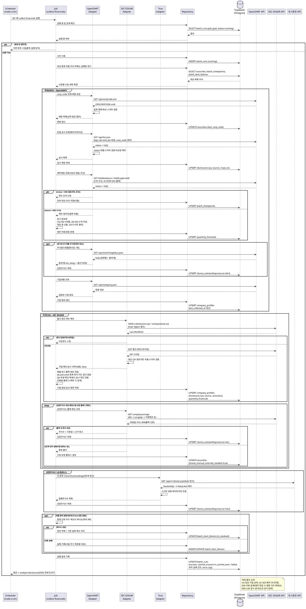

# UC-027: 재무/공시/기업정보 수집 배치

> `docs/userflow.md` 027번 기능의 상세 유스케이스. 종목 마스터 전 종목의 분기 재무제표·공시·기업 정형 정보·상장주식수를 1일 1회 수집해 자체 DB에 적재한다. 국내(KRX)는 OpenDART, 미국(US)은 SEC EDGAR를 사용하며, 상장주식수는 토스증권 Open API를 1순위 소스로 병행한다. 사용자 직접 상호작용이 없는 System 배치이며, 실행 결과는 배치 모니터링(UC-023)으로 조회되고 적재 데이터는 기업 상세(UC-020)·대시보드 집계(029)의 소스가 된다.

---

## 1. Primary Actor

- **System** — 배치 워커(`apps/worker`)의 스케줄러(node-cron)가 트리거하는 `collect-financials` 잡. 사용자 직접 상호작용 없음.
- (간접 이해관계자) **Admin**: 배치 모니터링(UC-023)에서 본 잡의 실행 상태·실패 로그를 조회한다.

## 2. Precondition (사용자 관점)

- 종목 마스터(`securities`)에 수집 대상 전 종목이 적재되어 있다(시장 구분 KRX/US, 국내 종목은 `dart_corp_code`, 미국 종목은 `cik`, 토스 조회용 `toss_symbol` 매핑 보유 — 매핑 누락분은 본 배치의 매핑 갱신 스텝에서 보완).
- 외부 연동 자격 정보가 환경변수로 설정되어 있다: `OPENDART_API_KEY`(40자리 인증키), `SEC_EDGAR_USER_AGENT`(서비스명+연락 이메일), `TOSSINVEST_CLIENT_ID`/`TOSSINVEST_CLIENT_SECRET`.
- 배치 워커 프로세스가 실행 중이다(스케줄 등록 상태).
- (관찰 가능한 결과 관점) 수집 완료 후 사용자는 기업 상세(UC-020)에서 분기 재무·공시·정형 정보·시총 추이를, 어드민은 배치 모니터링(UC-023)에서 실행 이력을 확인할 수 있다.

## 3. Trigger

- **정기 트리거**: 스케줄러(node-cron)가 1일 1회 정해진 시각(상수 관리, 양 시장 장 마감·공시 갱신 이후 시간대)에 `collect-financials` 잡을 실행한다.
- 수동 재실행 트리거는 MVP 범위 밖이다(UC-023은 조회 전용).
- **연쇄 사이드이펙트**: 본 잡이 종료(성공/부분성공)하면 LLM 공시 분석 배치(030)가 직후 연쇄 실행된다.

## 4. Main Scenario

1. 스케줄러가 `collect-financials` 잡을 실행한다. 동일 잡이 이미 실행 중(`batch_runs.status=running`)이면 중복 실행을 방지하기 위해 이번 회차를 스킵한다.
2. 잡은 실행 이력(`batch_runs`)에 `running` 상태로 시작 기록을 남긴다.
3. 대상 종목을 로드한다: `securities` 전 종목(밸류체인 편입 여부 무관)을 시장별(KRX/US)로 분리하고, 직전 실행에서 일일 한도 초과로 이월된 커서(`batch_checkpoints`)가 있으면 해당 지점부터 이어서 처리한다.
4. **[KRX — corp_code 매핑 갱신]** OpenDART 고유번호 전체 매핑(`corpCode.xml` ZIP)을 내려받아 파싱하고, 종목코드가 있는 상장 법인만 필터링해 `securities.dart_corp_code` 매핑을 갱신한다(1회 호출로 전체 확보 — 종목별 반복 호출 불필요).
5. **[KRX — 공시 수집]** 공시검색(`list.json`)을 `corp_code` 생략 + `bgn_de=end_de=당일`로 호출해 당일 전 시장 공시를 페이지네이션(최대 100건/페이지)으로 일괄 수집한다. `stock_code`가 비어있는 비상장 법인 공시는 제외하고, `rcept_no`를 멱등 키로 `disclosures`에 UPSERT한다(정정 공시는 동일 키 갱신 반영).
6. **[KRX — 재무 수집]** 최신 보고서 제출 주기(1분기 11013/반기 11012/3분기 11014/사업보고서 11011)에 해당하는 재무제표를 수집한다. 다중회사 주요계정(`fnlttMultiAcnt`, 100사 묶음)을 우선 활용해 호출 횟수를 최소화하고, 필요 시 단일회사 전체 재무제표(`fnlttSinglAcntAll`)를 CFS(연결) 우선 → 없으면(status 013) OFS(별도) 폴백으로 보완한다.
7. **[KRX — 분기 정규화]** 손익 계정(매출/영업이익/순이익)을 3개월 단위로 정규화한다: 1Q·3Q는 원천 3개월치(`amount_basis=three_month`), 2Q=반기 누적−1Q, 4Q=연간−3Q 누적 차감 도출(`amount_basis=derived_from_cumulative`). `fiscal_year ≥ 2015`만 대상이며, 회계 기간의 시작·종료일로 역년 축(`calendar_year`/`calendar_quarter`)을 산출해 `quarterly_financials`에 UPSERT한다.
8. **[KRX — 상장주식수]** 분기보고서 제출 주기에 맞춰(매일 전량 재수집 아님) 주식총수현황(`stockTotqySttus`, 회사당 1회)을 호출하고, `se="합계"` 행의 `istc_totqy`(발행주식총수)를 결산기준일(`stlm_dt`)과 함께 `shares_outstanding`(source=dart)에 UPSERT한다.
9. **[KRX — 기업정보]** 기업개황(`company.json`)으로 정형 정보(대표자, 설립일, 홈페이지, 업종 등)를 수집해 `company_profiles`에 UPSERT하고 `last_collected_at`을 갱신한다.
10. **[US — 벌크 확인·다운로드]** SEC EDGAR 벌크 파일(`submissions.zip`, `companyfacts.zip`)의 `Last-Modified`를 조건부 확인해 갱신이 없으면(주말·공휴일) 다운로드를 스킵한다. 갱신되었으면 ZIP을 스트리밍으로 열어 관리 대상 CIK 엔트리만 선택 추출한다(전체 압축 해제 없음). 모든 요청에 `User-Agent`(서비스명+연락 이메일) 헤더를 필수로 포함한다.
11. **[US — 기업정보·공시]** submissions 데이터에서 기업 정형 정보(회사명, SIC 업종, 주소, 전화 등)를 `company_profiles`에, 제출 이력(`filings.recent`)의 공시(10-K/10-Q/8-K/20-F/6-K 등)를 accession number를 멱등 키로 `disclosures`에 UPSERT한다.
12. **[US — 재무 정규화]** companyfacts에서 매출을 태그 폴백 체인(us-gaap 5종: RevenueFromContractWithCustomerExcludingAssessedTax → IncludingAssessedTax → Revenues → SalesRevenueNet → SalesRevenueGoodsNet/ServicesNet, 그리고 ifrs-full:Revenue)으로 추출한다. `(fy, start, end)` 기준 중복(비교 재수록분)을 제거하고, 기간 길이 검증(정상 분기 75~100일/연간 340~390일 범위, 상수)으로 스텁 기간을 걸러낸다. Q4는 원천에 없으므로 연간(FY)−Q1−Q2−Q3로 파생(`amount_basis=derived_from_cumulative`)하고, `fp` 라벨이 아닌 `start`/`end` 날짜로 역년 축을 재계산한다. 어떤 태그로도 매핑 실패한 기업은 `is_revenue_tag_unmapped=true`로 저장해 매출 집계에서 제외하고 제외 기업 수를 집계한다. 분기 데이터가 구조적으로 없는 20-F(IFRS) 기업은 `period_type=annual` 연간 행만 저장한다.
13. **[US — 상장주식수]** 종목별 폴백 체인으로 수집한다: ① `dei:EntityCommonStockSharesOutstanding` → ② `us-gaap:CommonStockSharesOutstanding`(클래스 합산 추정, 부분 신뢰 플래그) → ③ `us-gaap:WeightedAverageNumberOfSharesOutstandingBasic`(근사치) → ④ 전부 실패 시 `securities.shares_manual_override_needed=true`로 표식하고 자동 수집에서 제외. 채택 값은 기준일·태그와 함께 `shares_outstanding`(source=sec)에 UPSERT한다. `companyconcept`의 404는 오류가 아닌 "데이터 없음" 정상 신호로 다음 태그로 즉시 전환한다.
14. **[공통 — 토스 상장주식수 1순위]** 토스증권 `/api/v1/stocks`를 `symbols` 200개 청크로 순회해 `sharesOutstanding`을 수집하고 `shares_outstanding`(source=toss)에 UPSERT한다. 시총 계산(029)의 소스 우선순위는 toss > dart > sec이다.
15. **[실패·이월 처리]** 개별 종목 호출 실패(네트워크/5xx/스키마 검증 실패)는 종목 단위 3회 지수 백오프로 재시도하고, 최종 실패분은 `batch_item_failures`에 기록한 뒤 다음 정기 주기에 자동 재포함한다. 일일 한도 초과(OpenDART status 020) 감지 시 해당 API 호출을 중단하고 잔여 대상 커서를 `batch_checkpoints`에 저장해 다음 실행으로 이월한다.
16. 잡 종료 시 `batch_runs`를 최종 상태로 갱신한다: 전량 성공=`success`, 일부 실패·이월 존재=`partial_success`(+`is_carried_over`), 잡 자체 실패=`failed`(+`error_log`). 처리 건수·실패 건수를 함께 기록하고, 화면 표기용 최종 수집 시각(`company_profiles.last_collected_at` 등)이 갱신된 상태가 된다.
17. 종료(성공/부분성공) 후 LLM 공시 분석 배치(030)를 연쇄 트리거한다(당일 신규 공시가 분석 입력이 됨).

## 5. Edge Cases

| # | 상황 | 처리 |
|---|------|------|
| E1 | OpenDART 일일 한도(20,000건/일) 초과 — status `020` | 즉시 해당 API 호출 중단(재시도 금지), 잔여 대상 커서를 `batch_checkpoints`에 저장해 다음 실행으로 이월. `batch_runs`는 `partial_success` + `is_carried_over=true` |
| E2 | 2015 사업연도 이전 재무 | 수집·저장 제외(시계열 최소 시작 시점, DB CHECK `fiscal_year ≥ 2015`로 최종 방어) |
| E3 | 미국 매출 태그 폴백 전체 실패(미매핑) | `is_revenue_tag_unmapped=true`로 저장, 매출 집계 제외 대상으로 표시 + 제외 기업 수 카운트 기록(대시보드 커버리지 표기용, 010/029 연계) |
| E4 | 신규 상장/재무 미공시/조회 데이터 없음(status `013`) | 결측 허용(실패 아님) — 해당 종목·기간은 미적재로 두고 다음 주기 재확인. CFS 013은 OFS 폴백 후 판정 |
| E5 | 공시 중복 수신/정정 공시 | `uq(source, external_id)`(rcept_no/accession) 멱등 UPSERT로 중복 방지, 정정분은 동일 키 갱신 반영 |
| E6 | 과거 재무 정정(이미 적재된 분기 값 변경) | `quarterly_financials` UPSERT로 정정 반영하고, 영향 기간(체인 일별/분기 집계 재계산 대상)을 식별 가능하게 기록 → 일별 지표 집계 배치(029)가 영향 기간 재계산 |
| E7 | SEC User-Agent 누락/부적합 — `Undeclared Automated Tool`/403 차단 | 요청 전 헤더 필수 주입(환경변수 검증 실패 시 잡 시작 자체를 실패 처리). 차단 감지 시 재시도 전 헤더·요청 빈도 점검 후 보수적 백오프 |
| E8 | SEC 레이트 리밋(초당 10건) 초과 차단 | 어댑터 토큰버킷(안전마진 초당 5~8건)으로 사전 방지, 차단 감지 시 수 분 이상 백오프 후 재개 |
| E9 | 외부 응답 스키마 변경/파싱 실패(zod 검증 실패) | 해당 종목 단위 실패로 격리(잡 전체 중단 없음), 3회 지수 백오프 후 `batch_item_failures`에 원인 기록 |
| E10 | 개별 종목 호출 실패(네트워크/5xx/타임아웃) | 종목 단위 3회 지수 백오프 재시도, 최종 실패는 `batch_item_failures` 기록 후 다음 정기 주기에 자동 재포함 |
| E11 | SEC `companyconcept` 404 | 재시도 대상 아님 — "해당 태그 데이터 없음" 정상 폴백 신호로 다음 태그 즉시 전환 |
| E12 | 다중 클래스 주식 기업(Alphabet/Meta 등)의 상장주식수 표준 API 부재 | 폴백 4단계(dei → us-gaap 합산 → 가중평균 근사 → 수동 보정 플래그). 최종 실패 시 `shares_manual_override_needed=true`로 자동 수집 제외, 부분값은 `is_multi_class_partial` 플래그와 함께 저장 |
| E13 | 20-F(IFRS) 기업의 분기 데이터 구조적 부재 | Q1~Q3가 원천에 없으므로 Q4 파생 로직 미적용, `period_type=annual` 연간 행만 저장(분기 매출 집계에서 "연간 전용" 사유로 제외) |
| E14 | 회계연도 변경/M&A로 인한 스텁 기간(비정상 기간 길이) 혼입 | 기간 길이 검증(상수 범위) 위반 시 자동 채택하지 않고 예외 플래그 처리(자동 계산 대신 검토 대상 분리) |
| E15 | SEC 벌크 ZIP 미갱신(주말·공휴일) | `Last-Modified` 조건부 확인으로 재다운로드 스킵(불필요 트래픽 방지), 잡은 정상 종료 |
| E16 | 잡 중복 실행/지연 실행(직전 회차 미종료) | 동일 `job_type` `running` 존재 시 신규 회차 스킵(멱등). 모든 적재가 UPSERT라 재실행에도 중복 적재 없음 |
| E17 | corp_code/CIK 매핑 누락 종목 | 매핑 갱신 스텝에서 보완 시도, 그래도 미매핑이면 해당 종목은 이번 회차 제외 + `batch_item_failures` 기록(다음 주기 재시도) |
| E18 | OpenDART 다중회사 조회 100사 초과(status `021`) | 어댑터에서 요청 분할(100사 이하 청크) 강제 — 발생 시 청크 크기 축소 후 재시도 |
| E19 | OpenDART 시스템 점검(status `800`)/전면 장애 | 지수 백오프 재시도 후 실패 시 잡을 `failed`/`partial_success`로 기록, 다음 정기 주기 재수집(수집 실패가 화면 장애로 전파되지 않음 — 화면은 기존 DB 데이터로 동작) |
| E20 | 상장폐지/거래정지 종목 | `securities.listing_status` 기준으로 수집 대상 조정(폐지 종목은 신규 수집 제외, 기존 데이터는 보존) |

## 6. Business Rules

### 6.1 수집·멱등성 규칙

- **BR-1**: 외부 API(OpenDART/SEC EDGAR/토스증권)는 본 배치 등 DB 적재 용도로만 호출한다. 클라이언트 화면은 항상 자체 DB만 읽는다(PRD 전역 정책).
- **BR-2**: 수집 대상은 종목 마스터 **전 종목**이다(밸류체인 편입 여부 무관). `listing_status`에 따라 대상을 조정한다.
- **BR-3**: 모든 적재는 자연키 기반 UPSERT로 멱등하다 — 재무 `uq(security, fiscal_year, fiscal_quarter)`(연간은 `uq(security, fiscal_year)`), 공시 `uq(source, external_id)`, 상장주식수 `uq(security, as_of_date, source)`. 잡 재실행·이월 재개 시 중복 적재가 발생하지 않는다.
- **BR-4**: 호출 횟수 최소화 원칙 — 전체 매핑(corpCode.xml)·날짜 기준 일괄 공시 조회(list.json, corp_code 생략)·다중회사 조회(100사 묶음)·SEC 벌크 ZIP을 우선 활용하고, 회사당 1회가 불가피한 API(주식총수 등)는 분기 제출 주기에 맞춰 변경분만 갱신한다.
- **BR-5**: 레이트 리밋 준수 — OpenDART 20,000건/일·분당 1,000회 미만, SEC 초당 10건(안전마진 5~8건), 토스는 응답 헤더(X-RateLimit-*) 기반 동적 조절. API별 토큰버킷은 설정값으로 주입한다(하드코딩 금지).
- **BR-6**: 실패 격리 — 개별 종목 실패는 잡 전체를 중단시키지 않는다. 종목 단위 3회 지수 백오프 후 최종 실패는 기록 후 다음 정기 주기에 자동 재포함한다.
- **BR-7**: 성공/실패 판별 — OpenDART는 HTTP 코드가 아닌 응답 바디 `status` 필드(`000`=정상)로 판별한다. SEC `companyconcept` 404는 실패가 아닌 폴백 신호다.
- **BR-8**: 동시성 — 동일 잡의 중복 실행을 금지하고(running 상태 검사), 백필 배치(031)와 동일 테이블을 다루므로 충돌 방지(락/우선순위)를 적용한다.
- **BR-9**: 본 잡 종료가 LLM 공시 분석 배치(030)의 트리거다(연쇄 실행). 일별 지표 집계 배치(029)는 본 잡을 포함한 수집 배치들 완료 이후 실행된다.

### 6.2 정규화 규칙

- **BR-10 (국내 분기 매출)**: 1Q·3Q는 원천 3개월치, 2Q=반기 누적−1Q, 4Q=연간−3Q 누적으로 차감 도출한다. 산출 방식은 `amount_basis`(three_month/derived_from_cumulative)로 행마다 기록한다.
- **BR-11 (국내 재무제표 폴백)**: 연결재무제표(CFS) 우선 조회, 미제출 기업(status 013)은 개별/별도(OFS)로 폴백한다.
- **BR-12 (미국 매출 태그 폴백)**: us-gaap 다중 태그 + ifrs-full 폴백 체인을 적용한다. 태그 우선순위 목록은 상수/설정 모듈로 관리한다(하드코딩 금지). 태그 전환기 중복은 `(fy, start, end)` 기준으로 제거한다.
- **BR-13 (미국 Q4 파생)**: Q4는 원천에 존재하지 않으므로 항상 연간−Q1−Q2−Q3로 파생한다. 파생 전 각 분기의 기간이 겹치지 않고 연속인지, 기간 길이가 정상 범위(상수)인지 검증한다.
- **BR-14 (역년 정규화)**: 결산월이 다른 기업(9월 결산 등)을 동일 축으로 합산하기 위해, `fp`(회계 분기 라벨)가 아닌 회계 기간의 실제 시작·종료일로 `calendar_year`/`calendar_quarter`를 산출해 저장한다. 체인 분기 지표(029)는 이 역년 축으로 집계한다.
- **BR-15 (20-F 연간 전용)**: 분기 손익을 구조적으로 제공하지 않는 20-F(IFRS) 기업은 `period_type=annual` 행만 저장하고 분기 매출 집계에서 제외한다(제외 사유 구분 보존).
- **BR-16 (시계열 하한)**: 국내 재무는 2015 사업연도 이후만 수집·제공한다(OpenDART 제약).
- **BR-17 (상장주식수)**: 소스 우선순위는 toss(`sharesOutstanding`) > dart(`istc_totqy` 합계 행) > sec(dei/us-gaap 폴백)이며, 기준일(`as_of_date`)·근거 태그(`source_tag`)를 값과 함께 보존한다. 시총 계산(029)은 종목별 최신 `as_of_date` 행을 사용하고 화면에는 '주식수 기준일' 주석을 노출한다(UC-010/020).
- **BR-18 (정정 반영)**: 공시 정정은 멱등 키 갱신으로, 재무 정정은 UPSERT로 반영한다. 재무 정정 시 영향 기간의 체인 지표 재계산이 029에서 수행되도록 정정 발생 정보를 남긴다(구조 변경 재계산 금지 원칙과는 별개).
- **BR-19 (검증 계층)**: 외부 응답은 어댑터 경계에서 스키마 검증(zod)을 통과한 것만 정규화 단계로 전달한다. 검증 실패는 종목 단위 실패로 격리한다.

### 6.3 API Specification

> 본 기능은 배치 잡이므로 사용자 대상 HTTP API를 제공하지 않는다. 아래는 (1) 잡 트리거·입출력 계약, (2) 외부 API 호출 계약, (3) 적재 결과를 소비하는 내부 API 참조로 구성한다.
> 계층: Scheduler(node-cron) → Job(`jobs/collect-financials.job.ts`) → Adapter(`adapters/{opendart,sec-edgar,tossinvest}/contract.ts`+`client.ts`) → Repository(`repositories/`) → Supabase.

#### API-1. 잡 트리거 계약

| 항목 | 내용 |
|---|---|
| 잡 식별자 | `collect_financials` (`batch_job_type` enum) |
| 트리거 | node-cron 스케줄, 1일 1회(실행 시각은 상수 관리 — 양 시장 마감 이후 시간대) |
| 수동 트리거 | 미제공(MVP — 어드민 재실행 UI는 2단계) |
| 동시성 | 동일 `job_type`의 `running` 실행 존재 시 신규 회차 스킵 |
| 멱등성 | 전 적재 UPSERT — 중복/지연/재실행 안전 |
| 연쇄 | 종료(success/partial_success) 시 `analyze_disclosures`(030) 연쇄 실행 |
| 타임존 | 스케줄·"당일" 판정 기준 타임존은 상수로 관리(KST 기준 권장), 회계 기간 계산은 date-fns-tz 사용 |

#### API-2. 잡 입력 계약

| 입력 | 소스 | 내용 |
|---|---|---|
| 대상 종목 | `securities` | 전 종목: `id`, `market`(KRX/US), `ticker`, `dart_corp_code`, `cik`, `toss_symbol`, `listing_status`, `shares_manual_override_needed` |
| 이월 커서 | `batch_checkpoints` | `job_type=collect_financials`의 미완료 커서(직전 회차 한도 초과 잔여분) |
| 재시도 대상 | `batch_item_failures` | 미해소(`is_resolved=false`) 종목 — 다음 주기 자동 재포함 |
| 자격 정보 | 환경변수 | `OPENDART_API_KEY`, `SEC_EDGAR_USER_AGENT`, `TOSSINVEST_CLIENT_ID`/`TOSSINVEST_CLIENT_SECRET` |
| 외부 응답 | OpenDART / SEC EDGAR / 토스증권 | 6.5 External Service Integration 참조 |

#### API-3. 잡 출력 계약

| 출력 | 대상 | 내용 |
|---|---|---|
| 분기/연간 재무 | `quarterly_financials` | 매출/영업이익/순이익, `period_type`, `amount_basis`, 역년 축, `revenue_source_tag`, `is_revenue_tag_unmapped` |
| 공시 | `disclosures` | 출처·외부 식별자·제목·공시일·원문 URL(최신순 조회 소스) |
| 기업 정형 정보 | `company_profiles` | 대표자/설립일/홈페이지/업종 등 + `last_collected_at`(화면 "최종 수집 시각" 소스) |
| 상장주식수 | `shares_outstanding` | 주식수, 기준일, 소스(toss/dart/sec), 근거 태그, 부분값 플래그 |
| 종목 마스터 갱신 | `securities` | `dart_corp_code` 매핑, `shares_manual_override_needed` 플래그 |
| 실행 이력 | `batch_runs` | 상태(success/partial_success/failed), 처리·실패 건수, `is_carried_over`, `error_log` — UC-023 조회 소스 |
| 실패 상세 | `batch_item_failures` | 종목 단위 실패 원인·시도 횟수 |
| 이월 커서 | `batch_checkpoints` | 한도 초과 잔여분 재개 지점 |

- 상태 판정: 전량 성공=`success` / 일부 종목 실패 또는 한도 이월=`partial_success` / 잡 수준 실패(자격 정보 오류·전면 장애 등)=`failed`.

#### API-4. 외부 API 호출 계약 (요약)

**OpenDART** (Base `https://opendart.fss.or.kr/api`, GET, `crtfc_key` 공통 필수, 성공 판별=바디 `status="000"`)

| 엔드포인트 | 용도 | 핵심 파라미터 | 응답 핵심 필드 → 적재 |
|---|---|---|---|
| `corpCode.xml` | corp_code 전체 매핑(ZIP) | — | `corp_code`, `stock_code`, `modify_date` → `securities.dart_corp_code` |
| `list.json` | 당일 전 시장 공시 | `bgn_de=end_de=당일`, `corp_code` 생략, `page_no`/`page_count(≤100)` | `rcept_no`(멱등 키), `report_nm`, `rcept_dt`, `stock_code`, `corp_code` → `disclosures` |
| `fnlttMultiAcnt.json` | 다중회사 주요계정(≤100사) | `corp_code`(콤마 다중), `bsns_year`, `reprt_code` | 계정별 금액 → `quarterly_financials` |
| `fnlttSinglAcntAll.json` | 단일회사 전체 재무제표(보완) | `corp_code`, `bsns_year`, `reprt_code`, `fs_div`(CFS→OFS 폴백) | `sj_div=IS/CIS`의 `thstrm_amount`(3개월)/`thstrm_add_amount`(누적) → `quarterly_financials` |
| `stockTotqySttus.json` | 주식총수현황(회사당 1회, 분기 갱신) | `corp_code`, `bsns_year`, `reprt_code` | `se="합계"` 행 `istc_totqy`, `stlm_dt` → `shares_outstanding`(dart) |
| `company.json` | 기업개황 | `corp_code` | 정형 정보 필드 → `company_profiles` |

OpenDART 에러 처리(응답 바디 `status`):

| status | 의미 | 배치 처리 |
|---|---|---|
| `000` | 정상 | 적재 진행 |
| `013` | 조회 데이터 없음 | 실패 아님 — CFS→OFS 폴백 또는 결측 허용(E4) |
| `020` | 일일 한도(20,000건) 초과 | 재시도 금지, 커서 저장 후 이월(E1) |
| `021` | 다중회사 100사 초과 | 요청 분할 후 재시도(E18) |
| `800` | 시스템 점검 | 지수 백오프 재시도, 실패 시 기록(E19) |
| `010`/`011`/`012`/`901` | 키/IP 문제 | 잡 수준 실패(`failed`) — 설정 점검 필요 항목으로 로그 |

**SEC EDGAR** (Base `https://data.sec.gov` / 벌크 `https://www.sec.gov`, GET, 인증 없음, `User-Agent` 헤더 필수)

| 엔드포인트 | 용도 | 비고 |
|---|---|---|
| `/Archives/edgar/daily-index/bulkdata/submissions.zip` | 전 종목 제출 이력+기업 메타(벌크) | `Last-Modified` 조건부 확인, 스트리밍 추출(대상 CIK만) |
| `/Archives/edgar/daily-index/xbrl/companyfacts.zip` | 전 종목 XBRL 재무(벌크) | 동일 — 약 1.3GiB급, 전체 압축 해제 금지 |
| `/submissions/CIK{10자리}.json` | 개별 기업 메타·공시(증분 보완) | 벌크 미갱신 시 보조 수단 |
| `/api/xbrl/companyconcept/CIK{10자리}/{taxonomy}/{tag}.json` | 상장주식수 폴백 체인(개별) | 404=폴백 신호(재시도 아님) |

SEC 에러 처리: 403(`Undeclared Automated Tool`)=User-Agent 점검 후 백오프(E7), 레이트 초과 차단=수 분 이상 백오프(E8), 404(companyconcept)=다음 태그 폴백(E11), 5xx=지수 백오프 3회(E10).

**토스증권 Open API**

| 엔드포인트 | 용도 | 비고 |
|---|---|---|
| `GET /api/v1/stocks` | `sharesOutstanding`(발행주식수) 수집 | `symbols` 필수·최대 200개 → 청크 순회. 응답 `X-RateLimit-*` 헤더 기반 호출 속도 조절 |

#### API-5. 적재 데이터 소비 API (참조 — 본 유스케이스 소관 아님)

| 소비 지점 | 계약 소관 |
|---|---|
| `GET /api/companies/{ticker}` 등 기업 상세(재무 표/공시 목록/정형 정보/출처·최종 수집 시각) | UC-020 |
| `GET /api/admin/batches` 등 배치 실행 이력·실패 로그 조회 | UC-023 |
| 체인 일별/분기 지표 집계(입력으로 사용) | UC-029(029 배치) |
| 신규 공시 LLM 분석(입력으로 사용) | UC-030(030 배치) |

### 6.4 Database Operations

| 테이블 | 작업 | 목적 |
|---|---|---|
| `batch_runs` | SELECT | 동일 잡 `running` 존재 여부 확인(중복 실행 방지) |
| `batch_runs` | INSERT | 실행 시작 기록(`job_type=collect_financials`, `status=running`) |
| `batch_runs` | UPDATE | 종료 상태·처리/실패 건수·`is_carried_over`·`error_log` 확정 |
| `securities` | SELECT | 대상 전 종목 로드(시장/매핑/상장 상태/수동 보정 플래그) |
| `securities` | UPDATE | `dart_corp_code` 매핑 갱신, `shares_manual_override_needed` 플래그 설정 |
| `company_profiles` | INSERT/UPDATE (UPSERT) | 기업 정형 정보 갱신 + `last_collected_at`(최종 수집 시각) |
| `quarterly_financials` | INSERT/UPDATE (UPSERT) | 분기/연간 재무 적재·정정 반영 — `uq(security, fiscal_year, fiscal_quarter)`/`uq(security, fiscal_year) WHERE annual` |
| `disclosures` | INSERT/UPDATE (UPSERT) | 공시 적재·정정 반영 — `uq(source, external_id)` 멱등 |
| `shares_outstanding` | INSERT/UPDATE (UPSERT) | 상장주식수 이력 적재 — `uq(security, as_of_date, source)` |
| `batch_item_failures` | SELECT | 직전 미해소 실패분 재포함 대상 조회 |
| `batch_item_failures` | INSERT/UPDATE | 종목 단위 최종 실패 기록(`attempt_count`, `last_error`), 성공 시 `is_resolved` 갱신 |
| `batch_checkpoints` | SELECT | 이월 커서 확인(재개 지점) |
| `batch_checkpoints` | INSERT/UPDATE (UPSERT) | 한도 초과 잔여분 커서 저장 — `uq(job_type, checkpoint_key)` |

- **DELETE 없음**: 본 배치는 삭제를 수행하지 않는다(시세 30일 정리는 026 소관, 종목 물리 삭제 금지 정책).
- 대량 적재는 배열 UPSERT를 청크(1,000~5,000행) 단위로 반복한다. Repository 계층이 Supabase 접근을 캡슐화하고, Job은 Repository 인터페이스에만 의존한다.

### 6.5 External Service Integration

| 서비스 | 참조 문서 | 역할 | 필수 준수 사항 |
|---|---|---|---|
| **OpenDART** | `docs/external/opendart.md` | 국내(KRX) 재무제표·공시·기업개황·주식총수 | `crtfc_key` 환경변수 관리(하드코딩·프론트 노출 금지), 성공 판별은 바디 `status` 필드, 일일 20,000건·분당 1,000회 미만, 다중회사 ≤100사, 전체 매핑·날짜 일괄 조회 우선으로 호출 최소화, 2015 이후만 제공 |
| **SEC EDGAR** | `docs/external/sec-edgar-api.md` | 미국(US) 재무(XBRL)·공시(제출 이력)·기업 메타·상장주식수 | `User-Agent`(서비스명+연락 이메일) 필수, 초당 10건 이하(안전마진 5~8건), 벌크 ZIP 우선 + `Last-Modified` 조건부 요청, `companyconcept` 404=폴백 신호, 태그 폴백 체인 상수화 |
| **토스증권 Open API** | `docs/external/tossinvest-openapi.md` | 상장주식수 1순위 소스(`sharesOutstanding`) | `symbols` ≤200 청크, 응답 레이트리밋 헤더 기반 동적 조절, 이용약관(재배포 제한) 준수 범위 내 저장 |

- 어댑터 격리 원칙(techstack §4/§8): 각 연동은 `adapters/<provider>/contract.ts`(인터페이스)+`client.ts`(구현)로 분리하고, Job은 contract에만 의존한다. 소스 교체가 필요해도 Job 로직은 변경되지 않는다.
- 데이터 출처 표기: 적재 데이터에 소스(dart/sec/toss)를 보존해 화면의 출처·최종 수집 시각 표기(UC-020/025)를 지원한다.

## 7. Sequence Diagram

## 8. 관련 유스케이스

- **UC-020 기업 상세 조회**: 본 배치가 적재한 분기 재무·공시·정형 정보·상장주식수(시총 추이 입력)·최종 수집 시각을 표시한다.
- **UC-023 배치 작업 모니터링 조회**: `batch_runs`/`batch_item_failures`를 통해 본 잡의 상태·실패 로그·이월 여부를 조회한다.
- **UC-026 시세 수집 배치**: 시총 계산의 종가 소스. 본 배치의 상장주식수와 결합해 029에서 시총이 산출된다.
- **UC-029(029 배치) 일별 체인 지표 사전 집계**: 본 배치의 재무·상장주식수를 입력으로 사용하며, 재무 정정 시 영향 기간 재계산을 수행한다.
- **UC-030(030 배치) LLM 공시 분석**: 본 배치 종료 직후 연쇄 실행되어 당일 신규 공시를 분석한다.
- **UC-031(031 배치) 최초 전 종목 과거 데이터 백필**: 동일 정규화 규칙(누적 차감·태그 폴백·Q4 파생)을 공유하며, 동시 실행 충돌 방지 대상이다.

---

## Open Questions

1. **기업개황(company.json) 갱신 전략**: 회사당 1회 호출이 필요한 API라 매일 전 종목(약 2,600사) 전량 호출 시 OpenDART 일일 한도(20,000건)의 상당분을 소비한다. 매일 전량 갱신 vs `corpCode.xml`의 `modify_date` 기반 변경분만 갱신 중 어느 정책을 취할지 확정 필요.
2. **공시 저장 범위 필터**: `disclosures`에 저장할 공시 유형 범위 — 국내는 전체 공시 vs 특정 `pblntf_ty`(정기/주요사항 등)로 한정할지, 미국은 어떤 form(10-K/10-Q/8-K/20-F/6-K 등)까지 포함할지 기준 확정 필요("주요 공시 목록"의 '주요' 범위 정의).
3. **국내 2Q 매출 산출 방식**: PRD/database.md는 2Q=반기−1Q 차감(`amount_basis=derived_from_cumulative`)으로 규정하나, OpenDART 반기보고서 손익계산서는 3개월치(`thstrm_amount`)를 직접 제공한다. 차감 규칙 유지 vs 원천 3개월치 직접 사용(`three_month`) 중 우선 적용 기준 확정 필요.
4. **토스 상장주식수 수집의 소속 배치**: database.md는 상장주식수(toss 1순위)를 027 소관으로 배정했으나 userflow 027 입력에는 토스가 명시되지 않았다. 본 문서는 database.md를 따라 027에 포함했다 — 026(시세 배치, 토스 기사용)로 이관할지 확정 필요.
5. **재무 정정 → 029 재계산 전달 방식**: 정정된 분기(영향 기간)를 029가 식별하는 메커니즘(적재 시 변경 감지 기록 vs 029의 주기적 전 기간 대조)은 029 유스케이스와 함께 확정 필요.
