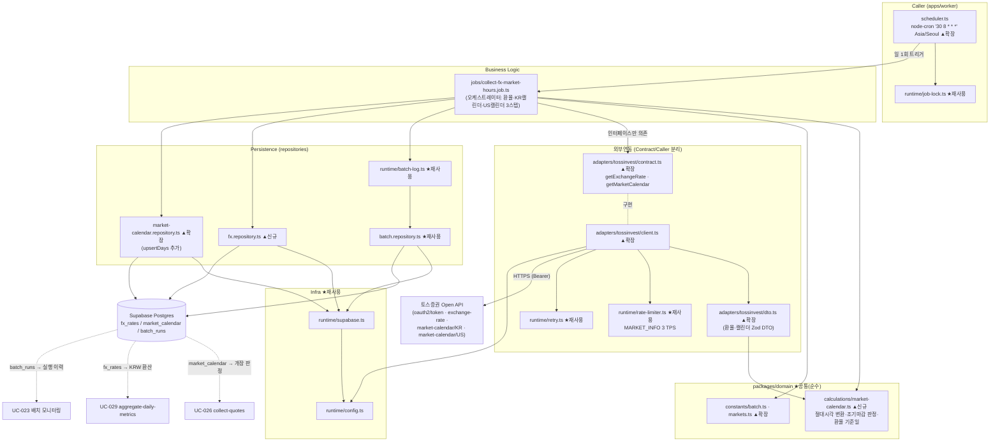

# Plan: UC-028 환율·장 운영시간 수집 배치 (collect-fx-market-hours)

> 근거: `docs/usecases/028/spec.md`, `docs/usecases/000_decisions.md`(H-9·C-3), `docs/techstack.md` §4·§6·§8·§9,
> `docs/database.md` §3(fx_rates·market_calendar·batch_runs)·§5, `supabase/migrations/0009_fx_and_market_calendar.sql`·`0012_batch_runs.sql`,
> `docs/external/tossinvest-openapi.md`(§4 Rate Limits — MARKET_INFO 3 TPS, §5 에러 코드, §6 환율·캘린더 모델), `docs/usecases/026/plan.md`(워커 공통 골격 SOT).
>
> - 본 plan은 **UC-026 plan이 최초 정의한 워커 공통 골격을 재사용·확장**하는 두 번째 워커 잡 계획이다.
>   `runtime/config.ts`·`supabase.ts`·`rate-limiter.ts`·`retry.ts`·`job-lock.ts`·`batch-log.ts`·`repositories/batch.repository.ts`·워커 패키지 골격은
>   026 plan 모듈 1~8을 **재정의 없이 그대로 사용**하고, `adapters/tossinvest/*`·`scheduler.ts`·`market-calendar.repository.ts`·domain 상수는 **기존 파일에 확장**한다.
> - 사용자향 HTTP API·화면이 없는 **System 배치**다. Presentation 모듈은 없으며, 실행 이력 조회는 UC-023(웹) 소관이다.
> - DB 스키마(`fx_rates`/`market_calendar`/`batch_runs`)는 0009·0012 마이그레이션으로 이미 존재한다.
>   **신규 마이그레이션 없음** — 두 테이블 모두 유니크 키 기반 단순 UPSERT라 RPC 함수도 불필요하다(techstack §7: 단순 CRUD는 `client.from()`).
> - 외부 연동은 **토스증권 Open API** 1건(`/api/v1/exchange-rate`, `/api/v1/market-calendar/{KR|US}` — 모두 MARKET_INFO 그룹 3 TPS).
>   026 plan의 `adapters/tossinvest/contract.ts`(계약) ↔ `client.ts`(구현) 분리 구조에 메서드를 추가하며, 잡은 contract에만 의존한다.
> - 환율은 **단방향 1행/일**(`base_currency='USD'`, `quote_currency='KRW'`, `1 USD = rate KRW`)로 적재한다 — 0009 컬럼 주석(기준 USD, 표시 KRW)과 일치.
>   역방향(KRW→USD)은 조회 측에서 역수 계산으로 파생하며 별도 행을 만들지 않는다(중복 데이터 금지).
> - `market_calendar`의 `open_at`/`close_at`은 **정규장 세션 기준 단일 구간**이다(0009 스키마가 세션 다중화가 아닌 단일 open/close).
>   KR의 NXT·미국 프리/애프터 세션은 저장 대상이 아니다 — 026 개장 판정도 정규장 기준(spec BR-4·026 BR-2 정합).
> - 결정 C-3에 따라 "최종 수집 시각"은 별도 컬럼 없이 `batch_runs.finished_at`에서 파생된다(spec BR-10). 결정 H-9(환율 축적 시점 이후만 환산)의
>   carry-forward·환산 로직은 UC-029/조회 소관 — 본 잡은 결측 일자를 임의 값으로 채우지 않는다(spec BR-3).
> - 토스 캘린더 응답의 필드 상세 SOT는 공식 openapi.json이다(spec §API 2). DTO 스키마는 **필수 최소 필드만 엄격 검증 + passthrough**
>   (026 plan 모듈 12 컨벤션)로 정의하고, 구현 시 openapi.json 원문 대조로 필드명을 확정한다.

---

## 개요

### 공통(shared) 모듈 — 026 plan 정의분 재사용 (본 plan에서 수정 없음)

| 모듈 | 위치 | 설명 |
| --- | --- | --- |
| 워커 패키지 골격 | `apps/worker/package.json` 외 | 026 plan 모듈 1. 추가 의존성 없음(기존 deps로 충분) |
| 워커 환경설정 | `apps/worker/src/runtime/config.ts` | 026 plan 모듈 2. `TOSSINVEST_CLIENT_ID`/`TOSSINVEST_CLIENT_SECRET` 이미 포함 — 신규 env 없음 |
| Supabase 클라이언트 팩토리 | `apps/worker/src/runtime/supabase.ts` | 026 plan 모듈 3 |
| 토큰버킷 레이트리미터 | `apps/worker/src/runtime/rate-limiter.ts` | 026 plan 모듈 4. `MARKET_INFO` 그룹은 어댑터가 생성 시 주입(모듈 4 참고) |
| 재시도 유틸 | `apps/worker/src/runtime/retry.ts` | 026 plan 모듈 5. 지수 백오프 3회 + `Retry-After` 존중(spec BR-6) |
| 잡 중복 기동 방지 | `apps/worker/src/runtime/job-lock.ts` | 026 plan 모듈 6. spec §API 1 "동시 실행 방지"의 1차 방어 |
| 배치 실행 기록기 | `apps/worker/src/runtime/batch-log.ts` + `repositories/batch.repository.ts` | 026 plan 모듈 7. `start`/`finish`만 사용 — 본 잡은 `batch_item_failures` 미사용(spec DB Operations: 스텝 실패는 `error_log`에 기록) |

### 공통(shared) 모듈 — 기존 파일 확장 (본 plan에서 추가 정의)

| 모듈 | 위치 | 설명 |
| --- | --- | --- |
| 배치 상수 확장 | `packages/domain/constants/batch.ts` | `COLLECT_FX_MARKET_HOURS_CRON='30 8 * * *'`, `BATCH_CRON_TIMEZONE='Asia/Seoul'` 추가(spec BR-1 실행 시각 상수) |
| 시장 상수 확장 | `packages/domain/constants/markets.ts` | `FX_PAIR={base:'USD',quote:'KRW'}`, `MARKET_REGULAR_SESSION_LOCAL`(시장별 표준 정규장 현지 시각 — 조기 마감 판정 기준) 추가 |
| 캘린더 계산(신규 파일) | `packages/domain/calculations/market-calendar.ts` | 순수 함수: 현지 벽시계 시각 → 절대 시각(timestamptz) 변환(DST 자연 반영), 조기 마감 판정, 환율 기준일(KST) 산출. UC-029 집계와 공유 가능 |
| 토스 어댑터 계약 확장 | `apps/worker/src/adapters/tossinvest/contract.ts` | `TossInvestPort`에 `getExchangeRate()`/`getMarketCalendar(market)` + 정규화 모델(`NormalizedFxRate`, `NormalizedCalendarDay`) 추가 |
| 토스 외부 DTO 확장 | `apps/worker/src/adapters/tossinvest/dto.ts` | `ExchangeRateResponse`/`KrMarketCalendarResponse`/`UsMarketCalendarResponse` Zod 스키마 + 내부 모델 변환 함수 추가 |
| 토스 어댑터 구현 확장 | `apps/worker/src/adapters/tossinvest/client.ts` | 위 2개 메서드 구현. `MARKET_INFO` 그룹(3 TPS) 버킷 등록, 404 `exchange-rate-not-found`의 결측 분기 |
| 캘린더 리포지토리 확장 | `apps/worker/src/repositories/market-calendar.repository.ts` | 026이 정의한 SELECT에 `upsertDays()`(멱등 UPSERT — 값 갱신형) 추가 |
| 스케줄러 등록 확장 | `apps/worker/src/scheduler.ts` | `cron.schedule(COLLECT_FX_MARKET_HOURS_CRON, handler, { timezone: BATCH_CRON_TIMEZONE })` 행 추가(026 plan 모듈 8의 확장 지점) |

### 기능(collect-fx-market-hours) 모듈 — 신규

| 모듈 | 위치 | 설명 |
| --- | --- | --- |
| 환율 리포지토리 | `apps/worker/src/repositories/fx.repository.ts` | `fx_rates` 멱등 UPSERT(`(rate_date, base, quote)` 충돌 시 갱신) + 최신 1건 SELECT(실패 시 폴백 가능성 로그용) |
| 환율·장운영 수집 잡 | `apps/worker/src/jobs/collect-fx-market-hours.job.ts` | 오케스트레이터: 환율 스텝 + 시장별 캘린더 스텝(KR·US) → 스텝 결과 취합 → `batch_runs` 기록. 내부 에러 코드 6종(spec §API 3) 상수 포함. 모든 의존성 주입형 |

### 범위 밖 (다른 plan 소관)

- `fx_rates` 결측 일자의 **carry-forward·KRW 환산**: UC-029(집계)·UC-010/012/020(조회). 본 잡은 결측 행을 만들지 않는다(spec BR-3).
- `market_calendar`를 읽는 **개장 판정**: UC-026(이미 plan 확정 — 캘린더 부재 시 보수적 스킵). 본 잡은 적재만 책임.
- 배치 실행 이력 조회 화면/API: UC-023(웹). 본 잡은 `batch_runs` 기록까지만.
- 환율 축적 시점 이전 과거 구간 처리(H-9 "부분 제공" 커버리지 표기): UC-029/조회 소관.
- 종목 단위 실패 추적(`batch_item_failures`)·백필 체크포인트(`batch_checkpoints`): 본 잡 미사용(spec DB Operations 명시).
- 수동 재실행 트리거: MVP 제외 — 실패 시 다음 정기 주기에 자동 재수집(spec Edge Cases).

---

## Diagram

데이터 흐름: Scheduler → Job(비즈니스 로직) → Adapter(외부)·Repository(퍼시스턴스) → Supabase. 잡은 `contract.ts`와 리포지토리 함수 시그니처에만 의존하고 HTTP·SQL 문법을 알지 못한다(techstack §4 계층 분리 매핑). ★재사용 = 026 plan 정의분 무수정 사용, ▲확장/신규 = 본 plan 작업 대상.

---

## Implementation Plan

### 1. 공통 확장 — 배치·시장 상수 (`packages/domain/constants/batch.ts`, `markets.ts`)

- 구현 내용:
  1. `batch.ts`에 추가: `COLLECT_FX_MARKET_HOURS_CRON = '30 8 * * *'`, `BATCH_CRON_TIMEZONE = 'Asia/Seoul'`.
     - **08:30 KST 근거(spec BR-1 선행 관계)**: 026은 매시 정각 실행이므로 KRX 당일 첫 판정은 09:00 KST — 08:30 실행이 당일 KRX 캘린더를 선행 갱신한다.
       US는 08:30 KST 시점의 미국 현지 "당일(전일 세션)·익일" 캘린더가 적재되어, 같은 날 KST 밤에 시작하는 US 정규장(미국 현지 익일자)이 익일 행으로 커버된다.
     - `BATCH_CRON_TIMEZONE`은 워커 호스트 시간대와 무관하게 KST 기준 실행을 보장하기 위한 node-cron `timezone` 옵션 값.
       026의 `COLLECT_QUOTES_CRON='0 * * * *'`(매시 정각)은 시간대 무관이라 기존 등록에 영향 없음.
  2. `markets.ts`에 추가:
     - `FX_PAIR = { base: 'USD', quote: 'KRW' } as const` — DB enum `currency_code`('KRW','USD') 리터럴과 일치. `fx_rates` 적재 방향의 단일 SOT.
     - `MARKET_REGULAR_SESSION_LOCAL: Record<MarketCode, { open: string; close: string }>` =
       `{ KRX: { open:'09:00', close:'15:30' }, US: { open:'09:30', close:'16:00' } }` — 표준 정규장 현지 벽시계 시각.
       조기 마감 판정(모듈 2)과 캘린더 정규화 검증의 기준값(하드코딩 분산 방지).
  3. 프레임워크·DB 의존성 없음(techstack §4 domain 원칙). 026이 정의한 기존 심볼(`MARKETS`, `MARKET_TIMEZONES`, `BATCH_MAX_RETRY` 등)은 변경하지 않는다.
- 의존성: 026 plan 모듈 9(기존 파일).
- **Unit Tests**:
  - [ ] `MARKET_REGULAR_SESSION_LOCAL`의 키가 `MARKETS`와 정확히 일치한다
  - [ ] `FX_PAIR.base !== FX_PAIR.quote` (0009 `chk_fx_pair_distinct` 제약과 정합 가드)
  - [ ] `COLLECT_FX_MARKET_HOURS_CRON`이 5필드 cron 형식이고 시(hour) 필드가 09 이전이다(026 선행 가드 테스트)

### 2. 공통 신규 — 캘린더 계산 순수 함수 (`packages/domain/calculations/market-calendar.ts`)

- 구현 내용(전부 순수 함수, date-fns/date-fns-tz만 사용 — 026의 `market-session.ts`와 별개 파일·심볼 충돌 없음):
  1. `toAbsoluteSessionTime(market: MarketCode, localDate: string, localTime: string): Date` —
     `MARKET_TIMEZONES[market]` 기준 `fromZonedTime(localDate + 'T' + localTime)`. 현지 벽시계 시각을 절대 시각(UTC Date)으로 변환.
     **DST는 시간대 규칙으로 자연 반영**(spec BR-4: US 09:30 ET가 3월/11월 전환 주에 13:30Z/14:30Z로 달라짐).
  2. `deriveEarlyClose(market: MarketCode, localDate: string, closeAt: Date): boolean` —
     `closeAt < toAbsoluteSessionTime(market, localDate, MARKET_REGULAR_SESSION_LOCAL[market].close)` 이면 조기 마감(spec Main 7).
     외부 응답이 명시적 조기 마감 플래그를 제공하면 어댑터가 그 값을 우선하고, 본 함수는 플래그 부재 시의 파생 규칙이다.
  3. `resolveFxRateDate(now: Date): string` — `Asia/Seoul` 기준 `yyyy-MM-dd`. `fx_rates.rate_date`(수집 기준일, spec Main 4)의 단일 SOT.
     기준 통화 표시가 KRW(국내 고시 환율)이므로 KST 일자를 사용한다 — 026 `resolveLocalDate('KRX', now)`와 결과가 같지만
     "환율 기준일은 시장이 아닌 KST 달력 기준"이라는 의미를 이름으로 고정하기 위해 별도 함수로 둔다.
- 의존성: 모듈 1, 026 plan 모듈 9(`MARKET_TIMEZONES`).
- **Unit Tests**:
  - [ ] `toAbsoluteSessionTime('KRX','2026-07-07','09:00')` = `2026-07-07T00:00:00Z`
  - [ ] `toAbsoluteSessionTime('US','2026-07-07','09:30')` = `2026-07-07T13:30:00Z`(EDT), `('US','2026-12-07','09:30')` = `14:30:00Z`(EST) — DST 양방향
  - [ ] `deriveEarlyClose('US','2026-11-27', 13:00 ET 절대시각)` = true(블랙프라이데이 조기 마감), `16:00 ET` = false
  - [ ] `deriveEarlyClose('KRX','2026-07-07', 15:30 KST 절대시각)` = false
  - [ ] `resolveFxRateDate(2026-07-06T23:30:00Z)` = `'2026-07-07'`(KST 자정 경계), `resolveFxRateDate(2026-07-07T02:00:00Z)` = `'2026-07-07'`

### 3. 어댑터 계약 확장 (`adapters/tossinvest/contract.ts`)

- 구현 내용(026 plan 모듈 11이 예고한 확장 지점 — 기존 심볼 무변경, 추가만):
  1. 내부 정규화 모델 추가:
     - `NormalizedFxRate { baseCurrency: 'USD', quoteCurrency: 'KRW', rate: number, rateDate: string }` — `1 base = rate quote`(0009 컬럼 주석).
     - `NormalizedCalendarDay { market: MarketCode, calendarDate: string, isTradingDay: boolean, openAt: Date | null, closeAt: Date | null, isEarlyClose: boolean }`
       — 휴장일은 `openAt`/`closeAt` null(0009 스키마), 정규장 세션 기준 단일 구간.
  2. `TossInvestPort` 메서드 추가:
     - `getExchangeRate(now: Date): Promise<{ kind: 'ok'; rate: NormalizedFxRate } | { kind: 'not_published' }>`
       — 404 `exchange-rate-not-found`는 **오류가 아닌 `not_published`**(spec Edge: 공휴일 고시 없음 → 당일 행 미생성 정상 종료).
       그 외 최종 실패는 기존 오류 타입(`TossAuthError`/`TossRequestError`) throw.
     - `getMarketCalendar(market: MarketCode, now: Date): Promise<NormalizedCalendarDay[]>`
       — 응답이 제공하는 일자(당일 포함, 익일 제공 시 함께)를 모두 정규화해 반환(spec Main 8 "당일·익일 캐시 갱신").
       스키마 검증·시각 변환 실패는 `TossRequestError`의 비재시도 분류(`validation_failed`)로 throw(spec: 검증 실패는 재시도 없음, BR-6).
  3. 기존 오류 타입 재사용: `TossAuthError`(잡 전체 `failed` 신호), `TossRequestError { code, status, retryAfterMs? }`. 신규 오류 타입 불필요.
- 의존성: 026 plan 모듈 11(기존 파일), 모듈 2(모델이 참조하는 `MarketCode`).
- Unit Tests: N/A(인터페이스·타입 정의). 구현 검증은 모듈 5.

### 4. 어댑터 외부 DTO 확장 (`adapters/tossinvest/dto.ts`)

- 구현 내용(026 plan 모듈 12 컨벤션 유지 — 필수 최소 필드 엄격 검증 + passthrough, `z.coerce.number()` 방어):
  1. Zod 스키마 추가(필드명은 구현 시 공식 openapi.json 대조로 확정 — spec §API 2 SOT 명시):
     - `exchangeRateResponseSchema` — 환율값(양수 number 강제)·통화쌍·기준 시각(제공 시) 최소 검증.
     - `krMarketCalendarResponseSchema`(`KrMarketDay`/`KrMarketDetail`/`IntegratedHour` 대응) — 일자·거래일 여부·KRX 정규장 개장/폐장 시각 최소 검증. NXT 세션 필드는 passthrough(저장 안 함).
     - `usMarketCalendarResponseSchema`(`UsMarketDay` 대응) — 일자·거래일 여부·**정규장 세션**(RegularMarketSession) 개장/폐장 시각 최소 검증. 프리/애프터/데이마켓 세션은 passthrough(저장 안 함).
  2. DTO → 내부 모델 변환 순수 함수 추가:
     - `toNormalizedFxRate(dto, now)` — `FX_PAIR` 방향으로 정규화(응답이 KRW→USD 표기라면 역수 변환 규칙을 여기 한 곳에 고정), `rateDate = resolveFxRateDate(now)`.
     - `toNormalizedCalendarDays(market, dto)` — 일자별로 `NormalizedCalendarDay` 배열 생성:
       응답 시각이 현지 벽시계 문자열이면 `toAbsoluteSessionTime`으로 절대 시각 변환, ISO 오프셋 포함 문자열이면 직접 파싱(두 경로 모두 결과는 timestamptz 호환 Date — spec BR-4).
       `isTradingDay=false`면 `openAt`/`closeAt`을 null로 강제(0009 주석 규칙). `isEarlyClose`는 응답 플래그 우선, 부재 시 `deriveEarlyClose` 파생.
       `open_at >= close_at` 같은 논리 모순은 변환 실패로 분류(부분 저장 없이 스텝 실패 — spec Edge "스키마 불일치").
  3. 기존 스키마(`TokenResponse`·오류 envelope 등)는 재사용 — 오류 envelope `{ error: { requestId, code, message } }` 파싱 경로 공유.
- 의존성: 모듈 2, 3, 026 plan 모듈 12(기존 파일).
- **Unit Tests**:
  - [ ] 정상 환율 응답 → `NormalizedFxRate { base:'USD', quote:'KRW' }` 변환, 문자열 숫자 `"1350.5"`도 number로 강제
  - [ ] 환율값 필드 결측/0 이하 → 검증 실패로 판별 가능한 결과 반환(`FX_VALIDATION_FAILED` 입력)
  - [ ] KR 캘린더 정상 응답 → 거래일 행: `openAt`=09:00 KST 절대시각, `closeAt`=15:30 KST 절대시각, `isEarlyClose=false`
  - [ ] US 캘린더 DST 경계 일자 → `openAt`/`closeAt` 절대시각이 EDT/EST에 맞게 산출된다(spec BR-4)
  - [ ] 휴장일 응답(`isTradingDay=false`) → `openAt`/`closeAt` null, 시각 필드가 와도 null로 강제
  - [ ] 조기 마감 응답(US 13:00 ET 마감) → `isEarlyClose=true`
  - [ ] `open >= close` 모순 응답 → 변환 실패로 분류(스텝 실패 입력, 부분 저장 없음)
  - [ ] 스키마 밖 미지 필드(NXT·프리마켓 등) 존재해도 통과(passthrough)

### 5. 어댑터 구현 확장 (`adapters/tossinvest/client.ts`) 【외부 서비스 연동 모듈 — 토스증권 Open API】

- 구현 내용(026 plan 모듈 13의 토큰 관리·오류 매핑·재시도 골격 재사용, 메서드 2개 추가):
  1. **레이트리밋 그룹 추가**: 어댑터 내부 TPS 기본값에 `MARKET_INFO: 3` 추가(토스 문서 §4). 세 호출(환율·KR·US) 모두
     `rateLimiter.acquire('MARKET_INFO')` 후 호출하고 응답 헤더 `X-RateLimit-*`를 `feedback()`으로 반영(spec BR-9 동적 감속).
  2. **`getExchangeRate(now)`**: `GET /api/v1/exchange-rate` → `withRetry`(재시도 대상: 429는 `retryAfterMs`, 5xx·네트워크/타임아웃은 지수 백오프 — spec BR-6) →
     - 200: Zod 검증 → `toNormalizedFxRate` → `{ kind:'ok', rate }`. 검증 실패는 재시도 없이 비재시도 오류(`FX_VALIDATION_FAILED` 매핑 입력).
     - 404 `exchange-rate-not-found`: **재시도 없이 즉시 `{ kind:'not_published' }`**(정상 흐름 — spec 에러 매핑 표).
     - 401 `invalid-token`/`expired-token`: 기존 토큰 재발급 경로(캐시 무효화 → 1회 재발급 → 원 요청 재시도, 재발급 실패 시 `TossAuthError`).
  3. **`getMarketCalendar(market, now)`**: 시장→경로 매핑 상수 `{ KRX:'KR', US:'US' }`(외부 계약 종속이므로 어댑터 내부에 위치, DB enum과 혼동 방지) →
     `GET /api/v1/market-calendar/{KR|US}` → 동일 재시도 정책 → Zod 검증 + `toNormalizedCalendarDays` → `NormalizedCalendarDay[]`.
     검증·시각 변환 실패는 비재시도 오류로 throw(같은 응답 반복이므로 — spec BR-6).
  4. **오류 코드 매핑**(spec §API 2 표 그대로): 401 → 토큰 재발급 경로 / 404(`exchange-rate-not-found`) → 결측 정상 분기 /
     429 → `retryAfterMs` 재시도 / 500 `internal-error`·`maintenance` → 백오프 재시도. 오류 메시지에 외부 `requestId` 포함(`error_log` 추적 — spec §API 3).
- 외부 연동 필수 항목:
  - 에러 처리 및 재시도: 위 2~4항. `runtime/retry.ts`(3회 지수 백오프 + jitter + `Retry-After` 존중)로 통일.
  - 타임아웃: 기존 `fetchImpl`의 `AbortSignal.timeout(WORKER_HTTP_TIMEOUT_MS)` 요청 단위 적용(026 정의 재사용).
  - API 키/인증 정보: `TOSSINVEST_CLIENT_ID`/`TOSSINVEST_CLIENT_SECRET`는 `runtime/config.ts` 경유만(techstack §9). 토큰·시크릿 로그 출력 금지.
  - 단위 테스트 시나리오: 아래 참조(fetch mock + fake timer — 실 API 키 발급 전 전체 검증 가능).
- 의존성: 모듈 3, 4, 026 plan 모듈 2, 4, 5, 13(기존 골격).
- **Unit Tests** (fetch mock):
  - [ ] `getExchangeRate` 정상 응답 → `acquire('MARKET_INFO')` 선행 호출 + `{kind:'ok'}` 반환, 응답 헤더가 `feedback`으로 전달된다
  - [ ] 404 `exchange-rate-not-found` → 재시도 없이 1회 호출로 `{kind:'not_published'}` 반환
  - [ ] 429 + `Retry-After: 2` → 2초 대기 후 재시도, 성공 시 정상 반환(fake timer)
  - [ ] 5xx 연속 → 백오프 3회 소진 후 `TossRequestError` throw(`FX_FETCH_FAILED` 매핑 입력)
  - [ ] 환율 응답 스키마 불일치 → 재시도 없이 비재시도 오류 throw
  - [ ] 401 `expired-token` → 토큰 재발급 후 원 요청 1회 재시도, 재발급 실패 시 `TossAuthError`
  - [ ] `getMarketCalendar('KRX')` → `/api/v1/market-calendar/KR` 경로로 호출된다(시장 코드 매핑)
  - [ ] `getMarketCalendar('US')` 정상 응답 → 당일·익일 `NormalizedCalendarDay[]` 반환(절대시각 변환 포함)
  - [ ] 캘린더 검증 실패 → 재시도 없이 비재시도 오류 throw(`CALENDAR_VALIDATION_FAILED` 매핑 입력)
  - [ ] 세 호출이 연속 실행될 때 `MARKET_INFO` 버킷을 공유해 3 TPS를 초과하지 않는다

### 6. 환율 리포지토리 (`repositories/fx.repository.ts`)

- 구현 내용(026 리포지토리 컨벤션: `SupabaseClient` 인자 + discriminated union 결과 반환, throw 금지):
  1. `upsertRate(client, row: { rateDate, baseCurrency, quoteCurrency, rate, source: 'toss' })` —
     `from('fx_rates').upsert(행, { onConflict: 'rate_date,base_currency,quote_currency' })`.
     **값 갱신형 UPSERT**(`ignoreDuplicates` 미사용) — 같은 일자 재실행은 값 갱신으로 수렴(spec Edge "중복 실행", BR-5).
     `updated_at`은 0009 트리거가 자동 갱신(최종 수집 시각 근거 — spec BR-10).
  2. `findLatestRate(client, base, quote)` — `eq(base).eq(quote).order('rate_date', {ascending:false}).limit(1).maybeSingle()`.
     환율 스텝 최종 실패 시 직전 관측값 존재 여부를 `error_log`에 남기기 위한 조회(spec DB Operations — 폴백 가능성 표시, 폴백 실행 자체는 029 소관).
  3. 1행/일 처리라 청크 분할 불필요(`DB_UPSERT_CHUNK_SIZE` 미적용).
- 의존성: 026 plan 모듈 3(supabase 팩토리), 모듈 1(`FX_PAIR` 타입).
- **Unit Tests** (supabase 클라이언트 mock — 쿼리 빌더 호출 스냅샷):
  - [ ] `upsertRate`가 onConflict `'rate_date,base_currency,quote_currency'`로 호출되고 `ignoreDuplicates`를 쓰지 않는다
  - [ ] camelCase 입력이 snake_case 행(`rate_date`/`base_currency`/...)으로 변환된다
  - [ ] `findLatestRate`가 통화쌍 필터 + `rate_date DESC` + limit 1을 적용하고, 행 없으면 `{ok:true, data:null}`을 반환한다
  - [ ] DB 오류 시 throw 없이 `{ok:false, error}` 반환(`DB_UPSERT_FAILED` 매핑 입력)

### 7. 캘린더 리포지토리 확장 (`repositories/market-calendar.repository.ts`)

- 구현 내용(026 plan 모듈 14가 정의한 `findByMarketDate`는 무변경, 함수 추가만):
  1. `upsertDays(client, rows: NormalizedCalendarDay[] → snake_case 행)` —
     `from('market_calendar').upsert(rows, { onConflict: 'market,calendar_date' })`. **값 갱신형 UPSERT**(당일·익일 캐시 갱신 — spec Main 8).
     행: `{ market, calendar_date, is_trading_day, open_at(ISO|null), close_at(ISO|null), is_early_close, source:'toss' }`.
  2. 빈 배열 입력이면 DB 호출 없이 `{ok:true, count:0}` 반환.
  3. 시장 단위 스텝 실패 시 기존 행은 건드리지 않는다 — 실패한 시장의 UPSERT 자체를 호출하지 않으므로 자연 보장(spec Edge "데이터 지연 시 기존 데이터 유지").
- 의존성: 026 plan 모듈 3, 14(기존 파일), 모듈 3(모델 타입).
- **Unit Tests** (supabase 클라이언트 mock):
  - [ ] `upsertDays`가 onConflict `'market,calendar_date'`로 호출되고 `ignoreDuplicates`를 쓰지 않는다(재실행 시 값 갱신 — 026 틱의 DO NOTHING과 다른 정책임을 가드)
  - [ ] 휴장일 행이 `open_at`/`close_at` null로 직렬화된다
  - [ ] 빈 배열 → DB 미호출, `{ok:true, count:0}`
  - [ ] DB 오류 시 `{ok:false, error}` 반환

### 8. 환율·장운영 수집 잡 (`jobs/collect-fx-market-hours.job.ts`)

- 구현 내용: `createCollectFxMarketHoursJob(deps)` → `run(now?: Date)`. `deps = { toss: TossInvestPort, fxRepo, calendarRepo, batchLog, clock }` 전부 주입(테스트 mock).
  내부 에러 코드 상수(spec §API 3): `TOSS_AUTH_FAILED`, `FX_FETCH_FAILED`, `FX_VALIDATION_FAILED`, `CALENDAR_FETCH_FAILED`, `CALENDAR_VALIDATION_FAILED`, `DB_UPSERT_FAILED` — 본 파일 내 const(다른 잡과 공유하지 않는 잡 전용 분류).
  Main Scenario 1~9를 다음 스텝 함수로 분해(파일 내 private 함수, 1 파일 = 1 책임):
  1. **시작 기록**: `batchLog.start('collect_fx_market_hours')` → runId(spec Main 1).
  2. **환율 스텝**: `toss.getExchangeRate(now)` —
     - `{kind:'ok'}` → `fxRepo.upsertRate`(방향·`rate_date`는 정규화 모델 그대로). 적재 성공 시 processed +1, 적재 실패 시 `DB_UPSERT_FAILED(fx_rates)` 스텝 실패.
     - `{kind:'not_published'}` → 행 미생성, **스텝 성공 취급**(processed +0 — spec Edge "결측 허용", BR-3).
     - `TossRequestError` 최종 실패 → `FX_FETCH_FAILED`(검증 실패 분류면 `FX_VALIDATION_FAILED`) 스텝 실패.
       이때 `fxRepo.findLatestRate(FX_PAIR)`로 직전 관측값 유무를 확인해 `error_log`에 "carry-forward 가능(최신 rate_date=...)" 여부를 병기(spec DB Operations).
  3. **캘린더 스텝(시장별 순차, KR → US)**: `MARKETS` 반복 —
     `toss.getMarketCalendar(market, now)` → 성공 시 `calendarRepo.upsertDays(days)` → processed += 적재 행 수.
     호출 최종 실패 → `CALENDAR_FETCH_FAILED(market)`, 검증·변환 실패 → `CALENDAR_VALIDATION_FAILED(market)`, 적재 실패 → `DB_UPSERT_FAILED(market_calendar, market)` —
     각각 **해당 시장 스텝만 실패**로 기록하고 다음 시장은 계속 진행(spec Edge "해당 시장 스텝만 실패", 기존 데이터 유지 → 026 보수적 판정).
  4. **인증 실패 단락(短絡)**: 어느 스텝에서든 `TossAuthError` 발생 시(토큰 재발급까지 실패 — spec Edge) **잔여 스텝을 수행하지 않고**
     `TOSS_AUTH_FAILED`로 미수행 스텝 전부를 실패 처리 → status `failed`(spec §API 1 성공 판정: 인증 실패 → failed).
  5. **종료 기록**(spec §API 3 실행 결과 계약):
     - 스텝 = [환율, KR 캘린더, US 캘린더] 3개. 전부 성공 → `success`, 일부 성공 → `partial_success`, 전부 실패 또는 `TossAuthError` → `failed`.
     - `processed_count` = fx 적재 행(0|1) + 캘린더 적재 행 합산, `failed_count` = 실패 스텝 수(0~3).
     - `error_log` = 스텝별 `{step, 내부코드, 외부 requestId, message}` 요약(길이 상한 `BATCH_ERROR_LOG_MAX_LENGTH` — 026 상수 재사용).
     - `is_carried_over`는 사용하지 않음(일일 한도 이월 개념 없음 — 기본 false 유지), `target_market`은 null(전 시장 단일 실행).
  6. **최상위 방어**: run 전체 try/catch — 예상 밖 예외는 `finish(failed, errorLog)` 시도 후 종료, 예외를 스케줄러로 전파하지 않는다
     (기록 실패 시 console.error만 — `running` 고아는 UC-023에서 "실행 누락/중단"으로 식별, spec Edge "잡 실행 자체 누락").
  7. `batch_item_failures`·`batch_checkpoints`는 사용하지 않는다(spec DB Operations 명시 — 종목 단위 잡이 아님).
- 의존성: 모듈 1, 2, 3, 5, 6, 7, 026 plan 모듈 5, 7.
- **Unit Tests** (전 의존성 mock, `now` 고정 주입):
  - [ ] 3스텝 전부 성공(캘린더 시장당 2행) → `success`, processed=5(fx 1 + 캘린더 4), failed=0, `finished_at` 기록
  - [ ] 환율 `not_published`(404) + 캘린더 전부 성공 → `success`, processed=4, fx upsert 미호출(행 미생성)
  - [ ] 환율 `FX_FETCH_FAILED` + 캘린더 성공 → `partial_success`, failed=1, `findLatestRate` 호출되고 error_log에 직전 관측값 유무·requestId 포함
  - [ ] 환율 검증 실패 → error_log 내부 코드가 `FX_VALIDATION_FAILED`로 구분 기록된다
  - [ ] KR 캘린더 실패 + 환율·US 성공 → `partial_success`, US `upsertDays`는 정상 호출, KR `upsertDays` 미호출(기존 데이터 유지)
  - [ ] 3스텝 전부 실패 → `failed`, failed=3
  - [ ] 첫 호출(환율)에서 `TossAuthError` → 즉시 `failed`, 캘린더 호출 0회, error_log=`TOSS_AUTH_FAILED`
  - [ ] 캘린더 스텝 도중 `TossAuthError`(환율은 이미 성공) → 잔여 스텝 미수행 + `failed`, 성공한 fx 적재는 유지(트랜잭션 롤백 없음 — 다음 주기 재수렴)
  - [ ] fx upsert가 `{ok:false}` 반환 → `DB_UPSERT_FAILED` 스텝 실패, `partial_success`
  - [ ] 예상 밖 예외(리포지토리 throw) → `finish(failed)` 호출 후 예외 미전파
  - [ ] 정규화 모델의 `rateDate`/`calendarDate`가 리포지토리 행에 그대로 전달된다(잡이 일자를 재계산하지 않음 — 정규화 책임은 어댑터)

### 9. 스케줄러 등록 확장 (`scheduler.ts`)

- 구현 내용(026 plan 모듈 8이 예고한 확장 지점 — 행 추가만):
  1. 잡 의존성 조립(기존 토스 어댑터·batch-log 재사용 + fxRepo·calendarRepo 주입) 후
     `cron.schedule(COLLECT_FX_MARKET_HOURS_CRON, handler, { timezone: BATCH_CRON_TIMEZONE })` 등록.
  2. handler: `jobLock.tryAcquire('collect_fx_market_hours')` 실패 시 경고 로그 후 스킵(중복 기동 방지 — spec §API 1),
     성공 시 잡 실행 후 finally에서 release. 잡 예외는 프로세스로 전파하지 않는다(026과 동일 패턴).
  3. 026의 `collect-quotes` 등록은 무변경 — 두 잡이 같은 토스 어댑터 인스턴스(공유 토큰 캐시·레이트리미터)를 사용하도록 조립부에서 싱글턴 주입.
- 의존성: 모듈 1, 5, 8, 026 plan 모듈 6, 8(기존 파일).
- **Unit Tests** (`registerSchedules(deps)` 분리 테스트 — 026 방식 동일):
  - [ ] `COLLECT_FX_MARKET_HOURS_CRON` + `timezone: 'Asia/Seoul'` 옵션으로 핸들러가 등록된다
  - [ ] 락 획득 실패 시 잡이 호출되지 않고, 기존 collect-quotes 등록에는 영향이 없다
  - [ ] 잡이 예외를 던져도 핸들러가 정상 종료하고 락이 해제된다

---

## 구현 순서 및 검증

전제: 026 plan의 공통 골격(모듈 1~8)·어댑터 기반(모듈 11~13)이 선행 구현되어 있다. 미구현 상태라면 026 plan의 해당 모듈을 먼저 구현한다(본 plan은 그 위의 증분만 정의).

1. **도메인**: 모듈 1 → 2 (순수 함수, Vitest 선작성 — TDD Red→Green)
2. **어댑터**: 모듈 3 → 4 → 5 (fetch mock 단위 테스트 — 실 API 키 발급 전에도 전체 검증 가능. openapi.json 원문 대조로 DTO 필드명 확정)
3. **퍼시스턴스**: 모듈 6 → 7 (신규 마이그레이션 없음 — 0009·0012 기존 테이블 사용)
4. **잡·스케줄러**: 모듈 8 → 9
5. 통합 검증: `npm run typecheck && npm run lint && npm run test` 무오류 + 아래 통합 QA 시트 확인

**통합 QA 시트** (로컬 `npm run dev:worker` + 실 키/모의 서버, UC-023 화면 또는 SQL로 확인):

| # | 시나리오 | 기대 결과 |
| --- | --- | --- |
| 1 | 평일 08:30 KST 정기 실행 | `fx_rates`에 당일(KST) USD→KRW 1행, `market_calendar`에 KRX·US 당일(+제공 시 익일) 행, `batch_runs` success + processed/finished_at 기록 |
| 2 | 같은 날 잡을 수동으로 2회 연속 실행 | 행 수 불변(유니크 키 UPSERT 갱신 수렴), 2회차도 success — 멱등 확인(spec Edge "중복 실행") |
| 3 | 환율 고시 없는 날(모의 404) 실행 | `fx_rates` 당일 행 미생성, `batch_runs` success — 결측 정상 종료(spec Edge "환율 결측") |
| 4 | 환율 엔드포인트만 5xx 고정(모의 서버) | 3회 백오프 재시도 후 `partial_success`, error_log에 `FX_FETCH_FAILED` + 직전 관측값 유무 + requestId, 캘린더는 정상 적재 |
| 5 | KR 캘린더만 스키마 불일치 응답(모의 서버) | `partial_success`, error_log `CALENDAR_VALIDATION_FAILED(KRX)`, 기존 KRX 행 유지·US 행은 갱신 |
| 6 | 잘못된 `TOSSINVEST_CLIENT_SECRET`로 실행 | `batch_runs` failed + error_log `TOSS_AUTH_FAILED`, 외부 데이터 호출 0회, 프로세스 생존 |
| 7 | US DST 전환 주간(3월/11월) 캘린더 적재 후 확인 | `open_at`/`close_at` 절대시각이 전환 전후로 1시간 차이 — timestamptz 자연 반영(spec BR-4) |
| 8 | 조기 마감일(모의 응답 13:00 ET 마감) 적재 | 해당 행 `is_early_close=true`, `close_at`=조기 마감 절대시각 |
| 9 | 실행 완료 후 09:00 KST 026 실행 | 026이 이번에 갱신된 KRX 당일 캘린더로 개장 판정(선행 관계 — spec BR-1) |
| 10 | 실행 완료 후 UC-023 화면(구현 시) | `collect_fx_market_hours` 최근 실행이 상태·건수·에러 로그와 함께 조회된다 |

## 다른 유스케이스와의 접점 (충돌 방지 메모)

- **026 plan과의 파일 공유**: `contract.ts`/`dto.ts`/`client.ts`/`market-calendar.repository.ts`/`scheduler.ts`/`constants/batch.ts`/`constants/markets.ts`는
  026 plan이 정의한 기존 심볼을 **변경하지 않고 추가만** 한다(교차 확인: `getPrices`/`getConfirmedDailyCandle`/`findByMarketDate`/`COLLECT_QUOTES_CRON` 등과 이름 충돌 없음).
  UC-031 plan이 같은 파일에 `stocks`/candles 페이지네이션 메서드를 추가할 때도 동일 규칙을 따른다.
- **레이트리미터·토큰 캐시 공유**: 026과 같은 토스 어댑터 싱글턴을 쓰므로 `AUTH`/`MARKET_INFO`/`MARKET_DATA` 버킷이 프로세스 내에서 일관 관리된다.
  08:30 KST(본 잡)와 매시 정각(026)은 시간대가 겹치지 않아 실질 경합 없음.
- **`market_calendar` 쓰기/읽기 계약**: 본 잡이 유일한 쓰기 주체, 026은 읽기 전용(`findByMarketDate`). 본 잡 실패 시 026은
  기존 행 사용 또는 행 부재 시 보수적 스킵(026 plan E9)으로 동작 — 본 plan은 실패 시장의 UPSERT를 호출하지 않는 것으로 이 계약을 보장한다.
- **`fx_rates` 쓰기/읽기 계약**: 본 잡이 유일한 쓰기 주체(단방향 USD→KRW 1행/일). UC-029(당일 환율·분기 말일 환율 환산, carry-forward)와
  UC-010/012/020 조회가 소비한다. 결정 H-9(축적 이전 구간 미환산·부분 제공 표기)는 소비 측 책임이며 본 잡은 과거 행을 만들지도 수정하지도 않는다(spec BR-2·BR-3).
- **`batch_runs` 기록 형태**: status·finished_at·processed/failed_count·error_log는 UC-023(모니터링)·C-3(최종 수집 시각 파생)의 조회 계약 —
  성공/부분 성공/실패 모두 `finished_at`을 기록하는 것이 본 plan의 책임(모듈 8). `batch_item_failures`는 기록하지 않으므로 UC-023 상세 화면에서 본 잡은 error_log만 노출된다.
- **도메인 신규 파일** `calculations/market-calendar.ts`는 기존 plan의 domain 모듈(`market-session.ts`(026), `metrics-range.ts`(010), `timeline-date.ts`(012), `auth.ts`/`legal.ts`(001))과 파일·심볼 충돌 없음(교차 확인 완료). UC-029가 분기 말일 환율 선택 등에서 `resolveFxRateDate`류 순수 함수를 재사용할 수 있다.
- **마이그레이션 번호 경합 없음**: 본 plan은 신규 마이그레이션이 없어 0013+ 번호 경합(007/008/010/012/015/026 plan)에 관여하지 않는다.
