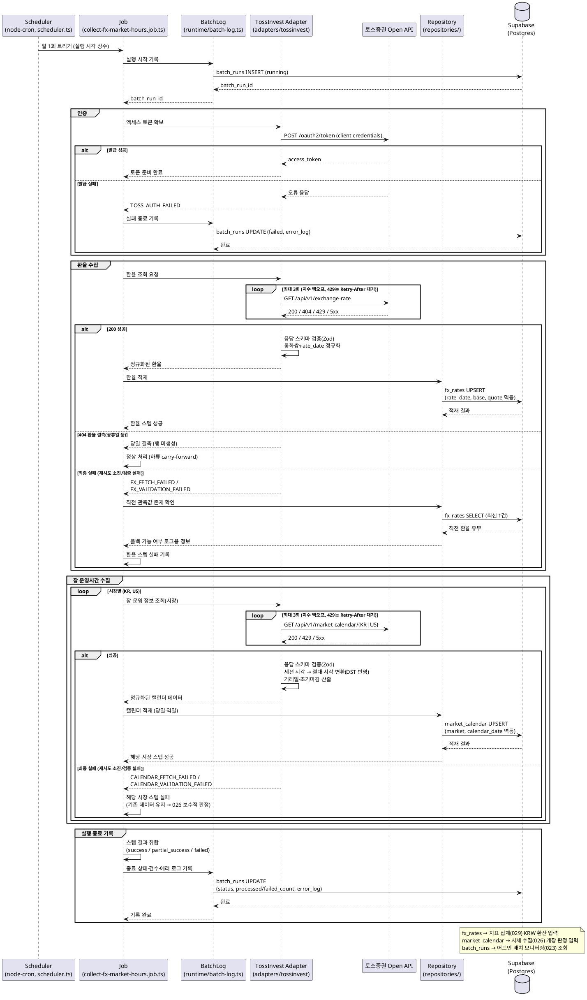

# UC-028: 환율·장 운영시간 수집 배치

> 관련 유저플로우: `docs/userflow.md` 028 · 관련 영역: 배치 워커(`apps/worker`) — 사용자 대면 페이지 없음(어드민 배치 모니터링 023에서 실행 이력 조회)
> 연계 기능: 026(시세 수집 — 개장 판정 입력), 029(일별 지표 집계 — KRW 환산 입력), 023(배치 모니터링 조회)
> 외부 연동: 토스증권 Open API (`docs/external/tossinvest-openapi.md`)

KRW↔USD 환율과 시장별(KRX/US) 장 운영시간·휴장일을 **1일 1회** 토스증권 Open API에서 수집해 자체 DB(`fx_rates`, `market_calendar`)에 적재한다. 수집 결과는 시세 수집 배치(026)의 개장 판정과 일별 체인 지표 집계(029)의 KRW 환산에 사용된다. 외부 API는 배치 적재 용도로만 호출되며 클라이언트는 자체 DB만 읽는다.

---

## Primary Actor

- **System** — 배치 워커의 스케줄러(node-cron)가 트리거하는 `collect-fx-market-hours` 잡. 사용자 직접 상호작용 없음.
- (간접 이해관계자) **Admin** — 배치 모니터링(023)에서 본 잡의 실행 상태·실패 로그를 조회한다.

## Precondition (사용자 관점)

- 서비스 운영자가 토스증권 Open API 자격증명(`client_id`/`client_secret`)을 발급받아 워커 환경변수에 설정해 두었다.
- 배치 워커 프로세스가 실행 중이며 스케줄러에 본 잡이 등록되어 있다.
- 대상 테이블(`fx_rates`, `market_calendar`, `batch_runs`)이 준비되어 있다.

## Trigger

- 스케줄러(node-cron)가 **1일 1회** 정해진 실행 시각(상수 관리)에 `collect-fx-market-hours` 잡을 트리거한다.
- 실행 시각은 시세 수집 배치(026)가 당일 개장 판정에 최신 캘린더를 사용할 수 있도록 **026보다 선행**하는 시각으로 설정한다.

## Main Scenario

1. 스케줄러가 실행 시각에 잡을 기동하고, 잡은 배치 로그를 통해 `batch_runs`에 실행 시작(`job_type=collect_fx_market_hours`, `status=running`)을 기록한다.
2. 잡이 토스 어댑터를 통해 OAuth 2.0 액세스 토큰을 확보한다(Client Credentials Grant, 토큰 캐시 재사용 가능).
3. **환율 수집**: 어댑터가 `GET /api/v1/exchange-rate`를 호출한다(MARKET_INFO 그룹 레이트리밋 준수).
4. 어댑터가 응답을 스키마(Zod)로 검증하고, 통화쌍(KRW↔USD)·환율값·기준 일자(`rate_date`=수집 기준일)로 정규화해 잡에 반환한다.
5. 잡이 리포지토리를 통해 `fx_rates`에 멱등 UPSERT 한다(유니크 키 `(rate_date, base_currency, quote_currency)` 기준 — 중복 실행 시 동일 일자 갱신).
6. **장 운영시간 수집**: 어댑터가 시장별로 `GET /api/v1/market-calendar/KR`, `GET /api/v1/market-calendar/US`를 호출한다.
7. 어댑터가 응답을 스키마 검증하고, 세션별 개장/폐장 시각을 **절대 시각(timestamptz)** 으로 변환(서머타임 자연 반영)하며 거래일 여부(`is_trading_day`)·조기 마감(`is_early_close`)을 산출한다.
8. 잡이 리포지토리를 통해 `market_calendar`에 멱등 UPSERT 한다(유니크 키 `(market, calendar_date)` 기준 — 당일 및 익일 캐시 갱신).
9. 잡이 스텝별 결과를 취합해 `batch_runs`를 종료 상태(`success`/`partial_success`/`failed`)와 처리 건수·에러 로그로 갱신한다. 이 기록이 최종 수집 시각의 근거가 된다.
10. (후속 연계) 시세 수집 배치(026)는 `market_calendar`로 실행 시각의 개장 여부를 판정하고, 일별 지표 집계 배치(029)는 `fx_rates`로 KRW 환산을 수행한다.

## Edge Cases

| 상황 | 처리 |
|---|---|
| 환율 API 장애/타임아웃 | 지수 백오프 3회 재시도(상수). 최종 실패 시 당일 `fx_rates` 행을 생성하지 않고 실패 기록 — 하류(029·조회)는 직전 관측값 이월(carry-forward)로 동작하므로 서비스는 지속된다. |
| 환율 결측/공휴일(고시 없음, `exchange-rate-not-found` 404) | 당일 행 미생성으로 정상 종료(결측 허용). 집계(029)와 조회 화면은 직전 관측값 이월로 사용한다. |
| 장 운영시간 데이터 지연/미제공 | 해당 시장 스텝만 실패 처리하고 기존 `market_calendar` 데이터를 유지한다. 026은 직전값 사용 또는 판정 불가 시 보수적 스킵(수집 생략)으로 동작한다. |
| 서머타임(DST) 등 시간대 전환 | `open_at`/`close_at`을 절대 시각(timestamptz)으로 저장하므로 전환이 자연 반영된다. 변환은 어댑터 정규화 단계에서 수행한다. |
| 레이트리밋 429 (`rate-limit-exceeded`) | `Retry-After` 헤더만큼 대기 후 재시도. 토큰버킷이 `X-RateLimit-Remaining`/`X-RateLimit-Reset` 헤더로 선제 감속한다. |
| 토큰 만료/무효 (`expired-token`/`invalid-token` 401) | 토큰 1회 재발급 후 해당 호출 재시도. 재발급 실패 시 잡 전체 실패 기록. |
| 서버 점검/일시 장애 (`maintenance`/`internal-error` 500) | 지수 백오프 재시도 대상. 최종 실패 시 실패 기록 + 직전 관측값 폴백(하류). |
| 응답 스키마 불일치(외부 스펙 변경) | 어댑터의 Zod 검증 실패 → 해당 스텝 실패 기록(검증 오류 상세를 `error_log`에 남김). 부분 저장 없이 스텝 단위로 중단한다. |
| 부분 성공(환율만 성공, 캘린더 실패 등) | `batch_runs.status=partial_success`로 기록하고 스텝별 실패 사유를 `error_log`에 남긴다. 다음 정기 주기에 자동 재수집된다. |
| 중복 실행/지연 실행 | `fx_rates`·`market_calendar` 모두 유니크 키 기반 UPSERT로 멱등 — 같은 일자 재실행은 값 갱신으로 수렴한다. |
| DB 적재 실패 | 해당 스텝 실패 기록(`error_log`), 상태는 실패 범위에 따라 `failed`/`partial_success`. 다음 주기에 재수집. |
| 잡 실행 자체 누락(워커 다운) | 실행 이력이 남지 않아 모니터링(023)에서 최근 실행 부재로 식별. 하류는 직전 관측값 이월로 동작한다. |

## Business Rules

1. **주기·선행 관계**: 1일 1회 실행(실행 시각 상수). 시세 수집(026)의 개장 판정보다 먼저 당일·익일 캘린더가 갱신되도록 스케줄한다.
2. **환율 시계열 보존**: 환율은 일별 시계열(`fx_rates`)로 보존한다. 일별 지표는 당일 환율, 분기 매출은 분기 말일 환율로 환산(029)하므로 과거 행은 수정하지 않고 일자별로 누적한다.
3. **결측 무가공 원칙**: 본 배치는 결측 일자를 임의 값으로 채우지 않는다. 결측 처리(직전 관측값 이월)는 집계(029)·조회(010/012/020) 단계의 책임이다.
4. **절대 시각 저장**: `market_calendar.open_at/close_at`은 timestamptz 절대 시각으로 저장해 서머타임 전환을 데이터로 자연 반영한다.
5. **멱등 적재**: 두 테이블 모두 유니크 제약 기반 UPSERT로 중복 실행에 안전하다.
6. **재시도 정책**: 호출 단위 3회 지수 백오프(상수). 429는 `Retry-After` 준수, 5xx는 백오프, 스키마 검증 실패는 재시도 없이 실패 처리(같은 응답 반복이므로).
7. **모니터링 의무**: 모든 실행은 시작/종료/상태/처리 건수/에러 로그를 `batch_runs`에 기록한다(023 조회 전용 소스). 워커와 웹은 이 테이블로만 디커플된다.
8. **배치 전용 외부 호출**: 토스증권 API는 본 배치에서만 호출하며 자격증명·호출 로직은 클라이언트에 절대 노출하지 않는다.
9. **레이트리밋 준수**: MARKET_INFO 그룹(초당 최대 3회) 한도를 토큰버킷으로 준수하고, 응답 헤더 기반으로 동적 감속한다.
10. **최종 수집 시각**: 별도 컬럼 없이 `batch_runs.finished_at`(및 각 행 `updated_at`)이 화면의 "최종 수집 시각" 표기 근거다.

### API Specification

> 본 기능은 사용자 대면 HTTP API를 제공하지 않는 배치 잡이다. 계약은 (1) 잡 트리거·실행 결과 계약, (2) 외부 API 입출력 계약으로 정의한다. 실행 이력 조회 API는 UC-023(배치 모니터링)의 범위다.

#### 1) 잡 트리거 계약

| 항목 | 내용 |
|---|---|
| 잡 식별자 | `collect_fx_market_hours` (`batch_job_type` enum) |
| 트리거 | 워커 스케줄러(node-cron) 1일 1회, 실행 시각 상수(예: `FX_MARKET_HOURS_CRON`) |
| 입력 파라미터 | 없음(파라미터리스). 실행 환경: `TOSSINVEST_CLIENT_ID`, `TOSSINVEST_CLIENT_SECRET` |
| 출력(적재) | `fx_rates` 통화쌍당 1행/일, `market_calendar` 시장×일자당 1행(당일·익일), `batch_runs` 실행당 1행 |
| 동시 실행 | 동일 잡 중복 기동 방지(스케줄 단일 등록). 데이터 계층은 UPSERT 멱등으로 이중 안전 |
| 성공 판정 | 환율·KR 캘린더·US 캘린더 3개 스텝 모두 성공 → `success`, 일부 성공 → `partial_success`, 전부 실패/인증 실패 → `failed` |

#### 2) 외부 API 입출력 계약 (토스증권 Open API)

| 호출 | Method/Endpoint | 요청 | 응답(요지) | 그룹/TPS |
|---|---|---|---|---|
| 토큰 발급 | `POST /oauth2/token` | `grant_type=client_credentials`, `client_id`, `client_secret` (form) | `access_token` 등 (`OAuth2TokenResponse`) | AUTH / 5 |
| 환율 조회 | `GET /api/v1/exchange-rate` | 헤더 `Authorization: Bearer {token}` | KRW↔USD 환율 (`ExchangeRateResponse`) | MARKET_INFO / 3 |
| 국내 장 운영 | `GET /api/v1/market-calendar/KR` | 헤더 동일 | KRX·NXT 세션별 시간 (`KrMarketCalendarResponse`: `KrMarketDay`/`KrMarketDetail`) | MARKET_INFO / 3 |
| 미국 장 운영 | `GET /api/v1/market-calendar/US` | 헤더 동일 | 데이마켓·프리·정규·애프터 세션 (`UsMarketCalendarResponse`: `UsMarketDay`) | MARKET_INFO / 3 |

- 필드 상세의 최종 SOT는 토스 공식 OpenAPI JSON이며, 어댑터의 응답 스키마(Zod)는 그 스펙 기준으로 정의한다.
- 모든 에러 응답은 `{ "error": { "requestId", "code", "message", "data?" } }` envelope이다.

**외부 에러 코드 → 잡 처리 매핑**

| HTTP | 외부 code | 잡 처리 |
|---|---|---|
| 401 | `invalid-token` / `expired-token` | 토큰 1회 재발급 후 재시도, 재실패 시 잡 실패 |
| 404 | `exchange-rate-not-found` | 당일 환율 결측으로 간주(행 미생성, 정상 흐름) — 하류 carry-forward |
| 429 | `rate-limit-exceeded` / `edge-rate-limit-exceeded` | `Retry-After` 대기 후 재시도(재시도 횟수 내) |
| 500 | `internal-error` / `maintenance` | 지수 백오프 3회 재시도, 최종 실패 시 스텝 실패 기록 |

#### 3) 실행 결과 계약 (batch_runs 기록)

| 필드 | 값 |
|---|---|
| `job_type` | `collect_fx_market_hours` |
| `status` | `running` → `success` \| `partial_success` \| `failed` |
| `processed_count` | 적재 성공 행 수(환율 + 캘린더 합산) |
| `failed_count` | 실패 스텝 수 |
| `error_log` | 스텝별 내부 에러 코드·외부 `requestId`·메시지 |

**내부 에러 코드(에러 로그 분류)**

| 내부 코드 | 의미 | 상태 영향 |
|---|---|---|
| `TOSS_AUTH_FAILED` | 토큰 발급/재발급 실패 | `failed` (전 스텝 진행 불가) |
| `FX_FETCH_FAILED` | 환율 호출 최종 실패(재시도 소진) | 환율 스텝 실패 |
| `FX_VALIDATION_FAILED` | 환율 응답 스키마 검증 실패 | 환율 스텝 실패(재시도 없음) |
| `CALENDAR_FETCH_FAILED` | 캘린더 호출 최종 실패(시장 구분 기록) | 해당 시장 스텝 실패 |
| `CALENDAR_VALIDATION_FAILED` | 캘린더 응답 검증/시각 변환 실패 | 해당 시장 스텝 실패 |
| `DB_UPSERT_FAILED` | 적재 실패(테이블 구분 기록) | 해당 스텝 실패 |

### Database Operations

| 테이블 | 작업 | 용도 |
|---|---|---|
| `fx_rates` | **UPSERT** (`(rate_date, base_currency, quote_currency)` 충돌 시 갱신) | 일별 KRW↔USD 환율 시계열 적재(멱등) |
| `fx_rates` | SELECT (최신 1건, 선택적) | 환율 스텝 실패 시 직전 관측값 존재 여부 확인·로그(폴백 가능성 표시) |
| `market_calendar` | **UPSERT** (`(market, calendar_date)` 충돌 시 갱신) | 시장별 거래일 여부·세션 개장/폐장 절대 시각·조기 마감 적재(당일·익일) |
| `batch_runs` | **INSERT** | 실행 시작 기록(`running`) |
| `batch_runs` | **UPDATE** | 종료 상태·처리/실패 건수·에러 로그 기록 |

- `batch_item_failures`는 종목 단위 재시도 추적용(FK `security_id`)이라 본 잡에서는 사용하지 않는다(스텝 실패는 `batch_runs.error_log`에 기록).
- `batch_checkpoints`는 백필(031) 전용으로 본 잡과 무관하다.
- DELETE 없음 — 환율·캘린더는 이력 보존 대상이다.

### External Service Integration

- **토스증권 Open API** (`docs/external/tossinvest-openapi.md`)
  - 인증: OAuth 2.0 Client Credentials(`POST /oauth2/token`), 모든 호출에 `Authorization: Bearer {token}`.
  - 사용 엔드포인트: `/api/v1/exchange-rate`, `/api/v1/market-calendar/KR`, `/api/v1/market-calendar/US` (모두 MARKET_INFO 그룹, 초당 최대 3회).
  - 레이트리밋: 자체 토큰버킷 + 응답 헤더(`X-RateLimit-Limit/Remaining/Reset`, 429 시 `Retry-After`) 기반 동적 감속.
  - 격리: 어댑터 계약(contract) 뒤에 클라이언트 구현을 격리해, 이용약관 이슈 등으로 데이터 소스를 교체해도 잡 로직 변경을 최소화한다(techstack 확정 사항).
  - 유의: 토스 오픈 API 이용약관의 제3자 제공·재배포 제한 조항은 키 발급 시 원문 수동 확인이 선행 과제다(techstack §10-2).
- **OpenDART / SEC EDGAR**: 본 기능과 무관(재무/공시 수집 027에서 사용).

---

## Sequence Diagram

