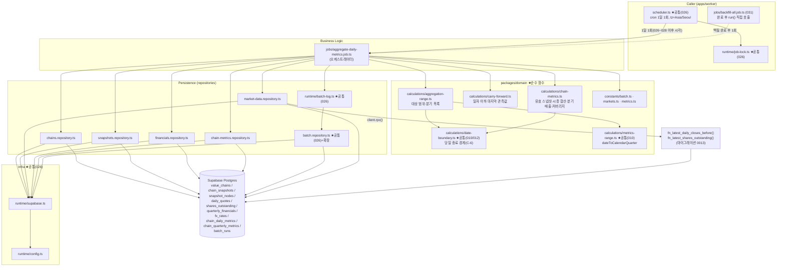

# Plan: UC-029 일별 체인 지표 사전 집계 배치 (aggregate-daily-metrics)

> 근거: `docs/usecases/029/spec.md`, `docs/usecases/000_decisions.md`(C-6·C-8·H-9), `docs/techstack.md` §4·§6·§7·§8,
> `docs/database.md` §1.1·§3.3~§3.9·§4.1·§4.2·§4.4·§4.5·§5,
> `supabase/migrations/0005_value_chains.sql`·`0006_chain_snapshots.sql`·`0007_price_timeseries.sql`·`0008_fundamentals.sql`·`0009_fx_and_market_calendar.sql`·`0010_chain_metrics.sql`·`0012_batch_runs.sql`,
> `docs/usecases/026/plan.md`(워커 공통 골격 SOT), `docs/usecases/010/plan.md`·`docs/usecases/012/plan.md`(도메인 날짜·분기 모듈 공유).
>
> - 본 배치는 **System 잡**이다. 사용자향 HTTP API·화면·Presentation 모듈이 없고, **외부 API도 호출하지 않는다**
>   (읽기 소스는 전부 자체 DB 정규화 테이블). 외부 연동 모듈은 Supabase 클라이언트(UC-026 plan 모듈 3 재사용)뿐이다.
> - 워커 공통 골격(패키지/`runtime/config.ts`/`runtime/supabase.ts`/`runtime/retry.ts`/`runtime/job-lock.ts`/
>   `runtime/batch-log.ts`/`repositories/batch.repository.ts`/`scheduler.ts`)은 **UC-026 plan이 최초 정의**했다.
>   본 plan은 재정의 없이 참조·확장만 한다(`batch.repository.ts` 함수 추가, `scheduler.ts` cron 1행 추가).
> - DB 스키마(`chain_daily_metrics`/`chain_quarterly_metrics` 등)는 0005~0012 마이그레이션으로 이미 존재한다.
>   신규 마이그레이션은 **집계 입력 조회용 RPC 함수 1건**(DISTINCT ON 패턴 2개 함수 — 테이블 변경 없음)뿐이다.
>   번호는 `0013`을 기본으로 하되 타 plan(007/008/010/012/015/026)이 선점하면 다음 빈 번호로 민다(멱등 `CREATE OR REPLACE`).
>
> **spec Open Questions 확정 (본 plan의 구현 결정)**
> 1. **정정 감지 메커니즘**: 소스 테이블 `updated_at` 기반으로 확정 — "직전 성공 실행 `started_at` 이후 갱신된 행"을 감지한다.
>    수집 배치(UC-027/028)가 재계산 기간을 명시적으로 전달하는 방식은 기각(잡 간 결합 발생, 027/028 plan 미작성 상태에서도 독립 구현 가능).
>    전 테이블에 `updated_at` 트리거가 이미 있어 스키마 무영향.
> 2. **일자 경계 D 해석**: 결정 **C-6** — Asia/Seoul 고정, **당일 종료(23:59:59) 경계 포함**. UC-010/012와 동일한 domain 공유 함수를 사용한다.
> 3. **커버리지 분모 m**: PRD 문구대로 **전체 노드 수(자유 주체 포함)** 유지(database.md Open Question 5의 기본안).
> 4. **분기 지표의 기준 스냅샷**: `min(분기 말일의 당일 종료 경계, 실행 시점)` 기준 유효 스냅샷으로 확정
>    — 확정 분기는 분기 말일 기준, 진행 중 분기는 실행 시점 기준이 단일 식으로 수렴한다.
> 5. **보관 체인**: 신규 집계 제외·기존 행 유지(spec안 유지). 보관 해제 후 공백 구간은 MVP에서 재집계하지 않는다
>    (행 없음 → 조회 측(UC-010/012)의 carry-forward·"미산출" 표기가 흡수. 재집계는 2단계).
>
> **spec 대비 의도된 단순화**: 입력 계약의 `correctionDateRanges`(배열)·`correctionQuarters`(배열)는
> **워터마크(최소 영향 일자·최소 영향 분기) 기반 연속 범위**로 구현한다 — `[min(기본 시작, 정정 최소 일자), 전일]` 단일 범위,
> 분기는 `[최소 영향 분기, 전일 소속 분기]` 연속 목록. UPSERT 멱등이라 superset 재계산은 안전하며(BR 6.2),
> 배열 병합·구간 산술 로직을 제거해 오류 표면을 줄인다(설계 원칙 4 — 오버엔지니어링 금지).
> **H-9 반영**: 환율 축적 시점 이전 일자/분기는 USD 종목을 KRW 환산하지 않고 **커버리지 n에서 제외**(부분 합산 — KRX만 환산)한다.

---

## 개요

### 공통(shared) 모듈 — 타 plan 정의분 참조 (본 plan 재정의 없음)

| 모듈 | 위치 | 정의 plan | 본 plan에서의 역할 |
| --- | --- | --- | --- |
| 워커 골격(패키지·config·Supabase 팩토리·retry·job-lock·batch-log·스케줄러) | `apps/worker/{package.json, src/runtime/*, src/scheduler.ts}` | UC-026 | 그대로 재사용. `scheduler.ts`에 cron 1행, `runtime/config.ts`는 변경 없음(토스 키 불필요 — Supabase 키만 사용) |
| 배치 리포지토리 | `apps/worker/src/repositories/batch.repository.ts` | UC-026 | **함수 2개 추가**(모듈 7): 직전 성공 실행 조회·running 중복 확인 |
| 배치 상수 | `packages/domain/constants/batch.ts` | UC-026 | **상수 추가**(모듈 1): 집계 cron·stale 기준·집계 창 크기 |
| 시장 상수 | `packages/domain/constants/markets.ts` | UC-026 | **상수 추가**(모듈 1): `FX_PAIR_USD_KRW` |
| 시계열 하한 상수 | `packages/domain/constants/metrics.ts`(`TIMESERIES_MIN_START_DATE='2015-01-01'`) | UC-010 (UC-012 `constants/timeline.ts`와 중복 선언 — 먼저 구현되는 쪽으로 통합) | E16 하한·최초 실행 전 범위 시작점 |
| 당일 종료 경계 계산 | `packages/domain/calculations/date-boundary.ts#toDayEndBoundary`, `todayInAppTz` | UC-010 (UC-012 `timeline-date.ts#toSeoulDayEndIso`와 기능 동일 — **하나로 통합, 재정의 금지**) | `effective_at <= D 경계` 판정의 단일 SOT(C-6). UC-012 타임라인 조회와 동일 상수·함수 공유(spec Open Q2 요건) |
| 역년 분기 변환 | `packages/domain/calculations/metrics-range.ts#dateToCalendarQuarter`, `quarterOrdinal` | UC-010 (UC-012 `calendar-quarter.ts`와 중복 — 통합) | 분기 축 산출·분기 순서 비교 |

### 신규 모듈 — 도메인 (packages/domain, 순수 로직)

| 모듈 | 위치 | 설명 |
| --- | --- | --- |
| 집계 상수 확장 | `packages/domain/constants/batch.ts`(추가), `markets.ts`(추가) | `AGGREGATE_DAILY_METRICS_CRON`, `BATCH_RUNNING_STALE_HOURS`, `AGGREGATION_DATE_WINDOW_DAYS`, `FX_PAIR_USD_KRW` |
| carry-forward 리졸버 | `packages/domain/calculations/carry-forward.ts` | 정렬된 관측 시계열에서 "일자 이하 마지막 관측값"을 찾는 제네릭 순수 함수(§4.5 패턴). 종가·환율 공용, UC-020 조회에서도 재사용 가능 |
| 집계 대상 범위 계산 | `packages/domain/calculations/aggregation-range.ts` | 일별 대상 범위(기본+정정 워터마크 병합·하한 클램프)·분기 대상 목록·일자 열거·분기 말일 산출 순수 함수 |
| 체인 지표 계산 | `packages/domain/calculations/chain-metrics.ts` | 유효 스냅샷 선정, 일별 가치총액·커버리지·이월 판정, 분기 매출 합산·제외 분류 — spec §6.1 산정 규칙의 단일 구현(순수 함수) |

### 신규 모듈 — 워커 (apps/worker)

| 모듈 | 위치 | 설명 |
| --- | --- | --- |
| 체인 리포지토리 | `apps/worker/src/repositories/chains.repository.ts` | `value_chains` 집계 대상(`is_archived=false`) SELECT |
| 스냅샷 리포지토리 | `apps/worker/src/repositories/snapshots.repository.ts` | 체인별 스냅샷 목록·스냅샷별 노드(전체 m + 상장기업 `security_id`/통화) SELECT |
| 시세·환율·주식수 리포지토리 | `apps/worker/src/repositories/market-data.repository.ts` | `daily_quotes`/`fx_rates`/`shares_outstanding` 범위 조회 + carry-forward 시드 RPC + 정정 워터마크 조회 |
| 재무 리포지토리 | `apps/worker/src/repositories/financials.repository.ts` | `quarterly_financials` 역년 축 분기 매출·연간 전용 판별·정정 워터마크 조회 |
| 지표 적재 리포지토리 | `apps/worker/src/repositories/chain-metrics.repository.ts` | `chain_daily_metrics`/`chain_quarterly_metrics` 청크 UPSERT(멱등), 체인 삭제 경합(E15) 판별 |
| 배치 리포지토리 확장 | `apps/worker/src/repositories/batch.repository.ts`(추가) | `findLatestRunByStatus`(직전 성공 실행), `findActiveRunningRun`(중복 기동 방지, stale 무시) |
| 집계 입력 RPC | `supabase/migrations/0013_fn_metric_aggregation_inputs.sql` | `fn_latest_daily_closes_before`(종목별 일자 이전 마지막 종가), `fn_latest_shares_outstanding`(종목별 최신 주식수, 소스 우선순위 tie-break) — DISTINCT ON 패턴(§4.4·§4.5)의 SQL 캡슐화(techstack §7) |
| 집계 잡 | `apps/worker/src/jobs/aggregate-daily-metrics.job.ts` | 오케스트레이터: 중복 방지 → 범위 산출 → 정정 감지 → 체인 순회(일별·분기) → 기록. 의존성 전부 주입형. UC-031 후속 트리거가 `run()`을 직접 호출 |
| 스케줄러 등록 | `apps/worker/src/scheduler.ts`(수정) | `cron.schedule(AGGREGATE_DAILY_METRICS_CRON, ..., { timezone: 'Asia/Seoul' })` 1행 추가 |

### 범위 밖 (다른 plan 소관)

- `daily_quotes`/`quarterly_financials`/`shares_outstanding`/`fx_rates` **적재**: UC-026/027/028 (본 잡은 읽기만).
- 집계 결과 **조회** API·화면: UC-010(대시보드)·UC-012(타임라인)·UC-007(메인 카드).
- `batch_runs` 조회 화면: UC-023 (본 잡은 기록까지만).
- 최초 전 종목 백필·후속 트리거 호출 주체: UC-031 (본 plan은 호출 가능한 `run()` 계약만 제공).
- 수동 재실행 트리거(어드민 UI): MVP 범위 밖(spec §3).
- 보관 해제 체인의 공백 구간 재집계: 2단계(Open Q5 확정 사항).

---

## Diagram

데이터 흐름: Scheduler → Job(비즈니스 로직) → Domain(순수 계산)·Repository(퍼시스턴스) → Supabase.
**외부 서비스 노드 없음** — spec §6.6에 따라 본 배치는 외부 API를 호출하지 않는다. 잡은 리포지토리 함수 시그니처와
domain 순수 함수에만 의존하고 SQL 문법을 알지 못한다(techstack §4 계층 분리).

---

## Implementation Plan

### 1. 도메인 상수 확장 (`packages/domain/constants/batch.ts`, `markets.ts` — UC-026 정의 파일에 추가)

- 구현 내용:
  1. `batch.ts` 추가: `AGGREGATE_DAILY_METRICS_CRON = '0 8 * * *'`(Asia/Seoul 기준 08:00 — 026 시세 확정·027 재무·028 환율 일일 잡 이후.
     026~028 cron 시각 확정 시 함께 조정하는 단일 지점), `BATCH_RUNNING_STALE_HOURS = 6`(이보다 오래된 `running` 행은
     크래시 고아로 간주하고 중복 판정에서 무시 — E10/E11 방어), `AGGREGATION_DATE_WINDOW_DAYS = 370`
     (대량 캐치업 시 체인×일자 처리를 창 단위로 분할 — E13·메모리 상한. 조회 페이지 크기 `DB_UPSERT_CHUNK_SIZE`는 026 상수 재사용).
  2. `markets.ts` 추가: `FX_PAIR_USD_KRW = { base: 'USD', quote: 'KRW' } as const`(0009 `fx_rates` 행 방향 리터럴 —
     `rate` = 1 USD당 KRW), `SHARES_SOURCE_PRIORITY = ['toss', 'dart', 'sec'] as const`(0008 §3.5 소스 우선순위 —
     RPC(모듈 5)의 tie-break 순서와 문서화 목적의 단일 SOT).
  3. 기존 상수(`BATCH_MAX_RETRY=3`, `DB_UPSERT_CHUNK_SIZE=1000`, `BATCH_ERROR_LOG_MAX_LENGTH`)는 그대로 재사용 — 재정의 금지.
- 의존성: UC-026 plan 모듈 9(파일 존재 전제 — 미구현 시 본 구현에서 026 정의대로 생성).
- **Unit Tests**:
  - [ ] `AGGREGATE_DAILY_METRICS_CRON`이 유효한 cron 표현식이다(파서 검증)
  - [ ] `FX_PAIR_USD_KRW`의 통화 리터럴이 DB enum `currency_code` 값('USD'/'KRW')과 일치한다

### 2. carry-forward 리졸버 (`packages/domain/calculations/carry-forward.ts`)

- 구현 내용:
  1. `createCarryForwardResolver<T>(observations: Array<{ date: IsoDate; value: T }>, seed?: { date: IsoDate; value: T } | null)`
     → `{ resolve(date: IsoDate): { value: T; observedDate: IsoDate; isCarried: boolean } | null }`.
     - `observations`는 `date` 오름차순 정렬 입력(리포지토리가 정렬 보장). `seed`는 범위 시작 이전 마지막 관측값(RPC 결과).
     - `resolve(D)`: `date <= D`인 마지막 관측값. `isCarried = observedDate < D`. 관측값이 전혀 없으면 `null`(E3 — 합산 제외 신호).
     - 오름차순 일자 순회 시 O(n+m)이 되도록 내부 커서 유지(같은 리졸버로 일자 오름차순 반복 호출 — 성능 E13).
  2. 종가(종목별)·환율(통화쌍별) 공용 제네릭. I/O·`Date.now()` 없음(순수).
- 의존성: 없음.
- **Unit Tests**:
  - [ ] 관측 [5/1, 5/3] + `resolve('5/3')` → 5/3 값·`isCarried=false`
  - [ ] `resolve('5/2')` → 5/1 값·`isCarried=true`(휴장 이월 — E2)
  - [ ] `resolve('4/30')`(첫 관측 이전, seed 없음) → `null`(E3)
  - [ ] seed(4/28) 존재 시 `resolve('4/30')` → seed 값·`isCarried=true`
  - [ ] 일자 오름차순 연속 호출 시 결과가 개별 호출과 동일하다(커서 최적화 무결성)
  - [ ] 관측 0건 + seed만 존재 → 모든 일자에 seed 이월

### 3. 집계 대상 범위 계산 (`packages/domain/calculations/aggregation-range.ts`)

- 구현 내용(전부 순수 함수, "오늘"·"현재 시각"은 인자 주입):
  1. `resolveDailyTargetRange({ prevSuccessStartedAt: string | null, correctionMinDates: Array<IsoDate | null>, today: IsoDate }): { from: IsoDate; to: IsoDate } | null`
     - `to = today - 1일`(전일 — 최근 확정 일자, BR 6.3).
     - `baseFrom`: `prevSuccessStartedAt` 존재 시 그 시각의 Asia/Seoul 일자(= 직전 성공이 집계한 마지막 일자(전일)의 익일),
       없으면 `TIMESERIES_MIN_START_DATE`(최초 실행·백필 후속 실행 = 전 기간 캐치업).
     - `from = min(baseFrom, correctionMinDates 중 최솟값)`을 `TIMESERIES_MIN_START_DATE`로 하한 클램프(E16).
     - `from > to`(당일 재실행 등) → `null`(일별 집계 없음 — 오류 아님).
  2. `resolveTargetQuarters({ correctionMinQuarter: {year, quarter} | null, fxCorrectionMinDate: IsoDate | null, hasPrevSuccess: boolean, to: IsoDate }): Array<{ year: number; quarter: number }>`
     - 시작 분기 = `min(재무 정정 최소 분기, fx 정정 최소 일자의 소속 분기)`; `hasPrevSuccess=false`면 2015Q1.
     - 종료 분기 = `dateToCalendarQuarter(to)`. 시작이 없으면(정정·신규 없음) 빈 배열.
     - `quarterOrdinal`(UC-010 모듈)로 연속 열거, 2015Q1 하한 클램프(E16).
  3. `enumerateDates(from, to): IsoDate[]`, `splitRangeByWindow(from, to, windowDays): Array<{from, to}>`(E13 창 분할),
     `quarterEndDate(year, quarter): IsoDate`, `quarterStartDate(year, quarter): IsoDate`.
- 의존성: 모듈 1, UC-010의 `metrics.ts`(하한 상수)·`metrics-range.ts`(`dateToCalendarQuarter`/`quarterOrdinal`), `date-fns`.
- **Unit Tests**:
  - [ ] 직전 성공 `started_at=2026-07-05T23:00Z`(KST 7/6 08:00), today=7/7 → `{from: '2026-07-06', to: '2026-07-06'}`(익일~전일)
  - [ ] 직전 성공 없음 → from=`2015-01-01`(최초 전 기간 캐치업)
  - [ ] 정정 최소 일자 6/20 < baseFrom 7/6 → from=`2026-06-20`(E6 재계산 범위 확장)
  - [ ] 정정 일자 `2014-01-01` → `2015-01-01` 클램프(E16)
  - [ ] 같은 날 재실행(baseFrom=today) → `null`(빈 범위)
  - [ ] 3일 공백 후 실행(직전 성공이 3일 전) → 3일치 범위(캐치업 — E10)
  - [ ] `resolveTargetQuarters`: 재무 정정 2025Q3 + to=2026-07-06 → [2025Q3, 2025Q4, 2026Q1, 2026Q2] 연속 목록
  - [ ] 정정·신규 없음 + 직전 성공 존재 → 빈 배열(분기 집계 스킵)
  - [ ] fx 정정 최소 일자 2026-01-15 → 시작 분기 2026Q1 반영
  - [ ] `splitRangeByWindow('2015-01-01','2026-07-06',370)` → 경계 누락·중복 없는 연속 창 목록
  - [ ] `quarterEndDate(2026,1)='2026-03-31'`, `(2026,4)='2026-12-31'`(윤년 2월 포함 경계)

### 4. 체인 지표 계산 (`packages/domain/calculations/chain-metrics.ts`)

- 구현 내용(전부 순수 함수 — spec 시퀀스 다이어그램의 Domain participant):
  1. `resolveEffectiveSnapshot(snapshots: Array<{ id, effectiveAt }>, boundaryIso: string): { id, effectiveAt } | null`
     — `effectiveAt <= boundaryIso` 마지막 1건(§4.1 패턴의 TS 구현 — 체인당 스냅샷 목록을 1회 로드해 일자별 재사용, E13).
     경계는 호출측이 `toDayEndBoundary(D)`(C-6)로 계산해 전달. 없으면 `null`(E7 스킵 신호).
  2. `calculateDailyChainMetric(input): { totalMarketCapKrw: number | null; coveredNodeCount: number; totalNodeCount: number; isCarriedForward: boolean }`
     - input: `{ totalNodeCount: number, listedNodes: Array<{ securityId, currency }>, closeOf(securityId) → {value, isCarried} | null, sharesOf(securityId) → number | null, fxRateAt() → {value, isCarried} | null }`
       (리졸버 함수 주입 — 모듈 2 결과물).
     - 규칙(spec §6.1): 종목별 시총 = 종가 × 최신 주식수(현지 통화). `currency='USD'`면 fx로 KRW 환산 — **fx가 `null`(축적 이전, H-9)이면
       해당 종목을 합산·n에서 제외**. 종가 또는 주식수 결측 종목도 제외(E3, m은 유지). 반올림은 소수 2자리(numeric(28,2) 정합).
     - `coveredNodeCount = 합산 반영 종목 수 n`, `totalNodeCount = m`(전체 노드 — Open Q3 확정).
     - `isCarriedForward = 반영 종목 중 이월 종가 사용 or 이월 환율 사용 존재`(E2).
     - **null/0 구분(BR 6.1)**: `n = 0`(상장기업 0개 포함 — E1)이면 `totalMarketCapKrw = null`. 합산 결과 0은 `0` 유지.
  3. `classifyQuarterlyConstituent(input: { quarterRow: { revenue: number | null, currency, isRevenueTagUnmapped: boolean } | null, hasAnnualOnly: boolean, fxRate: number | null }): 'included' | 'excluded_unmapped' | 'excluded_annual_only' | 'excluded_no_fx' | 'missing'`
     - `quarterRow` 존재 + `isRevenueTagUnmapped=true` → `excluded_unmapped`(E8).
     - `quarterRow` 없음 + `hasAnnualOnly=true` → `excluded_annual_only`(E8 — 20-F 연간 전용).
     - `quarterRow` 존재 + `revenue` 유효 + (`KRW` 또는 fx 존재) → `included`; USD인데 fx `null` → `excluded_no_fx`(H-9, n 제외).
     - 그 외(행 없음·revenue null) → `missing`(커버리지 미반영, 제외 수 미포함).
  4. `calculateQuarterlyChainMetric(input): { totalRevenueKrw: number | null; coveredNodeCount; totalNodeCount; excludedUnmappedCount }`
     - `included` 종목의 매출을 KRW 환산(분기 말일 환율 — 이월 허용) 합산. `excludedUnmappedCount = excluded_unmapped + excluded_annual_only` 수(spec §6.4 출력 계약 — "태그 미매핑·연간 전용 제외 기업 수").
     - `n = included 수`, `n = 0`이면 `totalRevenueKrw = null`(E1·C-8 정합 — 미산출은 null).
- 의존성: 모듈 2(리졸버 타입).
- **Unit Tests**:
  - [ ] `resolveEffectiveSnapshot`: 스냅샷 [5/1 10:00, 5/2 09:30] + 경계 5/2 23:59:59+09 → 5/2 스냅샷(당일 변경 포함 — E4·C-6)
  - [ ] 경계가 첫 스냅샷 이전 → `null`(E7)
  - [ ] 일별: KRX 2종목 정상 → Σ(종가×주식수), n=2, `isCarriedForward=false`
  - [ ] 일별: USD 종목 포함 + fx 존재 → 환산 합산, fx 이월이면 `isCarriedForward=true`
  - [ ] 일별: USD 종목 + fx 관측 전무(H-9) → 그 종목 제외, KRX만 합산, n 감소·m 유지
  - [ ] 일별: 종가 이월(휴장) 종목 포함 → 합산 반영 + `isCarriedForward=true`(E2)
  - [ ] 일별: 첫 관측 이전 종목(closeOf=null) → n 제외·m 유지(E3)
  - [ ] 일별: 주식수 없음 종목 → n 제외(시총 계산 불가)
  - [ ] 일별: 상장기업 0개(전부 자유 주체) → `totalMarketCapKrw=null`·n=0·m=전체(E1 — 0과 구분)
  - [ ] 일별: 합산 결과가 정확히 0(이론 케이스) → `0` 기록(null 아님)
  - [ ] 분기: 정상 2종목(KRW+USD) → 분기 말일 환율 환산 합산
  - [ ] 분기: `is_revenue_tag_unmapped=true` 1종목 → 합산 제외 + `excludedUnmappedCount=1`(E8)
  - [ ] 분기: 연간 전용(분기 행 없음+annual 존재) → 합산 제외 + `excludedUnmappedCount` 포함(E8)
  - [ ] 분기: 행 자체 없음(미수집) → `missing` — n·제외 수 모두 미포함
  - [ ] 분기: included 0 → `totalRevenueKrw=null`(C-8 — "미제공" 데이터 근거)
  - [ ] 금액 반올림이 소수 2자리로 고정된다(numeric(28,2) 정합)

### 5. 집계 입력 RPC (`supabase/migrations/0013_fn_metric_aggregation_inputs.sql`)

- 구현 내용(테이블 변경 없음 — 함수 2개, 멱등 `CREATE OR REPLACE`, `STABLE`, `SET search_path = public, pg_temp` — 기존 컨벤션):
  1. `fn_latest_daily_closes_before(p_security_ids uuid[], p_before date) RETURNS TABLE (security_id uuid, trade_date date, close_price numeric)`
     — `SELECT DISTINCT ON (security_id) ... FROM daily_quotes WHERE security_id = ANY(p_security_ids) AND trade_date < p_before AND close_price IS NOT NULL ORDER BY security_id, trade_date DESC`(§4.5 carry-forward 시드.
     `uq(security_id, trade_date)` 인덱스 활용). supabase-js가 DISTINCT ON을 표현할 수 없어 RPC로 캡슐화(techstack §7).
  2. `fn_latest_shares_outstanding(p_security_ids uuid[]) RETURNS TABLE (security_id uuid, shares numeric, as_of_date date, source data_source)`
     — `SELECT DISTINCT ON (security_id) ... FROM shares_outstanding WHERE security_id = ANY(p_security_ids) ORDER BY security_id, as_of_date DESC, CASE source WHEN 'toss' THEN 0 WHEN 'dart' THEN 1 ELSE 2 END`
     (§4.4 그대로 + 동일 `as_of_date` 복수 소스 시 우선순위 tie-break — `SHARES_SOURCE_PRIORITY`와 순서 일치, E5).
  3. `is_closing_confirmed` 필터는 걸지 않는다 — 미확정 잠정 종가도 해당 시점 최선값으로 사용하고, 이후 확정 UPSERT가
     `updated_at`을 갱신하면 정정 감지가 자동 재계산한다(E12).
  4. 적용은 `mcp__supabase__apply_migration`(로컬 Supabase 금지), 적용 후 `generate_typescript_types`로
     `packages/domain/types/database.ts` 재생성(techstack §7). 번호 경합 시 다음 빈 번호로 조정(함수명은 유일 — 내용 충돌 없음).
- 의존성: 기존 0007(daily_quotes)·0008(shares_outstanding). 신규 테이블·컬럼 없음.
- **검증 시나리오** (SQL 통합 테스트 — 시드 데이터로 실행):
  - [ ] 종목 A에 5/1·5/3 종가 존재, `p_before='2026-05-03'` → 5/1 행 1건(경계 미포함 — 시드는 "이전" 관측)
  - [ ] `close_price IS NULL` 행은 건너뛰고 그 이전 행을 반환한다
  - [ ] 관측 없는 종목은 결과에 나타나지 않는다(호출측 `null` 처리 — E3)
  - [ ] 동일 `as_of_date`에 toss·sec 두 행 → toss 행 반환(우선순위)
  - [ ] `as_of_date`가 더 최신인 sec 행 vs 과거 toss 행 → 최신 sec 행 반환(기준일 우선, 소스는 tie-break만)

### 6. 체인·스냅샷 리포지토리 (`repositories/chains.repository.ts`, `snapshots.repository.ts`)

- 구현 내용(UC-026 컨벤션: 모든 함수 `SupabaseClient` 인자 + discriminated union 결과 반환, throw 금지, 반환 행은 Zod row 스키마 검증 — spec 시퀀스의 "입력 행 스키마 검증(Zod)" 지점):
  1. `chains.repository.ts` — `findActiveChains(client)`: `from('value_chains').select('id').eq('is_archived', false)`
     (공식+사용자 전체 — BR 6.3, E14. 보관 체인 제외).
  2. `snapshots.repository.ts`:
     - `findSnapshotsByChain(client, chainId, untilIso)`: `from('chain_snapshots').select('id, effective_at').eq('chain_id', chainId).lte('effective_at', untilIso).order('effective_at', { ascending: true })`
       — 체인당 1회 로드 후 domain이 일자·분기별 재사용(`idx(chain_id, effective_at DESC)` 활용).
     - `findNodesBySnapshotIds(client, snapshotIds)`: `from('snapshot_nodes').select('snapshot_id, node_kind, security_id, securities(currency)').in('snapshot_id', snapshotIds)`
       → 스냅샷별 `{ totalNodeCount: 전체 행 수, listedNodes: node_kind='listed_company' 행의 { securityId, currency } }`로 그룹핑 반환.
       `.range()` 페이지네이션으로 전량 수집(스냅샷 다건 × 노드 최대 100 — PostgREST 행 상한 방어).
- 의존성: UC-026 모듈 3(Supabase 팩토리).
- **Unit Tests** (supabase 클라이언트 mock — 쿼리 빌더 호출 스냅샷):
  - [ ] `findActiveChains`가 `is_archived=false` 필터를 적용한다(E14)
  - [ ] `findSnapshotsByChain`이 `effective_at <= untilIso`·오름차순 정렬로 조회한다
  - [ ] `findNodesBySnapshotIds`가 스냅샷별 m(자유 주체 포함 전체 수)과 상장기업 목록(통화 포함)을 분리 집계한다
  - [ ] `security_id`가 null인 자유 주체 행이 listedNodes에 포함되지 않는다
  - [ ] DB 오류 시 `{ok:false, message}` 반환(throw 없음)

### 7. 시세·환율·주식수·재무 리포지토리 + 배치 리포지토리 확장 (`repositories/market-data.repository.ts`, `financials.repository.ts`, `batch.repository.ts` 추가분)

- 구현 내용:
  1. `market-data.repository.ts`:
     - `findDailyCloses(client, securityIds, from, to)`: `daily_quotes`에서 `security_id, trade_date, close_price`
       (`close_price NOT NULL`, `trade_date BETWEEN`) — `.range()` 페이지네이션 전량 수집, 종목별 오름차순 정렬 보장(모듈 2 입력 계약).
     - `findLatestClosesBefore(client, securityIds, before)`: `client.rpc('fn_latest_daily_closes_before', ...)`(모듈 5) — carry-forward 시드.
     - `findLatestShares(client, securityIds)`: `client.rpc('fn_latest_shares_outstanding', ...)` → 종목별 최신 주식수 Map(E5).
     - `findFxRates(client, pair, from, to)` / `findLatestFxBefore(client, pair, before)`: `fx_rates`에서
       `base_currency/quote_currency = FX_PAIR_USD_KRW` 행 범위 조회 + 시작 전 마지막 1건(`.lt().order(desc).limit(1)` — 단일 쌍이라 RPC 불필요).
     - **정정 워터마크(Open Q1 확정 — updated_at 기반)**: `findMinCorrectedQuoteDateSince(client, sinceIso)` /
       `findMinCorrectedFxDateSince(client, sinceIso)` / `findMinNewSharesAsOfSince(client, sinceIso)` —
       각각 `.gt('updated_at', sinceIso).order(대상일자, asc).limit(1)` 1행 조회로 최소 영향 일자만 반환
       (백필 직후 대량 갱신 상황에서도 1행 — 전체 행 스캔·전송 없음).
  2. `financials.repository.ts`:
     - `findQuarterRevenues(client, securityIds, year, quarter)`: `quarterly_financials`에서
       `period_type='quarter' AND calendar_year=year AND calendar_quarter=quarter` 행의
       `security_id, revenue, currency, is_revenue_tag_unmapped`(`idx(calendar_year, calendar_quarter)` 활용 — BR 6.1 역년 축).
     - `findAnnualOnlySecurities(client, securityIds, year, quarterStart, quarterEnd)`: `period_type='annual'`이고
       해당 분기와 기간이 겹치는(`period_start_date <= quarterEnd AND period_end_date >= quarterStart`,
       기간 결측 행은 `fiscal_year = year` 폴백) 행의 `security_id` 집합 — 연간 전용(20-F) 판별 입력(E8).
     - `findMinCorrectedQuarterSince(client, sinceIso)`: `period_type='quarter' AND updated_at > sinceIso`에서
       `calendar_year, calendar_quarter` 최소 1행(`order year asc, quarter asc limit 1`) — 분기 재계산 워터마크(E6).
  3. `batch.repository.ts` **추가분**(026 정의 파일에 함수 추가 — 기존 심볼 변경 없음):
     - `findLatestRunByStatus(client, jobType, status)`: `batch_runs`에서 해당 상태 최신 1행(`order started_at desc limit 1`,
       `idx(job_type, started_at DESC)` 활용) → 직전 성공 실행(대상 범위·정정 감지 기준 시각).
     - `findActiveRunningRun(client, jobType, staleBefore)`: `status='running' AND started_at >= staleBefore` 1행 존재 확인
       → 중복 기동 방지(E11). `staleBefore`보다 오래된 running 고아는 무시(`BATCH_RUNNING_STALE_HOURS`).
- 의존성: 모듈 1, 5, UC-026 모듈 3·7.
- **Unit Tests** (supabase 클라이언트 mock):
  - [ ] `findDailyCloses`가 `close_price NOT NULL`·범위 필터·페이지네이션을 적용하고 2,500행을 전량 수집한다
  - [ ] `findLatestShares`가 RPC 결과를 종목별 Map으로 변환한다
  - [ ] `findFxRates`가 `FX_PAIR_USD_KRW` 양방향 필터(base·quote)를 적용한다
  - [ ] 워터마크 3종이 `updated_at > sinceIso` + `order asc limit 1`로 호출되고, 0행이면 `null`을 반환한다
  - [ ] `findQuarterRevenues`가 역년 축(`calendar_year/quarter`)·`period_type='quarter'` 필터를 적용한다(회계 축 아님 — BR 6.1)
  - [ ] `findAnnualOnlySecurities`가 기간 겹침 조건과 `fiscal_year` 폴백을 함께 구성한다
  - [ ] `findActiveRunningRun`이 stale 경계 이전 running 행을 무시한다
  - [ ] Zod row 검증 실패 행 존재 시 `{ok:false}`로 분류된다(오염 데이터 조기 차단)

### 8. 지표 적재 리포지토리 (`repositories/chain-metrics.repository.ts`)

- 구현 내용:
  1. `upsertDailyMetrics(client, rows)`: `chain_daily_metrics`에 `DB_UPSERT_CHUNK_SIZE` 청크 반복
     `upsert(rows, { onConflict: 'chain_id,metric_date' })` — 재실행 멱등(BR 6.2, E11). 행:
     `{ chain_id, metric_date, based_on_snapshot_id, total_market_cap_krw(null 허용), covered_node_count, total_node_count, is_carried_forward }`.
  2. `upsertQuarterlyMetrics(client, rows)`: `onConflict: 'chain_id,calendar_year,calendar_quarter'` 동일 패턴. 행:
     `{ chain_id, calendar_year, calendar_quarter, based_on_snapshot_id, total_revenue_krw(null 허용), covered_node_count, total_node_count, excluded_unmapped_count }`.
  3. **E15(체인 삭제 경합) 판별**: Postgres 오류 코드 `23503`(FK 위반 — `chain_id` 소실)을
     `{ ok: false, kind: 'chain_deleted' }`로 분류해 잡이 실패가 아닌 스킵으로 처리하게 한다. 그 외 오류는 `{ ok: false, kind: 'db_error', message }`.
  4. UPSERT는 멱등이므로 청크 단위 1회 재시도 허용(UC-026 모듈 5 `withRetry` 재사용 — BR 6.3 "재시도 대상은 DB 연산 실패에 한정").
  5. 금액은 `number → numeric` 전달(소수 2자리 반올림은 domain 책임 — 모듈 4).
- 의존성: 모듈 1, UC-026 모듈 3·5.
- **Unit Tests** (supabase 클라이언트 mock):
  - [ ] 2,500행이 1,000/1,000/500 청크로 분할 upsert 되고 onConflict 키가 올바르다
  - [ ] `total_market_cap_krw: null` 행이 그대로 전달된다(0 변환 금지 — E1)
  - [ ] FK 위반(23503) 오류 → `{kind:'chain_deleted'}` 반환(E15)
  - [ ] 일반 DB 오류 → 1회 재시도 후 `{kind:'db_error'}` 반환
  - [ ] 빈 배열 입력 → DB 호출 없이 `{ok:true, count:0}`

### 9. 집계 잡 (`jobs/aggregate-daily-metrics.job.ts`)

- 구현 내용: `createAggregateDailyMetricsJob(deps)` → `{ run(now?: Date): Promise<void> }`.
  `deps = { repos: { chains, snapshots, marketData, financials, chainMetrics, batch }, batchLog, clock }` 전부 주입(테스트 mock).
  **UC-031 후속 트리거 계약**: 이 팩토리·`run()`이 잡의 유일한 진입점 — 백필 잡이 완료 후 동일 인스턴스의 `run()`을 1회 직접 호출한다(스케줄 외 호출 허용, 파라미터 동일).
  Main Scenario 1~10을 다음 스텝으로 분해(파일 내 private 함수, 1 파일 = 1 책임):
  1. **중복 기동 방지**(E11): `jobLock.tryAcquire('aggregate_daily_metrics')`(프로세스 내 1차) 실패 또는
     `findActiveRunningRun('aggregate_daily_metrics', now - BATCH_RUNNING_STALE_HOURS)`(DB 2차 — spec Main 2) 존재 시
     **신규 `batch_runs` 행 미생성**·경고 로그 후 즉시 종료(spec §6.4 오류 계약 "중복 기동").
  2. **기준 실행 조회**: `findLatestRunByStatus('aggregate_daily_metrics', 'success')` → `prevSuccess`.
     `sinceIso = prevSuccess?.started_at`(정정 감지 기준 — `finished_at`이 아닌 `started_at` 사용: 실행 중 갱신분 누락 방지).
     `partial_success`는 기준으로 삼지 않는다 — 실패분 범위가 다음 실행에 자동 포함(E9·E10 캐치업, UPSERT 멱등으로 중복 안전).
  3. **시작 기록**: `batchLog.start('aggregate_daily_metrics')` → runId.
  4. **대상 범위 산출**: `today = todayInAppTz(now)`; 정정 워터마크 4종 조회(sinceIso 없으면 스킵 — 전 기간이 이미 대상) →
     `dailyRange = resolveDailyTargetRange(...)`, `targetQuarters = resolveTargetQuarters(...)`(모듈 3).
     범위 산출용 조회 실패 → **잡 전체 실패**: `finish(failed, errorLog)` 후 종료(spec §6.4 — 다음 실행이 캐치업).
  5. **대상 체인 로드**: `findActiveChains()` — 실패 시 잡 전체 실패. 빈 목록이면 `success`/processed 0 종료.
  6. **체인 순회**(순차 — E13, 체인별 try/catch — E9): 각 체인에 대해
     a. `findSnapshotsByChain(chainId, toDayEndBoundary(dailyRange.to ?? today))` → 0건이면 체인 전체 스킵(행 미기록, 실패 아님 — E7).
     b. **일별 집계**(`dailyRange` 존재 시): `chainFrom = max(range.from, 첫 스냅샷 effective_at의 KST 일자)` —
        체인 생성 이전 일자 스킵(E7). `splitRangeByWindow(chainFrom, range.to, AGGREGATION_DATE_WINDOW_DAYS)` 창 단위로:
        - 창 내 일자별 유효 스냅샷 결정(`resolveEffectiveSnapshot` + `toDayEndBoundary(D)` — C-6·E4) → 관련 스냅샷 노드 로드(모듈 6).
        - 종목 유니버스에 대해 입력 일괄 로드: 최신 주식수(RPC), 창 범위 종가 + 창 시작 전 시드(RPC), fx 범위 + 시드 →
          종목별·통화쌍 `carry-forward` 리졸버 구성(모듈 2).
        - 일자별 `calculateDailyChainMetric`(모듈 4) → 행 버퍼(`based_on_snapshot_id` = 해당 일자 유효 스냅샷) → `upsertDailyMetrics`.
        - `chain_deleted` 결과 → 해당 체인 스킵 처리(실패 카운트 미포함 — E15).
     c. **분기 집계**(`targetQuarters` 중 체인 유효 분기만): 분기별 경계 = `min(toDayEndBoundary(quarterEndDate), now)`(Open Q4 확정) →
        유효 스냅샷 없으면 분기 스킵(E7). 노드 로드 → `findQuarterRevenues` + `findAnnualOnlySecurities` + 분기 말일 fx(carry-forward) →
        `classifyQuarterlyConstituent`/`calculateQuarterlyChainMetric`(모듈 4) → `upsertQuarterlyMetrics`.
     d. 체인 처리 중 오류(조회/검증/적재 실패) → `{ chainId, phase: 'daily'|'quarterly', message }` 누적 후 **다음 체인 계속**(E9).
  7. **종료 기록**(spec §6.4 출력 계약):
     - `processedCount` = UPSERT 성공한 체인×일자 행 수 + 체인×분기 행 수. `failedCount` = 실패 체인 수. `isCarriedOver = false` 고정(외부 API 한도 없음).
     - 실패 0 → `success`; 일부 체인 실패 → `partial_success` + `errorLog`(체인 식별자·원인 요약, `BATCH_ERROR_LOG_MAX_LENGTH` 상한);
       전 체인 실패 또는 4~5단계 실패 → `failed` + `errorLog`.
  8. **최상위 방어**: run 전체 try/catch — 예상 밖 예외는 `finish(failed)` 시도 후 종료(기록 실패는 console.error만 —
     running 고아는 `BATCH_RUNNING_STALE_HOURS` 경과 후 다음 실행이 무시하고 진행, E10). finally에서 lock release.
  9. **비재계산 원칙 확인**(E6·BR 6.2): 재계산 시에도 각 일자·분기의 기준 스냅샷은 동일 규칙으로 재선정된다(스냅샷 불변) —
     별도 "구조 변경 감지" 로직을 두지 않는다(구조 변경은 변경 시점 이후 일자에만 자연 반영).
  10. **시장 시차 주기**: 미국 종목의 `trade_date`는 미국 현지 일자라 KST 일자 D의 값은 통상 D-1 종가다 —
     carry-forward 규칙("D 이하 마지막 관측값")이 시차를 자연 흡수하므로 시장별 분기 로직을 두지 않는다.
- 의존성: 모듈 1, 2, 3, 4, 6, 7, 8, UC-026 모듈 5·6·7, UC-010/012 domain 날짜 모듈.
- **Unit Tests** (전 의존성 mock, `now` 고정 주입):
  - [ ] DB에 활성 running 행 존재 → `batch_runs` 신규 행 없이 스킵(E11)
  - [ ] stale running 행(7시간 전)만 존재 → 정상 실행(고아 무시)
  - [ ] 직전 성공 없음 → dailyRange가 `2015-01-01 ~ 전일`로 산출되어 전 기간 캐치업(백필 후속 실행 시맨틱)
  - [ ] 직전 성공 존재·정정 없음 → 익일~전일 범위만 집계, 분기 집계 미수행(워터마크 없음)
  - [ ] `daily_quotes` 정정 워터마크(6/20) 감지 → 6/20부터 재계산(E6·E12 — repository 호출 인자 검증)
  - [ ] 재무 정정 2025Q3 감지 → 2025Q3~현재 분기 각각 upsert(E6)
  - [ ] 스냅샷 0건 체인 → 일별·분기 모두 행 미기록·실패 미집계(E7)
  - [ ] 체인 생성일(첫 스냅샷 7/1)·범위 6/25~7/5 → 7/1~7/5만 집계(E7 부분 스킵)
  - [ ] 일자별 유효 스냅샷이 다른 경우(7/3에 새 스냅샷) → 7/2와 7/3 행의 `based_on_snapshot_id`가 다르다(BR 6.2)
  - [ ] 상장기업 0개 체인 → `total_market_cap_krw=null`·`covered=0`·`total=m` 행이 기록된다(E1 — 스킵 아님)
  - [ ] 2번째 체인 조회 실패 → 1·3번째 체인은 정상 처리, `partial_success`+failedCount=1+errorLog에 체인 식별자(E9)
  - [ ] `chain_deleted`(FK 위반) → 실패가 아닌 스킵, status에 영향 없음(E15)
  - [ ] 전 체인 실패 → `failed`
  - [ ] 대상 범위 산출 조회 실패 → `failed` + 이후 스텝 미수행(spec §6.4)
  - [ ] 동일 범위 2회 실행(mock 재호출) → upsert 입력이 동일(멱등 — E11)
  - [ ] 분기 경계: 진행 중 분기(말일 > now)의 스냅샷 경계가 `now`로 산출된다(Open Q4)
  - [ ] `processedCount` = 일별 행 수 + 분기 행 수, `isCarriedOver=false`로 종료 기록된다
  - [ ] 예상 밖 예외 → `finish(failed)` 호출·예외 미전파·락 해제

### 10. 스케줄러 등록 (`apps/worker/src/scheduler.ts` 수정)

- 구현 내용:
  1. 의존성 조립(리포지토리 5종 + batchLog) 후
     `cron.schedule(AGGREGATE_DAILY_METRICS_CRON, handler, { timezone: 'Asia/Seoul' })` 1행 추가
     (UC-026이 정의한 "후속 잡은 행 추가만" 계약 — 다른 잡 등록에 영향 없음).
  2. handler는 UC-026 모듈 8 패턴 그대로: 락 실패 시 스킵, 잡 예외 프로세스 비전파, finally release.
  3. 외부 어댑터 주입 없음(본 잡은 어댑터 미사용 — spec §6.6).
- 의존성: 모듈 1, 9, UC-026 모듈 8.
- **Unit Tests** (`registerSchedules(deps)` 분리 테스트):
  - [ ] `AGGREGATE_DAILY_METRICS_CRON` + `timezone: 'Asia/Seoul'`로 핸들러가 등록된다
  - [ ] 핸들러 실행 시 aggregate 잡의 `run()`이 호출된다
  - [ ] 잡 예외 발생 시 핸들러가 정상 종료하고 다른 잡 스케줄에 영향이 없다

---

## 구현 순서 및 검증

1. **도메인**: 모듈 1 → 2 → 3 → 4 (순수 함수, Vitest 선작성 — TDD Red→Green. UC-010/012의 날짜·분기 모듈이 미구현이면 해당 plan 정의대로 먼저 생성)
2. **DB**: 모듈 5 마이그레이션 작성 → `mcp__supabase__apply_migration` 적용(선점 번호 확인 후 넘버링) → 타입 재생성
3. **퍼시스턴스**: 모듈 6 → 7 → 8 (UC-026 워커 골격 미구현 시 026 plan 모듈 1~8을 먼저 구현)
4. **잡·스케줄러**: 모듈 9 → 10
5. 통합 검증: `npm run typecheck && npm run lint && npm run test` 무오류 + 아래 통합 QA 시트 확인

**통합 QA 시트** (로컬 `npm run dev:worker` + 시드 데이터, UC-023 화면 또는 SQL로 확인):

| # | 시나리오 | 기대 결과 |
| --- | --- | --- |
| 1 | 시세·환율·주식수·스냅샷 시드 후 최초 실행 | `chain_daily_metrics`에 체인 생성일~전일 행 적재, `based_on_snapshot_id`·커버리지 정확, `batch_runs` success |
| 2 | 동일 조건 즉시 재실행 | 행 수·값 불변(UPSERT 멱등 — E11), 2회차는 running 확인으로 스킵되거나 빈 범위로 processed 0 |
| 3 | 휴장일 포함 범위(주말) 실행 | 주말 일자 행이 직전 금요일 종가로 집계되고 `is_carried_forward=true`(E2) |
| 4 | 자유 주체만 있는 체인 | `total_market_cap_krw=null`·`covered=0`·`total=m` 행 기록(E1) — UC-010 화면에서 "지표 미산출" 표기 확인 |
| 5 | USD 종목 포함 체인 + 환율 시드 | 당일 환율로 KRW 환산 합산. 환율 축적 이전 과거 일자는 USD 종목이 n에서 제외(H-9) |
| 6 | 과거 `daily_quotes` 1행 수정(updated_at 갱신) 후 실행 | 해당 일자부터 전일까지 재계산되어 값 갱신(E6), `based_on_snapshot_id` 불변 |
| 7 | 신규 분기 재무 시드 후 실행 | 해당 역년 분기의 `chain_quarterly_metrics` UPSERT, 미매핑·연간 전용 기업이 `excluded_unmapped_count`에 집계(E8) |
| 8 | 체인 하나의 스냅샷 노드에 오염 데이터 주입(검증 실패 유도) | 해당 체인만 실패 기록, 나머지 체인 정상 → `partial_success`+`error_log` 상세(E9) |
| 9 | 보관(`is_archived=true`) 체인 | 신규 행 미생성, 기존 행 유지(E14) |
| 10 | 잡 실행 중 프로세스 강제 종료 후 6시간 내 재기동 | running 고아로 스킵 → `BATCH_RUNNING_STALE_HOURS` 경과 후 실행 시 정상 캐치업(E10) |
| 11 | 3일 미실행 후 실행 | 3일치 자동 캐치업(E10), UC-012 타임라인에서 공백 없이 조회 |
| 12 | 실행 이력 | `batch_runs`에 processed/failed/isCarriedOver=false가 기록되어 UC-023에서 조회 가능 |

## 다른 유스케이스와의 접점 (충돌 방지 메모)

- **워커 공통 골격은 UC-026 plan이 SOT** — 본 plan은 `batch.repository.ts` 함수 추가·`scheduler.ts` 행 추가만 하며
  기존 심볼(026의 insertRun/finishRun 등)을 변경하지 않는다. `adapters/*`는 사용하지 않는다(외부 API 미호출).
- **domain 날짜·분기 모듈 중복 주의**: UC-010(`date-boundary.ts`·`metrics-range.ts`·`constants/metrics.ts`)과
  UC-012(`timeline-date.ts`·`calendar-quarter.ts`·`constants/timeline.ts`)가 동일 기능을 각자 선언한 상태다.
  **구현 시 하나로 통합하고(먼저 구현되는 파일이 SOT) 본 잡은 그것을 import만 한다** — 당일 종료 경계·역년 분기 변환이
  집계(본 UC)와 조회(010/012)에서 단일 함수로 공유되어야 spec Open Q2의 "동일 상수 공유" 요건이 성립한다.
- **UC-027/028과의 결합 없음**: 정정 감지가 `updated_at` 기반(Open Q1 확정)이므로 수집 잡이 재계산 대상을 전달할 필요가 없다.
  단, `AGGREGATE_DAILY_METRICS_CRON`은 026~028 일일 잡 이후 시각이어야 하며, 그 plan들의 cron 확정 시 상수만 조정한다.
- **UC-031(백필) 접점**: 백필 완료 후 본 잡 `run()`을 1회 직접 호출한다(모듈 9 계약). 직전 성공이 없는 최초 실행은
  자동으로 전 기간(2015-01-01~) 캐치업이므로 별도 파라미터가 필요 없다. 백필 중 대량 `updated_at` 갱신도
  워터마크 1행 조회 방식이라 부하 문제가 없다.
- **UC-010/012/007 조회 계약**: 본 잡이 기록하는 `null`(미산출)과 `0`(집계값)·`is_carried_forward`·`excluded_unmapped_count`·
  `based_on_snapshot_id`는 조회 측 표기(미산출/이월/제외 수/기준 스냅샷)의 데이터 근거다 — 컬럼 의미 변경 금지.
  진행 중 분기는 재무 행이 없어 집계 행 자체가 생성되지 않으며, 조회 측이 C-8("미제공")로 표기한다.
- **UC-023 조회 계약**: `batch_runs.finished_at`·status·건수·`error_log`를 반드시 기록(UC-026과 동일 책임).
  중복 기동 스킵 시 행을 만들지 않는 것도 계약의 일부다(모니터링에 노이즈 미생성).
- **마이그레이션 번호 `0013`**: UC-007/008/010/012/015/026 plan도 후보로 선언한 상태 — 구현 순서대로 빈 번호를 점유하고
  본 파일명은 번호만 조정한다(함수명 `fn_latest_daily_closes_before`/`fn_latest_shares_outstanding`은 유일 — 내용 충돌 없음).
