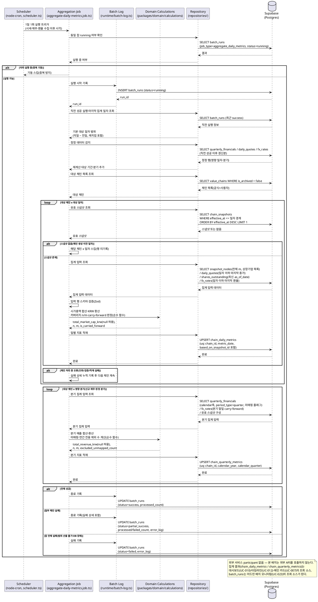

# UC-029: 일별 체인 지표 사전 집계 배치

> 근거: `docs/userflow.md` 029(및 용어·전제, 026~028·031 연계), `docs/prd.md` 6장(데이터·지표 정책), `docs/database.md` §1.1·§3.7·§4.1·§4.4·§4.5·§5, `docs/techstack.md` §4(worker: scheduler → jobs → repositories → Supabase)·§8(배치 스케줄링).
> 본 기능은 **System 배치**다. 사용자 직접 상호작용이 없으며, 외부 API를 호출하지 않고 자체 DB의 정규화 테이블(시세·재무·환율·스냅샷)만 읽어 집계 테이블에 적재한다. 집계 결과는 대시보드(UC-010)·타임라인(UC-012)·메인 카드(UC-007)의 조회 소스가 되고, 실행 이력은 어드민 배치 모니터링(UC-023)의 조회 소스가 된다.

---

## 1. Primary Actor

- **System (배치 워커 스케줄러)** — `apps/worker`의 node-cron 스케줄러가 트리거하는 `aggregate-daily-metrics` 잡(`batch_job_type = 'aggregate_daily_metrics'`).
- 사용자 직접 상호작용 없음. Admin은 실행 결과를 모니터링 화면(UC-023)에서 조회만 한다.

## 2. Precondition

- (사용자 관점의 선행 조건은 없다 — 배치는 사용자 입력 없이 동작한다.)
- 시스템 전제:
  - 시세 수집 배치(UC-026)가 대상 일자의 일별 종가를 확정 적재했다(`daily_quotes`).
  - 재무/상장주식수 수집 배치(UC-027)가 분기 재무·상장주식수를 적재했다(`quarterly_financials`, `shares_outstanding`).
  - 환율 수집 배치(UC-028)가 일별 환율을 적재했다(`fx_rates`).
  - 집계 대상 밸류체인과 스냅샷(`value_chains`, `chain_snapshots` 및 하위 구성)이 존재한다.
  - 일부 소스가 결측이어도 배치는 동작한다(carry-forward·커버리지로 흡수, Edge Cases 참조).

## 3. Trigger

- **정기 트리거**: node-cron 스케줄 — 1일 1회, 시세·재무·환율 수집 잡(026~028) 완료 이후 시각(실행 시각은 상수로 관리).
- **후속 트리거**: 최초 전 종목 백필 배치(UC-031) 완료 후 연결 실행 1회.
- 수동 재실행 트리거(어드민 UI)는 MVP 범위 밖(UC-023은 조회 전용).

## 4. Main Scenario

1. 스케줄러(node-cron)가 일별 지표 집계 잡을 실행한다.
2. 잡이 `batch_runs`에 실행 시작을 기록한다(`job_type=aggregate_daily_metrics`, `status=running`). 동일 잡이 이미 `running`이면 중복 실행을 방지한다.
3. **대상 일자 범위 산출**: 직전 성공 실행의 마지막 집계 일자 익일부터 실행 시점 기준 최근 확정 일자(전일)까지를 기본 범위로 잡는다(집계 공백 캐치업 포함).
4. **정정 감지**: 직전 성공 실행 이후 갱신된 소스 행(`quarterly_financials`/`daily_quotes`/`fx_rates`의 정정분)을 감지해, 영향받는 과거 일자·분기를 재계산 대상에 추가한다.
5. **대상 체인 로드**: 보관되지 않은(`is_archived=false`) 전체 밸류체인(공식+사용자)을 조회한다.
6. **체인 × 대상 일자별 일별 지표 집계**:
   1. 해당 일자 경계 이전 마지막 스냅샷(`effective_at <= D`)을 유효 구성으로 확정한다. 스냅샷이 없으면(체인 생성 이전 일자) 해당 일자를 스킵한다.
   2. 유효 스냅샷의 노드에서 전체 노드 수 m과 상장기업 노드(`node_kind=listed_company`)의 종목 목록을 산출한다.
   3. 종목별로 일별 종가(해당 일자 이하 마지막 관측값 — carry-forward)와 최신 상장주식수(`as_of_date` 최신 행)를 조회해 시가총액(현지 통화)을 계산한다.
   4. USD 종목은 해당 일자 환율(결측 시 carry-forward)로 KRW 환산 후 합산한다(순수 계산 함수, `packages/domain`).
   5. 종가·주식수가 확보된 종목 수를 커버리지 n으로, 이월값이 포함되면 `is_carried_forward=true`로 산출한다. 상장기업 노드가 0개이면 지표값 `null`(0과 구분)·커버리지 `0/m`으로 기록한다.
   6. `chain_daily_metrics`에 UPSERT 한다(`uq(chain_id, metric_date)`, `based_on_snapshot_id` 포함).
7. **체인 × 영향 분기별 분기 지표 집계**(신규 재무 적재·정정으로 영향받은 역년 분기만):
   1. 해당 분기 기준 유효 스냅샷의 상장기업 노드별로 분기 매출(`quarterly_financials`, 역년 정규화 축 `calendar_year/quarter`, `period_type=quarter`)을 조회한다.
   2. 태그 미매핑(`is_revenue_tag_unmapped=true`)·연간 전용(20-F 등 분기 행 없음) 기업은 합산에서 제외하고 `excluded_unmapped_count`로 집계한다.
   3. 분기 말일 환율(결측 시 carry-forward)로 KRW 환산 후 합산한다.
   4. `chain_quarterly_metrics`에 UPSERT 한다(`uq(chain_id, calendar_year, calendar_quarter)`, `based_on_snapshot_id` 포함).
8. 체인 단위 실패(조회 실패·검증 실패)는 실패 상세를 누적 기록하고 다음 체인 처리를 계속한다.
9. 잡 종료 시 `batch_runs`를 확정한다 — 전체 성공 `success`, 일부 실패 `partial_success`(처리/실패 건수·`error_log`), 전체 실패 `failed`.
10. 집계 결과는 대시보드(UC-010)·타임라인(UC-012)에서, 실행 이력은 배치 모니터링(UC-023)에서 조회된다.

## 5. Edge Cases

| # | 상황 | 처리 |
|---|---|---|
| E1 | 상장기업 노드 0개(전부 자유 주체) | 지표값 `null`(0과 구분)·`covered_node_count=0`·`total_node_count=m`으로 행 기록 → 조회 화면에서 "지표 미산출" 표시 근거 제공 |
| E2 | 시세/환율 결측 일자(휴장·미수집·장애) | 직전 관측값 이월(carry-forward)로 집계하고 `is_carried_forward=true` 기록. 차트의 거래일만 표시 처리는 조회 측(UC-010) 책임 |
| E3 | 최초 관측 이전이라 carry-forward 불가한 종목 | 해당 종목을 합산·커버리지 n에서 제외(부분 합산), m은 유지 |
| E4 | 구조 변경 당일 경계 | 유효 시점(어드민 승인/편집 시각) 기준 — `effective_at <= 일자 경계`인 마지막 스냅샷 적용. 경계 해석은 상수로 관리(Open Questions) |
| E5 | 상장주식수 기준일이 과거(미갱신) | 최신 보관값(`as_of_date` 최신 행)으로 계산. '주식수 기준일' 주석 데이터는 조회 시(UC-010) 산출 |
| E6 | 과거 재무/시세/환율 데이터 정정 | 영향 기간의 일별/분기 집계를 UPSERT로 재계산. **구조 변경분은 재계산하지 않음**(`based_on_snapshot_id` 기준 구성 고정 — 스냅샷 불변이므로 재계산 시에도 동일 스냅샷이 재선정됨) |
| E7 | 체인 생성 이전 일자(유효 스냅샷 없음) | 해당 체인×일자 스킵(행 미기록) — 실패로 취급하지 않음 |
| E8 | 미국 매출 태그 미매핑·연간 전용(20-F) 기업 | 분기 매출 합산에서 제외 + `excluded_unmapped_count`에 포함(UC-027 적재 플래그 기준) |
| E9 | 일부 체인 집계 실패 | 해당 체인 실패 기록 후 다음 체인 계속 → `partial_success` + `error_log` 상세, 다음 실행에서 미집계 범위 자동 캐치업 |
| E10 | 잡 전체 실패(DB 장애 등) | `batch_runs`에 `failed` 기록. 다음 정기 실행이 직전 성공 이후 범위를 캐치업 |
| E11 | 중복/지연/동시 실행 | `running` 상태 확인으로 중복 기동 방지 + UPSERT 멱등으로 재실행 안전 보장 |
| E12 | 수집 배치(026~028) 미완료·지연 상태에서 실행 | 가용 데이터 기준 carry-forward 집계 후, 다음 실행의 정정 감지로 자동 재계산 |
| E13 | 대량 체인/노드(상한 근접) | 체인 단위 순차 처리 + 소스 데이터 청크 조회로 성능 대응(체인당 노드 최대 100, 상수) |
| E14 | 보관(`is_archived=true`) 체인 | 신규 집계 대상에서 제외, 기존 집계 행은 유지(과거 시점 조회 보전) |
| E15 | 집계 중 체인 삭제(사용자 탈퇴/체인 삭제 경합) | 체인 삭제 시 지표는 CASCADE 삭제됨. 처리 중 사라진 체인은 실패가 아닌 스킵으로 처리 |
| E16 | 2015 사업연도 이전 구간 | 시계열 최소 시작 시점(상수) 이전은 집계·제공하지 않음(소스 자체가 ≥2015로 제한, UC-027) |

## 6. Business Rules

### 6.1 지표 산정 규칙

- **합산 대상**: 종목 마스터에 연결된 상장기업 노드(`node_kind=listed_company`)만. 자유 주체 노드는 합산 제외(분모 m에는 포함).
- **가치총액(일 단위)** = Σ(구성 상장기업 시가총액). 시가총액 = 일별 종가 × 최신 상장주식수(`as_of_date` 최신 행, `docs/database.md` §4.4).
- **구성 기업 매출 합계(분기 단위)** = Σ(구성 상장기업 분기 매출). **역년 정규화 축**(`calendar_year/quarter`)으로 합산해 결산월이 다른 기업을 동일 분기에 정렬한다.
- **KRW 환산**: 일별 지표는 당일 환율, 분기 매출은 분기 말일 환율. 환율 결측 시 직전 관측값 이월.
- **커버리지**: `covered_node_count`(지표 반영 종목 수 n) / `total_node_count`(전체 노드 수 m).
- **결측 이월(carry-forward)**: 시세/환율 결측 일자는 해당 일자 이하 마지막 관측값으로 집계하고 `is_carried_forward=true`를 기록한다(`docs/database.md` §4.5 패턴).
- **`null`과 `0`의 구분**: 산출 불가(상장기업 0개 등)는 `null`, 집계 결과 0은 `0`으로 기록한다.

### 6.2 스냅샷·재계산 규칙

- **유효 구성**: 각 일자 D의 지표는 `effective_at <= D 경계`인 마지막 스냅샷(`chain_snapshots`) 구성 기준으로 집계하며, `based_on_snapshot_id`로 기준을 명시한다.
- **구조 변경 비재계산**: 구조 변경(스냅샷 추가) 시 과거 집계는 재계산하지 않고, 변경 시점 이후부터 새 구성으로 집계한다.
- **데이터 정정 재계산**: 과거 재무/시세/환율 정정 시 **영향 기간의 일별/분기 집계를 UPSERT로 재계산**한다(구조 변경 비재계산 원칙과 별개). 스냅샷은 불변이므로 재계산 시에도 각 일자의 기준 스냅샷은 동일하게 재선정된다.
- **멱등성**: 모든 적재는 유니크 제약 기반 UPSERT — 같은 범위를 재실행해도 결과가 동일하다.

### 6.3 대상·스케줄 규칙

- **대상 체인**: `is_archived=false`인 전체 체인(공식+사용자). 사용자 체인도 타임라인·대시보드를 지원하므로 집계 대상이다.
- **대상 일자**: 직전 성공 실행의 마지막 집계 일자 익일 ~ 실행 시점 기준 최근 확정 일자(전일) + 정정 감지로 추가된 과거 기간.
- **실행 순서**: 시세 종가 확정(026)·재무(027)·환율(028) 수집 이후 1일 1회 실행(cron 시각 상수). 백필(031) 완료 후 후속 실행 1회.
- **실패 처리**: 체인 단위 실패는 기록 후 계속(부분 성공). 잡 재시도 정책은 배치 공통 규칙(지수 백오프 3회, 상수)을 따르되, 외부 API 미사용이므로 재시도 대상은 DB 연산 실패에 한정된다.

### 6.4 API Specification (배치 잡 계약)

본 배치는 **HTTP 엔드포인트를 제공하지 않는다.** 워커 프로세스 내부 잡으로만 실행되며, 웹과는 DB 테이블로만 결합된다(워커-웹 디커플, `docs/techstack.md` §8). 실행 이력 조회 API는 UC-023(배치 모니터링)의 계약을 따른다.

#### (1) 잡 트리거 계약

| 항목 | 값 |
|---|---|
| 잡 식별자 | `batch_job_type = 'aggregate_daily_metrics'` |
| 실행 모듈 | `apps/worker/src/jobs/aggregate-daily-metrics.job.ts` |
| 정기 트리거 | node-cron, 1일 1회(026~028 완료 이후 시각, 상수 관리) |
| 후속 트리거 | 백필 잡(UC-031) 완료 후 연결 실행 |
| 동시 실행 | 동일 잡 `running` 상태 존재 시 기동 스킵(중복 방지) |

#### (2) 입력 계약 (잡 파라미터·소스)

```typescript
{
  // 대상 일자 범위 — 미지정 시 기본값: 직전 성공 집계 익일 ~ 전일(캐치업 포함)
  targetDateRange: { from: string, to: string },        // YYYY-MM-DD
  // 정정 감지로 추가되는 재계산 기간(잡 내부 산출)
  correctionDateRanges: Array<{ from: string, to: string }>,
  correctionQuarters: Array<{ calendarYear: number, calendarQuarter: number }>,
  // 대상 체인 — is_archived=false 전체(공식+사용자)
  targetChains: 'all_active'
}
// 읽기 소스: value_chains, chain_snapshots(+snapshot_nodes),
//            daily_quotes, shares_outstanding, quarterly_financials, fx_rates
```

#### (3) 출력 계약 (적재·기록)

```typescript
{
  // 지표 적재 (UPSERT)
  chainDailyMetrics: Array<{
    chainId: string,
    metricDate: string,                    // YYYY-MM-DD
    basedOnSnapshotId: string,             // 해당 일자 유효 스냅샷
    totalMarketCapKrw: number | null,      // 미산출 시 null(0과 구분)
    coveredNodeCount: number,              // n
    totalNodeCount: number,                // m
    isCarriedForward: boolean              // 이월값 포함 여부
  }>,
  chainQuarterlyMetrics: Array<{
    chainId: string,
    calendarYear: number,                  // 역년 정규화 축
    calendarQuarter: number,               // 1~4
    basedOnSnapshotId: string,
    totalRevenueKrw: number | null,
    coveredNodeCount: number,
    totalNodeCount: number,
    excludedUnmappedCount: number          // 태그 미매핑·연간 전용 제외 기업 수
  }>,
  // 실행 이력 (batch_runs — UC-023 조회 소스)
  batchRun: {
    jobType: 'aggregate_daily_metrics',
    status: 'success' | 'partial_success' | 'failed',
    startedAt: string, finishedAt: string,
    processedCount: number,                // 처리한 체인×일자 + 체인×분기 건수
    failedCount: number,
    isCarriedOver: false,                  // 외부 API 한도 없음 — 이월 미사용
    errorLog: object | null                // 체인 단위 실패 상세
  }
}
```

#### (4) 오류 계약

| 상황 | 기록 |
|---|---|
| 체인 단위 실패(조회/검증/UPSERT 실패) | 다음 체인 계속 → `status=partial_success`, `failed_count` 증가, `error_log`에 체인 식별자·원인 |
| 잡 전체 실패(대상 범위 산출 불가, DB 장애) | `status=failed`, `error_log`에 원인 — 다음 실행이 자동 캐치업 |
| 중복 기동 | 실행 스킵(신규 `batch_runs` 행 미생성 또는 스킵 사유 기록) |

### 6.5 Database Operations

| 테이블 | 연산 | 용도 |
|---|---|---|
| `batch_runs` | SELECT / INSERT / UPDATE | 직전 성공 실행 조회(대상 범위 산출·중복 방지), 실행 시작 INSERT(`running`), 종료 UPDATE(상태·건수·`error_log`) |
| `value_chains` | SELECT | 집계 대상 체인 목록(`is_archived=false`, 공식+사용자) |
| `chain_snapshots` | SELECT | 일자별 유효 스냅샷 결정(`effective_at <= D` 마지막 1건, `idx(chain_id, effective_at DESC)`, `docs/database.md` §4.1) |
| `snapshot_nodes` | SELECT | 유효 스냅샷의 전체 노드 수 m·상장기업 노드 `security_id` 목록 |
| `daily_quotes` | SELECT | 종목별 해당 일자 이하 마지막 종가(carry-forward, §4.5), 종가 확정 여부 |
| `shares_outstanding` | SELECT | 종목별 최신 `as_of_date` 상장주식수(§4.4), 정정 감지 입력 |
| `fx_rates` | SELECT | 당일/분기 말일 환율(carry-forward), 정정 감지 입력 |
| `quarterly_financials` | SELECT | 역년 축 분기 매출·미매핑 플래그·연간 전용 여부, 정정 감지 입력 |
| `chain_daily_metrics` | INSERT / UPDATE (UPSERT) | 일별 가치총액·커버리지·carry-forward 적재(`uq(chain_id, metric_date)`) |
| `chain_quarterly_metrics` | INSERT / UPDATE (UPSERT) | 분기 매출 합계·커버리지·제외 수 적재(`uq(chain_id, calendar_year, calendar_quarter)`) |

- DELETE 없음. 체인 삭제 시 지표 정리는 FK CASCADE가 담당한다(UC-006/019).
- 복잡한 스냅샷 복원·롤업 집계는 Postgres 함수/뷰로 정의해 `client.rpc()`로 호출할 수 있다(`docs/techstack.md` §7, 마이그레이션 SQL이 SOT).
- 데이터 접근은 워커의 Repository 계층(`apps/worker/src/repositories/`)이 캡슐화하고, 잡·도메인 계산 로직은 Supabase 쿼리 문법을 알지 못한다.

### 6.6 External Service Integration

- **본 배치는 외부 서비스를 직접 호출하지 않는다.** 모든 입력은 자체 DB의 정규화 테이블이다(클라이언트·집계 모두 자체 DB만 사용, PRD 8장).
- 간접 의존(데이터 공급 경로, 각각 별도 유스케이스):
  - 토스증권 Open API → 시세(UC-026)·환율/장운영시간(UC-028) → `daily_quotes` / `fx_rates` (`docs/external/tossinvest-openapi.md`)
  - OpenDART → 국내 분기 재무·주식총수(UC-027) → `quarterly_financials` / `shares_outstanding` (`docs/external/opendart.md`)
  - SEC EDGAR → 미국 분기 재무·상장주식수(UC-027) → `quarterly_financials` / `shares_outstanding` (`docs/external/sec-edgar-api.md`)
- 상류 수집 장애 시에도 본 배치는 가용 데이터 기준 carry-forward·커버리지로 집계를 지속하며, 외부 API를 대체 호출하지 않는다.

---

## 7. Sequence Diagram



---

## 8. Open Questions

1. **정정 감지 메커니즘**: 본 문서는 "직전 성공 실행 이후 갱신된 소스 행 감지"로 기술했으나, 소스 테이블 `updated_at` 기반 감지 방식과 수집 배치(UC-027)가 재계산 대상 기간을 명시적으로 전달하는 방식 중 무엇으로 구현할지 확정 필요(스키마 무영향).
2. **일자 경계 D 해석**: `effective_at <= D`의 D를 당일 종료(23:59:59, 기준 시간대 포함)로 볼지 당일 시작으로 볼지 — `docs/database.md` Open Question 1과 동일하며, 타임라인 조회(UC-012)와 집계(본 UC)가 동일 상수를 공유해야 한다.
3. **커버리지 분모(m) 정의**: 본 문서는 PRD 문구대로 "전체 노드(자유 주체 포함)"로 기술 — `docs/database.md` Open Question 5. "상장기업 노드만"으로 확정되면 본 배치의 분모 산정만 조정.
4. **분기 지표의 기준 스냅샷 시점**: 확정 분기는 분기 말일 기준 유효 스냅샷, 진행 중 분기는 집계 실행 시점 기준으로 기술했으나 정책 확정 필요(`based_on_snapshot_id` 기록 기준).
5. **보관(is_archived) 체인의 집계 제외**: 본 문서는 신규 집계 제외·기존 행 유지로 기술 — 보관 체인 재공개(비공개 전환 해제) 시 공백 구간 처리 정책과 함께 확정 필요.
