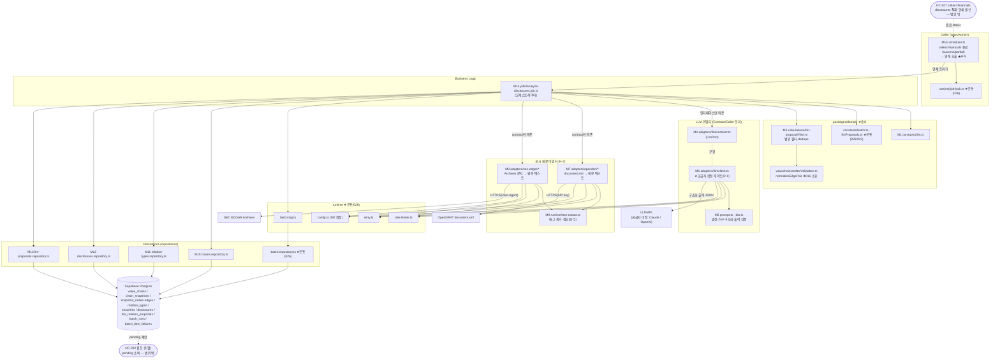

# Plan: UC-030 LLM 공시 분석·관계 변경안 생성 배치 (analyze-disclosures)

> 근거: `docs/usecases/030/spec.md`, `docs/usecases/000_decisions.md`(F-1, H-1~H-4, D-6·D-7), `docs/techstack.md` §4(worker: scheduler → jobs → adapters/llm → repositories)·§8(배치 스케줄링)·§9(환경변수)·§10(LLM 공급자 미정 — 어댑터 추상화),
> `docs/database.md` §1.3·§3.8·§3.9·§5, `supabase/migrations/0011_disclosures_llm.sql`·`0012_batch_runs.sql`(기존 스키마 — **신규 마이그레이션 없음**),
> `docs/usecases/026/plan.md`(워커 공통 골격의 SOT — 본 plan은 재정의 없이 참조), `docs/usecases/027/spec.md`(선행 잡·연쇄 트리거 계약), `docs/usecases/022/plan.md`(제안 큐 소비 측 계약·`packages/domain/constants/llmProposals.ts`), `docs/usecases/016/plan.md`(`normalizeEdgePair` D-6 정규화의 SOT),
> `docs/external/opendart.md`(§3 document.xml 공시서류원본파일)·`docs/external/sec-edgar-api.md`(User-Agent·레이트리밋·Archives 문서).
>
> - 사용자향 HTTP API·화면이 없는 **System 배치**다. Presentation 모듈은 없으며, 적재 결과 소비는 UC-022(검토 큐)·UC-023(모니터링) 소관이다.
> - 워커 공통 골격(패키지 골격·config·supabase 팩토리·rate-limiter·retry·job-lock·batch-log·batch.repository·scheduler)은 **UC-026 plan이 최초 정의** — 본 plan은 위치만 참조하고 재정의하지 않는다.
> - **외부 연동 3건**: ① LLM API(공급자 미정 — `adapters/llm/{contract,client}` 격리, 구현 직전 확정 게이트), ② OpenDART `document.xml`(국내 공시 원문 — 결정 H-2), ③ SEC EDGAR Archives 문서(미국 공시 원문 — 결정 H-2). ②·③의 어댑터 파일(`adapters/opendart/*`, `adapters/sec-edgar/*`)은 본 plan이 원문 조회 메서드만 최초 정의하고, UC-027 plan이 수집 메서드를 동일 contract에 추가한다(UC-026이 tossinvest contract를 후속 plan에 개방한 방식과 동일).
> - DB는 0011(`disclosures`/`llm_relation_proposals`)·0012(`batch_runs`/`batch_item_failures`)가 이미 최종 방어선(부분 유니크 `uq_llm_proposals_pending` NULLS NOT DISTINCT, `chk_llm_proposal_no_self`, 미분석 부분 인덱스)을 제공한다 — **테이블·함수 신규 마이그레이션 없음**.

---

## 사전 정합화 결정 (spec Open Questions·모호점 해소 — 구현 시 이 표를 따름)

| # | 사안 | 결정 | 근거 |
|---|---|---|---|
| R-1 | LLM 공급자 미정(spec OQ-1, H-1) | **어댑터 구현(M6) 착수 직전 확정 게이트**를 둔다. M1~M5·M7~M15는 공급자 무관이라 선구현 가능(테스트는 mock). 게이트 통과 절차: ① 공급자 확정(Anthropic Claude vs OpenAI) ② `docs/external/`에 연동 문서 추가(모델·구조화 출력 방식·토큰 한도·과금·레이트리밋) ③ SDK **하나만** 설치(`@anthropic-ai/sdk` 또는 `openai`) ④ 환경변수 키 1종 확정 | techstack §10, H-1 |
| R-2 | `relation_delete`의 관계 종류 NULL(spec OQ-4) | **모든 제안 유형에 `relationTypeId` 필수**(F-1 — NULL 불허, 앱 검증). 어댑터 출력 스키마(M5)에서 필수 강제 + 필터(M3)에서 활성 마스터 매핑 재검증. spec 6.4(3)의 `relationTypeId: string \| null` 계약은 F-1이 대체한다. DB 컬럼은 nullable이지만 본 배치는 non-null만 적재 | 000_decisions F-1 |
| R-3 | 공시 원문 fetch(spec OQ-2, H-2) | **원문 fetch 포함**(품질 우선). 단, fetch 최종 실패(재시도 소진·문서 없음·인코딩 불능)는 공시 실패가 아니라 **메타데이터-온리 폴백**으로 분석을 계속한다(원문 없는 분석이 기본선이었으므로 우아한 성능 저하 — 영구 미분석 루프·quota 낭비 방지). 원문은 `DISCLOSURE_CONTENT_MAX_CHARS`로 절단(토큰 비용 제어), DB에 영속하지 않는다(fetch는 회차당·공시당 1회, 관련 체인 간 공유) | H-2, BR-8 비용 제어 |
| R-4 | 상한 집계 기준(spec OQ-5, H-4) | 상한 = **LLM 호출 횟수(공시×체인) 기준** 상수. 단 포함/이월 판정은 **공시 단위로 원자적** — 그 공시의 관련 체인 호출 전부가 잔여 예산에 들어갈 때만 처리한다(일부 체인만 분석 후 `llm_analyzed_at` 마킹 시 나머지 체인 영구 누락 — E10·멱등성 붕괴 방지). 공시일 오름차순 순회 중 첫 초과 지점에서 중단하고 이후 전부 이월(순서 원칙 유지 — 소단위 끼워넣기 최적화 금지) | H-4, spec 4-5 |
| R-5 | `pending` 부분 유니크 충돌 처리 방식 | PostgREST `upsert(ignoreDuplicates)`의 `on_conflict`는 **부분 유니크 인덱스(WHERE pending)를 추론하지 못한다** → 사용 불가. 제안은 **행 단위 INSERT + 오류 코드 `23505` 캐치 → 스킵(병합)**으로 처리한다(회차당 제안 건수가 소량이라 행 단위로 충분). 1차 방어로 회차 내 인메모리 dedupe + 기존 pending 키 대조(M13 `listPendingKeys`)를 선행한다 — 무향 관계의 (A,B)/(B,A) 역방향 중복은 DB 유니크가 못 막으므로 앱 레벨 정규화 대조(D-6)가 필수 | spec E5·BR-7, D-6 |
| R-6 | `running` 중복 기동 검사 방식 | 워커는 단일 프로세스(techstack §8) — UC-026 공통 `runtime/job-lock.ts`(인메모리)로 충족한다. 크래시로 남은 고아 `running` 행은 기동을 막지 않으며(멱등 적재·`llm_analyzed_at` 마킹이 2차 방어 — E13·E16), UC-023 화면에서 식별된다. UC-026 모듈 6의 기결정 패턴을 그대로 따른다 | spec 4-2·E13, UC-026 plan 모듈 6 |
| R-7 | LLM 응답 검증 단위 | **봉투(envelope) 파싱 실패**(비JSON·`proposals` 배열 부재)는 재시도 대상(지수 백오프 3회 — BR-10), **개별 제안 항목의 스키마 위반**(별칭 미매핑·필수 필드 결측·F-1 위반)은 그 항목만 드롭하고 카운트한다(항목 1건 때문에 전체 재시도하는 재시도 폭주 방지 — E4 환각 방어는 항목 드롭 + 필터로 완결) | spec 4-6-2·E4 |
| R-8 | `processed_count` 정의 | 이번 회차에 `llm_analyzed_at`을 마킹한 공시 수(**LLM 분석 완료 + 무관 마킹 포함**). `error_log` 요약에 세부(분석 n·무관 마킹 m·적재 제안 k·필터 드롭 사유별·이월 c)를 기록해 UC-023에서 구분 가능하게 한다. `failed_count` = 최종 실패 공시 수 | spec 6.4(4), UC-023 조회 |
| R-9 | 연쇄 트리거 배선 계약 | `scheduler.ts`에서 **collect-financials 핸들러가 반환한 최종 status가 `success`/`partial_success`면 analyze-disclosures 핸들러를 즉시 호출**한다(각자 job-lock·오류 격리, `failed`면 미호출 — E12). 이를 위해 **UC-027 잡의 `run()`은 최종 `BatchRunStatus`를 반환해야 한다**(접점 표에 계약 명시). UC-027 구현 전에는 잡 조립·export만 존재하며 dev 검증은 잡 함수 직접 호출로 수행한다 | spec BR-11, UC-027 spec 4-17 |
| R-10 | `relation_update`/`relation_delete` 사전 필터 규칙 | UC-022 plan R-1과 **동일 규칙**을 기준 스냅샷에 사전 적용한다(승인 시점 자동 무효될 제안의 적재 자체를 차단 — 규칙 드리프트 방지): update = 재매핑 쌍의 엣지 **정확히 1건** 존재(0건/복수 → 드롭) + (쌍, 제안 종류) 엣지 미존재(무변경 → 드롭); delete = (쌍 + 제안 종류) 일치 엣지 존재(무향 종류는 역방향 포함 — D-6). add = (쌍 + 동일 종류) 미존재(서로 다른 종류 병존 제안은 허용 — BR-5) | spec BR-5, UC-022 R-1, D-6 |
| R-11 | 공식 체인 0개(E9)일 때의 무관 마킹 | **체인이 1개 이상 존재할 때만** 무관 공시를 마킹한다(H-3). 공식 체인이 아예 없으면(시드 전) 마킹·분석 없이 `success`(처리 0)로 종료 — 시드 전 대량 마킹으로 향후 분석 대상이 영구 제외되는 것을 방지 | spec E9, H-3의 보수적 적용 |
| R-12 | LLM 프롬프트의 노드/관계 종류 식별자 | 프롬프트에는 UUID 대신 **컴팩트 별칭**(`N1..Nn`/`R1..Rm`)을 사용하고 어댑터 경계(M5)에서 실 UUID로 역매핑한다(토큰 절감 + UUID 환각 방지). 실 UUID는 어댑터 밖으로만 흐른다 | BR-14 환각 방어 |
| R-13 | LLM 전면 장애 조기 중단 | 공시 처리 루프에서 LLM 최종 실패가 **연속 임계치(상수)**에 도달하면 잔여 공시를 미분석 이월로 남기고 루프를 조기 중단한다(전면 장애 시 무의미한 재시도 비용·시간 방지). 인증 오류(`LlmConfigError`)는 즉시 중단. 성공 0건이면 `failed`, 일부 성공이면 `partial_success`(E15) | spec E15 |
| R-14 | `error_log` 표현 | DB 컬럼은 `text`(0012) — spec 6.4(4)의 `errorLog: object`는 **요약 JSON 직렬화 문자열**로 기록하고 길이 상한(`BATCH_ERROR_LOG_MAX_LENGTH`, UC-026 상수 재사용)을 적용한다. 공시 단위 상세는 `batch_item_failures`가 SOT | UC-026 plan 모듈 7과 동일 규약 |

---

## 개요

### 공통(shared) 모듈 — 위치만 참조 (UC-026 plan 정의, 본 plan 신규 정의 없음)

| 모듈 | 위치 | 설명 |
| --- | --- | --- |
| 워커 골격·환경설정 | `apps/worker/{package.json,tsconfig.json,vitest.config.ts}`, `src/runtime/config.ts` | UC-026 정의. 본 plan은 config에 키 3종만 **추가**(M2) |
| Supabase 클라이언트 팩토리 | `apps/worker/src/runtime/supabase.ts` | service-role 싱글턴 + 타임아웃 fetch |
| 레이트리미터/재시도/잡락 | `apps/worker/src/runtime/{rate-limiter.ts,retry.ts,job-lock.ts}` | 토큰버킷(그룹별)·`withRetry`(지수 백오프 3회+jitter+Retry-After)·인메모리 중복 기동 방지 |
| 배치 기록 | `apps/worker/src/runtime/batch-log.ts`, `src/repositories/batch.repository.ts` | `start/finish/itemFailures/resolve` — `batch_runs`/`batch_item_failures` 기록 |
| 배치 상수 | `packages/domain/constants/batch.ts` | `BATCH_MAX_RETRY=3`, `BATCH_RETRY_BASE_DELAY_MS`, `DB_UPSERT_CHUNK_SIZE`, `WORKER_HTTP_TIMEOUT_MS`, `BATCH_ERROR_LOG_MAX_LENGTH` 재사용 |
| 제안 도메인 리터럴 | `packages/domain/constants/llmProposals.ts` | UC-022 plan M3 정의 — `LLM_PROPOSAL_TYPES`/`LLM_PROPOSAL_STATUSES` 리터럴 재사용(DRY) |
| D-6 무향 정규화 | `packages/domain/valuechains/editorValidation.ts` | UC-016 plan M2 정의 — `normalizeEdgePair(sourceId, targetId, isDirected)` 재사용(중복 판정 단일 SOT) |

### 기능(analyze-disclosures) 모듈 — 본 plan 소유

| # | 모듈 | 위치 | 설명 |
| --- | --- | --- | --- |
| M1 | LLM 배치 상수 | `packages/domain/constants/llm.ts` | 일일 호출 상한(H-4)·원문 절단 길이·LLM 타임아웃·연속 실패 임계 등 — 하드코딩 금지의 단일 진입점 |
| M2 | 워커 config 확장 | `apps/worker/src/runtime/config.ts` (수정) | `ANTHROPIC_API_KEY`/`OPENAI_API_KEY`(optional), `OPENDART_API_KEY`(optional), `SEC_EDGAR_USER_AGENT`(optional) 스키마 추가 — 실검증은 각 어댑터 팩토리 책임 |
| M3 | 제안 범위 필터(순수 로직) | `packages/domain/calculations/llm-proposal-filter.ts` | 기존 노드 매핑·자기 참조·활성 관계 종류·유형별 정합(R-10)·회차 내/기존 pending 중복 dedupe — 순수 함수(BR-2·BR-4·BR-5·BR-7) |
| M4 | LLM 어댑터 계약 | `apps/worker/src/adapters/llm/contract.ts` | `LlmPort` 인터페이스 + 입력/출력 모델 + 오류 타입(`LlmConfigError`/`LlmRequestError`). 잡이 의존하는 유일한 LLM 표면(BR-13) |
| M5 | LLM 프롬프트·출력 스키마 | `apps/worker/src/adapters/llm/prompt.ts`, `apps/worker/src/adapters/llm/dto.ts` | 별칭 기반 프롬프트 생성(순수 함수, R-12) + 구조화 출력 Zod 스키마·별칭 역매핑(BR-14, R-7) |
| M6 | LLM 어댑터 구현 | `apps/worker/src/adapters/llm/client.ts` | 【외부 연동 — 공급자 확정 게이트 R-1】 구조화 출력 강제 호출·타임아웃·재시도·레이트리밋 |
| M7 | OpenDART 원문 어댑터(기여분) | `apps/worker/src/adapters/opendart/{contract.ts,client.ts}` | 【외부 연동】 `document.xml`(rcept_no) → ZIP 스트림 추출 → 텍스트. UC-027이 동일 contract에 수집 메서드 추가 |
| M8 | SEC EDGAR 원문 어댑터(기여분) | `apps/worker/src/adapters/sec-edgar/{contract.ts,client.ts}` | 【외부 연동】 disclosures.url(Archives 문서) fetch(User-Agent 필수) → 텍스트. UC-027이 동일 contract에 벌크 메서드 추가 |
| M9 | 문서 텍스트 추출 유틸 | `apps/worker/src/runtime/text-extract.ts` | HTML/XML 태그 제거·엔티티 디코드·공백 정규화·절단 + 버퍼 인코딩 판별(EUC-KR/UTF-8) — M7/M8 공용 순수 함수 |
| M10 | 체인 컨텍스트 리포지토리 | `apps/worker/src/repositories/chains.repository.ts` | 공식 활성 체인 + 체인별 최신 스냅샷 구성(노드·엣지·securities 조인) 로드 |
| M11 | 관계 종류 리포지토리 | `apps/worker/src/repositories/relation-types.repository.ts` | 활성 관계 종류(`is_active=true`) 목록 |
| M12 | 공시 리포지토리 | `apps/worker/src/repositories/disclosures.repository.ts` | 미분석 공시 청크 스캔(부분 인덱스)·`llm_analyzed_at` 마킹 |
| M13 | 제안 리포지토리 | `apps/worker/src/repositories/llm-proposals.repository.ts` | 기존 pending 키 조회 + 행 단위 INSERT(23505 스킵 — R-5) |
| M14 | LLM 분석 잡 | `apps/worker/src/jobs/analyze-disclosures.job.ts` | 오케스트레이터: 컨텍스트 로드 → 선별/상한 → 원문 fetch → LLM 호출 → 필터 → 적재 → 마킹 → 기록. 전 의존성 주입형 |
| M15 | 스케줄러 연쇄 배선 | `apps/worker/src/scheduler.ts` (수정) | 잡 의존성 조립 + collect-financials 종료 status 연쇄 트리거(R-9). cron 등록 아님 |

### 범위 밖 (다른 plan 소관)

- `disclosures` **적재**(UC-027 — 본 잡은 읽기·`llm_analyzed_at` 마킹만), 공시 수집 잡 `collect-financials.job.ts` 자체와 그 어댑터 수집 메서드.
- `llm_relation_proposals`의 **소비**(승인/거부/무효 전환·스냅샷 생성): UC-022. 본 잡은 `pending` INSERT만 — 기존 제안 행 UPDATE/DELETE 없음(BR-6).
- `chain_snapshots` 및 하위 테이블 쓰기: 없음(BR-6 — 승인은 UC-022의 `approve_llm_proposal` RPC 전속).
- 배치 실행 이력 조회 화면/API: UC-023. 수동 재실행 트리거: MVP 제외(spec 3장).
- 체인 신규 편입 종목의 과거 공시 소급 분석: 2단계(H-3).

---

## Diagram

데이터 흐름: Scheduler(연쇄) → Job(비즈니스 로직) → LLM/원문 Adapter(외부)·Repository(퍼시스턴스) → Supabase. 잡은 `contract.ts`·리포지토리 함수 시그니처·domain 순수 함수에만 의존하고 SDK/HTTP/SQL 문법을 알지 못한다(techstack §4 계층 분리). 본 배치는 `chain_snapshots` 및 하위 테이블에 쓰지 않는다(BR-6).

---

## Implementation Plan

### M1. LLM 배치 상수 — `packages/domain/constants/llm.ts`

- 구현 내용:
  1. `ANALYZE_DISCLOSURES_DAILY_LLM_CALL_LIMIT = 200` — 일일 분석 상한, **LLM 호출(공시×체인) 횟수 기준**(H-4, R-4). 운영 조정은 이 상수만 변경(BR-8 하드코딩 금지).
  2. `DISCLOSURE_CONTENT_MAX_CHARS = 20_000` — 공시 원문 발췌 절단 길이(R-3, 토큰 비용 제어).
  3. `LLM_REQUEST_TIMEOUT_MS = 60_000` — LLM 호출 타임아웃(생성형 응답 지연 감안, `WORKER_HTTP_TIMEOUT_MS`와 별도).
  4. `LLM_CONSECUTIVE_FAILURE_ABORT_THRESHOLD = 5` — 전면 장애 조기 중단 임계(R-13).
  5. `LLM_RATIONALE_MAX_LENGTH = 2_000` — `rationale` 적재 상한(비정상 장문 방어).
  6. 재시도 횟수·기본 지연은 `constants/batch.ts`의 `BATCH_MAX_RETRY`/`BATCH_RETRY_BASE_DELAY_MS` 재사용(BR-10 — 별도 상수 만들지 않음, DRY). 프레임워크·DB 의존 없음(techstack §4 domain 원칙).
- 의존성: 없음(최우선 구현).
- **Unit Tests**:
  - [ ] `ANALYZE_DISCLOSURES_DAILY_LLM_CALL_LIMIT`가 1 이상 정수다
  - [ ] `DISCLOSURE_CONTENT_MAX_CHARS`·`LLM_REQUEST_TIMEOUT_MS`·임계 상수가 양수다

### M2. 워커 config 확장 — `apps/worker/src/runtime/config.ts` (수정)

- 구현 내용:
  1. UC-026이 정의한 zod 스키마에 **optional 키 4종 추가**: `ANTHROPIC_API_KEY`, `OPENAI_API_KEY`, `OPENDART_API_KEY`, `SEC_EDGAR_USER_AGENT`(전부 `z.string().min(1).optional()`) — techstack §9의 키 이름 그대로.
  2. 기동 시점 필수 검증은 하지 않는다(collect-quotes만 도는 환경을 깨지 않음 — 추가만, 기존 필수 4종 불변). **키 존재의 실검증은 각 어댑터 팩토리 책임**: LLM 키 부재는 잡 수준 실패(E14, M6), OpenDART 키/SEC UA 부재는 원문 fetch 불가 → 메타데이터-온리 폴백 + 경고 로그(R-3, M7/M8).
  3. 공급자 확정(R-1) 후에도 두 키를 모두 스키마에 남기되 사용은 하나만 한다(spec 2장 — "공급자 확정 후 하나만 사용").
- 의존성: UC-026 모듈 2(기존 파일 수정 — 기존 키·동작 비파괴).
- **Unit Tests**:
  - [ ] LLM 키 없이도 config 파싱이 성공한다(optional — 기존 잡 비파괴)
  - [ ] `ANTHROPIC_API_KEY`가 빈 문자열이면 파싱 실패(min 1)
  - [ ] 기존 필수 4종 누락 시 기존과 동일하게 실패한다(회귀 방지)

### M3. 제안 범위 필터 — `packages/domain/calculations/llm-proposal-filter.ts` (Business Logic, 순수)

- 구현 내용 (전부 순수 함수 — I/O 없음, `normalizeEdgePair`(UC-016 M2) 재사용):
  1. 타입 정의: `ChainAnalysisContext { chainId, latestSnapshotId, nodes: Array<{ nodeId, displayName, nodeKind }>, edges: Array<{ sourceNodeId, targetNodeId, relationTypeId }> }`, `ActiveRelationType { relationTypeId, name, isDirected }`, `LlmProposalCandidate { proposalType, sourceNodeId, targetNodeId, relationTypeId, rationale }`(M4와 공유 — UUID 역매핑 완료 후 형태).
  2. `buildProposalDedupeKey(chainId, sourceNodeId, targetNodeId, relationTypeId, proposalType, isDirected): string` — **무향 종류는 `normalizeEdgePair`로 노드 쌍을 정렬 정규화**한 조합 키(D-6). 기존 pending 대조(M13)·회차 내 dedupe가 공유하는 단일 키 규칙.
  3. `filterProposalCandidates(candidates, ctx, activeTypes, existingPendingKeys: ReadonlySet<string>): { accepted: AcceptedProposal[], dropped: Array<{ candidate, reason }> }` — 후보별 판정 순서(spec 4-6-3):
     - `UNKNOWN_NODE`: source/target이 `ctx.nodes`에 없음(신규 노드 필요 제안 — E1/E2, BR-2)
     - `SELF_REFERENCE`: 재매핑 후 동일 노드(BR-5 — DB CHECK의 사전 차단)
     - `MISSING_RELATION_TYPE`/`INACTIVE_RELATION_TYPE`: `relationTypeId` 결측(F-1 위반, R-2) 또는 활성 마스터에 없음(E3, BR-4)
     - 유형별 정합(R-10, 무향 비교는 2의 키 규칙 공유):
       - `relation_add` — (쌍+동일 종류) 엣지 기존재 → `DUPLICATE_EDGE`(다른 종류 병존 제안은 통과)
       - `relation_update` — 쌍의 엣지 0건 → `EDGE_NOT_FOUND`, 2건 이상 → `UPDATE_AMBIGUOUS`, (쌍+제안 종류) 기존재 → `UPDATE_NO_CHANGE`
       - `relation_delete` — (쌍+제안 종류) 엣지 미존재 → `EDGE_NOT_FOUND`
     - `DUPLICATE_PENDING`: `existingPendingKeys`(DB의 기존 pending + 회차 내 선적재분) 충돌 → 스킵(E5 병합)
     - 통과 → `accepted`에 추가하고 키를 호출자 반환용으로 노출(잡이 회차 누적 Set에 합류).
  4. `rationale`은 `LLM_RATIONALE_MAX_LENGTH`로 절단, 공백-only는 빈 근거로 간주해 `MISSING_RATIONALE` 드롭(BR-3 — 근거 필수).
- 의존성: M1, `valuechains/editorValidation.ts`(UC-016), `constants/llmProposals.ts`(UC-022).
- **Unit Tests**:
  - [ ] 기존 노드 2개·유향 관계 종류로 정상 add 후보 → accepted 1건
  - [ ] ctx에 없는 nodeId 참조 → `UNKNOWN_NODE` 드롭(E1 — 신규 노드 제안 배제)
  - [ ] source=target → `SELF_REFERENCE` 드롭
  - [ ] `relationTypeId=null`/미지 ID/비활성 ID → 각각 `MISSING_RELATION_TYPE`/`INACTIVE_RELATION_TYPE` 드롭(F-1·E3)
  - [ ] add: (A,B,공급) 엣지 기존재 → `DUPLICATE_EDGE` / (A,B,경쟁) 후보는 통과(BR-5 병존 허용)
  - [ ] add 무향 종류: 기존 엣지 (B,A) + 후보 (A,B) → `DUPLICATE_EDGE`(D-6)
  - [ ] update: 쌍 엣지 0건 → `EDGE_NOT_FOUND` / 2건 → `UPDATE_AMBIGUOUS` / (쌍,제안 종류) 기존재 → `UPDATE_NO_CHANGE` / 정확히 1건+종류 상이 → accepted(R-10)
  - [ ] delete: (쌍+종류) 일치 무향 역방향 엣지 존재 → accepted / 미존재 → `EDGE_NOT_FOUND`
  - [ ] 동일 후보 2건 입력(회차 내 중복) → 1건 accepted + 1건 `DUPLICATE_PENDING`
  - [ ] `existingPendingKeys`에 무향 역방향 키 존재 → `DUPLICATE_PENDING`(R-5 — DB가 못 막는 케이스)
  - [ ] rationale 공백 → `MISSING_RATIONALE`, 초장문 → 절단되어 accepted
  - [ ] 입력 배열·ctx 비변이(순수성)

### M4. LLM 어댑터 계약 — `apps/worker/src/adapters/llm/contract.ts`

- 구현 내용 (타입 전용 — 잡이 의존하는 유일한 LLM 표면, BR-13):
  1. 입력 모델: `LlmAnalysisInput { disclosure: { title, disclosureDate, companyName, ticker, market, url, contentExcerpt: string | null }, chainContext: { chainName, nodes: Array<{ nodeId, displayName, nodeKind }>, edges: Array<{ sourceNodeId, targetNodeId, relationTypeName }>, activeRelationTypes: Array<{ relationTypeId, name, isDirected }> } }` — spec 6.4(3) 계약 + R-3(`contentExcerpt`)·R-2 반영.
  2. 출력 모델: `LlmAnalysisOutcome { proposals: LlmProposalCandidate[], droppedItemCount: number }` — `proposals`는 별칭 역매핑 완료·항목 Zod 통과분만(R-7·R-12), 관련 변경 없음 판단 시 빈 배열(정상). `LlmProposalCandidate`는 M3와 동일 타입 재사용(`relationTypeId: string` — F-1로 non-null).
  3. `LlmPort { analyzeDisclosure(input: LlmAnalysisInput): Promise<LlmAnalysisOutcome> }` — 공시 1건 × 체인 1건 = 호출 1건(E10·H-4).
  4. 오류 타입: `LlmConfigError`(키 누락/무효·401/403 — 잡 수준 실패 신호, E14), `LlmRequestError { kind: 'timeout' | 'rate_limited' | 'server_error' | 'invalid_response', retryAfterMs?: number }`(어댑터 내부 재시도 소진 후의 최종 실패 — 공시 단위 격리 신호, E4/E7).
  5. `LlmClientFactory = (config) => LlmPort` 타입 export — 팩토리는 생성 시 키 검증(부재 시 `LlmConfigError` throw), 잡은 run 내부에서 팩토리를 호출한다(시작 즉시 E14 판정 가능).
- 의존성: M3(후보 타입 공유).
- Unit Tests: N/A(인터페이스·타입 정의 — 구현 검증은 M6).

### M5. LLM 프롬프트·출력 스키마 — `adapters/llm/prompt.ts`, `adapters/llm/dto.ts`

- 구현 내용:
  1. `prompt.ts`(순수 함수): `buildAliasMaps(input)` — 노드 `N1..Nn`, 관계 종류 `R1..Rm` 별칭 부여 + 양방향 맵(R-12). `buildAnalysisPrompt(input, aliasMaps)` → `{ system, user }` 문자열:
     - system: 역할(밸류체인 관계 분석가)·출력 JSON 스키마 설명·제약(**기존 노드 별칭만 사용, 신규 기업 언급 금지(BR-2), 자기 참조 금지, 관계 종류 별칭 필수 지정(F-1), 변경 근거가 명확하지 않으면 제안하지 말 것, 변경 없음이면 빈 배열**).
     - user: 공시 컨텍스트(제목·공시일·기업명·티커·원문 발췌 — `contentExcerpt` null이면 "원문 미확보, 메타데이터만으로 판단" 명시) + 노드 목록(별칭·표시명·유형) + 활성 관계 종류(별칭·이름·방향성) + 기존 엣지 요약.
  2. `dto.ts`: 봉투 스키마 `llmEnvelopeSchema = z.object({ proposals: z.array(z.unknown()) })`(파싱 실패 = 재시도 대상 — R-7) + 항목 스키마 `llmProposalItemSchema { proposalType: z.enum(LLM_PROPOSAL_TYPES), sourceNodeAlias: z.string(), targetNodeAlias: z.string(), relationTypeAlias: z.string(), rationale: z.string().min(1) }`(F-1 — 전 유형 관계 종류 필수). `mapItemsToCandidates(items, aliasMaps)` — 항목별 safeParse + 별칭→UUID 역매핑, 실패 항목은 드롭 카운트(R-7·E4 환각 방어), 성공분만 `LlmProposalCandidate[]`로 반환.
  3. 구조화 출력용 JSON Schema(공급자 API의 스키마 강제 파라미터에 전달할 형태)도 이 파일에서 단일 정의(Zod 스키마와 필드 동기 — 이중 정의 드리프트 방지 주석).
- 의존성: M1, M4, `constants/llmProposals.ts`(UC-022).
- **Unit Tests**:
  - [ ] 별칭 맵: 노드 3개·종류 2개 → `N1~N3`/`R1~R2` 부여, 역매핑 왕복 일치
  - [ ] 프롬프트에 UUID가 포함되지 않는다(R-12 — 정규식 검사)
  - [ ] `contentExcerpt=null`이면 "원문 미확보" 문구가, 있으면 발췌가 포함된다(R-3)
  - [ ] 정상 항목 2건 + 별칭 미매핑 1건 + `relationTypeAlias` 결측 1건 → candidates 2건 + droppedItemCount 2(R-7·F-1)
  - [ ] `proposals` 키 부재/비배열 → 봉투 파싱 실패(재시도 신호로 판별 가능한 결과)
  - [ ] 빈 배열 응답 → candidates 0건·드롭 0건(정상 — spec 6.4(3))

### M6. LLM 어댑터 구현 — `adapters/llm/client.ts` 【외부 서비스 연동 모듈 — LLM API】

- 구현 내용: `createLlmClient({ config, rateLimiter, clock? }): LlmPort` — **착수 전 R-1 게이트 필수 통과**(공급자 확정 + `docs/external/` 연동 문서 + SDK 1종 설치).
  1. **팩토리 검증**: 확정 공급자의 API 키(`ANTHROPIC_API_KEY` 또는 `OPENAI_API_KEY`)가 config에 없으면 `LlmConfigError` throw(E14 — 잡이 시작 시점에 failed 처리).
  2. **`analyzeDisclosure(input)`**: `buildAliasMaps` → `buildAnalysisPrompt` → `rateLimiter.acquire('LLM')` → SDK 호출 시 **구조화 출력(JSON)을 API 레벨로 강제**(Anthropic: tool use + `tool_choice` 강제 / OpenAI: `response_format: json_schema` — 확정 공급자 방식을 `docs/external/` 문서에 기록, BR-14). `max_tokens`·모델명은 어댑터 내부 상수(공급자 종속이므로 domain이 아닌 어댑터에 위치 — UC-026 모듈 13의 TPS 상수와 동일 원칙).
  3. **재시도**: `withRetry`(공통 모듈 — `BATCH_MAX_RETRY=3`, 지수 백오프+jitter) 대상 = 429(`retryAfterMs` 존중)·5xx·네트워크/타임아웃·**봉투 파싱 실패(R-7)**. 401/403은 비재시도 → `LlmConfigError`. 재시도 소진 → `LlmRequestError`(kind 분류) — 공시 단위 격리(E4/E7/E15).
  4. **검증**: 응답 텍스트/tool input → `llmEnvelopeSchema` 파싱 → `mapItemsToCandidates`(항목 드롭) → `LlmAnalysisOutcome` 반환. 자유 텍스트를 직접 신뢰하지 않는다(BR-14).
  5. **레이트리밋**: `LLM` 그룹 토큰버킷(어댑터 내부 상수, 보수적 초기값 tps 1) — 공급자 문서 확정 시 값 조정(E7).
- 외부 연동 필수 항목:
  - 에러 처리 및 재시도: 위 3항 — 재시도는 공통 `withRetry`로 통일, 최종 실패는 오류 타입으로 분류 반환(throw)해 잡이 공시 단위 격리.
  - 타임아웃: `LLM_REQUEST_TIMEOUT_MS`를 SDK 타임아웃 옵션(또는 `AbortSignal.timeout`)으로 요청 단위 적용.
  - API 키/인증 정보 환경변수 관리: M2 config 경유만. 키·프롬프트 원문(공시 본문 포함)을 로그에 출력 금지(요약 길이만 기록).
  - 단위 테스트 시나리오: 아래 참조(SDK/fetch mock + fake timer — 실키 없이 전체 검증 가능).
- 의존성: M1, M2, M4, M5, 공통 `rate-limiter.ts`/`retry.ts`. **R-1 게이트**.
- **Unit Tests** (SDK mock):
  - [ ] 키 부재로 팩토리 호출 → `LlmConfigError`(E14)
  - [ ] 정상 구조화 응답 → 별칭 역매핑된 candidates·droppedItemCount 반환
  - [ ] 호출 전 `acquire('LLM')`이 호출된다
  - [ ] 봉투 파싱 실패 1회 → 재시도 후 성공 응답이면 정상 반환(R-7)
  - [ ] 429 + retry-after → 해당 시간 대기 후 재시도(fake timer), 소진 시 `LlmRequestError(kind='rate_limited')`
  - [ ] 타임아웃 → abort + 재시도, 소진 시 `kind='timeout'`(E7)
  - [ ] 401 → 재시도 없이 즉시 `LlmConfigError`(E14 무효 키)
  - [ ] 항목 일부 무효 응답 → 유효분만 반환 + 드롭 카운트(전체 실패 아님)
  - [ ] 빈 proposals → 빈 배열 정상 반환(제안 없음 판단)

### M7. OpenDART 원문 어댑터(기여분) — `adapters/opendart/{contract.ts,client.ts}` 【외부 서비스 연동 모듈 — OpenDART】

- 구현 내용 (본 plan은 원문 조회 1메서드만 최초 정의 — UC-027 plan이 수집 메서드를 동일 contract에 추가):
  1. `contract.ts`: `OpenDartPort { fetchDisclosureDocumentText(rceptNo: string): Promise<string | null> }` — **null = 원문 확보 불가(폴백 신호, 오류 아님 — R-3)**.
  2. `client.ts` `createOpenDartClient({ config, rateLimiter, fetchImpl? })`:
     - `OPENDART_API_KEY` 부재 시 fetch는 항상 null 반환 + 최초 1회 경고 로그(잡 중단 없음 — R-3, 키 실검증의 주 소유는 UC-027).
     - `rateLimiter.acquire('OPENDART')`(그룹 tps 5 — 어댑터 내부 상수, 분당 1,000회 제한 대비 보수적. UC-027과 **동일 그룹명 공유** — 일일 20,000건 quota 공유 주의, 본 잡 호출량은 일일 LLM 상한 이하로 미미) → `GET /api/document.xml?crtfc_key=&rcept_no=`.
     - 응답이 ZIP이면 `yauzl`(techstack 기존 dep)로 최대 크기 엔트리 1개 추출 → `decodeDocumentBuffer`(M9 — EUC-KR/UTF-8 판별) → `extractPlainText`(M9, `DISCLOSURE_CONTENT_MAX_CHARS` 절단).
     - 응답이 XML 오류 바디(status 013 문서 없음 등)면 null(비재시도). status 020(일일 한도)도 null + 경고(분석은 메타로 계속 — E7 유사).
     - 네트워크/5xx → `withRetry` 3회 후 최종 실패 시 null + 경고(R-3 폴백).
- 외부 연동 필수 항목:
  - 에러 처리 및 재시도: 위 — 재시도 소진·문서 없음 모두 null 폴백(공시 실패로 승격하지 않음 — R-3 결정).
  - 타임아웃: `fetchImpl`에 `AbortSignal.timeout(WORKER_HTTP_TIMEOUT_MS)` 적용.
  - API 키 환경변수: `OPENDART_API_KEY`(M2 config 경유만, 로그 출력 금지 — 프론트 노출 금지는 워커 특성상 자동 충족).
  - 단위 테스트 시나리오: 아래 참조(fetch mock + ZIP fixture).
- 의존성: M1, M2, M9, 공통 `rate-limiter.ts`/`retry.ts`.
- **Unit Tests** (fetch mock):
  - [ ] ZIP fixture(XML 문서 1개) → 태그 제거·절단된 평문 반환
  - [ ] EUC-KR 인코딩 fixture → 한글 정상 디코드(M9 경유)
  - [ ] status 013 오류 XML 바디 → null, 재시도 없음
  - [ ] status 020 → null + 경고, 재시도 없음(한도 존중)
  - [ ] 5xx 2회 후 성공 → 정상 텍스트(재시도 동작)
  - [ ] 3회 소진 → null(예외 전파 없음 — R-3)
  - [ ] 키 부재 → 호출 없이 null + 경고 1회
  - [ ] 호출 전 `acquire('OPENDART')` 호출 확인

### M8. SEC EDGAR 원문 어댑터(기여분) — `adapters/sec-edgar/{contract.ts,client.ts}` 【외부 서비스 연동 모듈 — SEC EDGAR】

- 구현 내용 (본 plan은 원문 조회 1메서드만 최초 정의 — UC-027 plan이 벌크/companyconcept 메서드 추가):
  1. `contract.ts`: `SecEdgarPort { fetchFilingDocumentText(url: string): Promise<string | null> }` — null = 확보 불가 폴백(R-3).
  2. `client.ts` `createSecEdgarClient({ config, rateLimiter, fetchImpl? })`:
     - `SEC_EDGAR_USER_AGENT` 부재 시 호출하지 않고 null + 경고(E7 계열 차단 예방 — UA 없는 요청 금지).
     - **URL 화이트리스트**: `https://www.sec.gov/` 또는 `https://data.sec.gov/` 시작만 허용(그 외 null — DB 값 오염 시 임의 fetch 방지).
     - `rateLimiter.acquire('SEC_EDGAR')`(그룹 tps 5 — 초당 10건 제한의 안전마진, UC-027과 동일 그룹 공유) → GET(`User-Agent` 헤더 필수) → HTML/텍스트 → `extractPlainText`(M9, 절단).
     - 403(Undeclared Automated Tool) → null + 경고(비재시도 — 빈도/UA 점검 신호), 404 → null(비재시도), 5xx/네트워크 → `withRetry` 3회 후 null.
- 외부 연동 필수 항목:
  - 에러 처리 및 재시도: 위 — 전 실패 경로 null 폴백(공시 실패 승격 없음).
  - 타임아웃: `AbortSignal.timeout(WORKER_HTTP_TIMEOUT_MS)`.
  - 인증 정보 환경변수: `SEC_EDGAR_USER_AGENT`(M2 config 경유 — "서비스명 연락이메일" 형식).
  - 단위 테스트 시나리오: 아래 참조.
- 의존성: M1, M2, M9, 공통 `rate-limiter.ts`/`retry.ts`.
- **Unit Tests** (fetch mock):
  - [ ] 정상 HTML → 태그 제거·절단 텍스트, 요청 헤더에 `User-Agent` 포함 확인
  - [ ] 허용 외 도메인 URL → 호출 없이 null(화이트리스트)
  - [ ] 403 → null + 재시도 없음(E7) / 404 → null
  - [ ] 5xx → 재시도 후 성공 시 정상 반환, 소진 시 null
  - [ ] UA 부재 → 호출 없이 null + 경고
  - [ ] 호출 전 `acquire('SEC_EDGAR')` 호출 확인

### M9. 문서 텍스트 추출 유틸 — `apps/worker/src/runtime/text-extract.ts` (공통 유틸, 순수)

- 구현 내용 (외부 라이브러리 미도입 — techstack 원칙 4 최소 인프라):
  1. `extractPlainText(raw: string, { maxChars }): string` — `<script>`/`<style>` 블록 제거 → 태그 제거 → 주요 HTML 엔티티 디코드(`&amp;` 등) → 연속 공백/개행 정규화 → `maxChars` 절단(절단 시 말줄임 표식).
  2. `decodeDocumentBuffer(buf: Uint8Array): string` — 문서 선두/meta의 charset 선언 탐지 → `TextDecoder('euc-kr')`(DART 구형 문서) 또는 UTF-8 디코드, 판별 불가 시 UTF-8 폴백(Node 24 full-icu 내장 — 의존성 추가 없음).
- 의존성: 없음.
- **Unit Tests**:
  - [ ] 태그·script/style 제거, 텍스트 노드만 보존
  - [ ] `&amp;`/`&lt;`/`&#39;` 디코드
  - [ ] 연속 공백·개행 → 단일 공백 정규화
  - [ ] `maxChars` 초과 입력 → 정확히 절단 + 표식, 이하 입력은 불변
  - [ ] EUC-KR 바이트 배열 → 한글 정상 문자열 / charset 미상 → UTF-8 폴백

### M10. 체인 컨텍스트 리포지토리 — `repositories/chains.repository.ts` (Persistence)

- 구현 내용 (모두 `SupabaseClient` 인자 + 결과 객체 반환, throw 금지 — UC-026 리포지토리 컨벤션):
  1. `listActiveOfficialChains(client)` → `from('value_chains').select('id, name').eq('chain_type','official').eq('is_archived', false)`(BR-1·E6·E9 — 사용자·보관 체인 원천 배제).
  2. `findLatestSnapshotComposition(client, chainId)` → ① `chain_snapshots` `ORDER BY effective_at DESC, created_at DESC LIMIT 1`(tie-break 결정성 — UC-022 R-5의 최신 판정과 동일 규칙) `maybeSingle()`, 없으면 `null`(스냅샷 없는 체인 = 분석 대상 제외). ② 노드: `from('snapshot_nodes').select('id, node_kind, security_id, subject_name, subject_type, securities(name, ticker)').eq('snapshot_id', ...)`. ③ 엣지: `from('snapshot_edges').select('id, source_node_id, target_node_id, relation_type_id').eq('snapshot_id', ...)`. 반환: `{ snapshotId, nodes, edges }` — 노드 표시명은 상장기업이면 `securities.name`, 자유 주체면 `subject_name`(LLM 입력용 — spec 6.5 securities 조인).
  3. 공식 체인은 소수(어드민 큐레이션)라 체인별 개별 쿼리로 충분(RPC 마이그레이션 불요 — 최소 스펙). 상장기업 노드의 `security_id` 목록이 공시 관련 체인 매칭 인덱스의 입력이 된다(spec 4-4).
- 의존성: 공통 `supabase.ts`.
- **Unit Tests** (Supabase client mock — 쿼리 빌더 호출 스냅샷):
  - [ ] `listActiveOfficialChains`가 `chain_type='official'`·`is_archived=false` 2필터를 적용한다
  - [ ] 최신 스냅샷 쿼리가 `effective_at DESC, created_at DESC LIMIT 1`로 호출된다
  - [ ] 스냅샷 0건 체인 → `{ ok: true, data: null }`(E9 입력)
  - [ ] 노드 행의 securities 조인 필드가 표시명으로 매핑된다(상장기업=종목명, 자유주체=subject_name)
  - [ ] DB 오류 → `{ ok: false }` 반환(throw 없음)

### M11. 관계 종류 리포지토리 — `repositories/relation-types.repository.ts` (Persistence)

- 구현 내용: `listActiveRelationTypes(client)` → `from('relation_types').select('id, name, is_directed').eq('is_active', true)`(BR-4 — `idx(is_active)` 활용). UC-024 정책(비활성은 신규 선택 불가)과 일관.
- 의존성: 공통 `supabase.ts`.
- **Unit Tests**:
  - [ ] `is_active=true` 필터 적용 확인
  - [ ] 0건(비정상 시드) → 빈 배열 정상 반환(잡이 E9 유사 처리)

### M12. 공시 리포지토리 — `repositories/disclosures.repository.ts` (Persistence)

- 구현 내용:
  1. `listUnanalyzedChunk(client, { limit, offset })` → `from('disclosures').select('id, security_id, source, external_id, title, disclosure_date, url, securities!inner(name, ticker, market)').is('llm_analyzed_at', null).order('disclosure_date', { ascending: true }).order('created_at', { ascending: true }).range(offset, offset+limit-1)` — 부분 인덱스 `idx_disclosures_unanalyzed` 활용, 공시일 오름차순(spec 4-5) + `created_at` tie-break(결정성). 잡이 `DB_UPSERT_CHUNK_SIZE`(1,000) 단위로 반복 스캔(H-10 소급 1년치 첫 회차 대비).
  2. `markAnalyzed(client, disclosureIds, analyzedAt)` → `update({ llm_analyzed_at: analyzedAt }).in('id', chunk)` 청크 반복 — 무관 공시(H-3)·제안 0건 공시(spec 4-8) 공용.
- 의존성: 공통 `supabase.ts`, `constants/batch.ts`.
- **Unit Tests**:
  - [ ] `is('llm_analyzed_at', null)` + 공시일 오름차순 + range 파라미터 적용 확인
  - [ ] securities 조인 필드(name/ticker/market) 매핑
  - [ ] `markAnalyzed` 2,500건 → 1,000/1,000/500 3청크 분할
  - [ ] UPDATE 실패 → `{ ok: false }`(잡이 E16 분기 — 마킹 실패 공시는 실패 카운트)

### M13. 제안 리포지토리 — `repositories/llm-proposals.repository.ts` (Persistence)

- 구현 내용:
  1. `listPendingKeys(client, chainIds)` → `from('llm_relation_proposals').select('chain_id, source_node_id, target_node_id, relation_type_id, proposal_type').eq('status','pending').in('chain_id', chainIds)` — 필터(M3)의 `existingPendingKeys` 입력(무향 역방향 중복까지 앱 레벨 차단 — R-5). 키 문자열 조립은 잡이 M3의 `buildProposalDedupeKey`로 수행(관계 종류 방향성 정보 필요).
  2. `insertPendingProposal(client, row)` → 단건 `insert({ chain_id, based_on_snapshot_id, proposal_type, source_node_id, target_node_id, relation_type_id, disclosure_id, rationale, status: 'pending' })`:
     - 성공 → `{ ok: true, inserted: true }`
     - **오류 코드 `23505`(부분 유니크 `uq_llm_proposals_pending` 충돌) → `{ ok: true, inserted: false }`** — 스킵/병합, 오류 아님(R-5·E5·BR-7)
     - 기타 오류 → `{ ok: false, error }`(잡이 해당 공시를 실패 격리)
     `relation_type_id`는 non-null만 수용(F-1 — 타입 레벨 강제). 회차당 제안이 소량이라 행 단위 INSERT로 충분(성능 이슈 시 RPC 전환 여지는 리포지토리 뒤에 격리됨).
  3. UPDATE/DELETE 함수는 **정의하지 않는다**(BR-6 — 기존 제안 수정·삭제는 UC-022 소관).
- 의존성: 공통 `supabase.ts`, `constants/llmProposals.ts`.
- **Unit Tests**:
  - [ ] `listPendingKeys`가 `status='pending'`·`chain_id IN` 필터로 5개 키 컬럼을 조회한다
  - [ ] insert 성공 → `inserted: true` / 오류 코드 23505 → `inserted: false`(throw 없음 — E5 병합)
  - [ ] 23505 외 오류(FK 위반 등) → `{ ok: false }` 전파
  - [ ] camelCase 입력 → snake_case 행 변환, `status='pending'` 명시 포함

### M14. LLM 분석 잡 — `jobs/analyze-disclosures.job.ts` (Business Logic, 오케스트레이터)

- 구현 내용: `createAnalyzeDisclosuresJob(deps)` → `run(now?: Date): Promise<BatchRunStatus>`. `deps = { llmFactory, openDart, secEdgar, repos: { chains, relationTypes, disclosures, proposals }, batchLog, clock }` 전부 주입(테스트 mock). Main Scenario 1~10을 스텝 함수로 분해(파일 내 private 함수 — 1 파일 = 1 책임):
  1. **시작**: `batchLog.start('analyze_disclosures')` → runId(잡 락은 스케줄러 핸들러 소관 — R-6, UC-026 모듈 8 패턴).
  2. **LLM 준비 검증**: `deps.llmFactory()` 호출 — `LlmConfigError` → `finish(failed, error_log='LLM 자격 정보 누락/무효 — 설정 점검')` 즉시 종료(E14, spec 4-2).
  3. **컨텍스트 로드**: 활성 공식 체인(M10) — **0개면 `finish(success, processed 0)` 종료, 마킹 없음**(E9·R-11). 체인별 최신 구성 로드(스냅샷 없는 체인 제외) + 활성 관계 종류(M11). `securityId → chainId[]` 매칭 인덱스 구성(상장기업 노드의 `security_id` 기준 — spec 4-4). 기존 pending 키 로드(M13→M3 키 규칙, R-5).
  4. **미분석 공시 스캔·선별**: M12 청크 반복 스캔(공시일 오름차순 유지) → 공시별 관련 체인 목록 산출. 무관 공시(관련 체인 0) → `irrelevantIds` 버퍼(H-3·BR-12). 관련 공시 → 작업 목록 `{ disclosure, chainIds }`.
  5. **상한 적용**(R-4·BR-8): 예산 = `ANALYZE_DISCLOSURES_DAILY_LLM_CALL_LIMIT`(호출 수 기준). 공시일 순 순회 — `chainIds.length ≤ 잔여 예산`이면 포함·차감, 첫 초과 지점에서 중단하고 이후 전부 이월(`isCarriedOver = true`, 미분석 유지 — spec 4-5).
  6. **무관 공시 마킹**: `markAnalyzed(irrelevantIds, now)`(상한과 무관하게 이번 회차 전량 — LLM 호출이 없으므로 비용 0, BR-12).
  7. **공시 처리 루프**(포함분, 공시 단위 격리 — BR-10):
     - 원문 확보(공시당 1회, 체인 간 재사용 — R-3): `source='dart'` → `openDart.fetchDisclosureDocumentText(external_id)`, `'sec'` → `secEdgar.fetchFilingDocumentText(url)`(url null이면 즉시 null). null → `contentExcerpt=null`(메타 전용 폴백).
     - 관련 체인 loop: `llm.analyzeDisclosure(input)` 호출(어댑터가 내부 재시도 — BR-10) →
       - `LlmRequestError`(최종 실패): 이 공시의 잔여 체인 중단 → 공시 실패 버퍼 `{ securityId, attemptCount: BATCH_MAX_RETRY, lastError }` 적재, **미분석 유지**(spec 4-8·E4), 연속 실패 카운터 증가 — 임계(R-13) 도달 또는 `LlmConfigError` 발생 시 루프 전체 조기 중단(잔여 공시 이월).
       - 성공: 연속 실패 카운터 리셋 → M3 `filterProposalCandidates`(ctx + 활성 종류 + 누적 pending 키) → accepted 각각 `insertPendingProposal`(M13 — `based_on_snapshot_id`=해당 체인 최신 스냅샷, `disclosure_id` 부착, BR-3·E11). `inserted:false`(23505)는 스킵 카운트, insert `ok:false`는 공시 실패로 승격(미분석 유지 — 다음 회차 멱등 재시도, E16). accepted 키를 누적 Set에 합류(회차 내 후속 공시 dedupe).
     - 전 체인 성공(제안 0건 포함) → `markAnalyzed([id], now)` 즉시 실행(공시 단위 — 부분 실패 시 재분석 범위 최소화, spec 4-8). 마킹 실패는 해당 공시를 실패 카운트에 포함(제안은 이미 적재 — E16: 다음 회차 재분석 시 부분 유니크가 중복 차단).
     - 성공 공시의 `security_id`가 미해소 `batch_item_failures`에 있으면 `batchLog.resolve`(spec 6.5).
  8. **실패 기록**: `batchLog.itemFailures(runId, 실패 버퍼)`(공시 기업 `security_id` 기준 — spec 6.5).
  9. **종료 판정**(spec 4-9·6.4(5), R-8):
     - LLM 호출 시도 > 0 이고 성공 0(전 호출 실패) 또는 `LlmConfigError` 중단+성공 0 → `failed`(E15·E14)
     - 실패 공시 > 0 또는 이월 발생 → `partial_success`(+`is_carried_over`)
     - 그 외(신규 0건·전부 무관 포함) → `success`(E8)
     - `processedCount` = 마킹 공시 수(무관 포함), `failedCount` = 최종 실패 공시 수, `errorLog` = 요약 JSON 문자열(분석 n·무관 m·제안 적재 k·중복 스킵 s·필터 드롭 사유별·이월 c·실패 원인 상위) — 길이 상한(R-14).
  10. **최상위 방어**: run 전체 try/catch — 예상 밖 예외는 `finish(failed, errorLog)` 시도 후 status 반환(예외 비전파 — 스케줄러 계약).
- 의존성: M1, M3, M4, M10~M13, 공통 `batch-log.ts`, `constants/batch.ts`.
- **Unit Tests** (전 의존성 mock, `now` 고정):
  - [ ] LLM 키 부재(`llmFactory` throw) → 외부 호출 없이 `failed` + error_log 설정 점검(E14)
  - [ ] 공식 체인 0개 → 마킹·LLM 호출 없이 `success`/processed 0(E9·R-11)
  - [ ] 미분석 0건 → `success`/processed 0(E8)
  - [ ] 무관 공시 3건 → LLM 호출 없이 3건 마킹, processed=3, `success`(BR-12·R-8)
  - [ ] 관련 공시 1건×체인 2개 → LLM 2회 호출(체인별 독립 — E10), 제안이 각 체인 `chain_id`·해당 `based_on_snapshot_id`로 적재
  - [ ] 상한 3·후보 [공시A(체인1), 공시B(체인2), 공시C(체인1)] → A·B 처리(3호출), C부터 이월·미분석 유지 + `is_carried_over=true`(R-4·E7)
  - [ ] 상한 경계: 잔여 1인데 다음 공시가 체인 2개 → 그 공시부터 전부 이월(공시 단위 원자성 — R-4)
  - [ ] 원문 fetch null → `contentExcerpt=null`로 LLM 호출 계속(공시 실패 아님 — R-3)
  - [ ] 원문 fetch가 공시당 1회만 호출된다(체인 2개여도 — 비용 제어)
  - [ ] LLM 응답 → 필터 accepted 2·dropped 1 → insert 2회, 드롭은 적재 없음(E1~E3 차단)
  - [ ] insert 23505 스킵 → 공시는 정상 마킹(중복 병합 — E5·E13)
  - [ ] insert DB 오류 → 해당 공시 미분석 유지 + 실패 기록, 다음 공시 계속(격리)
  - [ ] 제안 0건 응답 → 공시 마킹됨(spec 4-8 — 재분석 방지)
  - [ ] `LlmRequestError` 최종 실패 → 해당 공시 미분석 유지 + `itemFailures`(security_id) + `partial_success`/failedCount 반영(E4)
  - [ ] 연속 실패 임계 도달 → 루프 조기 중단, 잔여 미분석 이월, 성공 0이면 `failed`(E15·R-13)
  - [ ] 마킹 실패(E16) → 실패 카운트 포함, 제안 적재는 유지
  - [ ] 성공 공시의 기존 미해소 실패 → `resolve` 호출
  - [ ] 예상 밖 예외 → `finish(failed)` 후 status 반환, 예외 비전파
  - [ ] `chain_snapshots`/`snapshot_*` 테이블에 대한 쓰기 호출이 전무하다(BR-6 — mock 호출 검증)

### M15. 스케줄러 연쇄 배선 — `apps/worker/src/scheduler.ts` (수정)

- 구현 내용:
  1. 의존성 조립: `createOpenDartClient`/`createSecEdgarClient`/`llmFactory`(= `() => createLlmClient(...)` — 생성을 잡 실행 시점으로 지연해 E14를 잡 수준 실패로 기록 가능하게 함) + 리포지토리 + batchLog → `createAnalyzeDisclosuresJob(deps)`.
  2. **연쇄 트리거(R-9)**: collect-financials 핸들러(UC-027 plan 소관)가 반환한 최종 status가 `success`/`partial_success`면 직후 analyze 핸들러 호출. analyze 핸들러 = `jobLock.tryAcquire('analyze_disclosures')` 실패 시 경고 후 스킵(E13), 성공 시 `job.run()` 실행, finally에서 release, 예외 비전파(UC-026 모듈 8 패턴 동일). `failed`면 미호출(E12 — 미분석 공시는 다음 주기 자동 포함).
  3. **cron 등록 없음** — 본 잡은 독립 스케줄이 아니라 수집 파이프라인의 후속 단계(BR-11). UC-027 미구현 동안은 잡 조립·핸들러 export만 존재하고 배선은 collect-financials 구현과 함께 활성화(접점 표 계약).
- 의존성: M6, M7, M8, M14, 공통 `job-lock.ts`/`config.ts`/`supabase.ts`.
- **Unit Tests** (`registerSchedules(deps)` 분리 테스트 — UC-026 방식):
  - [ ] collect-financials 결과 `success` → analyze 핸들러 1회 호출 / `partial_success` → 호출 / `failed` → 미호출(E12)
  - [ ] analyze 락 획득 실패 → `run()` 미호출(E13)
  - [ ] `run()`이 예외를 던져도 핸들러 정상 종료 + 락 해제

---

## 구현 순서 및 검증

1. **도메인**: M1 → M3 (순수 함수 — Vitest 선작성, TDD Red→Green)
2. **런타임·config**: M2 → M9
3. **퍼시스턴스**: M10 → M11 → M12 → M13 (Supabase mock 단위 테스트)
4. **원문 어댑터**: M7 → M8 (fetch mock — 실키 없이 검증 가능)
5. **LLM 어댑터**: M4 → M5 → 【R-1 게이트: 공급자 확정 + `docs/external/` 문서 + SDK 1종 설치】 → M6
6. **잡·배선**: M14 → M15
7. 통합 검증: `npm run typecheck && npm run lint && npm run test` 무오류 + 아래 통합 QA 시트. UC-027 미구현 시점에는 잡 함수를 직접 호출(임시 tsx 스크립트/vitest 통합 테스트)해 수행하고, 시드는 SQL로 구성(공식 체인+스냅샷+노드/엣지+활성 관계 종류+미분석 공시).

**통합 QA 시트** (시드 데이터 + 실 LLM 키 또는 mock 서버, UC-023 화면/SQL로 확인):

| # | 시나리오 | 기대 결과 |
| --- | --- | --- |
| 1 | 공식 체인 1개(노드 A·B·C, 엣지 A→B 공급) + 노드 기업의 미분석 공시 1건으로 실행 | LLM 1회 호출, 유효 제안이 `llm_relation_proposals`에 `pending`·`based_on_snapshot_id`·`disclosure_id`·`rationale` 부착 적재, 공시 `llm_analyzed_at` 마킹, `batch_runs` success |
| 2 | 동일 조건으로 즉시 재실행 | 미분석 0건 → LLM 호출 0회, success/processed 0(BR-9 멱등) |
| 3 | 체인 무관 기업의 공시만 존재 | LLM 호출 0회, 전량 마킹, success(E8·BR-12) |
| 4 | 공식 체인 0개(시드 삭제) 상태 실행 | 마킹 없이 success/processed 0(E9·R-11) |
| 5 | 동일 공시 재분석 유도(마킹 수동 해제 후 재실행) | 동일 제안 INSERT가 23505로 스킵 — pending 1건 유지(E5·E13) |
| 6 | LLM 키 제거 후 실행 | `batch_runs` failed + error_log(설정 점검), 공시 미분석 유지, 프로세스 생존(E14) |
| 7 | LLM 모의 서버가 전 호출 5xx | 연속 실패 임계에서 조기 중단, failed(성공 0) — 미분석 유지, UC-022 화면은 기존 큐로 정상(E15) |
| 8 | 상한을 2로 낮추고 관련 공시 3건 실행 | 2건 분석·1건 이월, partial_success + `is_carried_over=true`; 다음 실행에서 이월분 자동 처리(E7) |
| 9 | LLM 응답에 체인에 없는 기업 관계 포함(모의) | 해당 항목 드롭 — 적재 없음, error_log 드롭 카운트 확인(E1) |
| 10 | 동일 종목이 공식 체인 2개에 편입된 공시 | 체인별 제안 독립 적재(`chain_id` 상이 — E10) |
| 11 | DART 원문 API 차단(모의) 상태 실행 | 메타데이터-온리로 분석 계속, 잡 성공(R-3) — 로그에 폴백 경고 |
| 12 | 실행 후 UC-022 화면(구현 시) | pending 제안이 근거 공시(제목·일자·원문 링크)·rationale과 함께 표시, 승인 시 재매핑 정상(E11 연계) |
| 13 | 실행 전 과정에서 `chain_snapshots`/`snapshot_*` 행 수 불변 | 구조 변경 없음(BR-6) |

## 타 유스케이스 plan과의 경계 (충돌 방지 계약)

| 공유 지점 | 본 plan의 역할 | 타 plan의 역할 |
|---|---|---|
| 워커 공통 골격(config·supabase·rate-limiter·retry·job-lock·batch-log·batch.repository·scheduler) | 재정의 없이 참조. config는 optional 키 4종 **추가만**(M2 — 기존 필수 키 불변) | UC-026 plan이 SOT(코드·시그니처) |
| `adapters/opendart/contract.ts`·`adapters/sec-edgar/contract.ts` | **파일 최초 정의**(원문 조회 메서드 1개씩 — M7/M8) | UC-027 plan이 동일 contract에 수집 메서드(list.json·재무·벌크 ZIP 등)를 추가(재정의 금지 — UC-026의 tossinvest contract 확장 방식) |
| 레이트리미터 그룹 `OPENDART`/`SEC_EDGAR` | 그룹명·보수적 tps 상수 최초 사용 | UC-027이 동일 그룹 공유(quota 단일 관리) — OpenDART 일일 20,000건은 정기 수집 우선, 본 잡 원문 호출은 일일 LLM 상한 이하(H-7 원칙과 정합) |
| 연쇄 트리거(R-9) | analyze 핸들러 제공 + scheduler 배선 | **UC-027 collect-financials 잡의 `run()`은 최종 `BatchRunStatus`를 반환해야 한다**(미준수 시 연쇄 판정 불가). `failed` 시 미호출(E12) |
| `disclosures` | 읽기 + `llm_analyzed_at` UPDATE만 | 적재(UPSERT)·정정 반영은 UC-027. **SEC 공시의 `url`은 fetch 가능한 Archives 문서 URL(primaryDocument 기반)로 저장**해야 본 잡의 원문 입력이 성립(H-2 — UC-027 plan 작성 시 반영) |
| `llm_relation_proposals` | INSERT(`pending`, F-1 non-null `relation_type_id`)만 — UPDATE/DELETE 없음(BR-6) | 소비(승인 1건=1스냅샷/거부/무효 전환)는 UC-022. 본 잡의 사전 필터(R-10)는 UC-022 `llm_proposal_applicability`와 동일 의미 규칙 — 규칙 변경 시 양쪽 동기 수정 |
| `packages/domain/constants/llmProposals.ts` | 리터럴 재사용(참조) | UC-022 plan M3 소유 |
| `packages/domain/valuechains/editorValidation.ts`(`normalizeEdgePair`) | D-6 정규화 재사용(참조) | UC-016 plan M2 소유 |
| `batch_runs`/`batch_item_failures` 기록 형태 | `job_type='analyze_disclosures'`·요약 error_log(R-14)·`is_carried_over` 기록 | UC-023(모니터링 화면)이 조회 계약으로 소비 |
| LLM 공급자·`docs/external/` 연동 문서 | R-1 게이트에서 문서 추가·SDK 1종 설치(`@anthropic-ai/sdk` 또는 `openai`) — `apps/worker/package.json` deps 추가 | techstack §10 기결정(H-1). 확정 후 본 plan M6과 어댑터 계약 정합 확인 |
| 마이그레이션 | **신규 없음**(0011·0012 기존 스키마로 충족) | `packages/domain/types/database.ts` 재생성 불요(스키마 무변경) |
