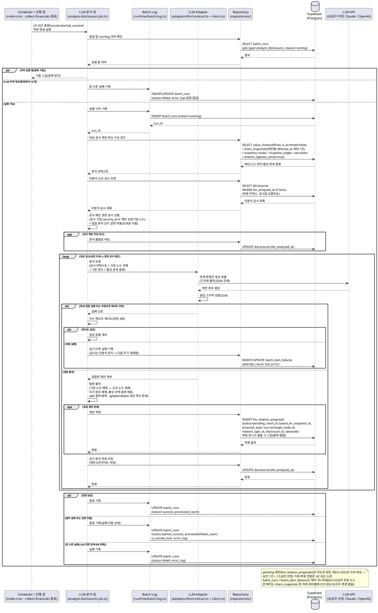

# UC-030: LLM 공시 분석·관계 변경안 생성 배치

> 근거: `docs/userflow.md` 030(및 용어·전제, 022·027 연계), `docs/prd.md` 6장(LLM 보조 업데이트)·7장(Non-Goals), `docs/database.md` §1.3·§3.8·§5, `docs/techstack.md` §4(worker: scheduler → jobs → adapters/llm → repositories → Supabase)·§8(배치 스케줄링)·§10(LLM 공급자 미정 — 어댑터 추상화).
> 본 기능은 **System 배치**다. 공시 수집 배치(UC-027)가 적재한 신규 공시를 LLM이 분석해 **공식 밸류체인의 기존 노드 간 관계 추가/변경/삭제 제안**을 생성하고, 어드민 검토 큐(`llm_relation_proposals`, UC-022의 소비 대상)에 `pending` 상태로 적재한다. **본 배치는 체인 구조를 직접 변경하지 않는다**(반영은 어드민 승인 UC-022의 책임 — 승인 1건 = 1스냅샷).
> **외부 연동**: LLM API가 유일한 외부 서비스다. 공급자는 미정(후보: Anthropic Claude / OpenAI)이며 `docs/external/`에 LLM 연동 문서가 아직 없다 — 공급자 확정 시 문서 추가 예정(techstack §10). 본 문서는 어댑터 계약(`adapters/llm/contract.ts`) 수준으로만 기술한다.

---

## 1. Primary Actor

- **System (배치 워커 스케줄러)** — `apps/worker`의 `analyze-disclosures` 잡(`batch_job_type = 'analyze_disclosures'`). 공시 수집 잡(UC-027) 종료 직후 연쇄 실행된다.
- 사용자 직접 상호작용 없음. 간접 이해관계자:
  - **Admin**: 생성된 제안을 검토 큐(UC-022)에서 승인/거부하고, 실행 이력을 배치 모니터링(UC-023)에서 조회한다.

## 2. Precondition

- (사용자 관점의 선행 조건은 없다 — 배치는 사용자 입력 없이 동작한다.)
- 시스템 전제:
  - 공시 수집 배치(UC-027)가 신규 공시를 `disclosures`에 적재했다(미분석 공시 = `llm_analyzed_at IS NULL`, 부분 인덱스).
  - 분석 대상 공식 밸류체인(`chain_type=official`, `is_archived=false`)과 최신 스냅샷(`chain_snapshots` + `snapshot_nodes`/`snapshot_edges`)이 존재한다.
  - 활성 관계 종류 마스터(`relation_types.is_active=true`)가 존재한다.
  - LLM API 자격 정보가 환경변수로 설정되어 있다(`ANTHROPIC_API_KEY` 또는 `OPENAI_API_KEY` — 공급자 확정 후 하나만 사용, techstack §9).
  - 배치 워커 프로세스가 실행 중이다.
- (관찰 가능한 결과 관점) 실행 완료 후 Admin은 검토 큐(UC-022)에서 근거 공시가 부착된 대기 제안을, 배치 모니터링(UC-023)에서 실행 상태를 확인할 수 있다.

## 3. Trigger

- **연쇄 트리거(기본)**: 공시 수집 배치(UC-027)가 종료(`success`/`partial_success`)하면 직후 연쇄 실행된다(userflow 030 — 당일 신규 공시가 분석 입력). 실행 주기는 결과적으로 1일 1회(techstack §8).
- UC-027이 `failed`로 종료한 날은 연쇄 트리거되지 않는다 — 미분석 공시는 누적되어 다음 주기에 자동 포함된다.
- 수동 재실행 트리거(어드민 UI)는 MVP 범위 밖이다(UC-023은 조회 전용).

## 4. Main Scenario

1. 공시 수집 잡(UC-027) 종료 직후 스케줄러가 `analyze-disclosures` 잡을 연쇄 실행한다.
2. 잡이 동일 잡의 `running` 실행 존재 여부를 확인하고(중복 기동 방지), `batch_runs`에 실행 시작을 기록한다(`job_type=analyze_disclosures`, `status=running`). LLM 자격 정보(환경변수) 부재 시 잡 수준 실패로 즉시 종료한다.
3. **대상 공식 체인·구성 로드**: `chain_type=official`이고 `is_archived=false`인 체인 목록과, 각 체인의 최신 스냅샷(`effective_at` 최대 1건)의 노드(`snapshot_nodes` — 상장기업 노드의 `security_id` 포함)·엣지(`snapshot_edges`)·활성 관계 종류(`relation_types`, `is_active=true`) 목록을 로드한다.
4. **분석 대상 공시 선별**: 미분석 공시(`disclosures.llm_analyzed_at IS NULL`) 중, 공시 기업(`security_id`)이 **어느 공식 체인의 최신 스냅샷 상장기업 노드에 포함되는** 공시만 선별한다. 공식 체인과 무관한 공시는 분석 없이 `llm_analyzed_at`을 마킹해 재스캔을 방지한다(제안 미생성 — 분석 불필요 확정).
5. **일일 분석 건수 상한 적용**: 선별된 공시가 일일 분석 건수 상한(상수, 비용 제어)을 초과하면 공시일 오름차순으로 상한까지만 이번 회차에서 처리하고, 초과분은 미분석 상태로 남겨 다음 실행으로 이월한다(`is_carried_over=true` 기록).
6. **공시별 LLM 분석** (대상 공시 × 관련 공식 체인 단위):
   1. LLM 어댑터(`adapters/llm/contract.ts`)에 분석을 요청한다. 입력 = 공시 컨텍스트(제목·공시일·공시 기업·원문 링크) + 해당 체인의 기존 노드 목록(식별자·표시명·유형) + 활성 관계 종류 목록 + 기존 엣지 요약.
   2. 어댑터가 LLM API에 구조화 출력(JSON)을 강제해 호출하고, 응답을 스키마(Zod)로 검증한다. 파싱·검증 실패는 지수 백오프 3회 재시도 후 최종 실패로 격리한다(공시 단위 — 잡 전체 중단 없음).
   3. 검증된 제안 후보 각각에 대해 **범위 필터**를 적용한다:
      - 제안의 양 끝 노드가 최신 스냅샷의 **기존 노드**로 매핑되는가 — 신규 노드가 필요한 제안은 배제(MVP 범위 밖, PRD Non-Goals).
      - 자기 참조(동일 노드 간) 제안 배제.
      - 제안 관계 종류가 **활성** 관계 종류 마스터로 매핑되는가 — 매핑 불가·비활성 종류는 배제.
      - 유형별 정합 — `relation_add`: 동일 노드 쌍·동일 관계 종류 엣지가 최신 구성에 미존재, `relation_update`/`relation_delete`: 대상 엣지가 최신 구성에 존재.
7. **제안 적재**: 필터를 통과한 제안을 `llm_relation_proposals`에 `status=pending`으로 INSERT 한다 — `chain_id`, `based_on_snapshot_id`(분석 기준 최신 스냅샷), `proposal_type`, `source_node_id`/`target_node_id`(기준 스냅샷 노드), `relation_type_id`, `disclosure_id`(근거 공시), `rationale`(LLM 근거 설명). 동일 (체인, 노드 쌍, 관계 종류, 유형)의 `pending` 제안은 DB 부분 유니크(NULLS NOT DISTINCT)가 차단하므로, 충돌 시 신규 INSERT를 스킵한다(중복 병합).
8. **분석 완료 마킹**: 처리를 마친 공시의 `llm_analyzed_at`을 갱신한다(유효 제안이 0건이어도 분석 완료 — 재분석 방지). 최종 실패한 공시는 미분석 상태를 유지해 다음 실행에 자동 재포함하고, 실패 상세를 `batch_item_failures`(공시 기업 `security_id` 기준)에 기록한다.
9. 잡 종료 시 `batch_runs`를 확정한다 — 전량 성공 `success`, 일부 실패·상한 이월 존재 `partial_success`(+`is_carried_over`), 잡 수준 실패(자격 정보 부재·LLM 전면 장애·DB 장애) `failed`(+`error_log`). 처리 건수(분석 공시 수)·실패 건수를 함께 기록한다.
10. 적재된 `pending` 제안은 어드민 검토 큐(UC-022)에서 근거 공시와 함께 표시되고, 실행 이력은 배치 모니터링(UC-023)에서 조회된다.

## 5. Edge Cases

| # | 상황 | 처리 |
|---|---|---|
| E1 | 신규 노드가 필요한 관계 제안(LLM이 체인에 없는 기업을 언급) | 범위 밖 — 기존 노드 매핑 실패로 필터에서 배제(적재 안 함). MVP는 기존 노드 간 관계로 한정(PRD Non-Goals) |
| E2 | 제안 대상 노드가 현재(최신 스냅샷) 체인에 없음 | 무효 — 적재 전 필터에서 배제. 적재 이후 어드민 처리 전에 노드가 삭제된 경우는 승인 시점 재매핑 실패로 `invalidated` 전환(UC-022 소관) |
| E3 | 비활성(`is_active=false`) 관계 종류로만 매핑되는 제안 | 배제(활성 마스터로 매핑 가능한 제안만 적재). 활성 대체 종류로 명확히 매핑되면 대체 적재 |
| E4 | LLM 응답 파싱 실패/스키마 불일치/환각(존재하지 않는 노드·관계 종류 지칭) | 어댑터 경계에서 Zod 검증·범위 필터로 차단. 파싱 실패는 지수 백오프 3회 재시도, 최종 실패는 실패 로그 기록 + 해당 공시 미분석 유지(다음 실행 재포함) |
| E5 | 중복 제안(동일 변경 다건 — 같은 공시 재분석·유사 공시) | DB 부분 유니크(`pending` 한정, NULLS NOT DISTINCT)로 동일 (체인·노드쌍·관계종류·유형) 1건만 유지 — 충돌 시 스킵(병합). 거부/무효된 과거 제안과는 별개로 신규 적재 허용 |
| E6 | 대상이 사용자 체인 | 배제 — 대상 선별 자체가 공식 체인(`chain_type=official`) 한정(LLM 보조는 공식 전용) |
| E7 | LLM 비용/레이트 리밋·타임아웃 | 일일 분석 건수 상한(상수)으로 사전 제어. 레이트 리밋·타임아웃은 지수 백오프 3회 재시도, 초과·실패분은 미분석 유지로 다음 실행 이월(`is_carried_over=true`) |
| E8 | 신규 공시 0건(또는 전부 공식 체인 무관) | 정상 종료(`success`, 처리 0건) — 실패 아님 |
| E9 | 공식 체인 0개(시드 미적재)·보관(`is_archived=true`)만 존재 | 분석 대상 없음 — 정상 종료. 보관 체인은 대상에서 제외 |
| E10 | 하나의 공시가 여러 공식 체인에 관련(동일 종목이 복수 체인에 편입) | 관련 체인별로 분석·제안 생성(제안은 체인 단위 — `chain_id`별 독립 행) |
| E11 | 분석 도중 어드민이 해당 체인을 편집(스냅샷 추가) | 제안은 `based_on_snapshot_id`로 분석 기준을 고정 적재. 최신 구성과의 괴리는 승인 시점(UC-022) 재매핑·충돌 처리로 흡수 |
| E12 | UC-027이 `failed`로 종료 | 연쇄 미실행 — 미분석 공시는 누적되어 다음 주기(027 정상 종료 후)에 자동 포함 |
| E13 | 동일 잡 중복 실행/지연 실행 | `running` 상태 검사로 신규 회차 스킵. 적재는 부분 유니크 + `llm_analyzed_at` 마킹으로 멱등 — 재실행에도 중복 제안 없음 |
| E14 | LLM 자격 정보(환경변수) 누락/무효 키 | 잡 수준 실패(`failed`) — 설정 점검 필요 항목으로 `error_log` 기록. 공시는 미분석 유지 |
| E15 | LLM 전면 장애(전 호출 실패) | 재시도 소진 후 `failed`(또는 일부 성공 시 `partial_success`) 기록. 미분석 공시는 다음 실행에서 재시도 — 화면(UC-022)은 기존 큐 데이터로 정상 동작 |
| E16 | 제안 적재 성공 후 `llm_analyzed_at` 갱신 실패(부분 실패) | 다음 실행에서 해당 공시 재분석 시 부분 유니크가 중복 적재를 차단(멱등) — 마킹만 재시도됨 |

## 6. Business Rules

### 6.1 제안 생성 규칙

- **BR-1 (공식 체인 전용)**: 분석·제안 대상은 공식 밸류체인(`chain_type=official`, `is_archived=false`)뿐이다. 사용자 체인은 수동 편집만 지원한다(PRD 6장).
- **BR-2 (기존 노드 간 관계 한정)**: 제안 유형은 `relation_add`/`relation_update`/`relation_delete` 3종이며, 양 끝은 반드시 분석 기준 스냅샷의 기존 노드다. 신규 노드 제안은 생성하지 않는다(MVP Non-Goal — 필터로 강제).
- **BR-3 (근거 부착)**: 모든 제안은 근거 공시(`disclosure_id`), LLM 근거 설명(`rationale`), 분석 기준 스냅샷(`based_on_snapshot_id`)을 필수로 부착한다 — 어드민 검토(UC-022)의 판단 재료이자, 승인 시 근거 공시일 메타데이터의 소스다.
- **BR-4 (활성 관계 종류만)**: 활성(`is_active=true`) 관계 종류로 매핑 가능한 제안만 큐에 적재한다(UC-024 정책과 일관 — 비활성 종류는 신규 선택 불가).
- **BR-5 (구조 무결성 사전 필터)**: 자기 참조 배제, `relation_add`는 동일 노드 쌍·동일 관계 종류 중복 배제(서로 다른 관계 종류 병존 제안은 허용), `relation_update`/`relation_delete`는 대상 엣지 존재를 전제로 한다 — UC-016/022와 동일 규칙의 사전 적용.
- **BR-6 (생성과 반영의 분리)**: 본 배치는 제안 생성까지만 수행한다. 체인 구조 변경(스냅샷 생성)은 어드민 승인(UC-022)의 전속 책임이며, 본 배치는 `chain_snapshots` 및 하위 테이블에 쓰지 않는다.
- **BR-7 (중복 대기 방지)**: 동일 (체인, source, target, 관계 종류, 제안 유형)의 `pending` 제안은 DB 부분 유니크(NULLS NOT DISTINCT — `relation_delete`의 NULL 관계 종류 포함)로 1건만 존재한다. 적재 충돌은 오류가 아닌 스킵(병합)으로 처리한다.

### 6.2 비용·상한·멱등성 규칙

- **BR-8 (일일 분석 건수 상한)**: LLM 호출 비용 제어를 위해 회차당 분석 공시 건수를 상수로 상한 관리한다. 초과분은 미분석 상태로 다음 실행에 이월하고 `batch_runs.is_carried_over=true`로 기록한다(하드코딩 금지 — 상수/설정 관리).
- **BR-9 (멱등성)**: 재실행 안전을 보장한다 — 분석 완료 공시는 `llm_analyzed_at` 마킹으로 재분석에서 제외되고, 제안 적재는 부분 유니크로 중복이 차단된다.
- **BR-10 (실패 격리·재포함)**: 공시 단위 실패는 잡 전체를 중단시키지 않는다. 지수 백오프 3회(상수) 재시도 후 최종 실패는 기록하고, 해당 공시는 미분석 유지로 다음 정기 주기에 자동 재포함한다.
- **BR-11 (연쇄 실행)**: 본 잡의 트리거는 공시 수집 배치(UC-027)의 정상 종료(success/partial_success)다. 독립 스케줄이 아니라 수집 파이프라인의 후속 단계로 동작한다.
- **BR-12 (무관 공시 마킹)**: 공식 체인과 무관한 공시(구성 종목이 아닌 기업의 공시)는 LLM 호출 없이 분석 완료로 마킹해 매 회차 재스캔 비용을 방지한다(마킹 정책의 확정 여부는 Open Questions 참조).

### 6.3 외부 연동·검증 규칙

- **BR-13 (어댑터 격리)**: LLM 호출은 `adapters/llm/contract.ts`(인터페이스) + `client.ts`(구현)로 격리한다. 잡은 contract에만 의존하며, 공급자 교체(Claude ↔ OpenAI) 시 잡 로직은 변경되지 않는다(techstack §4/§10).
- **BR-14 (구조화 출력 강제·검증 계층)**: LLM 응답은 구조화 출력(JSON)으로 강제하고, 어댑터 경계에서 스키마 검증(Zod)을 통과한 것만 필터 단계로 전달한다. 자유 텍스트 응답을 직접 신뢰하지 않는다(환각 방어).
- **BR-15 (자격 정보 보호)**: LLM API 키는 환경변수로만 관리하고 프론트엔드에 노출하지 않는다. 외부 API는 배치 적재 용도로만 호출된다(PRD 전역 정책).

### 6.4 API Specification (배치 잡 계약)

본 배치는 **HTTP 엔드포인트를 제공하지 않는다.** 워커 프로세스 내부 잡으로만 실행되며, 웹과는 DB 테이블(`llm_relation_proposals`, `batch_runs`)로만 결합된다(워커-웹 디커플, techstack §8). 제안 소비·처리 API는 UC-022, 실행 이력 조회 API는 UC-023의 계약을 따른다.

#### (1) 잡 트리거 계약

| 항목 | 값 |
|---|---|
| 잡 식별자 | `batch_job_type = 'analyze_disclosures'` |
| 실행 모듈 | `apps/worker/src/jobs/analyze-disclosures.job.ts` |
| 트리거 | 공시 수집 잡(UC-027) 종료(success/partial_success) 직후 연쇄 실행 — 결과적으로 1일 1회 |
| 수동 트리거 | 미제공(MVP — 어드민 재실행 UI는 2단계) |
| 동시 실행 | 동일 잡 `running` 상태 존재 시 기동 스킵(중복 방지) |
| 멱등성 | `llm_analyzed_at` 마킹 + `pending` 부분 유니크 — 재실행 안전 |

#### (2) 입력 계약 (잡 파라미터·소스)

```typescript
{
  // 일일 분석 건수 상한 — 상수/설정 주입(하드코딩 금지)
  dailyAnalysisLimit: number,
  // 분석 대상 — 미분석 신규 공시(공시일 오름차순, 상한까지)
  targetDisclosures: 'unanalyzed',        // disclosures.llm_analyzed_at IS NULL
  // 대상 체인 — 공식 체인 전용
  targetChains: 'official_active'          // chain_type=official AND is_archived=false
}
// 읽기 소스: disclosures(미분석 부분 인덱스), value_chains,
//            chain_snapshots(체인별 최신 1건) + snapshot_nodes + snapshot_edges,
//            securities(공시 기업 ↔ 노드 매칭·표시명), relation_types(is_active=true)
// 자격 정보(환경변수): ANTHROPIC_API_KEY 또는 OPENAI_API_KEY(공급자 확정 후 하나만)
```

#### (3) LLM 어댑터 계약 (`adapters/llm/contract.ts` — 외부 호출 경계)

```typescript
// 요청 (잡 → 어댑터): 공시 1건 × 관련 체인 1건 단위
{
  disclosure: { title: string, disclosureDate: string, companyName: string, url: string },
  chainContext: {
    nodes: Array<{ nodeId: string, displayName: string, nodeKind: 'listed_company' | 'free_subject' }>,
    edges: Array<{ sourceNodeId: string, targetNodeId: string, relationTypeName: string }>,
    activeRelationTypes: Array<{ relationTypeId: string, name: string, isDirected: boolean }>
  }
}
// 응답 (어댑터 → 잡): 구조화 출력(JSON) 강제 + Zod 검증 통과분만
{
  proposals: Array<{
    proposalType: 'relation_add' | 'relation_update' | 'relation_delete',
    sourceNodeId: string,                  // 반드시 chainContext.nodes 내 식별자
    targetNodeId: string,
    relationTypeId: string | null,         // 활성 마스터 식별자(delete는 null 허용)
    rationale: string                      // 근거 설명(공시 인용 요지)
  }>                                        // 관련 변경 없음 판단 시 빈 배열
}
// 제약: 타임아웃·레이트 리밋은 어댑터에서 처리, 실패 시 지수 백오프 3회(상수)
```

#### (4) 출력 계약 (적재·기록)

```typescript
{
  // 제안 큐 적재 (INSERT — pending 부분 유니크 충돌 시 스킵)
  llmRelationProposals: Array<{
    chainId: string,
    basedOnSnapshotId: string,             // 분석 기준(최신) 스냅샷
    proposalType: 'relation_add' | 'relation_update' | 'relation_delete',
    sourceNodeId: string,                  // based_on_snapshot 소속 노드
    targetNodeId: string,
    relationTypeId: string | null,
    disclosureId: string,                  // 근거 공시
    rationale: string,
    status: 'pending'
  }>,
  // 공시 분석 완료 마킹 (UPDATE)
  analyzedDisclosureIds: string[],          // llm_analyzed_at 갱신 대상(제안 0건 포함)
  // 실행 이력 (batch_runs — UC-023 조회 소스)
  batchRun: {
    jobType: 'analyze_disclosures',
    status: 'success' | 'partial_success' | 'failed',
    startedAt: string, finishedAt: string,
    processedCount: number,                // 분석 완료 공시 수
    failedCount: number,                   // 최종 실패 공시 수
    isCarriedOver: boolean,                // 일일 상한 초과 이월 발생 여부
    errorLog: object | null                // 공시 단위 실패·잡 수준 실패 상세
  }
}
```

#### (5) 오류 계약

| 상황 | 기록 |
|---|---|
| 공시 단위 실패(LLM 타임아웃/파싱·검증 실패, 재시도 3회 소진) | 다음 공시 계속 → `status=partial_success`, `failed_count` 증가, `batch_item_failures`(공시 기업 기준)·`error_log`에 원인. 해당 공시 미분석 유지 → 다음 주기 재포함 |
| 일일 상한 초과 | 실패 아님 — 초과분 미분석 유지 이월, `is_carried_over=true` |
| 잡 수준 실패(자격 정보 누락/무효, LLM 전면 장애, DB 장애) | `status=failed`, `error_log`에 원인 — 다음 주기 자동 캐치업 |
| 중복 기동 | 실행 스킵(중복 방지) |

#### (6) 적재 데이터 소비 API (참조 — 본 유스케이스 소관 아님)

| 소비 지점 | 계약 소관 |
|---|---|
| `GET /api/admin/llm-proposals?status=pending` 등 검토 큐 조회·승인·거부 | UC-022 |
| `GET /api/admin/batches` 등 배치 실행 이력·실패 로그 조회 | UC-023 |

### 6.5 Database Operations

| 테이블 | 연산 | 용도 |
|---|---|---|
| `batch_runs` | SELECT / INSERT / UPDATE | 동일 잡 `running` 확인(중복 방지), 실행 시작 INSERT, 종료 UPDATE(상태·건수·`is_carried_over`·`error_log`) |
| `value_chains` | SELECT | 대상 공식 체인 목록(`chain_type=official`, `is_archived=false`) |
| `chain_snapshots` | SELECT | 체인별 최신 스냅샷 1건(`effective_at` 최대 — `idx(chain_id, effective_at DESC)`) |
| `snapshot_nodes` | SELECT | 최신 스냅샷의 노드 목록(상장기업 `security_id` — 공시 관련 체인 매칭·기존 노드 필터 기준) |
| `snapshot_edges` | SELECT | 최신 스냅샷의 엣지 목록(add 중복·update/delete 대상 존재 검증) |
| `securities` | SELECT | 공시 기업 ↔ 체인 노드 매칭, LLM 입력용 노드 표시명 |
| `relation_types` | SELECT | 활성 관계 종류 목록(`is_active=true` — LLM 입력·제안 매핑 검증) |
| `disclosures` | SELECT | 미분석 공시 조회(`llm_analyzed_at IS NULL` 부분 인덱스, 공시일 오름차순) |
| `disclosures` | UPDATE | 분석 완료 마킹(`llm_analyzed_at` — 무관 공시·제안 0건 공시 포함) |
| `llm_relation_proposals` | INSERT | `pending` 제안 적재 — 부분 유니크 `uq(chain, source, target, relation_type, proposal_type) WHERE pending`(NULLS NOT DISTINCT) 충돌 시 스킵 |
| `batch_item_failures` | INSERT / UPDATE | 공시 단위 최종 실패 기록(공시 기업 `security_id` 기준, `attempt_count`·`last_error`), 후속 성공 시 `is_resolved` 갱신 |

- **DELETE·스냅샷 쓰기 없음**: 본 배치는 `chain_snapshots` 및 하위 테이블, 기존 제안 행을 수정·삭제하지 않는다(승인/거부/무효 전환은 UC-022 소관).
- 데이터 접근은 워커의 Repository 계층(`apps/worker/src/repositories/`)이 캡슐화하고, 잡은 Repository 인터페이스에만 의존한다.

### 6.6 External Service Integration

| 서비스 | 참조 문서 | 역할 | 필수 준수 사항 |
|---|---|---|---|
| **LLM API** (공급자 미정 — 후보: Anthropic Claude / OpenAI) | `docs/external/` 내 문서 **없음** — 공급자 확정 시 연동 문서 추가 예정(techstack §10) | 공시 컨텍스트 + 체인 노드/관계 종류를 입력으로 기존 노드 간 관계 변경안(구조화 JSON) 생성 | API 키 환경변수 관리(프론트 노출 금지), 구조화 출력 강제 + 어댑터 경계 Zod 검증, 일일 분석 건수 상한(상수)으로 비용 제어, 타임아웃·레이트 리밋 시 지수 백오프 3회, `adapters/llm/{contract,client}` 격리로 공급자 교체 시 잡 로직 무변경, SDK 설치는 공급자 확정 후 하나만(`@anthropic-ai/sdk` 또는 `openai`) |

- 간접 의존(데이터 공급 경로, 별도 유스케이스): OpenDART / SEC EDGAR → 공시 수집(UC-027) → `disclosures`. 본 배치는 UC-027이 적재한 공시 메타데이터를 입력으로 사용하며, OpenDART/SEC를 직접 호출하지 않는다(원문 본문 fetch 포함 여부는 Open Questions 참조).
- LLM 장애는 서비스 화면에 전파되지 않는다 — 검토 큐(UC-022)는 기존 적재분으로 동작하고, 미분석 공시는 다음 주기에 재처리된다.

---

## 7. Sequence Diagram



---

## 8. 관련 유스케이스

- **UC-027 재무/공시/기업정보 수집 배치**: 본 배치의 선행 잡 — 종료(success/partial_success) 시 본 배치를 연쇄 트리거하며, 분석 입력(`disclosures`)을 적재한다.
- **UC-022 LLM 관계 변경안 검토**: 본 배치가 적재한 `pending` 제안을 근거 공시와 함께 검토해 승인(1건=1스냅샷)/거부/무효 처리한다. 승인 시점의 노드 재매핑·충돌 처리는 UC-022 소관이다.
- **UC-021 공식 밸류체인 관리**: 본 배치의 분석 기준(최신 스냅샷)을 공급하며, 수동 편집과 LLM 승인의 스냅샷 직렬 처리 규칙을 공유한다.
- **UC-024 관계 종류 마스터 관리**: 활성 관계 종류 목록이 제안 매핑의 허용 범위를 결정한다(비활성 종류 제안 배제).
- **UC-023 배치 작업 모니터링 조회**: `batch_runs`/`batch_item_failures`를 통해 본 잡의 상태·실패 로그·이월 여부를 조회한다.

---

## 9. Open Questions

1. **LLM 공급자·연동 문서**: 공급자(Anthropic Claude vs OpenAI)가 미정이다(techstack §10 — LLM 기능 구현 직전 확정). 확정 시 `docs/external/`에 연동 스펙 문서(모델·구조화 출력 방식·토큰 한도·과금)를 추가하고 본 문서의 어댑터 계약과 정합시켜야 한다.
2. **LLM 분석 입력 범위**: `disclosures`는 제목·공시일·원문 URL 메타만 저장한다. 공시 **원문 본문**을 URL로 추가 fetch(OpenDART 원문/ SEC 문서)해 LLM 입력에 포함할지, 메타데이터만으로 분석할지 확정 필요 — 분석 품질과 비용(토큰·API 호출)의 트레이드오프.
3. **무관 공시 마킹 정책**: 본 문서는 공식 체인 무관 공시도 `llm_analyzed_at`을 마킹해 재스캔을 방지하는 것으로 기술했다. 이후 해당 기업이 공식 체인에 신규 편입될 때 과거 공시를 소급 분석할지(마킹 해제/별도 트리거) 여부 확정 필요.
4. **`relation_delete` 제안의 관계 종류 NULL 의미**: DB는 `relation_type_id` NULL을 허용(NULLS NOT DISTINCT 중복 방지)한다. NULL을 "해당 노드 쌍의 관계 전체 삭제"로 해석할지, delete 제안에도 관계 종류 지정을 필수로 강제할지(동일 쌍에 복수 관계 종류 병존 가능하므로) 확정 필요.
5. **LLM 호출 단위와 상한 집계 기준**: 하나의 공시가 복수 공식 체인에 관련될 때 체인별 개별 호출로 기술했다 — 일일 분석 건수 상한을 "공시 건수" 기준으로 볼지 "LLM 호출 횟수(공시×체인)" 기준으로 볼지, 상한 값과 함께 상수 확정 필요.
