# Plan: UC-031 최초 전 종목 과거 데이터 백필 배치 (backfill-all)

> 근거: `docs/usecases/031/spec.md`, `docs/usecases/000_decisions.md`(H-5·H-6·H-7·H-8·H-9·H-10), `docs/techstack.md` §4·§6·§7·§8·§9,
> `docs/database.md` §1.4·§3.2·§3.4·§3.5·§3.8·§3.9·§5, `supabase/migrations/0003·0007·0008·0011·0012`,
> `docs/external/tossinvest-openapi.md`(§6·§8), `docs/external/opendart.md`(§3~§7), `docs/external/sec-edgar-api.md`(§3~§8),
> `docs/usecases/026/plan.md`(워커 공통 골격·토스 어댑터 최초 정의 — 본 plan은 이를 **재정의 없이 재사용·확장**한다).
>
> **코드베이스·타 plan 충돌 검토 결과**:
>
> | # | 사안 | 결정 | 근거 |
> |---|---|---|---|
> | R-1 | 워커 공통 골격(config/supabase/rate-limiter/retry/batch-log/batch.repository/scheduler) | UC-026 plan 모듈 1~9를 재사용. 본 plan은 **확장 지점만** 기술(재정의 금지) | UC-026 plan 서두 원칙 |
> | R-2 | 토스 어댑터(`adapters/tossinvest/*`) | UC-026 plan 모듈 11~13에 정의됨. 본 plan은 `getStocks`·`getDailyCandlesPage` 메서드와 DTO만 **추가** | UC-026 plan 모듈 11 4항(확장 지점 예고) |
> | R-3 | OpenDART·SEC EDGAR 어댑터, 재무 정규화 로직 | UC-027 plan이 아직 없으므로 **본 plan이 최초 정의**하고 UC-027/029/030 plan이 위치만 참조한다(BR-4 규칙 이원화 금지 — 공유 모듈로 설계) | spec BR-4, UC-026 plan의 선행 정의 방식 |
> | R-4 | 마이그레이션 번호 | 신규 테이블 없음. RPC 함수 1건(`fn_upsert_quarterly_financials`)만 추가 — `0013_*`은 UC-007/008/010/012/014/015/026 plan이 경합 선점 중이므로 파일명 `NNNN_fn_upsert_quarterly_financials.sql`의 **NNNN은 구현 시점의 다음 빈 번호**로 부여(멱등 `CREATE OR REPLACE`, 내용 독립) | UC-022 plan R-7 방식 |
> | R-5 | `quarterly_financials`의 유니크 인덱스가 **부분(partial) 인덱스**(`WHERE period_type='quarter'/'annual'`)라 supabase-js `upsert(onConflict)`로 추론 불가 | UPSERT를 Postgres 함수(R-4의 RPC)로 캡슐화 — techstack §7(복잡 쿼리는 함수) 준수 | 0008 마이그레이션 실물 확인 |
> | R-6 | 백필은 스케줄러(`scheduler.ts`)와 **별도 프로세스**(`npm run backfill` → `tsx src/jobs/backfill-all.job.ts`) | 인메모리 job-lock은 교차 프로세스 방어 불가 → 중복 기동·경합 확인은 `batch_runs` DB 검사로 수행(E17 고아 판정 포함). `scheduler.ts`는 **수정하지 않는다**(backfill 미등록 — spec 6.2(1)) | techstack §6·§8 |
> | R-7 | 국내 재무의 역년 축 산출에 결산월(acc_mt) 필요 | Phase 2 내부 순서를 "기업개황·주식총수 → 공시 → 재무"로 배치해 결산월을 선확보하고, 체크포인트 cursor(jsonb)에 보존해 재개 시에도 재조회 없이 사용(스키마 변경 없음) | database.md 전제 유지 |
> | R-8 | 결정 H-9 | 과거 환율은 수집하지 않음(외부 의존 추가 없음). 환율·장 운영시간은 UC-028 소관 — 본 plan 범위 밖 | 000_decisions H-9 |
>
> - 사용자향 HTTP API·화면이 없는 **System 배치**다. Presentation 모듈은 없으며(QA Sheet는 통합 시나리오로 대체), 진행률·상태 조회는 UC-023(웹) 소관이다.
> - DB 스키마(`securities`/`daily_quotes`/`quarterly_financials`/`shares_outstanding`/`disclosures`/`company_profiles`/`batch_runs`/`batch_item_failures`/`batch_checkpoints`)는 0001~0012로 이미 존재 — 신규 테이블·컬럼 없음.
> - 외부 연동 3종(토스증권/OpenDART/SEC EDGAR)은 techstack §8에 따라 `adapters/<provider>/contract.ts`(계약) ↔ `client.ts`(구현)로 격리하고, 잡·Phase 모듈은 contract에만 의존한다.

---

## 개요

### A. 공통(shared) — UC-026 plan 기정의 모듈의 재사용·확장

| 모듈 | 위치 | 설명 |
| --- | --- | --- |
| 워커 패키지 확장 | `apps/worker/package.json` | `yauzl`(SEC 벌크 ZIP 스트리밍) 의존성 추가, `backfill` 스크립트(`tsx src/jobs/backfill-all.job.ts`) 확인 — techstack §6 그대로 |
| 워커 환경설정 확장 | `apps/worker/src/runtime/config.ts` | 필수 키 추가: `OPENDART_API_KEY`, `SEC_EDGAR_USER_AGENT`(서비스명+연락 이메일 형식 검증) — 기동 시 조기 실패(E10) |
| 배치 리포지토리 확장 | `apps/worker/src/repositories/batch.repository.ts` | `findRunningRuns(jobTypes)`(중복·경합 확인), `updateRunProgress(runId, counts)`(진행 하트비트 — `updated_at` 트리거로 E17 고아 판정 소스 겸용) 추가 |
| 종목 리포지토리 확장 | `apps/worker/src/repositories/securities.repository.ts` | 시드 UPSERT(`onConflict: market,ticker`), 백필 대상 조회(매핑별), `shares_manual_override_needed` 플래그 UPDATE 추가 |
| 토스 어댑터 확장 | `apps/worker/src/adapters/tossinvest/{contract,dto,client}.ts` | `getStocks(symbols)`(StockInfo+`sharesOutstanding`), `getDailyCandlesPage(symbol, before?)`(`before` 커서 페이지네이션) 메서드·DTO 추가 |
| 배치 상수 확장 | `packages/domain/constants/batch.ts` | 백필 상수 추가: 페이지 크기·OpenDART 일일 예산(H-7)·경합 폴링 주기·고아 판정 임계 등 |

### B. 공통(shared) — 본 plan 최초 정의 (UC-027/029/030 plan이 위치만 참조)

| 모듈 | 위치 | 설명 |
| --- | --- | --- |
| 재무 도메인 상수 | `packages/domain/constants/financials.ts` | `MIN_FISCAL_YEAR=2015`, DART `reprt_code` 4종, 정상 기간 길이 범위(분기 75~100일/연간 340~390일) — UC-027·029 공유 SOT |
| 회계기간·역년 축 계산 | `packages/domain/calculations/fiscal-period.ts` | 순수 함수: 기간 시작·종료일 → 역년 축(`calendar_year/quarter`) 산출, 기간 길이 분류(분기/연간/이상치), 결산월 기반 국내 회계 분기 기간 산출 |
| 분기 파생 계산 | `packages/domain/calculations/quarterly-derivation.ts` | 순수 함수: 국내 누적 차감(2Q=반기−1Q, 4Q=연간−3Q누적), 미국 Q4 파생(FY−Q1−Q2−Q3+연속성 검증), `(fy,start,end)` 중복 제거, 태그 체인 선택 — techstack §4의 "Q4파생" domain 배치 준수 |
| OpenDART 어댑터 | `apps/worker/src/adapters/opendart/{contract.ts,dto.ts,client.ts,account-map.ts}` | corpCode.xml ZIP·fnlttMultiAcnt·fnlttSinglAcntAll(CFS→OFS)·stockTotqySttus·company.json·list.json. `status` 바디 판별, **020 즉시 중단 신호**, 일일 호출 예산 카운터, 계정과목 매핑 상수 |
| SEC EDGAR 어댑터 | `apps/worker/src/adapters/sec-edgar/{contract.ts,dto.ts,client.ts,bulk-zip.ts,xbrl-tags.ts}` | company_tickers.json, companyfacts.zip/submissions.zip 스트리밍 추출(yauzl), User-Agent 필수 헤더, 초당 안전마진 레이트리밋, 매출·주식수 태그 폴백 체인 상수 |
| DART 재무 정규화기 | `apps/worker/src/normalizers/dart-financials.ts` | corp×사업연도 단위 원천 계정 → `quarterly_financials` 행 변환(1Q·3Q=3개월, 2Q·4Q=누적 차감, 역년 축, ≥2015). **UC-027과 규칙 공유 지점(BR-4)** |
| SEC 재무 정규화기 | `apps/worker/src/normalizers/sec-financials.ts` | companyfacts 1사 분 → `quarterly_financials` 행 + 상장주식수 폴백 평가(dei→us-gaap 합산→가중평균→수동 보정). 태그 폴백·중복 제거·스텁 검출·Q4 파생·20-F 연간 전용·미매핑 플래그. **UC-027과 규칙 공유 지점(BR-4)** |
| 재무 리포지토리 | `apps/worker/src/repositories/financials.repository.ts` | `quarterly_financials` RPC UPSERT(R-5), `shares_outstanding` UPSERT(`onConflict: security_id,as_of_date,source`) |
| 재무 UPSERT RPC | `supabase/migrations/NNNN_fn_upsert_quarterly_financials.sql` | `fn_upsert_quarterly_financials(rows jsonb)` — 부분 유니크 인덱스 대응 `ON CONFLICT ... WHERE` 단일 문 UPSERT(quarter/annual 분기 처리) |
| 공시 리포지토리 | `apps/worker/src/repositories/disclosures.repository.ts` | `disclosures` UPSERT(`onConflict: source,external_id` 멱등) |
| 기업정보 리포지토리 | `apps/worker/src/repositories/company-profiles.repository.ts` | `company_profiles` UPSERT(`onConflict: security_id`) + `last_collected_at` 갱신 |
| 체크포인트 리포지토리 | `apps/worker/src/repositories/checkpoints.repository.ts` | `batch_checkpoints` UPSERT(`onConflict: job_type,checkpoint_key`)·미완료 조회·완료 확정·전체 리셋(H-8) |

### C. 기능(backfill_all) 모듈

| 모듈 | 위치 | 설명 |
| --- | --- | --- |
| 체크포인트 플랜 | `apps/worker/src/jobs/backfill/checkpoint-plan.ts` | `checkpoint_key` 체계 + cursor Zod 스키마 + 신규 작업 큐 생성·진행률 계산(순수 로직) |
| 정기 잡 경합 가드 | `apps/worker/src/jobs/backfill/regular-job-guard.ts` | H-7: 정기 수집 잡 `running` 감지 시 백필 일시 정지(폴링 대기), 대기 중 하트비트 유지 |
| Phase 0 — 종목 마스터 시드 | `apps/worker/src/jobs/backfill/phase0-seed-securities.ts` | corpCode.xml(KRX)+company_tickers.json(US) 시드, 토스 `stocks` 200청크 보강(`toss_symbol`·주식수), H-5 준수 |
| Phase 1 — 과거 일봉 백필 | `apps/worker/src/jobs/backfill/phase1-daily-quotes.ts` | 종목 단위 candles `before` 소급(빈 배열/`nextBefore=null` 종료), `daily_quotes` 확정 UPSERT |
| Phase 2 — 국내 과거 재무 백필 | `apps/worker/src/jobs/backfill/phase2-krx-financials.ts` | 개황·주식총수 → 공시 1년 소급(H-10) → 재무(연도×보고서×100사). 020 시 즉시 이월 |
| Phase 3 — 미국 과거 재무 백필 | `apps/worker/src/jobs/backfill/phase3-us-financials.ts` | 벌크 ZIP 2종 스트리밍 → 재무·공시·기업정보·주식수 일괄 적재(CIK 엔트리 단위 커서) |
| 백필 잡 진입점 | `apps/worker/src/jobs/backfill-all.job.ts` | CLI 진입(main) + 오케스트레이터: 경합 확인 → 실행 기록 → 체크포인트 로드/큐 생성 → Phase 0~3 → 종료 판정 → UC-029 후속 연결 훅 |

### 범위 밖 (다른 plan 소관)

- 정기 증분 수집: 시세 UC-026, 재무/공시/기업정보 UC-027, 환율·장 운영시간 UC-028(H-9: 과거 환율 미수집 — 축적 이후만 KRW 환산).
- 체인 지표 집계(`aggregate-daily-metrics`): UC-029. 본 잡은 완료 시 **후속 실행 훅 1회 호출**까지만 책임(잡 구현은 UC-029 plan).
- 배치 모니터링 화면/API: UC-023(웹, 조회 전용). 본 잡은 `batch_runs`/`batch_checkpoints`/`batch_item_failures` 기록까지.
- 어드민 트리거/재실행 UI: MVP 제외(spec 3장). LLM 공시 분석: UC-030(H-10 — 국내 과거 공시는 수집만, 소급 분석 없음).
- 백필 미완료 상태의 커버리지·부분 데이터 표기: 조회 측(UC-010/012/020) 소관(E6).

---

## Diagram

```mermaid
graph TD
    OP["운영자 CLI<br/>npm run backfill -w apps/worker<br/>(--reset: H-8 전체 리셋)"]

    subgraph Job["Business Logic (jobs/)"]
        MAIN["backfill-all.job.ts<br/>(진입점·오케스트레이터)"]
        PLAN["backfill/checkpoint-plan.ts<br/>(키 체계·커서 스키마·큐 생성)"]
        GUARD["backfill/regular-job-guard.ts<br/>(H-7 정기 잡 우선 대기)"]
        P0["backfill/phase0-seed-securities.ts"]
        P1["backfill/phase1-daily-quotes.ts"]
        P2["backfill/phase2-krx-financials.ts"]
        P3["backfill/phase3-us-financials.ts"]
        MAIN --> PLAN
        MAIN --> GUARD
        MAIN --> P0
        MAIN --> P1
        MAIN --> P2
        MAIN --> P3
    end

    subgraph Norm["정규화 (normalizers/ ★공통 — UC-027 공유)"]
        NDART["dart-financials.ts"]
        NSEC["sec-financials.ts"]
    end

    subgraph Domain["packages/domain ★공통(순수)"]
        FP["calculations/fiscal-period.ts"]
        QD["calculations/quarterly-derivation.ts"]
        FC["constants/financials.ts · batch.ts"]
    end

    subgraph Adapter["외부연동 (Contract/Caller 분리)"]
        TOSS_A["adapters/tossinvest/*<br/>(UC-026 정의 + stocks·candles 페이지 확장)"]
        DART_A["adapters/opendart/* ★공통<br/>(020 예산 카운터 내장)"]
        SEC_A["adapters/sec-edgar/* ★공통<br/>(bulk-zip 스트리밍·xbrl-tags)"]
        RL["runtime/rate-limiter.ts ★UC-026"]
        RT["runtime/retry.ts ★UC-026"]
    end

    subgraph Persistence["Persistence (repositories/)"]
        RSEC["securities.repository (확장)"]
        RQ["quotes.repository ★UC-026"]
        RFIN["financials.repository ★공통"]
        RDIS["disclosures.repository ★공통"]
        RPROF["company-profiles.repository ★공통"]
        RCP["checkpoints.repository ★공통"]
        RB["batch.repository (확장) + batch-log ★UC-026"]
    end

    TOSS["토스증권 Open API"]
    DART["OpenDART API"]
    SEC["SEC EDGAR"]
    DB[("Supabase Postgres<br/>securities·daily_quotes·quarterly_financials·<br/>shares_outstanding·disclosures·company_profiles·<br/>batch_runs·batch_item_failures·batch_checkpoints")]
    RPC["fn_upsert_quarterly_financials()<br/>(마이그레이션 NNNN)"]
    UC029["UC-029 집계 잡<br/>(후속 1회 훅)"]

    OP --> MAIN
    P0 --> TOSS_A
    P0 --> DART_A
    P0 --> SEC_A
    P1 --> TOSS_A
    P2 --> DART_A
    P2 --> NDART
    P3 --> SEC_A
    P3 --> NSEC
    NDART --> FP
    NDART --> QD
    NSEC --> FP
    NSEC --> QD
    TOSS_A --> RL
    TOSS_A --> RT
    DART_A --> RL
    DART_A --> RT
    SEC_A --> RL
    SEC_A --> RT
    TOSS_A -->|HTTPS| TOSS
    DART_A -->|HTTPS| DART
    SEC_A -->|HTTPS| SEC
    P0 --> RSEC
    P0 --> RFIN
    P1 --> RQ
    P2 --> RFIN
    P2 --> RDIS
    P2 --> RPROF
    P3 --> RFIN
    P3 --> RDIS
    P3 --> RPROF
    P3 --> RSEC
    MAIN --> RB
    MAIN --> RCP
    GUARD --> RB
    RFIN -->|"client.rpc()"| RPC
    RSEC --> DB
    RQ --> DB
    RFIN --> DB
    RDIS --> DB
    RPROF --> DB
    RCP --> DB
    RB --> DB
    RPC --> DB
    MAIN -.->|"전 체크포인트 완료 시 1회"| UC029
```

데이터 흐름: CLI → Job(오케스트레이터) → Phase(비즈니스 로직) → Adapter(외부)·Normalizer(도메인 규칙)·Repository(퍼시스턴스) → Supabase. Phase는 어댑터 contract·리포지토리 시그니처에만 의존하고 HTTP/SQL 문법을 알지 못한다(techstack §4).

---

## Implementation Plan

### 1. 공통 확장 — 워커 패키지·환경설정 (`apps/worker/package.json`, `runtime/config.ts`)

- 구현 내용:
  1. `package.json` deps에 `yauzl`(+`@types/yauzl` devDep) 추가. scripts의 `backfill: "tsx src/jobs/backfill-all.job.ts"`는 techstack §6에 이미 규정 — UC-026 골격 구현 시 포함 여부 확인 후 없으면 추가.
  2. `config.ts` zod 스키마에 추가: `OPENDART_API_KEY`(min 1), `SEC_EDGAR_USER_AGENT`(공백으로 구분된 2토큰 이상 + 이메일 포함 형식 검증 — SEC 3.1절 "서비스명 연락이메일"). techstack §9 키 이름 그대로, 하드코딩·로그 출력 금지.
  3. 두 키는 워커 전 잡 공통 필수로 승격(UC-027도 사용) — 기동 시 조기 실패 원칙 유지(E10의 잡 수준 실패를 기동 시점으로 앞당김).
- 의존성: UC-026 plan 모듈 1·2(기정의 골격).
- **Unit Tests**:
  - [ ] `OPENDART_API_KEY` 누락 시 키 이름이 포함된 오류로 실패
  - [ ] `SEC_EDGAR_USER_AGENT="InvestInBest ops@example.com"` 형식은 통과, 이메일 미포함 문자열은 실패
  - [ ] 기존 UC-026 필수 키 4종 검증이 그대로 유지된다(회귀 방지)

### 2. 공통 확장 — 배치 리포지토리 (`repositories/batch.repository.ts`)

- 구현 내용:
  1. `findRunningRuns(client, jobTypes: BatchJobType[])` → `batch_runs`에서 `status='running'` AND `job_type IN (...)` 행의 `{id, jobType, startedAt, updatedAt}` 목록(중복 기동·경합 확인 입력 — spec 6.3).
  2. `updateRunProgress(client, runId, { processedCount, failedCount })` → 진행 건수 UPDATE. `updated_at` 트리거가 자동 갱신되므로 **하트비트 겸용**(E17 고아 판정: `updated_at`이 `BACKFILL_HEARTBEAT_STALE_MS` 이상 오래된 running 행은 고아).
  3. `markRunOrphaned(client, runId)` → 고아 run을 `failed` + `error_log='orphaned (heartbeat stale)'`로 종결.
  4. 기존 `insertRun`/`finishRun`/`insertItemFailures`/`findUnresolvedFailures`/`resolveFailures`(UC-026 모듈 7)는 시그니처 변경 없이 재사용.
- 의존성: UC-026 plan 모듈 3·7.
- **Unit Tests** (supabase mock):
  - [ ] `findRunningRuns`가 `status='running'`과 `job_type IN` 필터를 함께 적용한다
  - [ ] `updateRunProgress`가 두 카운트만 UPDATE 한다(다른 컬럼 불변)
  - [ ] `markRunOrphaned`가 `failed`·사유 로그로 UPDATE 한다

### 3. 공통 확장 — 종목 리포지토리 (`repositories/securities.repository.ts`)

- 구현 내용(모두 결과 객체 반환, throw 금지 — 기존 컨벤션):
  1. `upsertSecurities(client, rows)` — `onConflict: 'market,ticker'`(0003 전체 유니크 인덱스라 추론 가능), `DB_UPSERT_CHUNK_SIZE` 청크 반복. 행 필드: `ticker/name/english_name/market/currency/dart_corp_code/cik/toss_symbol/isin_code/security_type/listing_status/list_date/delist_date`. **부분 갱신 원칙**: 소스별로 채우는 컬럼만 포함(예: DART 시드는 `name/dart_corp_code`만, 토스 보강은 `toss_symbol/name/english_name/listing_status/...`) — 컬럼 단위 null 덮어쓰기 방지를 위해 소스별 UPSERT를 분리 호출.
  2. `findByMarket(client, market, { withDartCorpCode? | withCik? | withTossSymbol? })` — Phase별 대상 조회: Phase 1은 `toss_symbol IS NOT NULL`(H-5 — listing_status 무관, E15), Phase 2는 `market='KRX' AND dart_corp_code IS NOT NULL`, Phase 3은 `market='US' AND cik IS NOT NULL`.
  3. `setSharesManualOverrideNeeded(client, securityIds)` — E16 플래그 UPDATE.
  4. `findIdMaps(client, market)` — `ticker→id`, `dart_corp_code→id`, `cik→id`, `toss_symbol→id` 매핑 로드(적재 시 FK 해석용).
- 의존성: UC-026 plan 모듈 14, 모듈 6(상수).
- **Unit Tests**:
  - [ ] `upsertSecurities`가 2,500행을 청크 분할하고 `onConflict:'market,ticker'`를 사용한다
  - [ ] DART 시드 행에 `toss_symbol` 키 자체가 포함되지 않는다(기존 값 보존)
  - [ ] `findByMarket(KRX, withDartCorpCode)`가 `dart_corp_code NOT NULL` 필터를 적용한다
  - [ ] `setSharesManualOverrideNeeded`가 id IN 조건으로 true UPDATE 한다

### 4. 공통 확장 — 토스 어댑터 (`adapters/tossinvest/{contract,dto,client}.ts`) 【외부 서비스 연동 — 토스증권】

- 구현 내용(UC-026 모듈 11~13에 **추가**):
  1. `contract.ts`에 내부 모델·메서드 추가:
     - `NormalizedStockInfo { symbol, name, englishName, market, currency, status, listDate, delistDate, isinCode, securityType, sharesOutstanding: bigint|null, asOfDate }`.
     - `getStocks(symbols: string[]): Promise<{ stocks: NormalizedStockInfo[]; failures: SymbolFailure[]; carriedOverSymbols: string[] }>` — 200개 청크 분할·부분 실패 분리(`STOCK` 그룹 5 TPS).
     - `getDailyCandlesPage(symbol: string, before?: string): Promise<{ candles: NormalizedDailyCandle[]; nextBefore: string | null }>` — `interval=1d`, `count=BACKFILL_CANDLE_PAGE_COUNT(200)`, `adjusted=true`(`MARKET_DATA_CHART` 5 TPS). **빈 배열 또는 `nextBefore=null`이 소급 완료 신호**(E7/H-6 — 어댑터는 값 그대로 전달, 판정은 Phase 1).
  2. `dto.ts`에 `stockInfoSchema`(`sharesOutstanding`은 `z.coerce.bigint()` — 문자열 대형 수 방어, 토스 문서 §8.1), `candlePageResponseSchema`의 `nextBefore` nullable 확인.
  3. `client.ts`: 두 메서드 구현 — 토큰 캐시·`X-RateLimit-*` feedback·429 `Retry-After`·`withRetry`는 기존 경로 재사용. `stock-not-found`(404)는 심볼 단위 실패로 격리(E14 입력). 레이트리미터 그룹에 `STOCK: 5` 추가.
- 외부 연동 필수 항목: 에러 처리·재시도(429/5xx 재시도, 404 비재시도), 타임아웃(`WORKER_HTTP_TIMEOUT_MS` fetch 래퍼), 인증 정보는 config 경유만(하드코딩 금지), 단위 테스트 아래 참조. 약관 준수(BR-12): 적재 행에 `source='toss'` 보존.
- 의존성: 모듈 1, UC-026 plan 모듈 4·5·11~13.
- **Unit Tests** (fetch mock):
  - [ ] `getStocks` 450심볼 → 200/200/50 청크 분할, `sharesOutstanding` 문자열 `"5919637922"` → bigint 변환
  - [ ] `getStocks` 응답 누락 심볼 → `failures(not_found)`, 지속 429 청크 → `carriedOverSymbols`(E8)
  - [ ] `getDailyCandlesPage`가 `interval=1d&count=200&adjusted=true`와 `before` 커서를 쿼리에 포함한다
  - [ ] 마지막 페이지(`nextBefore:null`) 응답을 그대로 반환한다(E7 종료 조건 입력)
  - [ ] 호출 전 `acquire('MARKET_DATA_CHART')`/`acquire('STOCK')`이 그룹별로 호출된다

### 5. 공통 — 배치·재무 도메인 상수 (`packages/domain/constants/batch.ts` 확장, `constants/financials.ts` 신규)

- 구현 내용:
  1. `batch.ts` 추가 상수: `BACKFILL_CANDLE_PAGE_COUNT=200`, `OPENDART_MULTI_CORP_CHUNK=100`, `OPENDART_BACKFILL_DAILY_CALL_BUDGET=15_000`(H-7: 일 20,000 중 정기분 예약 후 잔여 — 상수로 조정 가능), `OPENDART_MAX_CALLS_PER_MINUTE=600`(분당 1,000 미만 안전마진), `SEC_SAFE_RPS=6`(초당 10 중 안전마진 5~8), `BACKFILL_REGULAR_JOB_POLL_MS=30_000`, `BACKFILL_HEARTBEAT_STALE_MS=600_000`(E17 고아 판정 10분), `BACKFILL_PROGRESS_UPDATE_EVERY_N_UNITS=10`, `KRX_DISCLOSURE_BACKFILL_MONTHS=12`(H-10), `OPENDART_LIST_WINDOW_DAYS=85`(corp_code 생략 시 3개월 제한 내 분할), `DISCLOSURE_PAGE_COUNT=100`, `SEC_BULK_IDLE_TIMEOUT_MS`, `BACKFILL_CONFLICT_JOB_TYPES=['collect_quotes','collect_financials','collect_fx_market_hours','aggregate_daily_metrics','analyze_disclosures'] as const`(H-7 경합 대상).
  2. `financials.ts` 신규: `MIN_FISCAL_YEAR=2015`(BR-3, DB CHECK와 일치), `DART_REPRT_CODES={Q1:'11013',HALF:'11012',Q3:'11014',ANNUAL:'11011'} as const`, `QUARTER_PERIOD_DAYS={min:75,max:100}`, `ANNUAL_PERIOD_DAYS={min:340,max:390}`(SEC 문서 8.4 스텁 검출 임계), `DEFAULT_KRX_SETTLEMENT_MONTH=12`.
  3. 프레임워크·DB 의존성 없음. UC-027/029 plan이 동일 상수 참조(DRY).
- 의존성: 없음.
- **Unit Tests**:
  - [ ] `MIN_FISCAL_YEAR`가 2015다(DB CHECK `chk_qfin_min_year`와 일치 가드)
  - [ ] `OPENDART_BACKFILL_DAILY_CALL_BUDGET`이 20,000 미만이다(정기분 예약 보장 가드)
  - [ ] `DART_REPRT_CODES` 값 4종이 외부 계약 코드와 일치한다

### 6. 공통 — 회계기간·역년 축 계산 (`packages/domain/calculations/fiscal-period.ts`)

- 구현 내용(전부 순수 함수):
  1. `deriveCalendarPeriod(startDate, endDate): { calendarYear, calendarQuarter }` — **기간 중앙일(midpoint) 기준** 역년 분기 산출(말일 기준의 월초 경계 왜곡 방어. Apple 회계 Q1(9/28~12/27)→CY Q4 재현). `quarterly_financials.calendar_*`의 단일 산출 SOT(BR-4 — UC-027 동일 함수 사용).
  2. `deriveCalendarYearOnly(startDate, endDate): number` — annual 행용(calendar_quarter는 NULL).
  3. `classifyPeriodLength(startDate, endDate): 'quarter' | 'annual' | 'anomalous'` — `QUARTER_PERIOD_DAYS`/`ANNUAL_PERIOD_DAYS` 범위 판정(스텁 기간 E 검출 — SEC 8.4).
  4. `deriveKrxPeriodDates(settlementMonth, fiscalYear, fiscalQuarter): { startDate, endDate }` — 결산월 기반 국내 회계 분기의 실제 기간 산출(12월 결산이면 fiscal=calendar. 예: 결산월 3, FY2024 Q1 = 2024-04-01~2024-06-30).
- 의존성: 모듈 5, `date-fns`.
- **Unit Tests**:
  - [ ] 2025-09-28~2025-12-27 → `{2025, 4}`(9월 결산 미국 기업 케이스)
  - [ ] 2026-01-01~2026-03-31 → `{2026, 1}` / 2015-01-01~2015-12-31 → annual, calendarYear 2015
  - [ ] 51일 기간(2025-02-08~2025-03-31) → `'anomalous'`(스텁), 91일 → `'quarter'`, 365일 → `'annual'`
  - [ ] `deriveKrxPeriodDates(12, 2024, 4)` = 2024-10-01~2024-12-31, `(3, 2024, 1)` = 2024-04-01~2024-06-30
  - [ ] 윤년 2월 포함 분기도 정상 분류된다

### 7. 공통 — 분기 파생 계산 (`packages/domain/calculations/quarterly-derivation.ts`)

- 구현 내용(전부 순수 함수, 금액은 `number|null` — 결측 허용):
  1. `deriveKrxQuarterAmounts(input)` — 입력: 지표별 `{ q1_3m, q1_cum, half_cum, q3_3m, q3_cum, annual_total }`(원천 누락은 null). 출력: 분기 1~4의 `{ amount, amountBasis }`:
     Q1=`q1_3m`(three_month), Q3=`q3_3m`(three_month), Q2=`half_cum−q1_cum`(derived_from_cumulative), Q4=`annual_total−q3_cum`(derived_from_cumulative). **피연산자 결측 시 해당 분기 null**(E2 — 가용 범위만, 실패 아님).
  2. `dedupeFactsByPeriod(facts)` — `(fy, start, end)` 키 중복 제거, `frame` 보유 행 우선 → 없으면 `filed`(또는 accn) 최신 우선(SEC 8.3 — 비교 재수록분 제거).
  3. `deriveUsQ4({ fyFact, q1, q2, q3 })` — 동일 `fy` 매칭 + **기간 연속성 검증**(Q1~Q3 구간이 FY 구간 내에서 서로 겹치지 않고 연속) 통과 시 `FY−Q1−Q2−Q3` 반환, 실패 시 `null`(SEC 8.5 체크리스트).
  4. `pickByTagChain<T>(factsByTag: Record<string, T[]>, chain: string[]): { tag, facts } | null` — 체인 순회 첫 번째 비어있지 않은 태그 채택(매출·주식수 폴백 공용 제네릭).
- 의존성: 모듈 5·6.
- **Unit Tests**:
  - [ ] 국내 정상 케이스: 1Q=100(3m)·반기누적=250·3Q=130(3m)·3Q누적=380·연간=500 → Q2=150(derived), Q4=120(derived)
  - [ ] `annual_total` 결측 → Q4=null, 나머지 분기는 정상 산출(E2)
  - [ ] `q1_cum` 결측 → Q2=null(부분 결측 격리)
  - [ ] 동일 (fy,start,end)에 frame 있는 행과 없는 행 → frame 행 채택
  - [ ] US Q4: FY=400, Q1~Q3=100씩·기간 연속 → 100 / Q2 기간 결손(비연속) → null
  - [ ] `pickByTagChain`: 1순위 빈 배열, 2순위 존재 → 2순위 태그 반환; 전부 빈 배열 → null(미매핑 신호)

### 8. 공통 — OpenDART 어댑터 (`adapters/opendart/{contract,dto,client,account-map}.ts`) 【외부 서비스 연동 — OpenDART】

- 구현 내용:
  1. `contract.ts` — `OpenDartPort` 인터페이스 + 내부 모델:
     - `fetchCorpCodeMap(): Promise<DartCorpEntry[]>` — corpCode.xml ZIP 다운로드→해제→XML 파싱, `stock_code` 보유(상장) 법인만 반환 `{ corpCode, corpName, stockCode, modifyDate }`.
     - `fetchMultiFinancials(corpCodes: string, bsnsYear, reprtCode): Promise<DartAccountRow[]>` — fnlttMultiAcnt.
     - `fetchSingleFinancialsAll(corpCode, bsnsYear, reprtCode): Promise<DartAccountRow[]>` — fnlttSinglAcntAll **CFS 우선 → status 013 시 OFS 폴백**(내부 처리), 둘 다 013이면 빈 배열(결측 허용 — E2).
     - `fetchStockTotal(corpCode, bsnsYear, reprtCode): Promise<{ shares: bigint, asOfDate } | null>` — stockTotqySttus, **`se`='합계'(또는 '총계') 행의 `istc_totqy`** 채택(외부 문서 3.2 — 종류별 행 합산 금지), `stlm_dt`를 `as_of_date`로.
     - `fetchCompanyProfile(corpCode): Promise<DartCompanyProfile | null>` — company.json(`ceo_nm/est_dt/hm_url/induty_code/adres/phn_no/acc_mt` — **acc_mt(결산월)는 역년 축 입력**, R-7).
     - `fetchDisclosureList({ bgnDe, endDe, pageNo }): Promise<{ items: DartDisclosure[], totalPage }>` — list.json corp_code 생략 전 시장 조회, `stock_code` 빈 항목 필터(비상장 제외).
     - 오류 타입: `DartBudgetExhaustedError`(status **020 — 재시도 금지**, BR-7), `DartApiError { status, message }`, `DartAuthError`(010/011/012/901 — 잡 수준 실패 신호).
  2. `dto.ts` — 응답 Zod 스키마(공통 envelope `{status, message}` + API별 list). **성공 판별은 HTTP가 아닌 바디 `status==='000'`**, `013`은 "데이터 없음" 정상 분기. 금액 문자열(콤마 포함 가능) → number 변환 유틸.
  3. `client.ts` — `createOpenDartClient({ config, rateLimiter, fetchImpl?, budget })`:
     - **일일 호출 예산 카운터 내장**: 모든 호출 전 `budget.tryConsume()` — 소진 시 `DartBudgetExhaustedError`를 호출 없이 즉시 발생(H-7 배분 준수). status 020 수신 시에도 동일 오류(이후 모든 OpenDART 호출 차단 래치).
     - 레이트리미터 그룹 `OPENDART`(`OPENDART_MAX_CALLS_PER_MINUTE` 환산 rps) 적용, `withRetry`(네트워크/5xx/800만 재시도, **020·013·인증 오류는 비재시도**).
     - ZIP 처리: corpCode.xml은 메모리 버퍼 해제(수 MB 수준) 후 XML 파싱.
  4. `account-map.ts` — 계정 매핑 상수: 표준 `account_id` 우선(`ifrs-full_Revenue`/`dart_OperatingIncomeLoss`/`ifrs-full_ProfitLoss`) + `account_nm` 폴백 동의어(매출액/수익(매출액)/영업수익, 영업이익(손실), 당기순이익(손실)). 하드코딩 금지 원칙에 따라 배열 상수로 정의(외부 계약 종속이므로 domain이 아닌 어댑터에 위치 — UC-026 TPS 상수와 동일 원칙).
- 외부 연동 필수 항목:
  - 에러 처리·재시도: 위 3항(020 비재시도·즉시 이월이 핵심 — E3). `message` 원문을 오류에 보존.
  - 타임아웃: `WORKER_HTTP_TIMEOUT_MS` fetch 래퍼(ZIP 다운로드 포함).
  - 인증: `OPENDART_API_KEY`는 config 경유만, 쿼리 파라미터 조립 시에도 로그 마스킹.
  - 단위 테스트: 아래.
- 의존성: 모듈 1·5, UC-026 plan 모듈 4·5.
- **Unit Tests** (fetch mock):
  - [ ] corpCode ZIP(고정 픽스처) → 상장 법인만 파싱, `stock_code` 공란 제외
  - [ ] `status:'000'` + list → 파싱 성공 / `status:'013'` → 빈 결과(오류 아님) / `status:'020'` → `DartBudgetExhaustedError`(재시도 0회)
  - [ ] 020 수신 후 후속 호출이 fetch 없이 즉시 실패한다(래치)
  - [ ] 예산 카운터가 설정치 도달 시 호출 전에 차단한다
  - [ ] `fetchSingleFinancialsAll`: CFS 013 → OFS로 1회 폴백 호출, OFS 000 → 결과 반환
  - [ ] `fetchStockTotal`: 보통주/우선주/합계 3행 응답 → 합계 행 `istc_totqy`만 채택(이중 집계 방지)
  - [ ] `status:'011'` → `DartAuthError`, 5xx → `withRetry` 경로 진입
  - [ ] `fetchDisclosureList`가 `bgn_de/end_de/page_no/page_count`를 전달하고 `total_page`를 반환한다

### 9. 공통 — SEC EDGAR 어댑터 (`adapters/sec-edgar/{contract,dto,client,bulk-zip,xbrl-tags}.ts`) 【외부 서비스 연동 — SEC EDGAR】

- 구현 내용:
  1. `contract.ts` — `SecEdgarPort` 인터페이스 + 내부 모델:
     - `fetchTickerCikMap(): Promise<SecTickerEntry[]>` — company_tickers.json `{ ticker, cik(10자리 zero-pad 문자열), title }`.
     - `streamCompanyFacts(targetCiks: Set<string>, onEntry: (cik, factsJson) => Promise<void>, resumeAfterEntry?: string): Promise<{ etag, lastEntryName }>` — companyfacts.zip 스트리밍 순회(대상 CIK만 파싱·콜백, 그 외 엔트리 스킵), `resumeAfterEntry` 이후부터 처리(E11 재개).
     - `streamSubmissions(...)` — submissions.zip 동일 패턴(`CIK##########.json` 본 파일만, `-submissions-NNN` 분할 파일은 범위 밖 — 최근 이력으로 충분, H-10 정합).
     - 오류 타입: `SecBlockedError`(403 `Undeclared Automated Tool` — E10), `SecRequestError`.
  2. `dto.ts` — Zod 스키마: companyfacts(`facts.{taxonomy}.{tag}.units.{unit}[]` — fact `{ start?, end, val, fy, fp, form, filed, frame?, accn }`), submissions(4.1.1 필드 중 사용분: `name/sic/sicDescription/tickers/exchanges/addresses/phone/fiscalYearEnd/filings.recent` 컬럼형 배열), company_tickers. **필수 최소 필드만 엄격 검증 + passthrough**(미지 필드 허용).
  3. `client.ts` — `createSecEdgarClient({ config, rateLimiter, fetchImpl? })`:
     - 모든 요청에 `User-Agent: SEC_EDGAR_USER_AGENT` + `Accept-Encoding: gzip, deflate` 헤더(3.1절 필수 — 누락 시 기동 전 config에서 차단).
     - 레이트리미터 그룹 `SEC`(`SEC_SAFE_RPS=6`), 403 차단 감지 시 보수적 백오프(수 분, 상수) 후 1회 재개 시도 — 실패 시 `SecBlockedError`로 Phase 이월(E10).
     - 벌크 ZIP: `If-None-Match`(ETag) 조건부 요청 지원, 응답 스트림을 **임시 파일**(`os.tmpdir()` 하위, 상수 파일명)로 저장 — 요청 타임아웃 대신 **스트림 유휴 타임아웃**(`SEC_BULK_IDLE_TIMEOUT_MS`) 적용(1GiB+ 대용량, E11). 다운로드 실패 시 부분 파일 삭제.
  4. `bulk-zip.ts` — `yauzl` 기반: `openZip(path)` → 엔트리 lazy 순회(`lazyEntries:true`), 파일명(`CIK##########.json`)에서 CIK 추출 → 대상 Set 매칭 시에만 스트림 해제·JSON 파싱(전체 압축 해제 금지 — BR 준수, 메모리는 엔트리 1건 단위). 엔트리 순서는 ZIP 중앙 디렉터리 순서로 결정적 — `lastEntryName` 커서 재개 지원.
  5. `xbrl-tags.ts` — 폴백 체인 상수(SEC 문서 6.5·7장, 하드코딩 금지 원칙의 상수화):
     - `REVENUE_TAG_CHAIN_US_GAAP = ['RevenueFromContractWithCustomerExcludingAssessedTax','RevenueFromContractWithCustomerIncludingAssessedTax','Revenues','SalesRevenueNet','SalesRevenueGoodsNet','SalesRevenueServicesNet']`, `REVENUE_TAG_IFRS = ['Revenue']`.
     - `SHARES_TAG_CHAIN = [{taxonomy:'dei',tag:'EntityCommonStockSharesOutstanding'},{taxonomy:'us-gaap',tag:'CommonStockSharesOutstanding',partial:true},{taxonomy:'us-gaap',tag:'WeightedAverageNumberOfSharesOutstandingBasic',partial:true}]`(4단계=수동 보정 플래그).
     - `OPERATING_INCOME_TAGS`, `NET_INCOME_TAGS`(us-gaap `OperatingIncomeLoss`, `NetIncomeLoss` + ifrs 대응).
- 외부 연동 필수 항목:
  - 에러 처리·재시도: 5xx/네트워크만 `withRetry`. **태그 데이터 부재(벌크 내 키 없음 = companyconcept 404와 동일 의미)는 오류가 아닌 폴백 신호**(E12) — 정규화기에서 다음 태그로 즉시 전환.
  - 타임아웃: 일반 요청 `WORKER_HTTP_TIMEOUT_MS`, 벌크는 유휴 타임아웃.
  - 인증 정보: API 키 없음. `SEC_EDGAR_USER_AGENT`를 환경변수로만 관리(3.1절).
  - 단위 테스트: 아래.
- 의존성: 모듈 1·5, UC-026 plan 모듈 4·5, `yauzl`.
- **Unit Tests** (fetch mock + ZIP 픽스처):
  - [ ] 모든 요청 헤더에 User-Agent가 포함된다(누락 시 생성자에서 실패)
  - [ ] company_tickers.json 파싱 → cik가 10자리 zero-pad 문자열로 정규화된다
  - [ ] 소형 테스트 ZIP(3 엔트리, 대상 CIK 1건) → 대상 엔트리만 콜백 호출·나머지 스킵
  - [ ] `resumeAfterEntry` 지정 시 해당 엔트리 이후부터만 처리된다
  - [ ] ETag 일치(304) → 재다운로드 스킵 신호 반환
  - [ ] 다운로드 스트림 중단(유휴 초과) → 부분 파일 삭제 + 재시도 가능한 오류 반환(E11)
  - [ ] 403 응답 → `SecBlockedError` 분류(E10), 500 → 재시도 경로

### 10. 공통 — DART 재무 정규화기 (`normalizers/dart-financials.ts`)

- 구현 내용(순수 로직 — 어댑터 모델 in, DB 행 모델 out. **UC-027이 동일 모듈 재사용, BR-4**):
  1. `normalizeDartFinancials({ corpCode, securityId, settlementMonth, byReport: Record<reprtCode, DartAccountRow[]>, fiscalYear })` → `QuarterlyFinancialRow[]`.
  2. 처리: (a) `account-map.ts`로 매출/영업이익/순이익 계정 선별(CFS 행 우선, 없으면 OFS — fs_div 구분), 손익 계정은 `thstrm_amount`(3개월)/`thstrm_add_amount`(누적) 분리 수집(외부 문서 3.3). (b) 모듈 7 `deriveKrxQuarterAmounts`로 분기 1~4 산출. (c) 모듈 6 `deriveKrxPeriodDates(settlementMonth, ...)` → `period_start/end_date` → `deriveCalendarPeriod`로 역년 축. (d) `fiscal_year ≥ MIN_FISCAL_YEAR` 필터(BR-3 — DB CHECK 2차 방어). (e) 행 공통: `period_type='quarter'`, `currency='KRW'`, `source='dart'`, `revenue_source_tag`=채택 계정 ID, `disclosure_rcept_no`=원천 `rcept_no`.
  3. 산출 불가 분기(피연산자 결측)는 행 생략(결측 허용 — E2). 검증 실패 원천은 corp 단위 실패로 반환(`{ rows, failures }`).
- 의존성: 모듈 5·6·7·8(모델 타입).
- **Unit Tests**:
  - [ ] 12월 결산 corp의 4개 보고서 픽스처 → Q1~Q4 행 4건, Q2·Q4만 `derived_from_cumulative`
  - [ ] 3월 결산(settlementMonth=3) → fiscal Q1의 calendar 축이 (동년, 2)로 산출된다
  - [ ] 반기보고서 결측(11012 없음) → Q2 행 생략, Q1·Q3·Q4는 정상
  - [ ] CFS 행과 OFS 행 공존 → CFS 채택
  - [ ] `bsns_year=2014` 입력 → 행 0건(≥2015 필터)
  - [ ] 계정 매핑 실패(매출 계정 부재) → revenue null 행 유지 + 영업이익/순이익은 정상 적재

### 11. 공통 — SEC 재무 정규화기 (`normalizers/sec-financials.ts`)

- 구현 내용(순수 로직. **UC-027이 동일 모듈 재사용, BR-4**):
  1. `normalizeSecFinancials({ cik, securityId, facts })` → `{ rows: QuarterlyFinancialRow[], sharesResult, failures }`.
  2. 매출: `pickByTagChain`(모듈 7)을 `xbrl-tags` 체인으로 순회(us-gaap 6종 → ifrs-full). 채택 태그 없으면 **행은 만들되 `is_revenue_tag_unmapped=true`**(영업이익/순이익만 채워질 수 있음 — E13과 구분되는 정상 케이스). 태그 전환기 중복은 `dedupeFactsByPeriod`로 제거.
  3. 분기/연간 분류: fact별 `classifyPeriodLength` — `'quarter'` → `period_type='quarter'`(`amount_basis='three_month'`), `'annual'` → FY 값으로 보관, `'anomalous'`(스텁) → 자동 채택 제외 + corp 단위 경고(SEC 8.4).
  4. Q4 파생: `deriveUsQ4` — 성공 시 `amount_basis='derived_from_cumulative'` 분기 행 추가(8.1절).
  5. **20-F/40-F(연간 전용) 판정**: 분기(quarter) fact가 전무하고 FY만 존재하면 `period_type='annual'` 행만 생성(`fiscal_quarter/calendar_quarter/amount_basis` NULL — 0008 CHECK 부합).
  6. 역년 축: `fp` 라벨 무시, fact `start/end` → `deriveCalendarPeriod`(8.2절). `fiscal_year ≥ 2015` 필터. `currency='USD'`(units.USD만 채택), `source='sec'`, `disclosure_rcept_no`=accn.
  7. 상장주식수 폴백(BR-13·E16): `SHARES_TAG_CHAIN`을 **facts 내에서** 순회(키 부재=폴백 신호 — companyconcept 개별 호출 없이 벌크로 평가, 호출량 절감·의미 동일). 채택 시 최신 `end`를 `as_of_date`로 `{ shares, asOfDate, sourceTag, isMultiClassPartial }`, 전 단계 실패 시 `{ manualOverrideNeeded: true }`.
- 의존성: 모듈 5·6·7·9(모델·태그 상수).
- **Unit Tests** (Apple형/20-F형/다중클래스형 픽스처):
  - [ ] 태그 전환 기업(SalesRevenueNet→Revenues→RevenueFromContract...) → 전 구간이 단절 없이 이어지고 중복 기간은 1행
  - [ ] FY 2025 + Q1~Q3 존재 → Q4 파생 행 생성(`derived_from_cumulative`), 값 = FY−ΣQ
  - [ ] 9월 결산 fact(`fp:Q1`, end 12월) → calendar (전년, 4) 재라벨링
  - [ ] 20-F 기업(분기 fact 없음) → `period_type='annual'` 행만, `fiscal_quarter` NULL
  - [ ] 스텁 기간(51일) fact → 채택 제외 + 경고 수집
  - [ ] 전 태그 미매핑 → `is_revenue_tag_unmapped=true` 행
  - [ ] dei 태그 존재 → shares 채택(tag 기록) / dei 없음+us-gaap 합산 존재 → partial 플래그 / 전부 없음 → `manualOverrideNeeded`
  - [ ] `fiscal_year 2014` fact 제외(≥2015)

### 12. 공통 — 재무·공시·기업정보·체크포인트 리포지토리 + UPSERT RPC

(`repositories/financials.repository.ts`, `disclosures.repository.ts`, `company-profiles.repository.ts`, `checkpoints.repository.ts`, `supabase/migrations/NNNN_fn_upsert_quarterly_financials.sql`)

- 구현 내용:
  1. **RPC 마이그레이션**(R-5): `CREATE OR REPLACE FUNCTION fn_upsert_quarterly_financials(p_rows jsonb) RETURNS integer` —
     `jsonb_to_recordset`으로 전개 후 두 개의 INSERT 문: quarter 행은 `ON CONFLICT (security_id, fiscal_year, fiscal_quarter) WHERE period_type='quarter' DO UPDATE`, annual 행은 `ON CONFLICT (security_id, fiscal_year) WHERE period_type='annual' DO UPDATE`(부분 유니크 인덱스 술어 명시 — supabase-js로 불가능한 추론을 SQL로 완결). 반환=영향 행 수. `SET search_path = public, pg_temp` 기존 컨벤션. 적용은 `mcp__supabase__apply_migration` + 타입 재생성(techstack §7).
  2. `financials.repository.ts` — `upsertQuarterlyFinancials(client, rows)`: `DB_UPSERT_CHUNK_SIZE` 청크로 `client.rpc('fn_upsert_quarterly_financials', ...)` 반복. `upsertSharesOutstanding(client, rows)`: `onConflict:'security_id,as_of_date,source'`(전체 유니크 인덱스 — 직접 upsert 가능), `is_multi_class_partial`·`source_tag` 포함.
  3. `disclosures.repository.ts` — `upsertDisclosures(client, rows)`: `onConflict:'source,external_id'`, 행 `{security_id, source, external_id, title, disclosure_date, url}` 청크 반복.
  4. `company-profiles.repository.ts` — `upsertProfiles(client, rows)`: `onConflict:'security_id'`, `last_collected_at=now` 포함.
  5. `checkpoints.repository.ts` — `findIncomplete(client, jobType)`(부분 인덱스 활용), `findByKeyPrefix(client, jobType, prefix)`, `upsertCheckpoint(client, { jobType, checkpointKey, cursor, isCompleted })`(`onConflict:'job_type,checkpoint_key'`), `countByCompletion(client, jobType)`(진행률), `deleteAll(client, jobType)`(H-8 리셋 전용).
  6. 전 함수 결과 객체 반환·throw 금지, camelCase↔snake_case 변환 캡슐화(기존 컨벤션).
- 의존성: 모듈 5, UC-026 plan 모듈 3.
- **Unit Tests** (supabase mock):
  - [ ] `upsertQuarterlyFinancials`가 2,500행을 청크로 나눠 RPC를 3회 호출한다
  - [ ] `upsertSharesOutstanding`이 onConflict 3컬럼 키를 사용한다
  - [ ] `upsertDisclosures`가 `source,external_id` 키로 멱등 UPSERT 한다
  - [ ] `upsertCheckpoint`가 cursor(jsonb)와 `is_completed`를 함께 저장한다
  - [ ] `deleteAll`이 `job_type='backfill_all'` 조건으로만 삭제한다
  - [ ] (SQL 검증) 동일 (security, fy, quarter) 재호출 → 행 수 불변·값 갱신 / quarter와 annual 행이 서로 충돌하지 않음

### 13. 체크포인트 플랜 (`jobs/backfill/checkpoint-plan.ts`)

- 구현 내용(순수 로직 + cursor Zod 스키마 — 커서 파손 시 검증 실패를 "신규 단위"로 안전 강등):
  1. **checkpoint_key 체계**(`uq(job_type, checkpoint_key)` — 0012):
     | key | 단위 | cursor 스키마 |
     |---|---|---|
     | `phase0:seed` | 전체 1건 | `{ step: 'dart'\|'sec'\|'toss', tossChunkIndex: number }` |
     | `phase1:candles:{security_id}` | 종목당 1건(spec 5 — 일봉은 종목 단위) | `{ before: string \| null }` |
     | `phase2:profiles` | 전체 1건 | `{ remainingCorpCodes: string[], settlementMonths: Record<string, number> }` (R-7 — 결산월 보존) |
     | `phase2:disclosures` | 전체 1건 | `{ windows: {fromDe,toDe}[], windowIndex, pageNo }` (H-10 — 최근 12개월을 85일 구간 분할) |
     | `phase2:financials:{year}:{reprt}:{chunkNo}` | 연도×보고서코드×100사(spec 5) | `{ corpCodes: string[], multiDone: boolean, fallbackRemaining: string[] }` |
     | `phase3:companyfacts` / `phase3:submissions` | 벌크 파일당 1건(CIK 엔트리 커서 — spec 8.5) | `{ etag: string \| null, lastEntryName: string \| null }` |
  2. `buildInitialQueue({ securities, now })` — 신규 백필 시(미완료+완료 체크포인트 모두 0건) 전 체크포인트 행 생성: Phase 1은 `toss_symbol` 보유 종목 전수, Phase 2 financials는 `MIN_FISCAL_YEAR..현재 사업연도`×4보고서×`OPENDART_MULTI_CORP_CHUNK` 청크(대상 corp 목록을 cursor에 **명시 스냅샷** — 재개 결정성 보장), Phase 2 profiles/disclosures·Phase 3은 각 1건.
  3. `computeProgress(counts)` — 완료/전체 비율(UC-023 진행률 소스는 DB지만 종료 로그 요약에도 사용).
  4. 커서 갱신 규칙(BR-6): **해당 단위 적재 성공 후에만** cursor 전진(적재-커서 정합) — Phase 모듈들의 계약으로 명문화.
- 의존성: 모듈 5·12, `zod`.
- **Unit Tests**:
  - [ ] `buildInitialQueue`: KRX 260 corp → financials 청크 키가 연도×4×3(청크) 규칙대로 생성되고 cursor에 corp 목록이 스냅샷된다
  - [ ] disclosures cursor의 구간이 모두 85일 이하이고 합집합이 최근 12개월을 커버한다
  - [ ] 잘못된 cursor(jsonb 스키마 불일치) → 검증 실패를 초기 cursor로 강등 반환(크래시 없음)
  - [ ] `computeProgress(3/10)` = 0.3

### 14. 정기 잡 경합 가드 (`jobs/backfill/regular-job-guard.ts`)

- 구현 내용(H-7: **정기 잡 우선 — 백필이 양보**):
  1. `createRegularJobGuard({ batchRepo, clock, onWait })` → `waitUntilIdle(runId): Promise<void>` — `findRunningRuns(BACKFILL_CONFLICT_JOB_TYPES)` 조회, running 존재 시 `BACKFILL_REGULAR_JOB_POLL_MS` 간격 재확인 대기. 대기 중에도 `updateRunProgress` 하트비트 유지(고아 오판 방지).
  2. Phase 모듈들은 **체크포인트 단위 처리 사이마다** `waitUntilIdle`을 호출(장시간 백필 중 매시 정각 collect-quotes가 뜨면 자동 일시 정지 → 종료 후 재개).
  3. OpenDART 일일 한도 배분(H-7 후단)은 모듈 8의 예산 카운터가 담당 — 본 가드는 시간대 양보만 책임(1 모듈 1 책임).
- 의존성: 모듈 2·5.
- **Unit Tests** (fake timer + mock repo):
  - [ ] running 없음 → 즉시 반환(폴링 0회)
  - [ ] collect_quotes running → 대기, 2번째 폴링에서 해소 시 반환
  - [ ] 대기 1주기마다 하트비트 콜백이 호출된다
  - [ ] `backfill_all` 자신은 경합 대상에 포함되지 않는다

### 15. Phase 0 — 종목 마스터 시드·보강 (`jobs/backfill/phase0-seed-securities.ts`)

- 구현 내용(`run(ctx)` — ctx는 어댑터 포트·리포지토리·체크포인트·가드 주입. 완료 체크포인트면 스킵):
  1. **[dart]** `fetchCorpCodeMap()`(1회 호출) → 상장 법인을 `{market:'KRX', ticker:stockCode, name:corpName, currency:'KRW', dart_corp_code}`로 UPSERT(H-5·BR-2). cursor.step='sec' 전진.
  2. **[sec]** `fetchTickerCikMap()`(1회 호출) → `{market:'US', ticker, name:title, english_name:title, currency:'USD', cik}` UPSERT — **SEC 전체를 마스터로 유지**(H-5). cursor.step='toss' 전진.
  3. **[toss]** 전 종목 ticker를 후보 심볼로 200개 청크 순회 `getStocks` — 응답 종목만 `toss_symbol=symbol` 확정 + 정형 필드(한글명/영문명/상장상태/상장일/폐지일/isin/securityType) 보강 UPSERT, `sharesOutstanding` 존재 시 `shares_outstanding(source='toss', as_of_date=조회일)` UPSERT(시총 최초 주식수 — BR-13 1순위). 미응답 심볼은 `toss_symbol` NULL 유지(H-5 — 시세 수집 제외 대상, 실패 아님). `carriedOverSymbols`는 cursor.tossChunkIndex 유지로 이월(E3). 청크마다 cursor 갱신 + 가드 호출.
  4. 전 스텝 완료 시 체크포인트 `is_completed=true`.
  5. 매핑 미확보 종목(E14)은 이후 Phase에서 대상 조회 조건으로 자연 제외 — Phase 0은 실패 기록 없이 종료(스킵 사유는 로그).
- 의존성: 모듈 3·4·8·9·12·13·14.
- **Unit Tests** (전 의존성 mock):
  - [ ] 신규 실행: dart→sec→toss 순서로 진행되고 스텝마다 cursor가 전진한다
  - [ ] 재개(cursor.step='toss', tossChunkIndex=2): DART/SEC 호출 없이 3번째 청크부터 재개
  - [ ] toss 응답 종목만 `toss_symbol`이 세팅되고, 미응답 종목 행은 갱신되지 않는다(H-5)
  - [ ] `sharesOutstanding` 포함 종목 → `shares_outstanding(source='toss')` UPSERT 호출
  - [ ] DART 시드 UPSERT에 `toss_symbol`/`cik` 필드가 포함되지 않는다(교차 오염 방지)
  - [ ] 완료 체크포인트 존재 시 외부 호출 0회 스킵

### 16. Phase 1 — 과거 일봉 백필 (`jobs/backfill/phase1-daily-quotes.ts`)

- 구현 내용:
  1. 대상: `phase1:candles:*` 미완료 체크포인트(= `toss_symbol` 보유 종목). 종목 루프마다 가드 호출.
  2. 종목당: cursor.before부터 `getDailyCandlesPage(symbol, before)` 반복 —
     페이지 정규화 행(`{security_id, trade_date, open/high/low/close_price, volume, is_closing_confirmed:true, source:'toss'}`)을 `quotes.repository.upsertConfirmedDaily`(UC-026 모듈 14 재사용 — `onConflict:'security_id,trade_date'`)로 멱등 UPSERT → **적재 성공 후** cursor.before=`nextBefore` 갱신(BR-6).
  3. **빈 배열 또는 `nextBefore=null` → 해당 종목 체크포인트 완료**(E7/H-6 — 과거 제공 상한 미상에도 안전한 종료 조건).
  4. 오류 처리: 429 지속(어댑터 이월 신호)·타임아웃 → cursor 보존 후 다음 종목 진행 + `isCarriedOver` 마킹(E8). `stock-not-found`·Zod 검증 실패 → `withRetry` 3회(검증 실패는 비재시도) 후 `batch_item_failures` 기록·체크포인트는 미완료 유지(다음 실행 자연 재포함 — E5). `TossAuthError` → Phase 1 전체 이월, 다른 Phase 계속(E9).
  5. `BACKFILL_PROGRESS_UPDATE_EVERY_N_UNITS`마다 `updateRunProgress`(하트비트).
- 의존성: 모듈 2·3·4·12·13·14, UC-026 plan 모듈 5·14.
- **Unit Tests**:
  - [ ] 3페이지(200/200/37) 종목 → UPSERT 3회, cursor가 페이지마다 갱신되고 마지막에 완료 처리
  - [ ] `nextBefore=null` 첫 페이지 → 1회 적재 후 즉시 완료(E7)
  - [ ] 빈 배열 응답 → 적재 없이 완료(신규 상장 직후 케이스, E2)
  - [ ] 적재 실패 시 cursor가 전진하지 않는다(적재-커서 정합, BR-6)
  - [ ] 종목 A 지속 429 이월 → A cursor 보존·미완료, 종목 B는 계속 처리(E8)
  - [ ] `TossAuthError` → 남은 종목 중단·이월 표시, 함수는 정상 반환(잡 전체 비중단, E9)
  - [ ] 동일 종목 재실행 → 동일 페이지 재적재에도 행 중복 없음(멱등 — mock 검증은 onConflict 키)

### 17. Phase 2 — 국내 과거 재무·공시·주식수 백필 (`jobs/backfill/phase2-krx-financials.ts`)

- 구현 내용(내부 순서: profiles → disclosures → financials — R-7 결산월 선확보):
  1. **[2a profiles+shares]** `phase2:profiles` cursor의 `remainingCorpCodes`를 순회(초기값=KRX 대상 전체): corp당 `fetchCompanyProfile`(개황) + 최신 사업연도 `fetchStockTotal`(주식총수 — 직전 연도 사업보고서 기준, 013이면 그 전 보고서 폴백 1회) →
     `company_profiles` UPSERT(대표자/설립일/홈페이지/업종/주소/전화/last_collected_at) + `shares_outstanding(source='dart', source_tag='istc_totqy')` UPSERT(BR-13 — 최신값만, 과거 이력 소급 불요). `settlementMonths[corp]=acc_mt`를 cursor에 축적, corp 처리마다 remaining에서 제거(N건 단위 커서 갱신).
  2. **[2b disclosures]** `phase2:disclosures` cursor: H-10 — 최근 12개월을 85일 구간으로 나눠 `fetchDisclosureList`(corp_code 생략·전 시장, `page_count=100`) 페이지네이션. `stock_code`→security 매핑되는 행만 `disclosures(source='dart', external_id=rcept_no, title=report_nm, disclosure_date=rcept_dt, url=DART 뷰어 URL 조립)` UPSERT. 페이지마다 cursor(windowIndex/pageNo) 갱신. 미매핑 corp 공시는 스킵(로그만).
  3. **[2c financials]** `phase2:financials:{year}:{reprt}:{chunkNo}` 미완료 청크 순회: `fetchMultiFinancials`(100사 1회) → corp별 계정 수집. **주요 계정 결측 corp만** cursor.fallbackRemaining에 넣고 `fetchSingleFinancialsAll`(CFS→OFS)로 보완(호출 최소화 — BR-7). corp×연도 단위로 4개 보고서분이 모이면(연도×보고서 청크가 같은 corp 집합을 공유하므로 청크 4개 완료 시) 모듈 10 정규화 → RPC UPSERT.
     **구현 단순화**: 청크 처리 결과(보고서별 계정 스냅샷)를 corp×연도 메모리 버퍼에 모으고, 같은 연도의 4개 보고서 청크가 모두 완료된 시점에 일괄 정규화·적재한다. 재개 시 일부 보고서 청크만 완료된 연도는 미완료 청크 처리 후 **완료된 청크의 원천을 재호출하지 않기 위해**, 정규화·적재를 "연도×청크 4종 세트의 마지막 청크" 처리 시점에 묶어 수행하고 그 시점까지의 청크 cursor에 계정 스냅샷을 보존한다(cursor jsonb — 계정 3종×100사 수준으로 소형).
  4. 결산월: cursor.settlementMonths에서 조회, 없으면 `DEFAULT_KRX_SETTLEMENT_MONTH=12`(대부분 12월 결산 — 개황 실패 corp의 안전 기본값, 로그 경고).
  5. **한도 처리(E3·BR-7)**: 어느 스텝이든 `DartBudgetExhaustedError` → 현재 cursor 저장 → Phase 2 즉시 종료(`carriedOver=true`), **Phase 3은 계속**. 개별 corp 오류는 3회 백오프 후 `batch_item_failures` 기록·계속(E5).
- 의존성: 모듈 2·3·5·6·7·8·10·12·13·14.
- **Unit Tests**:
  - [ ] 2a: corp 3건 처리 → profiles·shares UPSERT 각 3회, settlementMonths 축적, remaining 감소
  - [ ] 2a: stockTotqySttus 013(최신 미제출) → 직전 보고서로 1회 폴백
  - [ ] 2b: total_page=3 → 3페이지 순회, 비상장(stock_code 공란)·미매핑 행 제외
  - [ ] 2c: multiAcnt에 매출 결측 corp 1건 → 그 corp만 singlAcntAll 폴백 호출
  - [ ] 2c: 연도 4개 보고서 세트 완료 시 정규화·RPC UPSERT가 1회 수행된다
  - [ ] `DartBudgetExhaustedError` 발생 → cursor 저장·즉시 반환(`carriedOver:true`), 이후 DART 호출 없음(E3)
  - [ ] corp 1건 5xx 지속 → 실패 기록 후 다음 corp 진행(잡 비중단, E5)
  - [ ] 결산월 미보유 corp → 12로 간주하고 경고 수집

### 18. Phase 3 — 미국 과거 재무·공시·기업정보 백필 (`jobs/backfill/phase3-us-financials.ts`)

- 구현 내용:
  1. 대상 CIK Set = `market='US' AND cik NOT NULL`(Phase 0 산출). `shares_manual_override_needed=true` 종목은 주식수 평가만 제외(E16 — 재무는 적재).
  2. **[3a companyfacts]** `phase3:companyfacts` cursor: `streamCompanyFacts(targetCiks, onEntry, lastEntryName)` — 엔트리(1사)마다 모듈 11 정규화 → `quarterly_financials` RPC UPSERT + shares 결과에 따라 `shares_outstanding(source='sec')` UPSERT 또는 `setSharesManualOverrideNeeded`(E16). N엔트리마다 cursor.lastEntryName 갱신(spec 8.5의 "CIK 그룹 단위" 커서를 엔트리 커서로 구현 — ZIP 순서 결정적, R-9의 재개 정밀도 충족) + 가드·하트비트. ETag 불일치 재다운로드 시 cursor 리셋(멱등 UPSERT라 안전 — E1).
  3. **[3b submissions]** `phase3:submissions` cursor: 동일 패턴 — 엔트리마다 `company_profiles`(name/sic/sicDescription→sector·industry_code/주소/전화/last_collected_at) UPSERT + `filings.recent`를 `disclosures(source='sec', external_id=accessionNumber, title=form+primaryDocDescription, disclosure_date=filingDate, url=EDGAR Archives URL 조립)` UPSERT(accession 멱등 — BR-5). 분할 이력 파일(`-submissions-NNN`)은 범위 밖(최근 1년/1,000건으로 H-10과 정합).
  4. 오류: 다운로드 중단(E11) → cursor의 etag/lastEntryName 유지, 재실행 시 조건부 재다운로드. `SecBlockedError`(E10) → Phase 이월. 엔트리 1건 파싱·검증 실패(E13) → `batch_item_failures`(cik→security 매핑) 기록 후 다음 엔트리.
  5. 두 파일 처리 완료 시 각 체크포인트 완료 확정.
- 의존성: 모듈 2·3·9·11·12·13·14.
- **Unit Tests**:
  - [ ] 대상 3 CIK ZIP 픽스처 → 정규화·UPSERT 3회, 비대상 엔트리 스킵
  - [ ] shares `manualOverrideNeeded` → `setSharesManualOverrideNeeded` 호출·shares UPSERT 없음(E16)
  - [ ] `lastEntryName` 재개 → 이전 엔트리 재처리 없음
  - [ ] ETag 변경 감지 → cursor 리셋 후 처음부터(멱등)
  - [ ] submissions 엔트리 → profiles 1회 + disclosures 배열 UPSERT(accession 키)
  - [ ] 엔트리 1건 Zod 실패 → 실패 기록 후 계속, 전량 실패 시 Phase 실패 반환(E13)
  - [ ] `SecBlockedError` → cursor 보존·이월 반환(E10)

### 19. 백필 잡 진입점 (`jobs/backfill-all.job.ts`)

- 구현 내용: `createBackfillAllJob(deps)` → `run(options: { reset?: boolean })` + CLI `main()`(직접 실행 시: config 로드 → supabase·어댑터·리포지토리 조립 → `run({ reset: argv에 '--reset' })` → 종료 코드 설정).
  1. **[기동 검사]** `findRunningRuns(['backfill_all'])` — 존재 시 `updated_at` 신선도 판정: `BACKFILL_HEARTBEAT_STALE_MS` 이내면 **기동 스킵**(사유 로그, `batch_runs` 기록 없음 — spec 6.2(4)), 초과면 `markRunOrphaned` 후 진행(E17). 이어서 `findRunningRuns(BACKFILL_CONFLICT_JOB_TYPES)` — running이면 가드로 대기 후 시작(H-7).
  2. **[리셋(H-8)]** `--reset`이면 `checkpoints.deleteAll('backfill_all')` 후 경고 로그(전체 리셋만 — 부분 리셋 없음). 미완료 실행 중 리셋 금지(1번 검사 선행).
  3. **[시작 기록]** `batchLog.start('backfill_all')` → runId.
  4. **[큐 로드/생성]** 체크포인트 0건이면 `buildInitialQueue`(Phase 0만 생성 — Phase 1·2 큐는 Phase 0 완료 후 종목 확정 시점에 생성·저장, 시드 전 빈 마스터 대응 — spec Precondition), 있으면 미완료 커서 로드(재개).
  5. **[미해소 실패 재포함]** `findUnresolvedFailures('backfill_all')` — 대상 종목의 Phase 1 체크포인트가 완료 상태라도 이번 실행 대상에 재포함(완료 해제 없이 해당 종목만 재시도 목록으로 Phase에 전달), 성공 시 `resolveFailures`(E5 — "재실행 시 미해소 실패분 우선 포함").
  6. **[Phase 실행]** Phase 0 → (큐 확장) → Phase 1 → Phase 2 → Phase 3 순차 실행. 각 Phase는 `{ processed, failed, carriedOver, failures[] }` 요약 반환 — 오케스트레이터가 합산·`updateRunProgress`.
  7. **[종료 판정]**(spec 6.2(4)):
     - 전 체크포인트 완료 + 실패 0 → `success` → **UC-029 후속 훅 1회**: `deps.runFollowUpAggregation?.()`(옵셔널 주입 — UC-029 잡 구현 후 CLI 조립부에서 연결, 미구현 시 안내 로그만. BR-10).
     - 이월 잔여(`carriedOver`) 존재 → `partial_success` + `is_carried_over=true` + errorLog 요약("익일 재실행 안내" 포함 — E3).
     - 일부 종목 최종 실패만 → `partial_success` + failedCount.
     - 자격 정보 오류(`DartAuthError`·`TossAuthError`·`SecBlockedError` **전 소스 동시**)·DB 장애·예상 밖 예외 → `failed` + errorLog(단일 소스 실패는 해당 Phase 이월로 격리 — E9·E10).
  8. **[최상위 방어]** run 전체 try/catch — 예외 시 `finish(failed)` 시도 후 종료 코드 1(E17: 기록 실패 시 running 고아로 남아 UC-023에서 식별).
  9. `processedCount` = 적재 행 수 합계, `failedCount` = 종목(corp/CIK) 단위 최종 실패 수 — spec 출력 계약 예시와 일치.
- 의존성: 모듈 1~18 전체(조립), UC-026 plan 모듈 2·3·7.
- **Unit Tests** (전 의존성 mock):
  - [ ] 신선한 `backfill_all` running 존재 → 기동 스킵, `insertRun` 미호출
  - [ ] stale running(11분 경과) → orphan 처리 후 신규 실행(E17)
  - [ ] collect_quotes running → 가드 대기 후 시작(H-7)
  - [ ] `--reset` → `deleteAll` 후 신규 큐 생성(H-8)
  - [ ] 신규 실행 → Phase 0~3 순차 호출, Phase 0 완료 후 Phase 1/2 큐 생성
  - [ ] 재개 실행 → `buildInitialQueue` 미호출, 미완료 체크포인트만 Phase에 전달(E1)
  - [ ] Phase 2 `carriedOver` → 최종 `partial_success`+`is_carried_over=true`, Phase 3은 실행됨(E3)
  - [ ] 전 체크포인트 완료·실패 0 → `success` + 후속 훅 1회 호출(BR-10) / 훅 미주입 시 로그만
  - [ ] 미해소 실패 종목이 이번에 성공 → `resolveFailures` 호출(E5)
  - [ ] 전 소스 인증 실패 → `failed` / 토스만 실패 → Phase 1 이월 + `partial_success`(E9)
  - [ ] 예상 밖 예외 → `finish(failed)` 후 예외 비전파

---

## 구현 순서 및 검증

1. **도메인**: 모듈 5 → 6 → 7 (순수 함수 — Vitest 선작성, TDD Red→Green)
2. **공통 확장**: 모듈 1 → 2 → 3 → 4 (UC-026 골격이 선행 구현되어 있어야 함 — 미구현 시 UC-026 plan 모듈 1~9를 먼저)
3. **DB**: 모듈 12의 RPC 마이그레이션 작성 → 빈 번호 확인 후 `mcp__supabase__apply_migration` 적용 → `generate_typescript_types`로 타입 재생성
4. **어댑터**: 모듈 8 → 9 (fetch mock·ZIP 픽스처 단위 테스트 — 실 API 키 발급 전 전체 검증 가능)
5. **정규화·퍼시스턴스**: 모듈 10 → 11 → 12(리포지토리)
6. **백필 조립**: 모듈 13 → 14 → 15 → 16 → 17 → 18 → 19
7. 통합 검증: `npm run typecheck && npm run lint && npm run test` 무오류 + 아래 통합 QA 시트

**통합 QA 시트** (로컬 `npm run backfill -w apps/worker` + 실 키/모의 서버, UC-023 화면 또는 SQL로 확인):

| # | 시나리오 | 기대 결과 |
| --- | --- | --- |
| 1 | 빈 `securities`에서 최초 실행 | Phase 0가 KRX+US 마스터 시드(`dart_corp_code`/`cik`/`toss_symbol` 매핑), 이후 Phase 진행. `batch_runs`에 running→종료 기록 |
| 2 | Phase 1 도중 프로세스 강제 종료(Ctrl+C) 후 재실행 | `batch_checkpoints` 커서부터 재개, `daily_quotes` 행 수 중복 증가 없음(E1·멱등) |
| 3 | 오래된 대형주(삼성전자) 소급 | 빈 응답/`nextBefore=null` 도달 시 해당 종목 완료, 오류 없음(E7/H-6) |
| 4 | OpenDART 예산 상수를 소액(예: 50)으로 낮춰 실행 | Phase 2가 커서 저장 후 이월, Phase 3은 계속. `batch_runs`=`partial_success`+`is_carried_over=true`(E3). 재실행 시 이어서 처리 |
| 5 | 실행 중 매시 정각 collect-quotes 기동(dev:worker 병행) | 백필이 폴링 대기(일시 정지) 후 정기 잡 종료 시 재개(H-7) |
| 6 | 실행 중 동일 명령 2번째 프로세스 기동 | 2번째는 기동 스킵(사유 로그), `batch_runs` 신규 행 없음(BR-9) |
| 7 | `SEC_EDGAR_USER_AGENT` 누락 실행 | 기동 시점 조기 실패(잡 시작 전), 명확한 키 이름 오류(E10) |
| 8 | 9월 결산 미국 기업(Apple)·20-F 기업(TSMC/Alibaba류) 적재 확인 | `calendar_*` 역년 재라벨링, 20-F는 `period_type='annual'` 행만, Q4 파생 행 `derived_from_cumulative`(BR-4) |
| 9 | 다중 클래스 기업(Alphabet/Meta류) | 폴백 결과에 따라 `shares_outstanding(source='sec', partial)` 또는 `securities.shares_manual_override_needed=true`(E16) |
| 10 | 전 체크포인트 완료 실행 | `batch_runs`=`success`, UC-029 후속 훅 1회(미구현 시 안내 로그). 완료 후 재실행 시 잔여 작업 없음으로 즉시 success 종료 |
| 11 | `--reset` 실행(H-8) | 체크포인트 전체 삭제 후 신규 큐로 재백필, 기존 데이터는 UPSERT 덮어쓰기(E18) |
| 12 | UC-023 화면(구현 시)/SQL로 진행률 확인 | `batch_checkpoints` 완료 비율·`batch_runs` 처리/실패/이월·`batch_item_failures` 상세가 조회된다(BR-11) |

## 다른 유스케이스와의 접점 (충돌 방지 메모)

- **UC-026 plan과의 관계**: 워커 골격(config/supabase/rate-limiter/retry/batch-log/batch.repository/scheduler)·토스 어댑터·`quotes.repository`는 UC-026 plan 정의를 재사용하며, 본 plan의 "확장" 모듈(1~4)은 **기존 파일에 함수·필드 추가**만 한다(시그니처 변경 없음). `scheduler.ts`는 수정하지 않는다(backfill은 cron 미등록 — spec 6.2(1)).
- **UC-027 plan(미작성)과의 공유 계약**: 모듈 8~12(OpenDART/SEC 어댑터, 정규화기, 재무·공시·기업정보 리포지토리, RPC)는 본 plan이 최초 정의하는 **공유 모듈**이다. UC-027 plan은 재정의 없이 위치만 참조하고, 증분 수집 전용 메서드(예: `companyconcept` 개별 조회, 당일 공시 조회)를 contract에 추가하는 방식으로 확장한다(BR-4 규칙 이원화 금지 이행 지점).
- **UC-029와의 연결**: 완료 시 후속 훅(`runFollowUpAggregation`)은 옵셔널 주입 — UC-029 잡 구현 전에는 no-op(안내 로그)이며, 구현 후 CLI 조립부 한 줄로 연결한다(BR-10). 백필 미완료 중 UC-029 정기 실행은 UC-029의 carry-forward·커버리지 소관(E19 — 본 잡 방어 로직 없음).
- **UC-028(H-9)**: 과거 환율·장 운영시간은 수집하지 않는다. 혼합 체인 과거 KRW 환산의 "부분 제공" 표기는 UC-029/010 소관.
- **UC-023**: `batch_runs.finished_at`·`processed_count`·`is_carried_over`·`batch_checkpoints` 완료 비율이 모니터링 조회 계약 — 성공/부분성공/실패 모든 경로에서 `finishRun` 기록을 보장하는 것이 본 plan 책임(모듈 19).
- **마이그레이션 번호**: `NNNN_fn_upsert_quarterly_financials.sql`은 구현 시점 다음 빈 번호 부여(0013은 UC-007/008/010/012/014/015/026 plan이 경합 — 내용 독립·멱등이라 적용 순서 무관).
- **`packages/domain` 파일 충돌**: 신규 `constants/financials.ts`·`calculations/fiscal-period.ts`·`calculations/quarterly-derivation.ts`는 기존 plan들의 domain 모듈(`auth.ts`/`legal.ts`(001), `metrics-range.ts`(010), `timeline-date.ts`(012), `batch.ts`/`markets.ts`/`market-session.ts`(026))과 파일·심볼 충돌 없음(교차 확인 완료). `batch.ts`는 상수 추가만.
