# UC-031: 최초 전 종목 과거 데이터 백필 배치

> 근거: `docs/userflow.md` 031(및 용어·전제, 026·027·029 연계), `docs/prd.md` 6장(수집 범위·주기: "최초 적재 시 전 종목 과거 데이터 백필, 일일 한도 내 분산 실행")·8장(가정 및 제약), `docs/database.md` §1.4·§3.4·§3.5·§3.9·§5, `docs/techstack.md` §4·§6·§8(worker: `backfill-all.job.ts`, `npm run backfill`, `batch_checkpoints` 재개형), `docs/external/opendart.md`, `docs/external/sec-edgar-api.md`, `docs/external/tossinvest-openapi.md`.
> 서비스 최초 적재 시 **종목 마스터 전 종목의 과거 일봉 시세와 2015 사업연도 이후 분기 재무**를 외부 API 일일 한도 내에서 분산 수집·적재하는 System 배치다. 정기 수집(UC-026/027)이 "오늘 이후 증분"을 담당한다면, 본 배치는 "과거 전 구간"의 최초 공급자다. 사용자 직접 상호작용은 없으며, 진행률·완료 상태는 어드민 배치 모니터링(UC-023)에서 조회되고, 완료 후 일별 지표 사전 집계(UC-029)가 후속 실행된다.

---

## 1. Primary Actor

- **System** — 배치 워커(`apps/worker`)의 `backfill-all` 잡(`batch_job_type = 'backfill_all'`). 정기 스케줄(node-cron)에 등록되지 않으며, 운영자가 **수동 1회** 트리거한다(`npm run backfill -w apps/worker`).
- (간접 이해관계자) **Admin**: 진행률·실행 상태·실패 로그를 배치 모니터링(UC-023)에서 조회. **Guest/User**: 백필 결과를 대시보드(UC-010)·타임라인(UC-012)·기업 상세(UC-020)에서 간접 소비.

## 2. Precondition

> 배치 기능이므로 사용자 관점의 선행 조건은 없다(사용자 입력 없이 동작). 잡이 의미 있게 동작하기 위한 운영 전제만 기술한다.

- 데이터베이스 마이그레이션(0001~0012)이 적용되어 대상 테이블(`securities`, `daily_quotes`, `quarterly_financials`, `shares_outstanding`, `disclosures`, `company_profiles`, `batch_runs`, `batch_item_failures`, `batch_checkpoints`)이 존재한다.
- 외부 연동 자격 정보가 워커 환경변수로 설정되어 있다: `OPENDART_API_KEY`, `SEC_EDGAR_USER_AGENT`(서비스명+연락 이메일), `TOSSINVEST_CLIENT_ID`/`TOSSINVEST_CLIENT_SECRET`.
- 배치 워커 실행 환경이 준비되어 있다(MVP는 로컬 실행).
- 종목 마스터(`securities`)는 비어 있어도 된다 — 본 잡의 시드/보강 스텝(Phase 0)이 최초 적재를 수행한다(UC-026/027의 전제 공급자).
- (관찰 가능한 결과 관점) 백필 완료 후 사용자는 기업 상세(UC-020)에서 과거 일봉·시총 추이·과거 분기 재무를, 대시보드(UC-010)·타임라인(UC-012)에서 과거 지표 추이를 확인할 수 있다. 백필 진행 중에는 부분 데이터가 커버리지 표기와 함께 노출된다.

## 3. Trigger

- **수동 1회 트리거**: 운영자가 `npm run backfill -w apps/worker`를 실행 → `apps/worker/src/jobs/backfill-all.job.ts` 기동.
- **재개 트리거**: 중단(한도 이월·크래시·수동 중지) 후 동일 명령을 재실행하면 `batch_checkpoints`의 미완료 커서부터 이어서 처리한다(별도 파라미터 불필요).
- **재백필 트리거**: 데이터 전면 재적재가 필요한 경우 동일 명령으로 재실행(멱등 UPSERT라 안전). 완료된 체크포인트의 초기화 정책은 Open Questions 참조.
- 어드민 UI를 통한 트리거·재실행은 MVP 범위 밖이다(UC-023은 조회 전용).

## 4. Main Scenario

1. 운영자가 백필 잡을 수동 실행한다. 잡은 동일 잡(`backfill_all`)의 `running` 실행이 존재하면 중복 기동을 스킵하고, 동일 테이블을 쓰는 정기 수집 잡(UC-026/027)의 `running` 여부를 확인해 충돌 방지 정책(락/우선순위, 상수 관리)을 적용한다.
2. 잡이 `batch_runs`에 실행 시작을 기록한다(`job_type=backfill_all`, `status=running`).
3. **[체크포인트 로드]** `batch_checkpoints`(`job_type=backfill_all`)에서 미완료(`is_completed=false`) 커서를 조회한다 — 존재하면 해당 지점부터 **재개**, 없으면 신규 백필로 판단하고 작업 큐를 생성한다.
4. **[Phase 0 — 종목 마스터 시드·보강]** (신규 백필 시 최초 수행, 재개 시 완료 체크포인트면 스킵)
   1. OpenDART `corpCode.xml`(전체 매핑 ZIP, 1회 호출)에서 종목코드 보유 상장 법인을 추출해 KRX 종목을 `securities`에 UPSERT 한다(`dart_corp_code` 매핑 포함).
   2. SEC `company_tickers.json`(티커→CIK 전체 맵, 1회 호출)에서 미국 대상 종목을 추출해 `securities`에 UPSERT 한다(`cik` 매핑 포함).
   3. 토스증권 `/api/v1/stocks`를 `symbols` 200개 청크로 순회해 심볼 유효성·정형 필드(종목명/영문명/시장/통화/상장 상태/상장일)를 보강하고 `toss_symbol`을 확정한다. 함께 내려오는 `sharesOutstanding`을 `shares_outstanding`(source=toss)에 UPSERT 해 시총 계산의 최초 주식수를 확보한다.
5. **[작업 큐 생성]** 백필 대상을 종목·기간 단위로 분할해 체크포인트 단위(`checkpoint_key`)를 정의한다 — 일봉은 종목 단위(커서=`before` 페이지네이션 위치), 국내 재무는 사업연도×보고서코드×100사 청크 단위, 미국 재무는 벌크 파일 처리 단위. 각 단위의 진행 상태를 `batch_checkpoints`에 저장해 재개 가능하게 한다.
6. **[Phase 1 — 과거 일봉 백필 (토스증권)]** 미완료 종목마다:
   1. 어댑터가 `GET /api/v1/candles`(`interval=1d`, `count=200`, `adjusted=true`)를 `before` 커서로 반복 호출해 과거로 소급한다. `MARKET_DATA_CHART` 5 TPS를 토큰버킷으로 준수하고 응답 헤더(`X-RateLimit-*`)로 동적 조절한다.
   2. 각 페이지 응답을 Zod 스키마로 검증·정규화한 뒤 `daily_quotes`에 멱등 UPSERT 한다(`uq(security_id, trade_date)`, 확정 일봉이므로 `is_closing_confirmed=true`).
   3. 페이지마다 커서(`nextBefore`)를 `batch_checkpoints`에 갱신한다. **빈 배열 또는 `nextBefore=null`이면 해당 종목 소급 완료**로 판정하고 체크포인트를 완료 처리한다(과거 제공 상한을 몰라도 안전한 종료 조건).
7. **[Phase 2 — 국내 과거 재무 백필 (OpenDART)]** 사업연도(2015~현재)×보고서코드(1분기 11013/반기 11012/3분기 11014/사업보고서 11011) 조합마다:
   1. 다중회사 주요계정(`fnlttMultiAcnt`, 100사 묶음)을 우선 호출하고, 결측 계정은 단일회사 전체 재무제표(`fnlttSinglAcntAll`)를 CFS(연결) 우선 → status 013이면 OFS(별도) 폴백으로 보완한다.
   2. UC-027과 동일 규칙으로 분기 정규화한다 — 1Q·3Q=원천 3개월치(`amount_basis=three_month`), 2Q=반기−1Q, 4Q=연간−3Q 누적 차감(`derived_from_cumulative`), 회계 기간 시작·종료일로 역년 축(`calendar_year/quarter`) 산출, `fiscal_year ≥ 2015`만 적재.
   3. `quarterly_financials`에 UPSERT 하고 처리 단위마다 체크포인트를 갱신한다.
   4. 응답 status `020`(일일 한도 20,000건 초과) 감지 시 **재시도 없이** OpenDART 호출을 즉시 중단하고, 잔여 커서를 저장한 뒤 다음 실행으로 이월한다(다른 소스 Phase는 계속 진행).
   5. 최신 사업연도 기준 주식총수현황(`stockTotqySttus`)·기업개황(`company.json`)을 확보해 `shares_outstanding`(source=dart)·`company_profiles`를 채운다(과거 이력 전 구간이 아닌 최신값 — 시총 산식이 "최신 상장주식수"를 사용하므로 충분).
8. **[Phase 3 — 미국 과거 재무 백필 (SEC EDGAR)]**
   1. 벌크 파일 `companyfacts.zip`(전 종목 XBRL 재무 — **과거 전 구간 이력 포함**)과 `submissions.zip`(제출 이력+기업 메타)을 `User-Agent` 헤더 필수로 다운로드하고, 스트리밍으로 대상 CIK 엔트리만 추출한다(전체 압축 해제 없음, 초당 10건 이하·안전마진 준수).
   2. UC-027과 동일 규칙으로 정규화한다 — 매출 태그 폴백 체인(us-gaap 다중 태그 + ifrs-full), `(fy, start, end)` 중복 제거, 기간 길이 검증, Q4=연간−Q1−Q2−Q3 파생, 역년 축 재계산, 태그 미매핑은 `is_revenue_tag_unmapped=true`, 20-F(IFRS) 기업은 `period_type=annual` 연간 행만.
   3. `quarterly_financials`·`company_profiles`에 UPSERT 하고, submissions의 제출 이력에서 공시를 accession number 멱등 키로 `disclosures`에 적재한다.
   4. 상장주식수를 폴백 체인(dei → us-gaap 합산 → 가중평균 근사 → 수동 보정 플래그)으로 확보해 `shares_outstanding`(source=sec)에 UPSERT 한다. `companyconcept` 404는 오류가 아닌 폴백 신호다.
   5. CIK 그룹 처리 단위마다 체크포인트를 갱신한다.
9. **[실패 처리]** 개별 종목 실패(네트워크/5xx/스키마 검증 실패)는 종목 단위 **3회 지수 백오프** 재시도 후, 최종 실패분을 `batch_item_failures`에 기록하고 **다음 백필 실행에 이월**한다(잡 전체 중단 없음).
10. **[이월 종료]** 일일 한도·레이트 리밋으로 당일 처리 불가한 잔여분이 있으면 커서를 저장하고 잡을 정상 종료한다 — `batch_runs`에 `partial_success` + `is_carried_over=true` 기록. 운영자가 익일 재실행하면 이어서 처리한다(며칠에 걸친 장기 분산).
11. **[완료]** 전 작업 큐가 완료되면 해당 체크포인트들을 `is_completed=true`로 확정하고 `batch_runs`를 `success`로 종료한다. 이후 **일별 지표 사전 집계 배치(UC-029)를 후속 실행 1회 연결**해 과거 전 구간의 체인 지표를 생성한다.
12. 진행률(체크포인트 완료 비율·처리 건수)·실행 상태·실패 로그는 `batch_runs`/`batch_checkpoints`/`batch_item_failures`를 통해 배치 모니터링(UC-023)에서 조회된다.

## 5. Edge Cases

| # | 상황 | 처리 |
|---|---|---|
| E1 | 중단 후 재개(한도 이월·워커 크래시·수동 중지) | `batch_checkpoints` 커서 기반 이어받기. 모든 적재가 자연키 UPSERT라 재처리 구간도 중복 적재 없음(멱등) |
| E2 | 일부 종목 데이터 부재(신규 상장·2015 이전 재무) | 가용 범위만 적재(실패 아님) — 일봉은 소스가 제공하는 최초 시점까지, 재무는 `fiscal_year ≥ 2015`만(DB CHECK로 최종 방어). 상장 이전·미공시 구간은 결측 허용 |
| E3 | 한도 반복 초과(OpenDART 020 등) | 재시도 금지, 커서 저장 후 이월 — 며칠에 걸쳐 완료하는 장기 분산 설계. 매 실행이 `partial_success`+`is_carried_over=true`로 기록되어 진행률 추적 가능 |
| E4 | 백필과 정기 수집(UC-026/027) 중복 실행 | 잡 기동 시 상호 `running` 확인으로 충돌 방지(락/우선순위, 상수). 동일 테이블 적재는 모두 UPSERT라 데이터 정합은 이중 방어됨. 실질 경합은 API 한도 소모 — 우선순위 정책은 Open Questions |
| E5 | 부분 실패 종목(네트워크/5xx/파싱 실패) | 종목 단위 3회 지수 백오프 재시도 → 최종 실패는 `batch_item_failures` 기록, 다음 백필 실행에 자동 이월(재실행 시 미해소 실패분 우선 포함) |
| E6 | 백필 미완료 상태에서의 화면 노출 | 적재된 부분 데이터만으로 화면 동작 — 커버리지("반영 n/전체 m")·부분 데이터 표기는 조회 측(UC-010/012/020) 소관. 백필은 노출을 차단하지 않음 |
| E7 | 토스 candles 과거 제공 상한 도달(빈 배열/`nextBefore=null`) | 해당 종목 소급 완료로 정상 판정(오류 아님). 상한이 문서에 미명시라 종료 조건 기반으로 설계(Open Questions — 실호출 검증) |
| E8 | 토스 레이트 리밋(429 `rate-limit-exceeded`) | `Retry-After`만큼 대기 + 지수 백오프·jitter 재시도. 지속 초과 시 해당 종목 커서 저장 후 이월 |
| E9 | 토스 토큰 발급 실패/만료 | 토큰 1회 재발급 후 재시도. 재발급도 실패하면 Phase 1을 이월 처리하고 다른 Phase 계속(전 Phase 불가 시 `failed`) |
| E10 | SEC User-Agent 누락/403(`Undeclared Automated Tool`) | 잡 시작 시 환경변수 검증(누락 시 잡 수준 실패). 차단 감지 시 요청 빈도 점검 후 보수적 백오프 재개 |
| E11 | SEC 벌크 ZIP 다운로드 중단(1GiB+ 대용량) | 다운로드 실패 시 Phase 3 커서를 다운로드 전 단계로 유지하고 재실행 시 재다운로드. 스트리밍 추출로 메모리 한도 준수 |
| E12 | SEC `companyconcept` 404 | 재시도 대상 아님 — 다음 태그로 즉시 폴백(정상 신호) |
| E13 | 외부 응답 스키마 변경/파싱 불가(Zod 검증 실패) | 해당 종목·청크 단위 실패로 격리, 원문 요약을 실패 로그에 기록. 전량 실패 시 `failed` |
| E14 | corp_code/CIK/toss_symbol 매핑 누락 종목 | Phase 0에서 보완 시도, 그래도 미매핑이면 해당 종목은 이번 실행 제외 + `batch_item_failures` 기록(다음 실행 재시도) |
| E15 | 상장폐지·거래정지 종목 | `securities.listing_status` 기준 대상 조정 — 폐지 종목의 과거 데이터는 소스 제공 범위 내 적재(과거 시점 조회 보전), 신규 수집만 제외 |
| E16 | 다중 클래스 주식(미국) 상장주식수 확보 실패 | 폴백 4단계 후 실패 시 `securities.shares_manual_override_needed=true` 표식, 자동 수집 제외(어드민 수동 보정 대상) |
| E17 | 잡 실행 도중 워커 크래시 | `batch_runs`에 `running` 고아 레코드 잔존 → 모니터링(UC-023)에서 식별. 재실행 시 고아 판정(정책) 후 체크포인트부터 재개, 멱등 적재로 중복 없음 |
| E18 | 재백필(전면 재적재) 요청 | 동일 명령 재실행 — UPSERT라 기존 데이터 위에 안전하게 덮어씀. 완료 체크포인트 초기화 정책은 Open Questions |
| E19 | 백필 완료 전 UC-029가 정기 실행됨 | 집계는 가용 데이터 기준 carry-forward·커버리지로 동작(UC-029 소관). 백필이 과거 데이터를 추가 적재하면 UC-029의 정정 감지가 영향 기간을 재계산 |

## 6. Business Rules

### 6.1 백필 범위·수집 규칙

- **BR-1 (배치 전용 연동)**: 외부 API(OpenDART/SEC EDGAR/토스증권)는 본 배치의 DB 적재 용도로만 호출한다. 클라이언트 화면은 항상 자체 DB만 읽는다(PRD 전역 정책).
- **BR-2 (대상)**: 종목 마스터 **전 종목**(밸류체인 편입 여부 무관). 종목 마스터가 비어 있으면 Phase 0 시드가 선행된다.
- **BR-3 (범위)**: 과거 일봉은 소스가 제공하는 전 구간(제공 상한 도달 = 종료 조건), 분기 재무는 **2015 사업연도 이후**만(시계열 최소 시작 시점, OpenDART 제약·전역 정책). 시간별 원본(`quote_ticks`)은 백필 대상이 아니다(30일 보존 원칙 — 과거 일봉은 `daily_quotes` 직행).
- **BR-4 (정규화 규칙 재사용)**: 재무 정규화는 UC-027과, 일봉 확정 적재는 UC-026의 확정 스텝과 **동일 규칙**을 적용한다 — 국내 누적 차감(2Q/4Q), 미국 태그 폴백 체인+Q4 파생, 역년 축 산출, 미매핑 플래그, 20-F 연간 전용. 규칙 이원화 금지(공유 로직은 `packages/domain`·워커 공통 모듈).
- **BR-5 (멱등성)**: 모든 적재는 자연키 기반 UPSERT — `daily_quotes uq(security_id, trade_date)`, `quarterly_financials uq(security, fiscal_year, fiscal_quarter)`, `disclosures uq(source, external_id)`, `shares_outstanding uq(security, as_of_date, source)`, `securities uq(market, ticker)`. 중복 실행·재개·재백필이 데이터를 오염시키지 않는다.
- **BR-6 (재개 가능 체크포인트)**: 진행 상태는 `batch_checkpoints`(`uq(job_type, checkpoint_key)`, `cursor` jsonb)에 처리 단위마다 저장한다. 중단 지점 이어받기가 항상 가능해야 하며, 체크포인트 갱신은 해당 단위 적재 성공 이후에 수행한다(적재-커서 정합).
- **BR-7 (일일 한도 분산)**: OpenDART 20,000건/일(status 020 감지 시 즉시 중단·이월, 분당 1,000회 미만), SEC 초당 10건(안전마진 5~8건), 토스 그룹별 TPS(candles 5 TPS, stocks 5 TPS — 응답 헤더 기반 동적 조절)를 준수한다. 초과분은 다음 실행으로 이월하고 **며칠에 걸친 완료를 정상 시나리오**로 설계한다.
- **BR-8 (실패 격리·재시도)**: 개별 종목 실패는 잡을 중단시키지 않는다. 종목 단위 3회 지수 백오프(상수) 후 최종 실패는 `batch_item_failures`에 기록하고 다음 백필 실행에 이월한다.
- **BR-9 (충돌 방지)**: 동일 잡 중복 기동 금지(`running` 검사). 정기 수집(UC-026/027)과 동일 테이블을 다루므로 기동 시 상호 확인·우선순위 정책(상수)을 적용한다. 멱등 UPSERT가 정합성의 2차 방어선이다.
- **BR-10 (후속 연결)**: 백필 완료(`success`) 시 일별 지표 사전 집계(UC-029)를 후속 실행 1회 연결해 과거 전 구간 지표를 생성한다.
- **BR-11 (모니터링 기록)**: 실행 시작/종료/상태/처리·실패 건수/이월 여부/오류 로그를 `batch_runs`에, 진행 커서를 `batch_checkpoints`에 기록한다(UC-023 조회 소스 — 워커와 웹은 DB로만 결합).
- **BR-12 (약관·출처)**: 토스 시세의 저장·노출은 이용약관 준수 범위 내로 한정하고(재배포 제한 — techstack §10 확정 프로세스), 적재 데이터에 소스(dart/sec/toss)를 보존해 화면 출처 표기(UC-020/025)를 지원한다.
- **BR-13 (상장주식수)**: 시총 산식이 "일별 종가 × **최신** 상장주식수"이므로 주식수의 과거 이력 전 구간 소급은 불요 — 최신값 확보(toss > dart > sec 우선순위)로 충분하다. 기준일(`as_of_date`)·근거 태그를 함께 보존한다.

### 6.2 API Specification (잡 트리거·입출력 계약)

> 본 기능은 사용자향 HTTP API가 없는 워커 잡이다. 계약은 **잡 트리거 계약 + 입력 계약(소스) + 출력 계약(적재·기록) + 오류 계약**으로 정의한다. 실행 이력·진행률 조회 HTTP API(`GET /api/admin/batches` 등)는 UC-023 소관이다.

#### (1) 잡 트리거 계약

| 항목 | 내용 |
|---|---|
| 잡 식별자 | `batch_job_type = 'backfill_all'` |
| 실행 주체 | `apps/worker` — 수동 CLI: `npm run backfill -w apps/worker` → `jobs/backfill-all.job.ts` |
| 스케줄 | 없음(node-cron 미등록) — 최초 1회 수동, 이월분은 운영자 재실행으로 재개 |
| 입력 파라미터 | 없음(재개 지점은 `batch_checkpoints`에서 자동 판별) |
| HTTP 엔드포인트 | 없음(어드민 트리거/재실행 UI는 MVP 제외 — 2단계) |
| 동시성 | 동일 잡 `running` 시 기동 스킵 + 정기 수집 잡(026/027)과 락/우선순위 충돌 방지 + 멱등 적재 이중 방어 |
| 후속 연쇄 | 완료(`success`) 시 `aggregate_daily_metrics`(UC-029) 후속 실행 1회 |

#### (2) 입력 계약 (읽기 소스)

| 소스 | 내용 |
|---|---|
| `batch_checkpoints` | `job_type=backfill_all`의 미완료 커서(재개 지점) — 없으면 신규 작업 큐 생성 |
| `batch_runs` | 동일/경합 잡 `running` 여부(중복·충돌 방지) |
| `securities` | 백필 대상 종목(Phase 0 이후: `market`, `dart_corp_code`, `cik`, `toss_symbol`, `listing_status`) |
| `batch_item_failures` | 직전 실행 미해소 실패 종목(재포함) |
| 환경변수 | `OPENDART_API_KEY`, `SEC_EDGAR_USER_AGENT`, `TOSSINVEST_CLIENT_ID`/`TOSSINVEST_CLIENT_SECRET` |
| 외부 API | OpenDART / SEC EDGAR / 토스증권 — §6.4 |

#### (3) 출력 계약 (적재·기록)

| 출력 | 대상 테이블 | 내용 |
|---|---|---|
| 종목 마스터 시드·보강 | `securities` | KRX/US 전 종목, `dart_corp_code`/`cik`/`toss_symbol` 매핑, 상장 상태 |
| 과거 일봉 | `daily_quotes` | OHLCV(수정주가 기준), `is_closing_confirmed=true`, `uq(security_id, trade_date)` 멱등 |
| 과거 분기/연간 재무 | `quarterly_financials` | 매출/영업이익/순이익, `period_type`, `amount_basis`, 역년 축, `revenue_source_tag`, `is_revenue_tag_unmapped`, `fiscal_year ≥ 2015` |
| 상장주식수(최신) | `shares_outstanding` | 소스별(toss/dart/sec) 최신값 + 기준일 + 근거 태그 |
| 공시 이력(미국) | `disclosures` | submissions 제출 이력, accession 멱등 키 |
| 기업 정형 정보 | `company_profiles` | 정형 필드 + `last_collected_at` |
| 진행 커서 | `batch_checkpoints` | 처리 단위별 `cursor`(jsonb)·`is_completed` — 진행률 산출 소스 |
| 실행 이력 | `batch_runs` | 상태/처리·실패 건수/`is_carried_over`/`error_log` — UC-023 조회 소스 |
| 실패 상세 | `batch_item_failures` | 종목 단위 실패 원인·시도 횟수·해소 여부 |

`batch_runs` 종료 레코드 형태(예시):

```json
{
  "job_type": "backfill_all",
  "status": "success | partial_success | failed",
  "started_at": "2026-07-06T02:00:00+09:00",
  "finished_at": "2026-07-06T05:41:12+09:00",
  "processed_count": 182400,
  "failed_count": 37,
  "is_carried_over": true,
  "error_log": "실패 요약 + 이월 사유(종목 단위 상세는 batch_item_failures, 재개 지점은 batch_checkpoints 참조)"
}
```

#### (4) 오류 결과 계약

| 상황 | `batch_runs.status` | 부가 기록 |
|---|---|---|
| 전 작업 큐 완료 | `success` | 체크포인트 전부 `is_completed=true`, UC-029 후속 연결 |
| 일일 한도·레이트 리밋 이월 발생 | `partial_success` + `is_carried_over=true` | 잔여 커서(`batch_checkpoints`), 이월 사유 로그 |
| 일부 종목 최종 실패 | `partial_success` | `failed_count`, `batch_item_failures`(다음 실행 이월) |
| 자격 정보 오류·전 소스 접근 불가·DB 장애 | `failed` | `error_log`(원인) — 설정 점검 후 재실행 |
| 중복 기동/정기 잡 충돌 | 신규 실행 스킵 | 스킵 사유 로그(정책) |

### 6.3 Database Operations

| 테이블 | 작업 | 목적 |
|---|---|---|
| `batch_runs` | SELECT | 동일 잡·경합 잡(026/027) `running` 확인(중복·충돌 방지) |
| `batch_runs` | INSERT / UPDATE | 실행 시작(`running`) / 종료 확정(상태·건수·이월·오류 로그) |
| `batch_checkpoints` | SELECT | 미완료 커서 조회(재개 지점 판별) — `uq(job_type, checkpoint_key)` |
| `batch_checkpoints` | INSERT / UPDATE (UPSERT) | 작업 큐 생성·처리 단위별 커서 갱신·완료 확정(`is_completed=true`) |
| `securities` | SELECT | 백필 대상 종목·매핑 로드 |
| `securities` | INSERT / UPDATE (UPSERT) | 종목 마스터 시드·매핑 보강(`dart_corp_code`/`cik`/`toss_symbol`), `shares_manual_override_needed` 플래그 |
| `daily_quotes` | INSERT / UPDATE (UPSERT) | 과거 일봉 적재(`is_closing_confirmed=true`) — `uq(security_id, trade_date)` |
| `quarterly_financials` | INSERT / UPDATE (UPSERT) | 과거 분기/연간 재무 적재 — `uq(security, fiscal_year, fiscal_quarter)`/연간 부분 유니크 |
| `shares_outstanding` | INSERT / UPDATE (UPSERT) | 최신 상장주식수 적재 — `uq(security, as_of_date, source)` |
| `disclosures` | INSERT / UPDATE (UPSERT) | 미국 공시 이력 적재 — `uq(source, external_id)` |
| `company_profiles` | INSERT / UPDATE (UPSERT) | 기업 정형 정보 + `last_collected_at` |
| `batch_item_failures` | SELECT | 미해소 실패 종목 재포함 대상 조회 |
| `batch_item_failures` | INSERT / UPDATE | 종목 단위 최종 실패 기록, 성공 시 `is_resolved` 갱신 |

- **DELETE 없음**: 본 배치는 삭제를 수행하지 않는다(`quote_ticks` 30일 정리는 UC-026 소관, 종목 물리 삭제 금지 정책).
- 대량 적재는 배열 UPSERT를 청크(1,000~5,000행, techstack §7) 단위로 반복한다. 데이터 접근은 워커 Repository 계층(`apps/worker/src/repositories/`)이 캡슐화하고, Job·정규화 로직은 Supabase 쿼리 문법에 의존하지 않는다.

### 6.4 External Service Integration

> 어댑터 격리 원칙(techstack §4/§8): 각 연동은 `adapters/<provider>/contract.ts`(인터페이스)+`client.ts`(구현)로 분리하고, Job은 contract에만 의존한다. 소스 교체(토스 약관 이슈 등) 시 잡 로직은 변경되지 않는다.

| 서비스 | 참조 문서 | 백필에서의 역할 | 필수 준수 사항 |
|---|---|---|---|
| **토스증권 Open API** | `docs/external/tossinvest-openapi.md` | 과거 일봉(`/api/v1/candles`, `interval=1d`·`count≤200`·`before` 커서·`adjusted=true`), 종목 정보·발행주식수(`/api/v1/stocks`, `symbols≤200`), 인증(`/oauth2/token`) | `MARKET_DATA_CHART` 5 TPS·`STOCK` 5 TPS·`AUTH` 5 TPS, 응답 `X-RateLimit-*` 헤더 기반 동적 조절, 429 시 `Retry-After` 대기+백오프, 과거 제공 상한 미명시 → 빈 응답/`nextBefore=null` 종료 조건, 전체 종목 덤프 불가(심볼 마스터는 자체 확보), 이용약관(재배포 제한) 준수 |
| **OpenDART** | `docs/external/opendart.md` | KRX 종목 마스터 시드(`corpCode.xml` 전체 매핑 ZIP), 2015 이후 과거 분기 재무(`fnlttMultiAcnt` 100사 묶음 우선, `fnlttSinglAcntAll` CFS→OFS 폴백), 주식총수(`stockTotqySttus`)·기업개황(`company.json`) | `crtfc_key` 환경변수 관리(하드코딩·프론트 노출 금지), 성공 판별은 바디 `status` 필드(`000`), **일일 20,000건 한도 — `020` 시 재시도 금지·커서 이월**, 분당 1,000회 미만, 다중회사 ≤100사(`021` 시 분할), 2015 이후만 제공 |
| **SEC EDGAR** | `docs/external/sec-edgar-api.md` | US 종목 마스터 시드(`company_tickers.json` 티커→CIK 맵), 과거 전 구간 재무(`companyfacts.zip` 벌크)·공시 이력/기업 메타(`submissions.zip` 벌크), 상장주식수(`companyconcept` 폴백 체인) | `User-Agent`(서비스명+연락 이메일) 필수 — 누락 시 403 차단, 초당 10건 이하(안전마진 5~8건), 벌크 ZIP 스트리밍 추출(전체 압축 해제 금지), `companyconcept` 404=폴백 신호(재시도 아님), CIK는 URL에서 10자리 zero-pad |

- 외부 응답은 어댑터 경계에서 Zod 스키마 검증을 통과한 것만 정규화 단계로 전달한다(외부 계약과 내부 로직 분리). 검증 실패는 종목·청크 단위 실패로 격리한다.
- 백필은 **환율·장 운영시간을 수집하지 않는다** — 해당 시계열은 UC-028 소관이며 과거 구간 확보 방법은 Open Questions 참조.

## 7. Sequence Diagram

> 워커 계층은 techstack §4의 배치 아키텍처(수동 트리거 → Job → Adapter/Repository → Supabase)를 따른다(웹의 Hono route → service → repository → Supabase에 대응하는 워커 측 계층). 외부 서비스 3종은 별도 participant로 표기한다.

```plantuml
@startuml
actor "운영자\n(수동 트리거)" as Op
participant "Job\n(backfill-all.job.ts)" as Job
participant "OpenDART\nAdapter" as DartAd
participant "SEC EDGAR\nAdapter" as SecAd
participant "Toss\nAdapter" as TossAd
participant "Repository\n(repositories/)" as Repo
database "Supabase\n(Postgres)" as DB
participant "OpenDART API" as DART
participant "SEC EDGAR API" as SEC
participant "토스증권 Open API" as TOSS

Op -> Job: npm run backfill (최초 1회 / 재개 / 재백필)

Job -> Repo: 중복·경합 잡 확인
Repo -> DB: SELECT batch_runs\n(backfill_all·collect_quotes·collect_financials, status=running)
DB --> Repo: 결과
Repo --> Job: 실행 가능 여부

alt 동일 잡 실행 중 또는 정기 수집 충돌
    Job --> Op: 기동 스킵(사유 로그)
else 실행 가능
    Job -> Repo: 실행 시작 기록
    Repo -> DB: INSERT batch_runs (backfill_all, running)
    DB --> Repo: run_id
    Repo --> Job: run_id

    Job -> Repo: 체크포인트 로드
    Repo -> DB: SELECT batch_checkpoints\n(job_type=backfill_all, is_completed=false)
    DB --> Repo: 미완료 커서(있으면 재개)
    Repo --> Job: 재개 지점 또는 신규 작업 큐 생성

    group Phase 0 - 종목 마스터 시드·보강 (신규 시)
        Job -> DartAd: KRX 상장 법인 전체 매핑 요청
        DartAd -> DART: GET /api/corpCode.xml (ZIP)
        DART --> DartAd: corp_code 전체 매핑
        DartAd -> DartAd: 파싱·Zod 검증·상장 법인 필터
        DartAd --> Job: KRX 종목 목록
        Job -> SecAd: US 티커-CIK 맵 요청
        SecAd -> SEC: GET company_tickers.json\n(User-Agent 필수)
        SEC --> SecAd: 티커-CIK 전체 맵
        SecAd --> Job: US 종목 목록
        Job -> Repo: 종목 마스터 UPSERT
        Repo -> DB: UPSERT securities\n(dart_corp_code / cik 매핑)
        Job -> TossAd: 심볼 검증·정형 보강(200개 청크)
        TossAd -> TOSS: GET /api/v1/stocks?symbols=청크
        TOSS --> TossAd: StockInfo[] (sharesOutstanding 포함)
        TossAd -> TossAd: Zod 검증·레이트리밋 조절
        TossAd --> Job: 종목 정보 + 발행주식수
        Job -> Repo: 매핑·주식수 적재
        Repo -> DB: UPSERT securities (toss_symbol),\nshares_outstanding (source=toss)
        Job -> Repo: Phase 0 체크포인트 완료
        Repo -> DB: UPSERT batch_checkpoints
    end

    group Phase 1 - 과거 일봉 백필 (토스)
        loop 미완료 종목 (체크포인트 커서 기준)
            TossAd -> TOSS: GET /api/v1/candles\n(interval=1d, count=200, before=커서)
            alt 429 rate-limit-exceeded (E8)
                TOSS --> TossAd: 429 + Retry-After
                TossAd -> TossAd: 대기 + 지수 백오프·jitter\n(지속 시 커서 저장 후 이월)
            else 200 OK
                TOSS --> TossAd: candles[] + nextBefore
                TossAd -> TossAd: Zod 검증·정규화
                TossAd --> Job: 일봉 페이지
                Job -> Repo: 일봉 멱등 적재 + 커서 갱신
                Repo -> DB: UPSERT daily_quotes\n(is_closing_confirmed=true),\nUPSERT batch_checkpoints (nextBefore)
            end
            alt 빈 배열 / nextBefore=null (E7)
                Job -> Repo: 종목 소급 완료 처리
                Repo -> DB: UPDATE batch_checkpoints (is_completed=true)
            end
        end
    end

    group Phase 2 - 국내 과거 재무 백필 (OpenDART)
        loop 사업연도(2015~현재) x 보고서코드 x 100사 청크
            DartAd -> DART: GET fnlttMultiAcnt\n(보완: fnlttSinglAcntAll, CFS->013->OFS 폴백)
            DART --> DartAd: status + list[]
            alt status = 020 (일일 한도 초과, E3)
                DartAd --> Job: 한도 초과 신호(재시도 금지)
                Job -> Repo: 잔여 커서 저장(이월)
                Repo -> DB: UPSERT batch_checkpoints
                Job -> Job: OpenDART 호출 중단, 다음 Phase 진행
            else status = 000 / 013(결측 허용)
                DartAd -> DartAd: status 판별·Zod 검증
                DartAd --> Job: 재무 원천 데이터
                Job -> Job: 분기 정규화(UC-027 동일 규칙)\n1Q·3Q=3개월, 2Q·4Q=누적 차감,\n역년 축 산출, fiscal_year>=2015 필터
                Job -> Repo: 재무 적재 + 커서 갱신
                Repo -> DB: UPSERT quarterly_financials,\nbatch_checkpoints
            end
        end
        opt 최신 주식총수·기업개황
            DartAd -> DART: GET stockTotqySttus / company.json
            DART --> DartAd: 합계 행 istc_totqy / 정형 정보
            DartAd --> Job: 검증된 데이터
            Job -> Repo: 적재
            Repo -> DB: UPSERT shares_outstanding (source=dart),\ncompany_profiles
        end
    end

    group Phase 3 - 미국 과거 재무 백필 (SEC EDGAR)
        SecAd -> SEC: GET companyfacts.zip / submissions.zip\n(User-Agent 필수, 스트리밍)
        SEC --> SecAd: 벌크 ZIP 스트림(과거 전 구간 이력)
        SecAd -> SecAd: 대상 CIK 엔트리만 추출·Zod 검증
        SecAd --> Job: XBRL facts·제출 이력·기업 메타
        Job -> Job: 매출 태그 폴백 체인(UC-027 동일 규칙)\n(fy,start,end) 중복 제거·기간 길이 검증·\nQ4 파생·역년 축·미매핑 플래그·20-F 연간 전용
        Job -> Repo: 재무·공시·기업정보 적재 + 커서 갱신
        Repo -> DB: UPSERT quarterly_financials,\ndisclosures (uq: source, accession),\ncompany_profiles, batch_checkpoints
        loop 상장주식수 대상 종목(수동 보정 플래그 제외)
            SecAd -> SEC: GET companyconcept\n(dei -> us-gaap -> 가중평균 폴백)
            SEC --> SecAd: 200(값) 또는 404(폴백 신호, E12)
            alt 폴백 내 확보
                SecAd --> Job: 주식수 + 기준일 + 태그
                Job -> Repo: 적재
                Repo -> DB: UPSERT shares_outstanding (source=sec)
            else 4단계 전부 실패 (E16)
                SecAd --> Job: 확보 불가
                Job -> Repo: 수동 보정 플래그
                Repo -> DB: UPDATE securities\n(shares_manual_override_needed=true)
            end
        end
    end

    opt 종목 단위 실패 (네트워크/5xx/검증 실패, E5)
        Job -> Job: 지수 백오프 재시도(최대 3회)
        alt 재시도 성공
            Job -> Repo: 정상 적재 + 실패 해소
            Repo -> DB: UPDATE batch_item_failures (is_resolved=true)
        else 최종 실패
            Job -> Repo: 실패 기록(다음 백필 실행 이월)
            Repo -> DB: INSERT/UPDATE batch_item_failures
        end
    end

    alt 전 작업 큐 완료
        Job -> Repo: 완료 확정
        Repo -> DB: UPDATE batch_checkpoints (전체 is_completed=true),\nUPDATE batch_runs (status=success, processed_count)
        Job -> Job: 일별 지표 사전 집계(UC-029) 후속 실행 1회 연결
    else 한도·레이트 리밋 이월 잔여분 존재 (E3)
        Job -> Repo: 이월 종료 기록
        Repo -> DB: UPDATE batch_runs\n(status=partial_success, is_carried_over=true,\n처리·실패 건수, error_log)
        Job --> Op: 익일 재실행 시 커서부터 재개
    else 잡 수준 실패(자격 정보 오류·전 소스 불가·DB 장애)
        Job -> Repo: 실패 기록
        Repo -> DB: UPDATE batch_runs (status=failed, error_log)
    end
end

note over DB
  적재 결과는 UC-010 대시보드 / UC-012 타임라인 / UC-020 기업 상세의 과거 데이터 소스,
  UC-029 집계의 입력. batch_runs / batch_checkpoints / batch_item_failures는
  UC-023 배치 모니터링의 진행률·상태 조회 소스.
  백필 미완료 구간은 커버리지·부분 데이터 표기로 노출(조회 측 소관).
end note
@enduml
```



## 8. 관련 유스케이스

- **UC-026 시세 수집 배치**: 본 배치가 과거 일봉을 최초 공급하고, UC-026이 이후 증분(시간별 수집→일별 집계→종가 확정)을 담당한다. 동시 실행 충돌 방지 대상.
- **UC-027 재무/공시/기업정보 수집 배치**: 정규화 규칙(누적 차감·태그 폴백·Q4 파생·역년 축)을 공유한다. 본 배치가 과거 전 구간을, UC-027이 이후 증분·정정을 담당한다. 동시 실행 충돌 방지 대상.
- **UC-028 환율·장 운영시간 수집 배치**: `fx_rates`/`market_calendar`의 공급자 — 본 배치는 해당 시계열을 수집하지 않는다(과거 환율 확보는 Open Questions).
- **UC-029 일별 체인 지표 사전 집계 배치**: 백필 완료 후 후속 실행 1회로 연결되어 과거 전 구간 체인 지표를 생성한다.
- **UC-023 배치 작업 모니터링 조회**: `batch_runs`/`batch_checkpoints`/`batch_item_failures` 기반 진행률·상태·실패 로그 조회(조회 전용).
- **UC-010 대시보드 / UC-012 타임라인 / UC-020 기업 상세**: 백필 데이터의 최종 소비처. 백필 미완료 상태의 커버리지·부분 데이터 표기는 해당 유스케이스 소관.

---

## Open Questions

1. **과거 환율(fx_rates) 시계열 확보 방법**: 토스 `/api/v1/exchange-rate`는 현재 환율 조회용으로 과거 일별 시계열 제공 여부가 불명확하다. 백필 완료 후 UC-029가 과거 일자의 USD→KRW 환산에 사용할 과거 환율을 어떻게 확보할지(대체 소스 추가 vs 환율 축적 시점 이후부터만 KRW 환산 지표 제공) 확정 필요.
2. **종목 마스터 최초 시드의 소관과 미국 대상 범위**: UC-026 전제는 "최초 적재는 UC-031"로 기술되어 본 문서가 Phase 0(시드)을 포함했으나, userflow 031 처리 단계에는 시드가 명시되지 않았다. 별도 시드 스크립트로 분리할지, 그리고 미국 대상 종목 범위(SEC `company_tickers.json` 전체 vs 주요 종목 선별)를 어떤 기준으로 확정할지 결정 필요.
3. **토스 candles 과거 조회 가능 기간 상한**: 공식 문서에 상한이 미명시라(외부 문서 §8.3) 본 설계는 "빈 응답/`nextBefore=null` 종료 조건"으로 안전하게 처리하나, 키 발급 후 실호출로 실제 소급 한계(상장일까지 vs 최근 N년)를 검증해야 일봉 백필의 실제 시작 시점과 총 호출량 추정이 확정된다.
4. **국내 과거 공시 백필 범위**: userflow 031은 "과거 일봉·분기 재무"만 명시한다. 미국은 submissions 벌크에 공시 이력이 포함되어 자연 적재되지만, 국내 과거 공시(OpenDART `list.json` 기간 조회 소급)를 백필 범위에 포함할지와 소급 기간 기준 확정 필요(기업 상세 UC-020의 공시 목록 시작 시점에 영향).
5. **백필 ↔ 정기 수집 충돌 방지의 우선순위 세부 정책**: userflow는 "락/우선순위"로만 규정한다. 경합 시 어느 쪽이 양보할지(백필 실행 중 정기 잡 스킵 vs 정기 잡 시간대에 백필 일시 정지), OpenDART 일일 한도 20,000건을 두 잡이 어떻게 배분할지 상수·정책 확정 필요.
6. **재백필 시 완료 체크포인트 초기화 정책**: 전면 재백필 요청 시 기존 `is_completed=true` 체크포인트를 초기화하는 기준(전체 리셋 vs 특정 Phase/종목만)과 트리거 방식 확정 필요.
